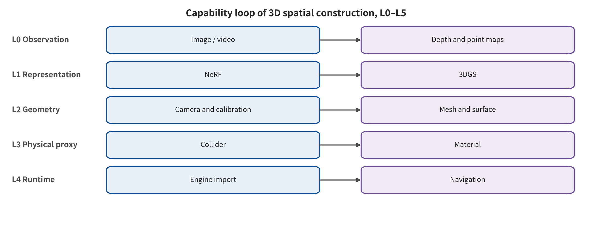

## Classification Design and Coverage Audit

The survey classifies along one primary axis only, defined by the verifiable spatial capability that a method natively closes. L0 is pixels and frame sequences, delivering images, video, or action-conditioned observations. L1 is queryable appearance, and it requires that the same scene can still be rendered given a new camera. L2 is measurable spatial samples, delivering cameras, depth, point maps, point clouds, or surfels. L3 is explicitly editable surfaces and production assets, delivering meshes, SDF/TSDF isosurfaces, or versioned visual assets. L4 is collidable and navigable agents. L5 is persistent interactive worlds with object identity, state, scripting, physics, streaming, saving, and rollback.

Judgment looks first at whether the output can be independently queried and verified. Video with consistent camera motion does not automatically reach L1. A radiance representation that can render novel views does not automatically reach L2 or L3. 3DGS carrying explicit three-dimensional centers is not equivalent to an explicit surface. A visual mesh with triangles does not automatically reach L4. A world model that can predict the next frame under action conditioning does not automatically reach L5. Every promotion must add a new artifact contract or state contract.

Multi-labeling records only secondary mechanisms, such as explicit or implicit representation, per-scene optimization or feed-forward inference, observation-driven or generation-driven, static or dynamic, closed-source product or open implementation. A hybrid system may span multiple layers. The main text, though, assigns it to the key interface of first closure, and then states for the later layers what conversions are still required.

Boundary cases of the coverage audit include Marble, Video2Game, feed-forward geometry foundation models, and procedural DCC/CAD. Public exports show that Marble can cover visual representation, mesh, and collision proxy, but the algorithm behind its generation is unknown. The value of Video2Game lies in the asset conversion chain, not merely in generating more frames. Procedural modeling moves straight from design intent to L3 or L4, so it should not be forced into the pixel reconstruction route.

This main axis does not promise that categories are mutually exclusive. It promises that the decision rules are stable. Categories are defined by verifiable outputs, and method names are only examples. A system that does not expose export, query, or state interfaces remains at the lowest layer that has been demonstrated. It cannot be inferred upward on the basis of demo footage.

### Classification and Verification Figures

The figures below come from structured data or from generation scripts of prior projects. The captions also give the readable scope. The main text does not use comparison tables to replace argumentation.

*The 3D spatial construction capability ladder and method family classification. The figure encodes categories by verifiable outputs and query capabilities, not by model names. It is a graphical expression of this survey's primary classification axis.*

---

[← Back to contents](index.md)
