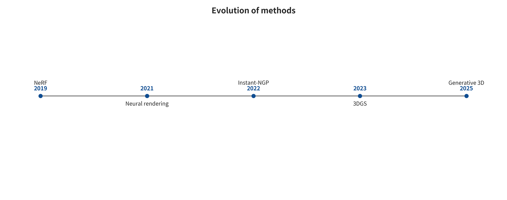

## Cross-Family Synthesis and Selection Guide

The preceding methods become comparable only once they sit in the same capability closed loop. What is compared here is not the highest score across heterogeneous sources. It is what observational constraints, generative priors, rule-based constraints, per-scene optimization, amortized inference and persistent state each take on.

Listing papers by year shows terms such as SfM, NeRF, 3DGS, video diffusion and world models being replaced again and again. It does not reveal why they appeared. A more accurate thread runs through them. Each generation of methods re-chooses what serves as the unknowns, what observation constrains them, and which kind of query the result must answer.

Traditional reconstruction takes cameras and 3D points as the unknowns and solves through cross-image correspondences. NeRF takes continuous density and color functions as the unknowns and solves through rendered pixel error. 3DGS takes projectable Gaussians as the unknowns in exchange for faster optimization and rendering. DUSt3R, VGGT and the like compress geometry that used to be solved per scene into a feed-forward network. Video and world models go further and take “what will be seen at the next moment” as the prediction target. They are not climbing ever higher along the same ruler. They redistribute the work among speed, observability, appearance, surface, state and interaction.

This chapter therefore does not organize its discussion around per-paper field cards. Per-paper numbers and source locations have already been moved to the evidence card appendix (open materials: appendix_per-paper-evidence-cards.md). What is explained here is the conceptual classification of the methods, the driving forces of their evolution and their composable relationships.

### Classification and Validation Figures

The following figures are derived from the structured data or generation scripts of the earlier project, and the captions also give the readable range. The main text does not use comparison tables in place of argument.



*Method evolution from measured geometry to persistent worlds. New representations change the unknowns and the locus of optimization, but they do not automatically eliminate the gaps in assetization, physical queries, and runtime state.*

### First Contradiction: Observational Constraints and Generative Priors

Real photographs can only constrain surfaces that are seen. The back side of the camera, occluded regions, the interior of transparent objects and absolute scale usually cannot be uniquely determined from a single image. Methods differ in how they handle these unidentifiable quantities.

Observation-constrained methods admit only geometry that multiple views, depth, IMU or a scale anchor can support. SfM, MVS, SLAM and TSDF belong to this category. Their errors carry physical meaning. The price is that uncovered regions remain unknown, and that the method fails when the input degrades. Learned-prior estimation uses the training distribution to fill in local ambiguity, but still outputs geometric quantities such as depth, point maps or cameras. MVSNet, NeuralRecon, DUSt3R and VGGT belong to this category. They lower the threshold of matching, calibration or per-scene optimization, while bringing training-domain bias into the geometry. Generative methods sample a plausible world directly from a conditional distribution. Video diffusion, text-to-3D and Marble-like world generation belong to this category. They can fill in invisible regions, but they cannot rewrite “plausible” as “observed ground truth.”

These three categories are not mutually exclusive routes. A usable system often fixes the regions already seen with observational constraints. It proposes candidates for unseen regions with generative priors. A closed loop, multiple views or human semantic verification then decides which content can be solidified into assets. When one and the same model produces the generated views, multi-view consistency may merely repeat the same hallucination from several angles. Real observational anchors must therefore be retained.

### Second Contradiction: Image Loss and Surface Queries

The key shift in NeRF is not “using a neural network.” It moves the supervision endpoint from feature correspondences/depth to rendered pixels. As long as the color integrated along each ray stays close to the photograph, the density may be a thick layer. It may be a semi-transparent layer, or several structures that compensate for one another. This objective suits novel views particularly well, yet it does not require a unique thin surface.

3DGS keeps the same kind of pixel objective. It replaces the implicit MLP with anisotropic Gaussians that can be projected directly. Training and rendering become markedly faster. The price is that Gaussians share no edges between them and have no closed inside and outside. Later, SuGaR, 2DGS, Gaussian Opacity Fields, 3DGSR and others reintroduce surface alignment, local disk primitives, level sets or SDF constraints. The evolution is therefore not “Gaussians eliminating meshes,” but rather:

Use a differentiable appearance representation to obtain high quality and fast rendering. Discover that the pixel objective is not sufficient to determine the surface. Then reconnect geometric constraints such as normals, depth, SDF, disks or Poisson to the system. Treat the visual representation and the extracted mesh as two artifacts that have a version relationship but cannot substitute for each other.

This back-and-forth reveals a general rule. The optimization objective determines what the result is willing to sacrifice. Pixel loss is willing to sacrifice topology. Chamfer distance may sacrifice thin walls and connectivity. Watertightening is willing to seal off unknown regions. A collision proxy is willing to sacrifice visual detail in exchange for conservative, stable and fast queries. Across tasks there is no “best representation”, only one that matches the query contract.

### Third Contradiction: Per-Scene Optimization and Amortized Inference

Classical SfM/MVS and early NeRF both require an explicit solve or optimization for a new scene. The advantage is that the observational residual can be reduced for the current scene. The drawback is high cost in initialization, time, local minima and scaling to long sequences.

Learned geometry amortizes the solving experience of many past scenes into network parameters. DUSt3R predicts point maps and confidence in two views directly, then performs global alignment. VGGT uses a shared Transformer to predict cameras, depth, point maps and point trajectories at the same time. They compress the modular pipeline of “match first, then estimate cameras, then estimate depth” into joint feed-forward inference. Yet they do not make geometric constraints ineffective: across long sequences, global alignment, closed loop, scale anchors and outlier observation handling are still required.

Therefore the engineering form more likely to stabilize is not “networks completely replacing optimization,” but:

**Text Pipeline or Pseudocode in the Original Manuscript**
```
The feed-forward model provides initial values for cameras/depth/point maps/confidence
→ geometric verification removes inconsistent observations
→ BA, pose graph, or global alignment corrects cross-view constraints
→ depth / point cloud fusion and surfacing
→ recapture failed regions or keep them as unknown
```

The driving force of the evolution here is to turn expensive search into a strong initialization, then let explicit optimization bear the auditable final constraint. Feed-forward speed and optimization interpretability are not an either-or choice.

### Fourth Contradiction: Frame-by-Frame Generation and Persistent Spatial State

An ordinary video generator learns conditional pixel sequences. It can generate camera motion and parallax. Nothing obliges it to preserve “the object ID of the door,” “the crate the player just moved,” or “the state of the same room along another path.” Action-conditioned world models go further and learn

$$
p(o_{t+1}\mid o_{\le t},a_{\le t}),
$$

so that the next frame responds to the action. Yet compressing all state into a finite number of history frames still causes revisit forgetting, object drift and branch inconsistency.

Methods such as GEN3C maintain a re-renderable 3D cache through depth back-projection, which shows that pixel generation needs spatial memory. PERSIST-class research places the camera, the environment and the renderer into a latent 3D state. Game engines have long used object tables, scene graphs, components and event logs to maintain deterministic state. Two routes that may converge thus emerge in the evolution of world models:

Neural models handle appearance, unobserved content, dynamic priors and counterfactual candidates. Explicit state handles object identity, geometry, collision, task logic, permissions and events that can be rolled back.

A truly “persistent world” is not merely a longer video. It is one in which the same state can still be queried and reproduced under revisits, occlusion, editing and action branching. Marble's public product interface already exports splats, visual meshes and coarse colliders as layered outputs, but its internal world model architecture is not public. It can therefore only be placed in the position of “productized layered asset output,” and it cannot be used to fill in latent state or a physical solving algorithm.

### Fifth Contradiction: From Observed Unknowns to Explicit Design Intent

All four contradictions above start from “not knowing what the scene is.” The algorithm must recover cameras, surfaces, appearance or state from observations or a training distribution. Procedural DCC/CAD changes the starting point. It treats wall width, door height, sketch constraints, Boolean relationships, instance rules, object IDs and random seeds as known design intent. The unknowns become “how the rules evaluate into legal geometry and scenes.” This route does not compete with SfM, NeRF or world models for the same problem. Where the structure is known and batch variants or editability are required, it avoids first generating pixels and then inferring back dimensions that were already known.

The core constraints of the procedural route are therefore different as well. OpenSCAD's CSG tree is constrained by set operations, tolerances and minimum features. The B-rep and feature history of CadQuery/FreeCAD are constrained by sketches, work planes, topological references and kernel validity. Blender `bpy`/BMesh and Geometry Nodes are constrained by scene data-blocks, the dependency graph, attribute domains and the host context. Houdini is constrained by the data flow, attributes and cook dependencies of SOP/VEX/PDG. Engine editor scripting is constrained further by the asset database, scene transactions and runtime build rules. Their main errors are not pixel loss. They are dimensional deviation, Boolean failures, topological naming drift, context dependence, nondeterministic randomness, export discrepancies and amplification of batch errors.

The most explanatory evolution is not “code modeling replacing AI,” but executable design specifications beginning to connect to learned models. A language/world model can parse intent into constrained parameters or candidate programs. A program executor constructs assets under a fixed version and in a sandbox. A geometry verifier gives counterexamples through dimension, topology, collision and navigation queries. The model then modifies the parameters or the program. The model in the closed loop is responsible for search and semantics, and the CAD/DCC kernel is responsible for deterministic evaluation. An independent verifier decides whether to publish. This kind of agentic modeling comes closer to maintainable engineering than a one-shot “text-to-Blender script” only if generated code is treated as untrusted input. That also requires parameters, seeds, versions, output hashes and failure trajectories to be preserved.

### Categorizing by core unknowns is more stable than categorizing by paper names

In terms of core unknowns, SfM/BA solves for camera intrinsics and extrinsics plus sparse 3D points. Its constraints come from epipolar geometry, reprojection error and robust kernels. It therefore answers “where is the camera, and where are the observed points” well. MVS and learned depth methods further solve for per-view depth and confidence, recovering visible surface distance through photometric or feature consistency, plane-sweep cost volumes and spatial regularization. TSDF/SLAM swaps the unknowns for pose trajectories, voxel distances and fusion weights, querying free space, occupancy and isosurfaces through visual/ICP residuals, weighted fusion and loop closure. DUSt3R- and VGGT-class models amortize the estimation of point maps, depth, cameras and point trajectories into large-scale networks. Yet scale, long-sequence loop closure and surface assets do not come automatically with a single forward inference.

NeRF solves for continuous density and view-dependent color. Pixel error from differentiable volume rendering constrains it directly, so it is natively good at radiance and novel-view queries. Neural SDF changes the geometric unknown to signed distance to the surface and constrains the zero level set with Eikonal or geometric regularization. 3DGS solves for Gaussian centers, covariances, opacity and appearance. It obtains fast rendering through image loss after projection and compositing, as well as through densification and pruning. Poisson, BPA and alpha shape, by contrast, no longer learn appearance. They estimate triangle surfaces from normal fields, neighborhood radii or sampled geometry. Each answers a different query: radiance, implicit surfaces, explicit primitives and point-to-surface. No single PSNR, and no single “does it output 3D” label, can lump them into one class.

Video generation treats latent video or per-frame pixels as its unknowns, and it optimizes denoising, sequence prediction, and condition following. World models add action-conditioned latent states, observation distributions, and reward or value prediction. Procedural DCC/CAD fixes or enumerates design parameters, and it evaluates editable geometry through CSG, constraints, node graphs, and scene APIs. Collision and NavMesh, in the end, solve for conservative contact proxies and for reachable space, subject to proxy size constraints.

The figure exists precisely to locate those unknowns and the gaps they leave behind. Two systems may both be called a world model. Yet their positions in the construction pipeline still differ if one only predicts pixels and the other maintains queryable 3D state. Two systems may both output GLB, yet a visual mesh and a coarse collider are not the same deliverable. A Blender script may produce a mesh deterministically, and even that cannot prove that field measurement, physical proxies, and host trust hold simultaneously.

### Seven key transitions define complete spatial construction

### From design intent to parameterized geometry and scene graph

CSG, sketch/feature B-rep, BMesh/modifiers, node data flows, or engine editor APIs evaluate units, dimensions, constraints, semantic IDs, and seeds into editable assets. Boolean/feature kernels, context, attribute domains, and exporters all intervene, so the same rules can yield different topology under different versions. That is the core risk. The output must carry toolchain locks, a parameter manifest, evaluated geometry, and read-back queries.

### From pixels to cameras and spatial samples

The work uses feature-based or learned correspondences, epipolar geometry, triangulation, depth regression, or point map prediction. The core risk is misreading object motion, repeated texture, or generative inconsistency as camera or geometry. The output must carry confidence, coordinate frames, and the source of scale.

### From spatial samples to queryable appearance

NeRF, 3DGS, or neural textures fit multi-view appearance. The core risk is that appearance optimization absorbs geometric errors. Near the training viewpoints the result looks good, while views away from the trajectory show floaters or stretching.

### From spatial samples or radiance representations to surfaces

TSDF isosurfaces, Poisson, BPA, neural SDF, Gaussian surface regularization, and similar methods all work here. Thresholds, normals, resolution, and the strategy for unobserved regions must be made explicit, because “surface extraction” is a new estimate rather than a format conversion.

### From surfaces to production meshes

Repair non-manifold geometry, self-intersections, degenerate faces, and flipped normals. Perform QEM/retopology, LOD, UV, and material baking. The core risk is that hole filling and simplification alter doorways, thin walls, joint clearances, or semantic boundaries.

### From visual meshes to collision and navigation

For dynamic objects, build primitives, convex hulls/convex decompositions, or SDFs. For the static environment, build simplified triangle collision. Then bake NavMesh from proxy radius, height, slope, and steps. The core risk is that visual precision and stable solving are opposing objectives, and the two cannot share a single “the denser the better” metric.

### From assets to a persistent running world

The engine organizes meshes, Gaussians, materials, collision, navigation, object state, and scripts into a scene graph. It also takes on streaming, versioning, network synchronization, and rollback. Only at this step can “viewable” possibly become “maintainable and interactive.”

### The correct order for method selection

Method selection should not start by asking “NeRF or 3DGS.” It should reason backward, in the following order:

Is the final query video viewing, novel views, measurement, editing, collision, navigation, or action branching? Which regions have real observations, and which permit prior-based generation? Is absolute scale, object identity, dynamic state, or deterministic replay required? How long may offline optimization take, and what are the runtime GPU/CPU/memory budgets? Which errors must fail conservatively, and which can be handed to human repair? How does each representation transition record coordinates, confidence, version, and error?

For example, a virtual tour can choose SfM poses plus 3DGS appearance, then build simplified collision for floors and walls. A robot digital twin can let scans provide on-site deviation and parametric CAD provide editable structure. TSDF/SDF/mesh then carry scaled geometry and contact validation, with 3DGS as the appearance layer. A text-to-game prototype can let a world generator propose layouts and let Blender/Houdini or engine scripts batch-instantiate constrained modules. Even so, key doorways, steps, dynamic objects, and gameplay regions still require collision and NavMesh regression.

This categorization also explains the overall direction of research. The aim is not some new model that swallows all the old modules. It is generation, geometry, appearance, surfaces, physics, and runtime gradually forming a hybrid system with explicit interfaces. Real progress should show up as a transition that requires less manual work, is more verifiable, or has more controllable error. It should not show up merely as more photorealistic demo imagery.

---

---

[← Back to contents](index.md)
