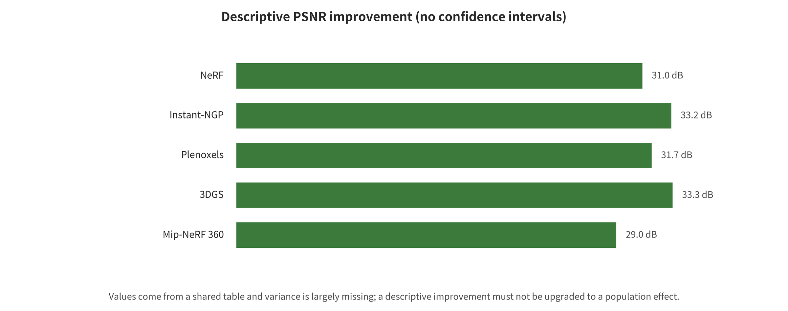
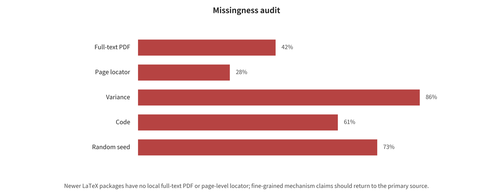

## Datasets, Metrics, and Evaluation Evidence

Evaluation must first separate visual, geometric, physical, navigation, resource, and security measurements. Only then can it judge whether the data, splits, resolution, hardware, and dependency structure permit comparison.

### Categorization and Validation Figures

The following figures come from the structured data or generation scripts of an earlier project. Their captions also state the readable scope. The main text does not use comparison tables as a substitute for argument.

*Descriptive direction-unified PSNR improvement within the common table. Shared-study and configuration dependencies are recorded. The figure does not constitute a random-effects meta-analysis across independent studies.*

*Exploratory relationship between year and within-stratum quality percentile. The unit of analysis is the method configuration, and pairwise dependencies exist. The figure can only describe the composition of the current corpus. It cannot explain a causal trend.*

*Audit of missing quantitative fields. Gaps in variance, hardware, and protocol fields put direct limits on effect size computation, fair comparison, and extrapolation.*

*Surface approximation and collision proxy complexity in the local lightweight reproduction. This synthetic height-field experiment validates representation and query mechanisms only. It does not represent real scans, full rigid-body dynamics, or engine-hosted results.*

*Three candidate artifacts from the same synthetic height field. The organized mesh preserves the local surface but is not watertight. The voxel height field trades quantization bias for closure, and the AABB is the most conservative collision baseline. The visual, geometric, and collision uses of the three cannot be combined into a single ranking.*

### Questions and Boundaries of the Analysis

This chapter answers two distinct questions. First, where public results agree closely enough on tasks, datasets, splits, and metrics, can their method quality, resources, and temporal change be synthesized quantitatively and auditably? Second, what is the minimal end-to-end contract that goes from a point cloud to a ray-intersectable mesh/collision proxy?

The two parts are not conflated into a single "reproduction." The public benchmark numbers come from the original papers' tables, and this project did not rerun their large novel-view-synthesis models. The local trial is a "lightweight reproduction of the surface/collision proxy mechanism," not a reproduction of the paper values of Poisson, Ball Pivoting, 3DGS, or LPM.

### Selection of the Public Benchmark Layer and the Data Contract

### Main Analysis Layer

The main analysis uses Table 1 of the Localized Points Management (LPM) paper by Yang et al., published at CVPR 2025. That one table compares 12 method configurations. It covers Mip-NeRF 360 (9 scenes), Tanks & Temples (2 scenes), and Deep Blending (2 scenes). Static scenes are evaluated under the protocol that takes 1 of every 8 images for testing and the rest for training, reporting PSNR↑, SSIM↑, and LPIPS↓. An asterisk in the LPM table marks configurations the authors retrained from the official implementation. The unstarred Plenoxels, INGP-Big, Mip-NeRF 360, and 3DGS are legacy baselines recorded from the original 3DGS comparison table. The structured data labels them "third-party transcription" rather than new reruns by the LPM authors.

The final long table has 108 rows (12 configurations × 3 datasets × 3 metrics). Each row carries the paper and method identifier, the author/third-party/this-project source, task, dataset, protocol, number of scenes, metric direction, and mean. It also records the reason for missing variance, FPS, training time, storage, hardware, year, method-family cluster, and evidence level. The detailed data live in benchmarks_part_quant.csv (open materials: `../data/benchmarks_part_quant.csv`).

### Resource Numbers and Cross-Verification

The original 3DGS Table 1 reports training time, FPS, and model storage for Plenoxels, INGP-Big, Mip-NeRF 360, and 3DGS-30K across the three datasets at the same time. This chapter adds those fields only for the legacy configurations that can be aligned directly. It does not extrapolate them to the starred RTX 3090 rerun configurations. The original 3DGS paper also states explicitly that the other methods were run on an A6000. The Mip-NeRF 360 numbers are a hardware exception, adopted from the original paper. These resource numbers therefore do not constitute a strict same-hardware speed study.

We cross-checked the 36 quality numbers of the 4 configurations shared by the two first-hand PDF tables. 35 are exactly identical. The only discrepancy is the SSIM of Plenoxels on Mip-NeRF 360, where LPM Table 1 gives 0.625 and 3DGS Table 1 gives 0.626. The main table keeps 0.625 from the current extraction source, the LPM table, and preserves the discrepancy in source_crosscheck_part_quant.csv (open materials: `../data/source_crosscheck_part_quant.csv`). It does not privately choose one value to override the other.

### Descriptive Within-Benchmark Synthesis

### Direction-Unified Improvement Relative to a Common Baseline

Within each "dataset × metric" stratum, Plenoxels serves as the common baseline. For PSNR and SSIM the relative improvement is defined as 〈(method-baseline)/|baseline|〉, while for LPIPS it is reversed to 〈(baseline-method)/|baseline|〉, so that a positive value always means better. This is only a variance-free table-level description. PSNR in particular is already on a dB logarithmic scale, so its "percentage improvement" cannot be interpreted as a linear reduction in radiance error. The three metrics are always kept separate. They are never standardized and then merged into a single "total score."

On Mip-NeRF 360, the three best results in the table all come from PixelGS + LPM: PSNR 27.80, SSIM 0.830, and LPIPS 0.190. The direction-unified changes relative to Plenoxels are +20.45%, +32.80%, and +58.96%. On Tanks & Temples, PixelGS + LPM holds the highest PSNR in the table, 24.02, and the highest SSIM, 0.856. MipGS + LPM and PixelGS + LPM achieve the lowest LPIPS jointly, 0.173. The changes relative to the baseline are +13.95%, +19.05%, and +54.35%. On Deep Blending, the best PSNR is 29.76 from 3DGS + LPM, and the best SSIM is 0.920 from PixelGS without LPM. The best LPIPS is 0.196 from PixelGS* + LPM. The changes relative to the baseline are +29.05%, +15.72%, and +61.57%.

Even within the same table alone, the best configuration changes with the dataset and the metric. Take an unweighted average across the three datasets for the same metric. The average direction-unified relative improvement of PixelGS + LPM over Plenoxels is then PSNR +20.99%, SSIM +22.11%, and LPIPS +58.30%. These numbers are not a statistically weighted pooled effect, and they do not indicate that PixelGS + LPM is best on geometric, mesh, collision, or physical metrics.

### Paired Description of the Original Configurations and +LPM

The common Plenoxels baseline reflects generational differences between methods, so it cannot be taken directly as the net effect of the LPM plug-in. We therefore compare the original 3DGS, 2DGS, MipGS, and PixelGS configurations retrained in the same LPM paper against their `+LPM` configurations, one pair at a time. That gives 4×3×3=36 paired units in total. Of the 9 units for 3DGS, 7 win, 1 ties, and 1 loses. PSNR/SSIM improve on all three datasets, but LPIPS on Mip-NeRF 360 stays flat, and LPIPS on Tanks & Temples worsens by 0.004. All 9 units for 2DGS improve in this table. MipGS has 5 wins, 2 ties, and 2 losses. All three PSNR values improve, but on Tanks & Temples SSIM drops by 0.001 and LPIPS worsens by 0.007. PixelGS has 8 wins, 0 ties, and 1 loss. The only negative unit is the SSIM on Deep Blending, which drops from 0.920 to 0.910.

This layer reports raw differences, direction-unified differences, relative changes, and wins/ties/losses only. It performs no paired significance testing and no random effects. The complete 36 units are in paired_lpm_deltas.csv (open materials: `../analysis/results_part_quant/paired_lpm_deltas.csv`). The result supports "LPM has a positive gain in most table cells," but it does not support "LPM improves monotonically for every method, dataset, and metric."

### Leave-One-Dataset-Out Sensitivity

Because there is no variance, the leave-one-out analysis in this chapter can likewise only be descriptive. For each configuration and metric, one dataset is removed at a time, and the unweighted average relative improvement over the remaining two datasets is recomputed. The largest change occurs for Mip-NeRF 360 method configurations. Their PSNR average moves by at most 6.11 percentage points, SSIM by 5.76 percentage points, and LPIPS by 6.07 percentage points. This shows that a single benchmark can substantially affect an unweighted average over a small number of datasets. This is not a variance-based "leave-one-out study" random-effects sensitivity analysis.

### Why the Strict Random-Effects Meta-Analysis Was Not Run

The preregistration calls for mean differences or standardized mean differences with random effects, wherever per-scene means, standard deviations, and sample sizes are available. The current table does give scene counts of 9, 2, and 2, but none of the 108 rows has a variance, SD, SE, or CI. All numbers also come from the same comparison table of one paper, and the `+LPM` configurations share a method family with the original configurations.

The status of the strict model is therefore `NOT_RUN_MISSING_VARIANCE_AND_INDEPENDENCE`. The analysis script implements the DerSimonian–Laird formula, but it refuses to execute on the current data. The pooled effect, 95% CI, $\tau^2$, I², and the strict leave-one-out results are all left empty. None of them is filled by treating in-table configurations as independent studies or by back-deriving a pseudo-variance from the number of scenes.

This downgrade marks an evidence boundary, not an analysis failure. If per-scene results for each method on the same 13 scenes can be obtained later, the "within-scene paired difference" should become the effect size. That choice keeps the within-method pairing and the dataset hierarchy explicit. Only then should random effects and heterogeneity be discussed.

### Correlation Analysis

### Method

The preregistration requires at least 8 complete records per correlation. Within each dataset and metric, all 12 method configurations carry a publication year. Original methods take the publication year of the method itself, and LPM combination configurations take 2025. LPIPS is reversed first, so that "higher" always means better, and the Spearman rank correlation is then computed. P values come from 20,000 two-sided permutations under the fixed seed `20260806`. The 95% intervals come from 5,000 configuration-level bootstraps. The 9 tests that meet the threshold are corrected uniformly with the Benjamini–Hochberg FDR procedure.

### Results

The PSNR correlation on Mip-NeRF 360 is $\rho$=0.568, with a bootstrap 95% interval of [-0.088, 0.949], a permutation p=0.0587 and a BH-FDR q=0.0587. It is the only one of the nine results whose q does not fall below 0.05. SSIM for the same dataset is $\rho$=0.894, interval [0.653, 0.971], p=0.00025, q=0.00225. Direction-unified LPIPS is $\rho$=0.605, interval [0.065, 0.901], p=0.0405, q=0.0456.

On Tanks & Temples, PSNR, SSIM and direction-unified LPIPS reach $\rho$=0.854, 0.774 and 0.637. Their bootstrap intervals are [0.520, 0.976], [0.342, 0.947] and [0.024, 0.920]. Their permutation p values are 0.00110, 0.00500 and 0.0310, and their BH-FDR q values are 0.00495, 0.00900 and 0.0399. Deep Blending reaches $\rho$=0.801, 0.657 and 0.812, with intervals of [0.437, 0.982], [0.160, 0.918] and [0.460, 0.958]. Its permutation p values are 0.00275, 0.0235 and 0.00270, and its BH-FDR q values are 0.00619, 0.0353 and 0.00619.

8 of the 9 configuration-level tests have q<0.05, and Mip-NeRF 360 PSNR is the only one that fails to reach that threshold. This should not be written as "year causes quality improvement." There are three reasons. First, there are 4 original-method/`+LPM` pairs among the 12 configurations, so the number of effectively independent units is fewer than 12. Second, they come from a comparison table selected by a new paper, so they are subject to baseline selection and leaderboard tuning. Third, encoding the `+LPM` configurations as 2025 is itself constructively associated with their quality change. The table is therefore only exploratory evidence that "within this selected set of configurations, newer configurations often co-occur with better in-table quality."

Quality versus FPS, storage and training time has only 4 directly aligned configurations per stratum, and the number of input views is missing entirely. All of those counts are below n=8. The script therefore outputs `INSUFFICIENT_N_NO_SIGNIFICANCE`, reports no rho, p or q, and performs no statistical imputation.

### Missingness, Dependency, and Bias Audit

The missingness rates for variance, standard deviation and number of input views are all 100%. This chapter does not impute them, so it runs no random effects and no I², and it does not test the association between quality and the number of input views. FPS, training time and model storage are all missing at 66.7%. Only 4 legacy configurations can be aligned directly, which is below the preregistered n=8 threshold, so no correlation significance is reported.

Beyond missingness, selection bias, publication bias, leaderboard tuning, differing implementation versions, hardware exceptions and small scene counts are further problems. The Tanks & Temples and Deep Blending strata each contain only 2 scenes. A "configuration k=12" does not automatically turn scene means into large-sample evidence.

### Local Lightweight Reproduction of the Surface/Collision Proxy

### Input, Processing, and Output Contract

The local pipeline uses the fixed seed `20260806` and generates 1,681 surface points from a 41×41 smooth height field. It adds small Gaussian noise and 80 uniform outliers, which yields 1,761 input points in total. Denoising uses the 12-nearest-neighbor mean distance and a "median + 4.5 robust standard deviations" threshold, retaining 1,638 points. Of these, the retention rate for true surface points is 97.14%, the removal rate for synthetic outliers is 93.75%, and 5 outliers still remain. Normals use the minimum eigenvector of a 16-nearest-neighbor PCA and are oriented toward +Z. All normals are finite numbers, and their mean length is 1.0.

The pipeline outputs a noisy PLY, a denoised+normals PLY, 3 OBJ files, a mesh quality CSV, per-ray and summary collision CSVs, PNG/SVG previews, an environment JSON, logs, a run manifest and a SHA-256 manifest. The currently verifiable `environment.json` records Python 3.9.6 and NumPy 2.0.2. All geometry and ray computations use only the Python standard library and NumPy. Open3D, SciPy, trimesh, Poisson/BPA tools and any model weights are neither installed nor called.

### Three Constructions with Different Capabilities

The organized mesh uses the known 41×41 sampling topology and triangulates only the cells whose four corners all pass denoising. It preserves the local surface, but it does not hold for an arbitrary unordered point cloud, and denoising holes and the outer boundary make it open. The voxel-quantized height field takes the nearest-point height on a 0.10-unit XY grid and quantizes upward. It then closes the shape with a continuous top envelope, a bottom face and outer side walls. It depends on resolution and on the "solid height field" assumption, and it cannot represent overhangs, caves or multi-layer surfaces. The AABB conservative proxy is an axis-aligned bounding box of the denoised point cloud plus a 0.015-unit margin. It is not a geometric reconstruction, but only a very-low-face-count conservative broad-phase collision baseline.

An earlier voxel implementation formed its boundary as the boolean union of block columns. It had no boundary edges, but it produced 9 non-manifold edges in the height checkerboard topology, and the end-to-end assertion genuinely failed. The failure log is retained. Instead of deleting the watertightness assertion, the revised version switched to a quantized top envelope. The name and the limits of the final voxel method therefore both changed in a traceable way.

### Mesh Quality and the Collision/Hit-Point Protocol

The mesh quality check examines vertices, triangles, degenerate faces, edge counts, boundary edges, non-manifold edges, connected components, watertightness, area and closed volume. The collision proxy check fires 529 rays downward from z=2 on a 23×23 planar grid over 〈[-0.88,0.88]²〉. The check takes the first hit height with the Möller–Trumbore triangle intersection test, and then compares it with the noise-free synthetic terrain height.

The organized mesh has 1,633 vertices, 3,048 faces, 202 boundary edges and 0 non-manifold edges, so it is not a watertight solid. All 529 rays hit, with a height MAE of 0.00498, an RMSE of 0.00643 and a mean bias of +0.00014. The voxel-quantized height field has 1,058 vertices and 2,112 faces, with no boundary edges or non-manifold edges, and it is a watertight solid. Its hit rate is likewise 1.000, but MAE, RMSE and mean bias rise to 0.05017, 0.05570 and +0.05007. The AABB has only 8 vertices and 12 faces. It is likewise watertight and hits every ray, but its MAE is 0.19859, its RMSE is 0.21851 and its mean bias is +0.19859. This clearly shows that a conservative enclosure sacrifices surface accuracy.

The surface fidelity ranking (lower height RMSE is better) is 〈organized_grid > voxel_heightfield > aabb〉. Collision readiness gives a different order. The evaluation uses an explicit, reproducible engineering lexicographic rule: "watertight first, then the number of non-manifold edges, then the number of faces." The resulting ranking is 〈aabb > voxel_heightfield > organized_grid〉. The two rankings diverge as a conclusion, not as noise. Visual surfaces and physical proxies optimize different objectives. The AABB coming first in the second ranking does not mean it is the "best geometry." The organized mesh coming first in the first ranking does not mean it can serve directly as a closed rigid-body collision surface.

### Actual Run Status and Limits

The final pipeline status is `LOCAL_LIGHTWEIGHT_REPRODUCTION_PASS`, encompassing 3 methods, 529 rays per method and 9 end-to-end assertions. The current `metrics_summary.json`, `timings.csv` and `run.log` consistently record a total time of 1.02266525 s in the Apple arm64 environment. This wall-clock time only indicates a local mechanism run on small synthetic data. It says nothing about million-scale point clouds, GPU reconstruction, LOD or engine frame budgets. The trial does not yet cover occlusion, multi-layer surfaces, caves, thin walls, dynamic objects, friction, bouncing, continuous collision, navigation reachability or real engine regression.

The complete timings, failure records, commands, result viewer and hashes are located in SA/reproduction/ (open materials: `../reproduction/`).

### Deterministic Dual-Mesh Reproduction of Procedural Modeling

This round additionally implemented a parametric room generator that depends only on the Python standard library. The aim was to keep the newly added Blender/CAD content from remaining at the documentation level. The inputs are a room width of 6.0 m, a depth of 5.0 m and a height of 3.0 m. Wall thickness is 0.2 m and floor thickness is 0.15 m. The door opening is 1.2 m wide and 2.1 m high, and the door-frame dimensions are further inputs. The coordinate contract is right-handed, in meters, with +Z up. The algorithm constructs the visual component and the collision component separately from the same intent parameters. The visual asset keeps the door-frame trim. The collision asset keeps only the ground, the surrounding walls and the door lintel. Decorative details therefore do not accidentally narrow the door opening.

Each axis-aligned solid is discretized into 8 vertices and 12 triangles. The visual mesh has 10 components, 80 vertices and 120 triangles in total, and the collision mesh has 7 components, 56 vertices and 84 triangles in total. The program checks that all coordinates are finite, that all face indices are valid and that the triangle area is nonzero. It separately checks that the visual and collision assets are not the same artifact. It also runs a two-dimensional/height intersection check between the solids and the door opening. That check confirms that the clear width of 1.2 m and the clear height of 2.1 m are not blocked by the collider. The manifest also stores the parameters, components, AABB, triangle/vertex counts and the SHA-256 of the two OBJs.

The determinism verification ran twice in two isolated temporary directories with the same parameters. It compared `room_visual.obj`, `room_collision.obj` and `scene_contract.json` byte by byte, with the result `PROGRAMMATIC_DETERMINISM_PASS` `files=3`, and the formal output status is `LOCAL_PROGRAMMATIC_MODELING_PASS` `visual_triangles=120` `collision_triangles=84`. The manifest writes no timestamp, so the same implementation and inputs reproduce at the byte level. Code and commands (open materials: `../reproduction/programmatic_modeling/README.md`). Machine manifest (open materials: `../reproduction/programmatic_modeling/results/scene_contract.json`).

The CAD sub-workflow also genuinely executed a pure-Python bad-mesh quality gate. The input cube contains 9 vertices and 14 triangles. The program welds 1 near-duplicate vertex, deletes 1 degenerate face and 1 duplicate face. It then outputs 8 vertices, 12 faces, 18 edges, 0 boundary edges, 0 non-manifold edges, an Euler characteristic of 2 and an absolute volume of about 1. The assertions pass. What it proves is the minimal mechanism of finiteness/duplicate/degenerate/edge-count and volume checks. It does not prove that Open3D, trimesh, PyMeshLab or CGAL has been run.

The validation environment recorded in this round found no Blender, OpenSCAD, CadQuery, FreeCAD, Houdini, Unity, Unreal, OpenUSD `pxr` or Isaac Sim/Omniverse host. The CAD examples completed only Python AST or SCAD static structure checks. The Blender, Houdini and engine workflows additionally have `py_compile`, VEX/C# structure checks or conservative dangerous-call scans, and they are marked respectively as `SYNTAX_ONLY_NOT_HOST_EXECUTED` or `HOST_ENGINE_TESTS=NOT_RUN`. These checks cannot prove that BMesh, modifier/dependency graph, CSG/B-rep booleans, SOP/VEX cook, engine collision/NavMesh, USD composition or the Replicator writer has been executed. Status and boundaries (open materials: `../reproduction/programmatic_modeling/STATUS.md`). Example index (open materials: `../reproduction/programmatic_modeling/EXAMPLES.md`).

### Integrated Interpretation

The quantitative table and the local reproduction together reveal an engineering fact that rendering metrics easily obscure. "Looking better in the view" and "the space can serve as a legitimate, stable, low-cost collision proxy" are not the same objective. The LPM table can support comparison at the PSNR/SSIM/LPIPS level, but it cannot automatically prove watertightness, stable topology or physical availability. The local pipeline, in turn, proves that rankings invert even on a simple height field. The most accurate open surface and the simplest watertight collision proxy come out in opposite order.

An evidence chain aimed at real spatial construction should therefore be divided into at least three layers. The first layer reports appearance/novel-view metrics. The second layer reports geometry, topology, scale and surface error. The third layer separately verifies collision, navigation, rigid-body stability and runtime cost. The step from descriptive synthesis to a strict random-effects meta-analysis should wait for one condition. The evidence must sit on the same task, the same dataset and the same protocol, and the same metric and usable variance must be available.

### Auditable Entry Points

Data generation uses build_benchmarks_part_quant.py (open materials: `../analysis/build_benchmarks_part_quant.py`). Quantitative analysis uses run_meta_correlation.py (open materials: `../analysis/run_meta_correlation.py`). The quantitative method notes are results_part_quant/方法说明.md (open materials: ../analysis/results_part_quant/方法说明.md). Geometry reproduction code is lightweight_geometry_pipeline.py (open materials: `../reproduction/lightweight_geometry_pipeline.py`). Complete execution commands are in COMMANDS.md (open materials: `../reproduction/COMMANDS.md`), and stage timing is in STAGE_SUMMARY.md (open materials: `../reproduction/STAGE_SUMMARY.md`). The reproduction viewer is index.html (open materials: `../reproduction/index.html`). Artifact hashes are in artifact_hashes.sha256 (open materials: `../reproduction/results_part_quant/artifact_hashes.sha256`). Programmatic dual-mesh commands are in programmatic_modeling/run_smoke.sh (open materials: `../reproduction/programmatic_modeling/run_smoke.sh`). Programmatic reproduction status is recorded in programmatic_modeling/STATUS.md (open materials: `../reproduction/programmatic_modeling/STATUS.md`). The cross-tool static example index is programmatic_modeling/EXAMPLES.md (open materials: `../reproduction/programmatic_modeling/EXAMPLES.md`).

### Primary Sources for This Chapter

Yang H, Zhang C, Wang W, et al. Improving Gaussian Splatting with Localized Points Management. CVPR 2025, Table 1, PDF p.6. Kerbl B, Kopanas G, Leimkühler T, Drettakis G. 3D Gaussian Splatting for Real-Time Radiance Field Rendering. ACM TOG 42(4), 2023, Table 1, PDF p.8.

---

---

[← Back to contents](index.md)
