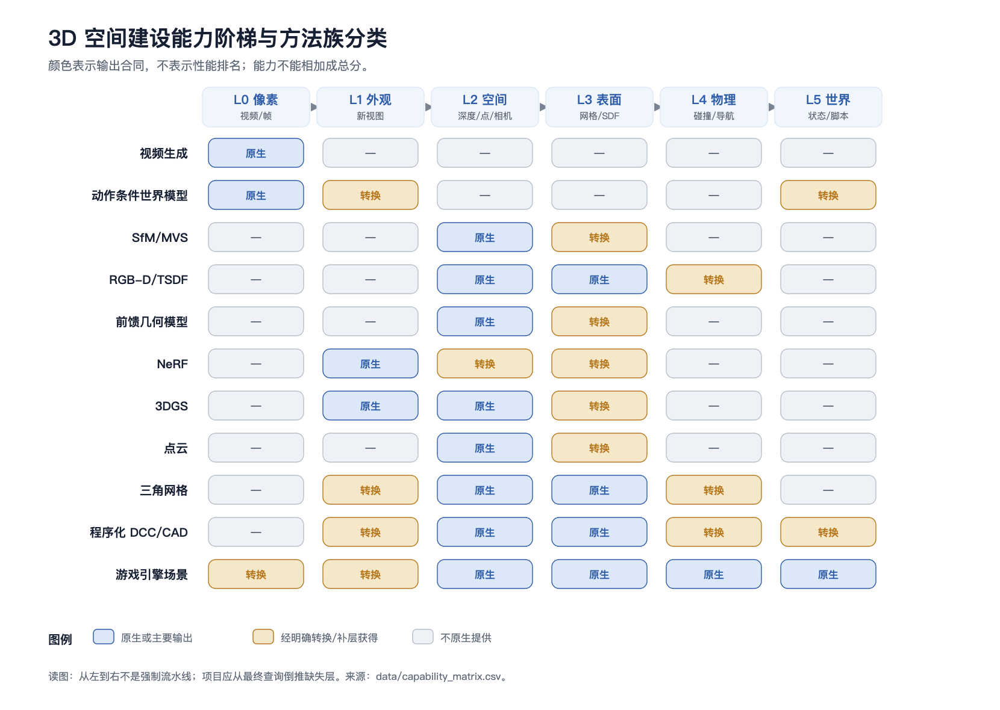
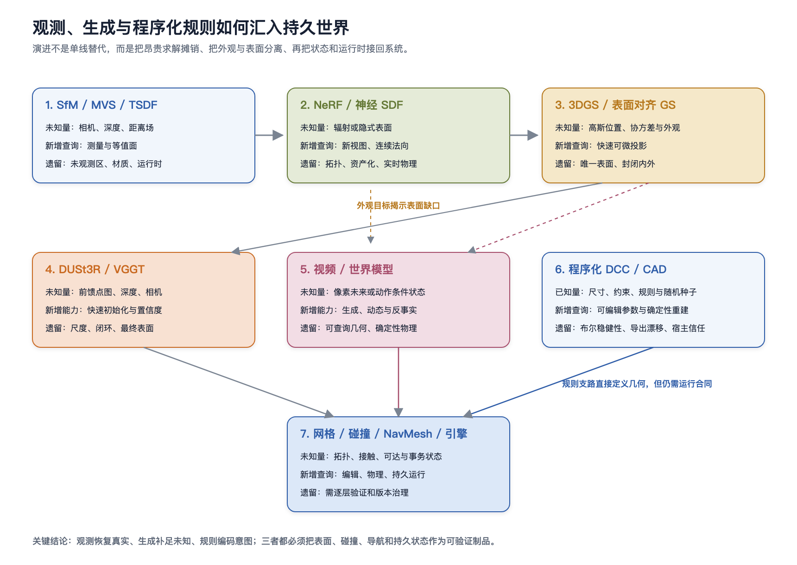
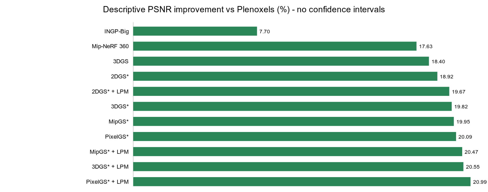
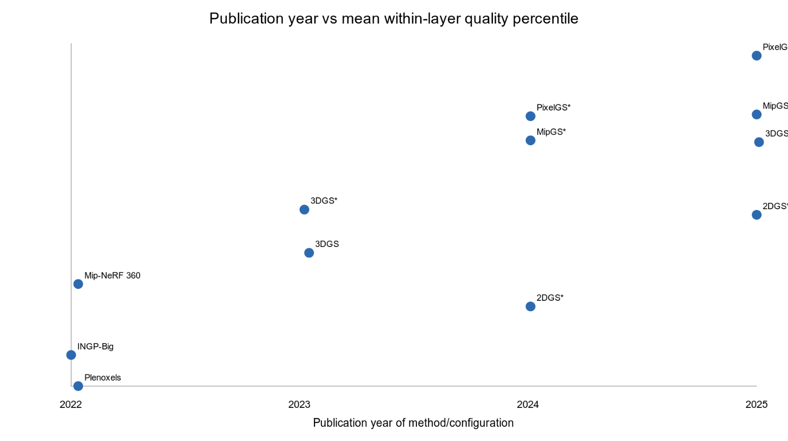
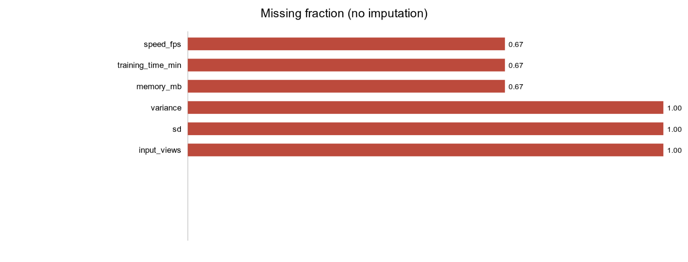
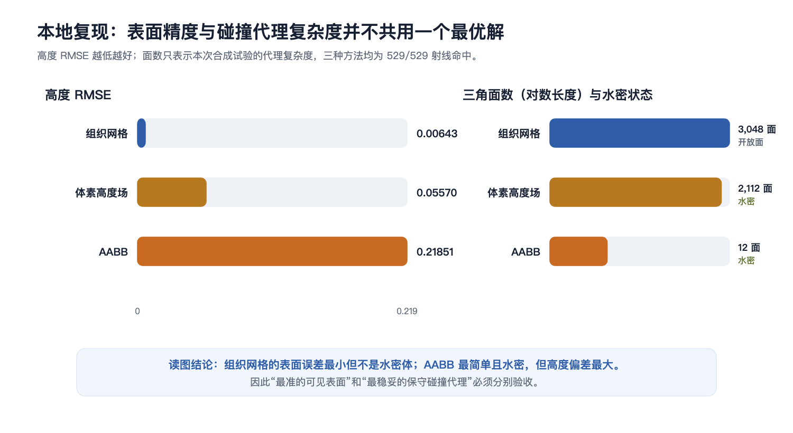
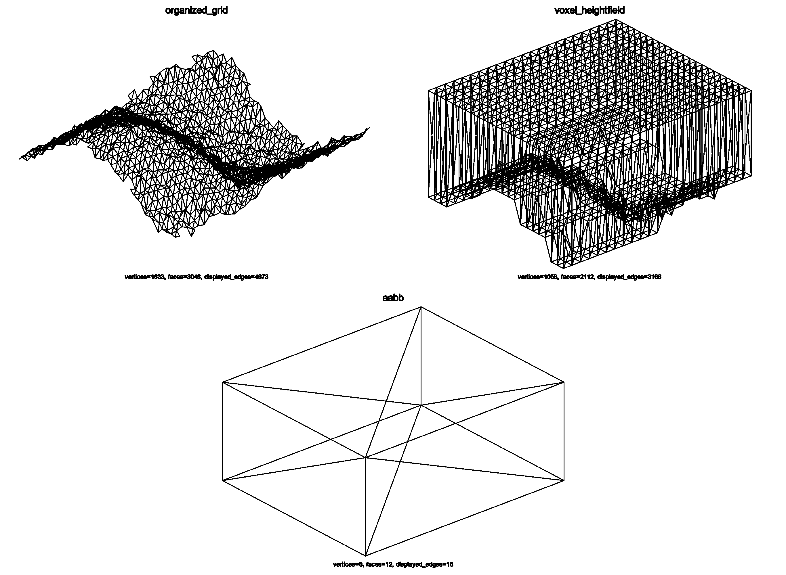
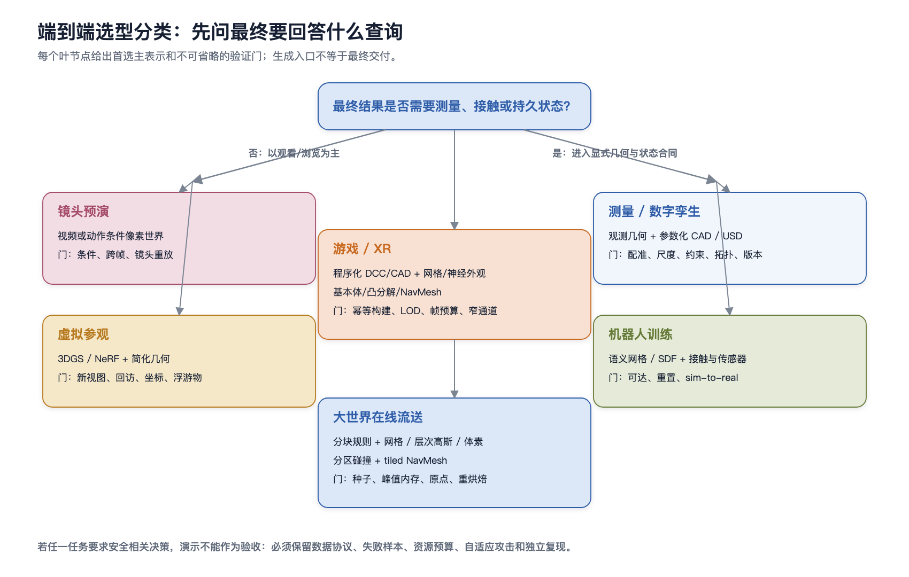
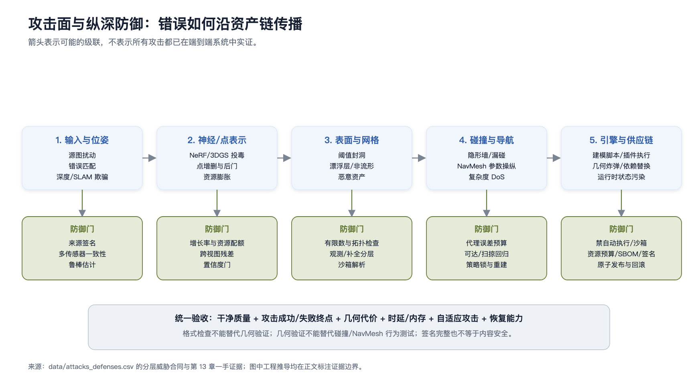

<!-- toc:start -->
## 目录

  - [Abstract](#abstract)
  - [引言](#引言)
  - [语料选择与编码方法](#语料选择与编码方法)
  - [背景与输入输出合同](#背景与输入输出合同)
  - [分类设计与覆盖审计](#分类设计与覆盖审计)
  - [L0--L5 方法家族](#l0--l5-方法家族)
  - [跨家族综合与选择指南](#跨家族综合与选择指南)
  - [数据集、指标与评价证据](#数据集指标与评价证据)
  - [应用与部署映射](#应用与部署映射)
  - [攻击、防御、未来趋势与局限](#攻击防御未来趋势与局限)
  - [结论](#结论)
  - [开放材料与迁移审计](#开放材料与迁移审计)
- [附录：截止后更新（2026-08-07 → 2026-09-26）](#附录截止后更新2026-08-07-→-2026-09-26)
  - [A.1　三维空间建设：议程无实质进展](#a1　三维空间建设议程无实质进展)
  - [A.2　相关领域的新动向](#a2　相关领域的新动向)
  - [A.3　跨库登记：OpenAI—Hugging Face 事件的制度后果](#a3　跨库登记openaihugging-face-事件的制度后果)
  - [A.4　如何使用本附录](#a4　如何使用本附录)
<!-- toc:end -->
## Abstract

三维空间建设并不是把二维画面生成得像三维，而是把观测或设计意图逐层转换为可查询表示、生产几何、物理代理和持久运行状态。本文截至 2026 年 8 月 7 日整理 173 条检索记录、253 个来源入口、247 个规范化标题、40 条攻击防御合同和 108 条基准长表记录，以 L0 画面到 L5 持久运行世界的能力闭环为唯一主分类轴，统一分析视频模型、动作条件世界模型、World Labs Marble、SfM/MVS/TSDF、NeRF 与神经 SDF、3DGS、点云成面、网格资产化、程序化 DCC/CAD、碰撞导航和游戏引擎建设。综合表明，生成、重建与规则建模解决的是不同未知量；视觉可用性不能替代几何、碰撞、导航或状态合同。攻击可沿坐标、表示、资产和运行时传播，防御因而需要分层验证门。严格随机效应荟萃因只有一个独立比较研究且缺方差而未运行；相关性仅作探索性描述。本地 Python 几何和双网格机制已运行，但 Blender、Houdini、CAD 与游戏引擎宿主仍未执行。由于缺少本地全文语料、双人筛选和具体投稿模板，交付状态限定为可编译分类综述草稿。

## 引言

空间建设的核心问题不是画面是否具有三维观感，而是系统能否把来源、坐标、表示、几何、物理代理和运行状态连接成可验证的转换链。

在本综述中，3D 空间建设指把一组观测或生成条件转化为可持续使用的空间系统。这个系统不一定在每个项目里都达到同样深度，但至少需要明确交付合同：它究竟只输出一段视频，还是输出可从任意相机查询的场景；它是否有可测量的几何；能否变成拓扑稳定的表面；能否支持碰撞、导航和动力学；能否被游戏引擎、XR 或机器人仿真器稳定加载。

这一定义刻意避免把下列结果混为一谈：

视频模型生成了一段具有视差和运动的像素序列；世界模型能根据动作持续生成下一帧；NeRF 或 3DGS 能从新相机渲染高质量图像；点云在三维坐标中给出大量表面样本；网格给出具有连通关系的三角面；碰撞代理能让物体在物理求解器中稳定接触；导航网格能描述某一种代理尺寸、坡度和台阶约束下的可达区域。

这些对象都可以被日常语言称为“3D”，但它们的输入、状态和可验证属性不同。把它们并列成排行榜会产生错误结论。例如，NeRF 原论文优化的是从已知相机图像到连续密度和视角相关颜色的函数，论文的直接目标是新视图合成；它并没有把水密网格或碰撞体作为原生输出。NeRF 原论文 [@srcNERF-2020] 3D Gaussian Splatting（3DGS）把场景表示成可优化、可快速投影的各向异性高斯集合，获得了实时新视图合成，但集合中的高斯没有三角网格的拓扑关系。3DGS 原论文 [@src3DGS-2023-N005] SuGaR 之所以需要额外的表面对齐正则和 Poisson 重建，恰恰说明从高质量高斯渲染到可编辑网格仍是一项独立工作。SuGaR [@srcN006]

### 三种常被误用的“真实性”

视觉真实性回答渲染图像是否像真实照片。PSNR、SSIM、LPIPS、FID/FVD 和人工偏好通常测的是这一层的不同侧面。

几何真实性回答表面位置、深度、法向、相机和拓扑是否接近参考。常见指标包括绝对/相对深度误差、相机旋转/平移误差、Chamfer 距离、F-score、法向一致性、完整度和准确度。

物理真实性回答对象能否按可复核的接触、摩擦、质量、约束和动力学演化。稳定帧率和视觉上不穿模不能代替接触误差、穿透深度、隧穿率、能量漂移、可达率和任务成功率。

一项方法可能在第一层很强、第二层一般、第三层没有输出。本文不会把三层指标归一后合成一个“综合真实度”，因为这种总分会把真实的工程缺口隐藏起来。

## 语料选择与编码方法

本节把旧项目中已经实际执行的检索、筛选、抽取、分析和验证记录改写为证据方法，而不倒推不存在的系统综述流程。证据截止日为 2026 年 8 月 7 日；主检索窗口从 2016 年开始，SfM、体融合、表面重建和碰撞检测等奠基方法不设起始年份。

合并检索日志含 173 条查询。来源主表含 253 个唯一入口 ID 和 247 个规范化标题，6 组同标题多入口记录用于版本或入口核对；筛选日志含 255 条决定，其中 253 条纳入、2 条同名实体排除。来源入口、唯一作品和独立研究是三个不同分母。

纳入条件是直接参与三维生成、重建、表示、资产化、程序化建模、物理代理、引擎运行或安全，并能核验方法、接口、公开结果、代码或运行产物至少一项。产品页只确认公开能力与导出合同；摘要、搜索片段和二手转述不能支撑精确机制或性能结论。

定性综合以方法或系统家族为单位，主分类按 L0--L5 输出能力编码。定量模块以论文--方法配置--数据集--指标为单位，并显式保留同论文、共同表格和成对配置的依赖。攻击防御模块另有 40 条合同记录，字段包括威胁模型、攻击能力、影响、可观测信号、防御假设、自适应评测和证据边界。

严格随机效应荟萃没有运行：当前同协议量化层只有一个独立比较研究，而且 108 条长表记录缺少逐场景方差、标准误或置信区间。已运行的是表内描述性综合、缺失和依赖审计以及探索性相关分析；这些结果描述当前语料，不构成因果或跨研究总体效应。

复现状态分四层记录。本地纯 Python 几何和确定性双网格机制实际运行并通过；Blender 与 Houdini 示例只通过语法或静态检查；CAD、引擎、USD 和合成数据宿主没有执行；Marble 只完成公开文件合同抽查，没有权重、收费 API 或内部算法复现。

本项目没有本地全文 PDF 语料、双人独立筛选一致性和正式偏倚评价工具，因此本文是可审计的分类学综述草稿，不使用严格系统综述标签。完整检索策略保存在 normalized/search_strategy.md，来源、迁移和缺口账本保存在 source、validation 与 evidence 目录。

## 背景与输入输出合同

本节统一七层管线和输入--内部状态--输出合同，为后续分类提供共同接口。

### 数据与条件层

这一层规定系统能看见什么、什么是已知量：

单图、多图、视频、全景、RGB-D、LiDAR/点云；内参、外参、时间戳、IMU、尺度或 GPS；文本、草图、粗 3D 布局、对象清单和风格；用户动作、代理姿态、历史帧、记忆和控制目标。

输入条件直接决定可辨识性。单图没有足够观测来唯一确定遮挡区和绝对尺度，任何完整背面或不可见空间都包含先验驱动的推断；多图如果没有重叠、纹理或稳定曝光，匹配和位姿也会退化；动态视频若把物体运动当作相机运动，会污染整个几何链。

### 生成或估计层

生成式模型和重建算法在这一层分流：

生成路线学习条件分布，在未观测区域提供合理但不保证真实的内容；估计路线用观测约束恢复位姿、深度、对应关系和表面；混合路线用生成先验填补不可见区，再通过多视图或显式几何约束使结果可查询。

经典增量 SfM 通过特征匹配、几何验证、相机注册、三角化和束调整恢复稀疏几何与相机。COLMAP 对应论文 [@srcG003] DUSt3R 则把无标定图像对直接回归为点图，再做全局对齐；它降低了相机先验门槛，但点图到生产网格仍需后处理。DUSt3R [@srcG011] VGGT 在一次前向计算中联合输出相机、深度、点图和点轨迹，代表 3D 几何基础模型的发展方向；其输出仍是几何属性与点状表示，而不是自动完成 UV、碰撞和导航的引擎资产。VGGT [@srcVGGT-2025]

### 场景表示层

表示决定哪些查询便宜、哪些编辑困难：

体素/TSDF/SDF：占据或到表面的有符号距离适合融合、等值面提取和距离查询，但高分辨率稠密网格耗内存；点云/点图/surfel：直接保留采样位置、颜色、法向或置信度，增量融合方便，但没有封闭表面和拓扑；NeRF/神经隐式场：连续、可微、善于外观拟合，逐场景优化和表面提取通常较昂贵；3DGS：显式高斯、训练和渲染快，透明度与视角相关外观强；几何、拓扑和碰撞仍需约束或转换；三角网格：引擎、DCC、光栅化和物理生态成熟；拓扑、UV、材质和 LOD 需要维护；混合表示：网格负责拓扑、动画和碰撞，高斯/神经纹理负责高保真外观，是当前很有实际价值的折衷；潜在世界状态：便于自回归预测和动作条件生成，但若不能导出或查询几何，就不能替代资产表示。

### 几何资产化层

这一层把“可以显示的数据”变成“可以维护的资产”，典型步骤包括：

统一坐标系、单位、朝向、相机和场景原点；去除离群点和低置信度浮游几何；法向估计与方向一致化；通过 alpha shape、Ball Pivoting、Poisson、TSDF 或神经表面获得三角网格；删除小连通分量、孔洞修复、自交处理、流形检查和法线修正；简化、重拓扑、LOD、UV 展开、纹理/材质烘焙；按 glTF/GLB、USD、FBX、OBJ、PLY、SPZ 等目标格式导出并验证。

Open3D 的官方表面重建文档能清楚体现算法假设：Ball Pivoting 依赖带方向的法向和合适的球半径；Poisson 解一个正则化问题得到平滑表面，八叉树深度决定细节和资源消耗。Open3D 表面重建 [@srcOPEN3D-SURFACE-P006] 因此，“点云转网格”不是无参数的格式转换，而是带有尺度、密度、噪声和拓扑假设的重建步骤。

### 物理代理层

视觉网格以画面为目标，物理代理以稳定、便宜、保守地回答接触和可达查询为目标。它们通常应该分离：

静态建筑可使用简化三角网格或高度场；动态刚体优先使用盒、球、胶囊、凸包或多个凸块；复杂凹物体可做近似凸分解或采用 SDF/体素距离查询；角色通常使用胶囊等稳定代理，而不是贴身高多边形网格；地面可行走面由代理半径、身高、坡度、台阶和净空决定，不能直接等同于可见地面三角形。

Unity 官方文档明确说明 Mesh Collider 对复杂形状可以比基本体更贴合，但通常开销更高；凸 Mesh Collider 有三角形数量限制，mesh cooking 也会清理退化三角形并预处理运行时查询。Unity Mesh Collider [@weba9de639ddac5] Unreal 也把简单碰撞（基本体/凸包）与复杂碰撞（三角网格）作为两种独立查询表示。Unreal 简单/复杂碰撞 [@srcUE-COLLISION-C006] 这不是引擎的偶然限制，而是实时物理在稳定性、内存、构建时间和精度间的基本取舍。

### 引擎运行层

进入引擎后还要完成：

坐标、尺度、左右手系和轴向转换；PBR 材质、色彩空间、透明度、双面和阴影规则；LOD、meshlet/Nanite 类几何流送、遮挡剔除和纹理流送；碰撞层、触发器、连续碰撞检测和物理材质；导航网格、动态障碍、off-mesh link 和代理配置；场景分块、世界原点重定位、网络复制和保存/加载；脚本、着色器、插件和资产供应链隔离。

Recast 的公开实现把输入三角网格体素化、过滤不可行走体素、分割区域并重新生成多边形导航网格；分块 navmesh 支持大场景重烘焙和流送。Recast Navigation [@srcRECAST-NAV-V001] Godot 文档进一步强调，导航与渲染/物理是独立系统，navmesh 是针对特定代理的近似可行走区域，不能期待它精确贴合地面；若角色需要精确贴地，还要依赖物理或其他地面查询。Godot NavigationMesh [@webfbcb09318894]

### 验证与安全层

每一层都需要自己的门槛：

输入：文件类型、大小、来源、许可、哈希、相机和时间戳一致性；重建：位姿闭环、重投影、深度/点云误差、置信度和异常帧；表示：新视图、几何、时序和未观测区不确定性；网格：有限数、三角形/顶点上限、退化面、自交、流形、水密、连通分量、法向、UV；碰撞：代理误差、穿透、连续碰撞、堆叠、静止抖动和查询时延；导航：连通率、不可达点、窄通道、坡度/台阶、动态重规划；引擎：导入警告、帧预算、峰值内存、流送、脚本/着色器白名单和沙箱。

只有这些门槛被明确记录，项目才能知道失败发生在“模型没有生成”“几何不正确”“资产不可用”还是“运行时配置错误”。

### 技术谱系：新表示扩展了能力，并未消除旧层

### 几何优先阶段

摄影测量、SfM/MVS、SLAM 和 RGB-D 融合建立了从对应关系、位姿和深度到点云/网格的主干。优势是几何量含义明确、误差可测、与 CAD/引擎资产接近；不足是依赖纹理、光照、标定、视角覆盖和动态场景处理。TSDF 等融合方法把多帧深度以截断距离平均到体素中，方便提取稳定表面，但分辨率和空间范围受内存约束。

### 神经隐式和神经渲染阶段

NeRF 把场景视为连续辐射场，显著提升了新视图质量，并激发了加速、动态、反射、语义、编辑和表面重建分支。其核心价值是把渲染误差直接用于优化场景函数；核心限制则是每场景优化、密集射线查询和密度到表面的歧义。神经 SDF/占据场通过把几何写进隐式函数改善网格提取，但对材质、光照、尺度和薄结构仍有困难。

### 显式可微基元阶段

3DGS 用显式各向异性高斯和可微 splatting 取得训练/渲染效率跃迁。显式中心、尺度、旋转、不透明度与球谐外观便于裁剪、压缩和流送，但“显式”不等于“表面化”：遮挡关系和颜色优化足以产生漂亮图像，却不保证每个高斯都贴在真实表面。SuGaR、2DGS、深度监督 GS、mesh-aligned GS 等后续工作正是在补这一缺口。

### 前馈几何基础模型阶段

DUSt3R、MASt3R、VGGT 及其后继把过去由多个模块和迭代优化完成的相机、匹配、深度和点图估计，部分压缩到共享 Transformer 的前向推理中。它们显著降低随手拍输入的门槛，也为视频生成结果的快速 3D 提取提供桥梁。但几何基础模型输出的置信度、尺度、跨长序列漂移、动态物体和外推区域仍需验证；快速点云仍不是最终游戏资产。

### 生成式视频和世界模型阶段

视频扩散提高了内容多样性和镜头控制，自回归世界模型把用户动作加入状态转移，使画面能实时响应。Genie 的研究版本使用时空分词、自回归动力学和潜动作模型，从无动作标签视频学习可控环境。Genie [@srcGDM-GENIE] Genie 3 的官方公开页面报告 720p、24 fps、持续数分钟，并明确列出有限动作空间、有限交互时长、多智能体交互和真实地点准确性等限制；截至本文截止日，本轮未检得该系统的公开技术报告或权重。Genie 3 [@srcGDM-GENIE3-W09] 因为这类模型的原生输出仍是动作条件像素序列，用户体验上的“在 3D 世界里走动”不能自动推导出可下载的静态网格、碰撞体或确定性物理状态。

### 程序化规则与约束的平行主干

摄影测量和生成模型并不是建设三维空间的唯一起点。OpenSCAD、参数化 CAD、Blender/Houdini 脚本、Geometry Nodes、程序化关卡生成和引擎编辑器自动化把尺寸、草图约束、CSG 树、节点图、对象规则与随机种子直接映射为几何和场景图。这条路线历史上早于神经表示，却在批量内容、数字孪生、合成数据和 agent 驱动建模中持续重要。它不需要从像素反推已知结构，因而可以显式保留墙宽、门洞与零件关系；只有当 schema 用语义路径和稳定参数派生 ID 时，才能进一步构造稳定对象 ID，工具默认编号、导出面号或“第 N 个面”都不提供这一保证。它描述的是设计意图，不自动证明现场真实。

程序化路线还揭示“生成”一词的两种不同含义。概率生成模型从学习分布采样内容，固定条件也可能需要采样策略和模型版本才能重现；程序化生成器从显式规则求值，固定参数、种子和工具链后应能得到相同的规范化资产。二者可以组合：语言或视频模型提出布局和风格，DCC/CAD 代码把可测尺寸与拓扑约束固化，几何库做差分验证，引擎脚本再构建碰撞、导航和运行状态。代码能直接产生 mesh，并不意味着该 mesh 已经具有正确单位、流形拓扑、碰撞语义或可信脚本来源；这些合同仍由后续层独立验收。

### 持久 3D 状态和生产资产阶段

2025–2026 年的代表工作显示，像素历史之外的显式或潜在 3D 状态正在重新进入世界模型。PERSIST 将环境、相机和渲染器写入潜 3D 场景，直接针对有限上下文导致的空间遗忘和长时不一致。PERSIST [@srcPERSIST-2026] WorldGen 则以文本为入口，组合布局推理、程序生成、3D 生成和对象级分解，目标从“可看”推进到“可遍历和可交互”。WorldGen [@srcWORLDGEN-2026]

Marble 是产品型的另一条路径：官方文档称其接受文本、单图、多图、全景、视频和粗 3D 结构，可导出约 200 万或 50 万高斯的 SPZ/PLY、高质量 GLB 网格和粗碰撞 GLB。Marble 概览 [@srcWL-MARBLE-OVERVIEW] Marble 导出规格 [@srcWL-MARBLE-EXPORT-M04] 更关键的是，文档明确区分最高保真 splat、约 60 万/100 万三角形的视觉网格和约 10–20 万三角形的碰撞网格，并承认视觉网格在薄结构、透明/反射面、天空和未覆盖区可能出现孔洞、团块与浮游面。Marble 网格导出 [@srcWL-MARBLE-MESH] 这为本文的中心论点提供了一个非常具体的产品证据：即便一个系统把生成、重建和导出整合在同一界面，视觉、表面和物理代理仍然是三种不同资产。

### 统一输入—内部状态—输出合同

统一合同不把方法压成一个总分，而是连续追问五件事：输入给了哪些可观测量，内部状态保存了什么，原生输出能回答什么查询，训练或求解依赖什么假设，最后还缺哪些资产层。视频生成从文本、图像或镜头条件出发，在像素或潜视频状态中预测帧；它通常仍缺位姿、尺度、表面和物理资产。动作条件世界模型增加动作与记忆，但若状态不可查询和导出，仍不能据此获得确定性几何。SfM/MVS 和 RGB-D/TSDF 从重叠观测、相机或深度出发，原生恢复相机、点云、深度或等值面，却仍要处理未覆盖区、动态、纹理和资产化。

前馈几何模型把相机、深度、点图或点轨迹的估计摊销进网络前向过程，降低了逐场景求解成本，但全局尺度、长序列闭环和最终表面仍需验证。NeRF 原生回答沿射线的颜色与密度查询，3DGS 原生回答高效投影和合成查询；二者都不能因为渲染质量高就自动获得稳定拓扑。程序化 DCC/CAD 则从参数、约束、CSG 树或节点图直接构造 B-rep、网格和场景层级，原生回答“给定规则应生成什么资产”，却不自动回答资产是否符合真实观测、宿主是否安全或碰撞是否正确。点云保存空间样本而不保存面连接，网格保存顶点—边—面的邻接关系却需要维护流形、UV、材质和 LOD，游戏引擎再把这些资产、物理代理与逻辑组织成可运行场景。

图中的着色只表示“原生输出”“经明确转换可获得”或“不原生提供”，不表示性能高低，也不能沿行相加。后续分析始终使用这一输入—状态—输出—缺口合同：每篇工作究竟替换了哪个求解环节，测量的是哪一种输出，又把哪些责任留给下一层。

---

## 分类设计与覆盖审计

本文只采用一条一级分类轴：方法原生闭合了哪一种可验证空间能力。L0 是像素与帧序列，交付图像、视频或动作条件观察；L1 是可查询外观，要求给定新相机后仍能渲染同一场景；L2 是可测空间样本，交付相机、深度、点图、点云或 surfel；L3 是显式可编辑表面与生产资产，交付网格、SDF/TSDF 等值面或版本化视觉资产；L4 是可碰撞和可导航代理；L5 是具有对象身份、状态、脚本、物理、流送、保存与回滚的持久交互世界。

判定时先看输出能否被独立查询和验证。能生成相机运动一致的视频并不自动达到 L1；能渲染新视角的辐射表示也不自动达到 L2 或 L3；携带显式三维中心的 3DGS 不等于显式表面；带三角形的视觉网格不自动达到 L4；能在动作条件下预测下一帧的世界模型也不自动达到 L5。每次晋升都必须增加新的制品合同或状态合同。

多标签只用于记录次级机制，例如显式或隐式表示、逐场景优化或前馈推理、观测驱动或生成驱动、静态或动态、闭源产品或开放实现。一个混合系统可以跨越多层，但正文把它放在首次闭合的关键接口处，并在后续层写清仍需的转换。

覆盖审计的边界案例包括 Marble、Video2Game、前馈几何基础模型和程序化 DCC/CAD。Marble 依据公开导出物可覆盖视觉表示、网格和碰撞代理，但内部生成算法未知；Video2Game 的价值在资产转换链，而非仅生成更多帧；程序化建模从设计意图直接进入 L3 或 L4，不应被迫归入像素重建路线。

该主轴不承诺类别互斥，而承诺判定规则稳定：类别由可验证输出定义，方法名称只是例子。未公开导出、查询或状态接口的系统停留在已证实的最低层，不能依据演示画面向上推断。

### 分类与验证图件

下列图件由旧项目的结构化数据或生成脚本派生，图注同时给出可读范围；正文不使用比较表格替代论证。

*3D 空间建设能力阶梯与方法族分类。图中类别按可验证输出和查询能力编码，而不是按模型名称编码；它是本文主分类轴的图形化表达。*

## L0--L5 方法家族

本节沿同一输入--内部状态--输出合同重组各方法家族。每一类都回答它解决了哪个未知量、产生什么可验证制品、依赖哪些监督和优化，以及失败如何传到下一层。

### L0：视频生成与动作条件帧世界

L0 原生交付图像、视频或动作条件观察序列。相机条件、三维缓存和潜状态可以提高一致性，但只有帧输出时仍不能推出可查询外观、空间样本或持久资产。

本章的结论先说在前面：视频模型进入三维空间建设，并不是因为“连续画面天然就是三维”，而是因为研究者逐步把相机、射线、深度、点云和外部缓存接入了生成过程。其演进顺序可以概括为：用数值位姿控制整体运动，用射线条件把位姿展开到像素，再用深度回投影和点云渲染提供像素级几何约束，最后把生成的新观测交给3DGS、网格和碰撞构建模块固化。每一步都增加了一种查询能力，但也会把上一步的误差写入下一层。

本章所述论文版本与公开页面核验截止到2026年8月6日。公式会明确区分通用表达和论文特定实现；尤其不能把所有相机可控视频模型都概括成“使用Plücker射线”，因为MotionCtrl直接使用位姿矩阵，AC3D使用Plücker相机表示，而ViewCrafter和GEN3C进一步使用显式点云渲染作为条件。

世界模型与普通视频生成的分界不在名称，而在闭环：动作必须改变内部状态，内部状态必须决定后续观察。用于控制的RSSM、用于可玩视频的自回归token模型、直接预测下一观察的扩散模型、在嵌入空间规划的JEPA，以及显式维护三维世界帧的持久状态模型，优化目标和输出合同并不相同。本章按“状态是什么”而不是按论文逐篇罗列。

#### 要解决的不是“生成一段视频”，而是三种不可辨识性

给定文本或一张起始图像、目标相机轨迹以及可选的深度信息，视频生成器要输出一组帧

$$
\hat{X}_{1:T}\sim p_\theta\left(X_{1:T}\mid X_{\mathrm{ref}},C_{1:T},c_{\mathrm{text}},c_{\mathrm{geo}}\right).
$$

这是相机条件视频生成的通用概率形式，不对应某一篇论文的原式。这里的 $C_t=(K_t,R_t,t_t)$ 表示内参与外参，$c_{\mathrm{geo}}$ 可以为空，也可以是深度、点云渲染、光流或多视图条件。这个问题至少有三重不可辨识性。

第一，单幅RGB图像不能唯一决定深度和绝对尺度。同一个透视投影可以由不同大小、不同距离的物体产生。第二，被遮挡区域没有观测，生成器只能依据训练先验补全，补出的背面可以感知合理，却不一定与真实场景相同。第三，像素运动可以来自相机运动、物体运动或二者叠加；如果训练数据中的“有位姿标注视频”几乎都是静态房产视频，模型很容易把相机条件误学成“压制场景动态”的信号。

因此，视频路线的原生输出合同通常只是带时间索引的RGB或潜变量序列。它能够回答“沿给定路径看起来是什么样”，却不能直接回答某一点的深度、墙体厚度、封闭拓扑、碰撞法向或角色能否通过门洞。只有当系统额外输出可查询深度、点云、3DGS或网格，并通过独立几何检查时，能力层级才真正向上移动。

#### 视频扩散的共同底座：去噪负责补全，条件负责约束

多数相关工作建立在潜视频扩散上。以下是通用扩散表达，不是某一方法独有的实现。先由编码器把真实视频 $X$ 压缩为潜变量 $z_0=E(X)$，再在随机时刻 $\tau$ 加入高斯噪声：

$$
z_\tau=\alpha_\tau z_0+\sigma_\tau\epsilon, \qquad \epsilon\sim\mathcal N(0,I).
$$

若网络预测噪声，其常见训练目标为

$$
\mathcal L_{\mathrm{diff}} =\mathbb E_{z_0,\epsilon,\tau} \left[\left\|\epsilon-\epsilon_\theta(z_\tau,\tau,c)\right\|_2^2\right],
$$

其中条件 $c$ 可以包括文本、首帧、相机参数和几何渲染。也有论文采用 $x_0$ 预测、速度预测或rectified flow；它们改变预测目标和采样轨迹，但“对噪声状态施加条件并逐步还原视频”的核心相同。训练时条件如果只是软嵌入，去噪器可以在视觉先验和条件之间折中，因而“输入了位姿”不等于“逐像素满足投影几何”。

相机条件可分为三种粒度。第一种是整帧位姿矩阵，例如把每帧 $3\times4$ 的旋转—平移矩阵展平后送入时序模块。第二种是逐像素射线。若采用世界到相机约定 $x_c=R_tX_w+t_t$，像素齐次坐标为 $\tilde u$，则相机中心和世界系射线方向可写为

$$
o_t=-R_t^\top t_t,\qquad d_t(u)=\frac{R_t^\top K_t^{-1}\tilde u} {\|R_t^\top K_t^{-1}\tilde u\|_2}.
$$

Plücker射线常写成 $r_t(u)=(d_t(u),o_t\times d_t(u))$。这是通用射线定义；CameraCtrl、VD3D和AC3D一类方法采用这一族表示，但MotionCtrl不是按像素构造Plücker射线。射线说明像素从哪里看向哪里，却没有说明射线在哪个深度与表面相交。

第三种是把深度和颜色回投影成显式三维点，再从目标相机渲染。仍使用上述相机约定，源像素 $u$ 的通用回投影和目标视图warp为

$$
X_w(u)=R_t^\top\left(D_t(u)K_t^{-1}\tilde u-t_t\right), \qquad \tilde u'\sim K_{t'}\left(R_{t'}X_w(u)+t_{t'}\right).
$$

实际实现还必须做z-buffer、视锥裁剪和遮挡掩码；否则源视图后方的点会错误覆盖目标视图前景。深度warp比纯射线嵌入多提供了“沿射线在哪里”的假设，因此能更强地锁定相机运动，但它也把深度误差直接变成三维位置误差。

一条通用的几何条件视频流程可写成下面的算法。它只描述方法族共有结构，不代表任何单篇论文的完整代码。

**原稿中的 text 流程或伪代码**
\begin{verbatim}
输入：参考图像或稀疏视图、相机参数、目标相机轨迹
1. 编码参考图像；若需要显式几何，则估计深度和置信度。
2. 将有效RGB-D像素回投影到世界坐标，保留来源视图与置信度。
3. 从每个目标相机渲染颜色、深度和可见性掩码。
4. 把渲染结果、首帧和文本编码为视频去噪条件。
5. 采样或蒸馏得到目标路径上的视频帧。
6. 用重投影、循环轨迹和多视图匹配过滤不一致帧。
7. 仅将通过筛选的帧送入点云融合、3DGS或网格构建。
输出：生成帧；可选的深度、点云缓存和下游重建表示。
\end{verbatim}

失败传播也由这条链决定：位姿误差使射线方向错误，射线或深度错误使warp错位，去噪器会把错位“修得像真的”，重建器又可能把这种视觉修补固化为假表面。因而视频指标、位姿重估指标和三维几何指标必须分别报告。

#### MotionCtrl：先把相机运动与物体运动从视频运动中拆开

MotionCtrl [@srcV01]解决的首要问题不是三维重建，而是控制信号纠缠：传统视频条件经常把相机移动和物体移动混为一个光流。它在潜视频扩散模型中分别加入Camera Motion Control Module（CMCM）和Object Motion Control Module（OMCM），使两类运动可以单独或组合控制。

其论文特定实现按以下步骤工作。第一，CMCM接收长度为 $L$ 的逐帧相机位姿序列 $RT_t=[R_t\mid t_t]\in\mathbb R^{3\times4}$，先把原始的 $L\times12$ 位姿数在空间维复制为 $H\times W\times L\times12$ 的相机条件。第二，将该条件与时序Transformer中第一个自注意力模块的输出沿通道维拼接，再由全连接层投影回原通道数，作为第二个自注意力部分的输入；也就是说，论文中的投影发生在广播与拼接之后，而不是先把12维位姿编码后再广播。第三，OMCM把用户给定的物体轨迹改写为稀疏位移场。若轨迹点在相邻帧的位置为 $(x_{i-1},y_{i-1})$ 和 $(x_i,y_i)$，论文定义

$$
u_i=x_i-x_{i-1},\qquad v_i=y_i-y_{i-1},
$$

并在未经过的像素填零，形成 $L\times H\times W\times2$ 的轨迹张量。第四，卷积和下采样网络从该张量提取多尺度特征，只向去噪U-Net编码器的对应空间层注入。第五，先训练CMCM，再冻结基础模型与CMCM训练OMCM，避免后训练的相机模块破坏已经学到的物体轨迹控制。

这一步演进的意义是把“相机全局运动”和“对象局部运动”在网络接口上拆开，但它仍是软控制。位姿矩阵被整帧广播，没有告诉每个像素具体对应哪条射线，也没有给出表面交点。因此，当场景含大视差、遮挡出现或训练分布外的相机组合时，模型可以产生大致正确的背景移动，却无法保证每个结构按同一个三维场景投影。

其输出合同仍是像素视频。CMCM的相机条件不能直接导出深度、点云或碰撞体。MotionCtrl之后的演进自然转向两个问题：如何把位姿条件展开为逐像素射线，以及条件究竟应在去噪过程的什么时间、什么层注入。

#### AC3D：相机运动是低频结构，条件不应干扰全部去噪层

AC3D [@web00a2d5e10b6d]针对视频DiT做了更细的机制分析。它不是简单地“换成Plücker射线”，而是先回答相机信息在去噪时间和网络深度上何时出现，再据此缩小条件注入范围。

论文特定流程如下。第一，给每帧外参和内参构造逐像素Plücker相机表示，经全卷积编码器变成与视频token同分辨率的相机token。第二，用轻量DiT分支处理相机token，并在主视频DiT块前相加，同时允许主分支对相机token做交叉注意力反馈。第三，作者对生成视频的运动频谱进行分析，发现相机移动主要形成低频运动，而且在rectified-flow反向轨迹很早阶段便确定。基于这一观察，训练噪声集中在 $[0.6,1]$ 的早期区间，推理也只在反向去噪最初40%的区间施加相机条件；这是AC3D的论文特定调度，不应泛化为所有扩散模型的固定比例。第四，作者对32个视频DiT块做线性位姿探测，发现相机信息在中间层最明显，于是只在前8个块注入条件，避免已经形成的相机表示与后续外观、动态特征互相干扰。第五，除RealEstate10K外，再加入约两万段“固定相机但场景有动态”的视频，使相机分支在动态内容上保持激活，降低“有相机标注就意味着静态场景”的数据偏置。

AC3D解释了从MotionCtrl到下一代方法的关键变化：控制能力不再只取决于条件是什么，还取决于条件在去噪时间轴和网络层轴上的注入位置。它改善的是相机跟随和视频质量之间的冲突，仍未形成显式表面。即使生成视频经ParticleSfM能够恢复较准确的轨迹，也只能说明画面携带了可估计的相机运动；尺度、遮挡后几何、拓扑和碰撞仍然未知。

因此，AC3D的失败会这样向下游传播：如果模型忽略高频相机变化，生成帧中的视差就小于给定轨迹；后续SfM会估计出被压缩的基线，三角化深度随之偏大，最终点云和网格尺度被扭曲。要阻断这种传播，下一步不能只继续调整嵌入，而要把粗三维投影直接变成像素条件。

#### ViewCrafter：让粗点云负责相机，视频扩散负责补洞

ViewCrafter [@srcV07]把任务从“相机可控视频”推进到“以粗三维为条件的新视图生成”。它的基本分工很清楚：点云渲染提供目标相机下可对齐的结构，视频扩散修复点云渲染的孔洞、拉伸和未观测区域。

论文特定算法包括六步。第一，用DUSt3R一类稠密立体模型从单图或稀疏图像估计点图、相机和初始点云 $P^{\mathrm{ref}}$。第二，在目标相机序列 $C_{1:L}$ 下把点云渲染为粗视频 $P_{1:L}$；这里的 $P$ 在论文中表示点云渲染条件，不是概率。第三，训练点条件视频扩散模型学习

$$
X_{1:L}\sim p_\theta \left(X_{1:L}\mid I^{\mathrm{ref}},P_{1:L}\right),
$$

这是ViewCrafter论文给出的条件分布形式。参考图像提供可靠外观锚点，粗渲染提供逐像素相机约束，去噪模型对缺失区进行补全。第四，为扩大浏览范围，系统在当前相机附近采样多个候选位姿，渲染每个候选的可见性掩码，用效用函数选择能揭示更多未覆盖区域的下一最佳视点。第五，在从当前位姿到下一最佳位姿的插值轨迹上生成新视频，再把生成的新视图送回稠密立体模型更新点云。第六，重复“规划相机—渲染粗点云—扩散补全—更新点云”，最后用扩展点云初始化3DGS，并用合成视图监督3DGS优化。

这套循环增加了“主动补观测”的思路，但也引入一个重要的自举风险。候选视点的效用来自当前点云的可见性；若初始深度错误，规划器可能把错误区域当作未覆盖区。扩散器随后生成一个视觉上合理的补丁，立体模型又会将其转成新点，错误便从外观幻觉升级为三维事实。较高的点云清理阈值可以减少飞点，却会增加孔洞；较低阈值会保留更多结构，也会保留更多错误点。

ViewCrafter的原生生成输出仍是新视图视频和更新点云，3DGS属于后续优化结果。它没有原生给出水密网格、对象身份、碰撞代理或物理属性。其演进位置在于：相机条件第一次从“描述射线”升级为“直接渲染粗几何”。接下来的GEN3C进一步把这种粗几何变成长视频中的显式外部记忆。

#### GEN3C：用可更新的三维缓存替代有限像素历史

GEN3C [@srcV08]关注两个问题：多视图条件之间可能不一致，长视频中离开画面的内容会被有限上下文遗忘。它把每个时间、每个输入视角的彩色点云保存在时空3D cache中，使过去内容可以从新相机重新渲染，而不是只依赖潜变量记忆。

论文特定表示为一个 $L\times V$ 的点云数组 $P_{t,v}$。对时间 $t$、视角 $v$ 的RGB图像估计深度，按3.2节给出的回投影公式生成彩色点云。单图生成时只建立一个缓存元素并沿时间复制；静态多视图时每个视图各有缓存；动态多视图时每个同步视频流形成一列缓存。相机若未给定，论文实现可用DROID-SLAM估计。

对用户相机 $C_t$，点云渲染器输出

$$
(I_{t,v},M_{t,v})=R(P_{t,v},C_t),
$$

其中 $I_{t,v}$ 是粗颜色，$M_{t,v}$ 是覆盖掩码。掩码为未覆盖区明确标出“需要生成”的位置。多视图融合没有先强行把所有点云拼成一个几何体，因为不同深度估计和光照会使直接拼接产生重影。GEN3C先用冻结VAE编码各视图渲染 $z^v=E(I^v)$，把掩码下采样后与渲染潜变量逐元素相乘，再与目标视频的噪声潜变量拼接。其论文特定融合可概括为

$$
z^{v\prime}=\operatorname{InLayer} \left(\operatorname{Concat}(z^v\odot M^{v\prime},z_\tau)\right), \qquad z'=\operatorname{MaxPool}_{v=1}^{V}z^{v\prime}.
$$

跨视图max-pooling使视图数和排列顺序不必固定。随后，微调后的视频扩散模型在这些渲染条件下生成目标视频。

长视频采用分块自回归。相邻块重叠一帧；生成一块后，只对该块最后一帧估计深度。论文补充材料不是直接相信单目深度的尺度，而是在旧缓存覆盖区域上求尺度 $s$ 和偏移 $b$：

$$
(s^*,b^*)=\arg\min_{s,b} \left\|\big(sD+b-D_{\mathrm{cache}}\big)\odot M\right\|_2^2.
$$

对齐后的RGB-D再回投影并追加到缓存，下一块从更新后的缓存渲染条件。这就是“先生成、再写回、再查询”的闭环。

3D cache带来的新增能力是回访：一面墙离开画面后，其采样点仍可在新视点下被查询和渲染。它同时带来持续污染风险。深度尺度对齐只在已有缓存覆盖区约束 $s,b$，新出现区域仍可能错误；动态物体如果时间对应关系不正确，会在缓存中留下多个位置的残影；遮挡边缘的深度混合会形成漂浮层。max-pooling可以聚合多视图特征，却不会自动完成几何冲突消解。

GEN3C的原生输出是视频和内部点云缓存，不是可交付网格。若要进入资产层，必须导出带相机、时间、置信度和来源的点云，再做融合或3DGS优化；如果只导出最终视频，外部记忆提供的空间价值会在接口处丢失。

#### ReconX：先用生成补齐观测，再用置信度把它固化成3DGS

ReconX [@srcD01]把稀疏视图重建的歧义改写成视频插值与外推问题。它与ViewCrafter的差别在于，最终目标从“生成可控新视图”更明确地推进到“用这些新视图优化3DGS”。

论文特定算法从两张或多张稀疏、可无已知位姿的图像开始。第一，DUSt3R对图像对预测点图和置信度，通过全局对齐得到统一点云 $P={p_i}_{i=1}^{N}$。第二，用最远点采样选取较少的查询锚点，再让锚点通过交叉注意力聚合原始点云特征，从而把可变长度点云编码成固定长度三维上下文 $F(P)$。第三，把首尾参考图像作为视频插值端点，并把图像条件和三维上下文分别注入视频U-Net的空间交叉注意力。ReconX的论文特定融合为

$$
F_{\mathrm{out}} =\operatorname{Softmax}\left(\frac{QK_g^\top}{\sqrt d}\right)V_g +\lambda_F\operatorname{Softmax}\left(\frac{QK_F^\top}{\sqrt d}\right)V_F,
$$

其中第一项来自图像条件，第二项来自三维点云条件。扩散训练仍采用噪声预测目标。第四，生成参考视图之间以及外侧路径上的多帧视频。第五，再用DUSt3R对生成帧做成对匹配，以获得生成视图间的全局对齐与置信度。第六，以输入端点的点图初始化3DGS，并用全部生成帧优化。

ReconX没有把所有生成像素同等视为真值。设第 $i$ 帧像素置信度为 $C_i$，其论文特定3DGS目标按置信度加权颜色、SSIM和LPIPS误差：

$$
\mathcal L_{\mathrm{conf}} =\sum_i C_i\left[ \lambda_{\mathrm{rgb}}\mathcal L_1(\hat I_i,I_i) +\lambda_{\mathrm{ssim}}\mathcal L_{\mathrm{ssim}}(\hat I_i,I_i) +\lambda_{\mathrm{lpips}}\mathcal L_{\mathrm{lpips}}(\hat I_i,I_i) \right].
$$

这比把生成帧当作无噪声照片更稳妥，但“低匹配置信度”不等于“生成内容一定错误”，反过来也不保证语义一致但几何虚假的区域会获得低权重。如果视频模型持续生成同一个不存在的窗户，多帧匹配可能对它给出高置信度，3DGS便会稳定地固化假结构。

ReconX的输出合同升级到可渲染3DGS，可以做任意视角外观查询；它仍没有闭合拓扑、明确表面法向、碰撞体或物理材质。它连接下一层的正确方式是给每个高斯保留来自真实输入还是生成补全的来源，并在表面提取前对两类区域设置不同阈值和复核协议。

#### VideoScene：用粗3D起步，跳过从纯噪声恢复结构的早期步骤

VideoScene [@srcD02]试图解决视频扩散参与三维重建时的速度瓶颈。其“one step”指蒸馏后的视频生成步骤，而不是一步直接得到已经通过物理验证的引擎资产。

算法首先接收两张图像和相机；位姿可以给定，也可由COLMAP或DUSt3R估计。随后用MVSplat这类前馈稀疏视图3DGS模型构造粗场景，并沿插值相机轨迹渲染一个结构一致但可能模糊的视频 $X_0^r$。传统扩散从纯噪声开始；VideoScene把粗渲染编码到潜空间，在中间时刻加噪

$$
x_t^r=\alpha_t x_0^r+\sigma_t\epsilon,
$$

再训练学生模型逼近教师从 $t_{n+1}$ 到 $t_n$ 的映射。其论文特定一致性蒸馏目标写为

$$
\mathcal L_D= \mathbb E\left[ d\left( f_\theta(x_{t_{n+1}}^r,t_{n+1}), f_{\theta^-}(\hat x_{t_n}^{\phi}(x_{t_{n+1}}^r),t_n) \right) \right],
$$

其中 $\phi$ 是教师，$\theta^-$ 是指数滑动平均学生。动态去噪策略网络DDPNet把候选跳跃时刻视为上下文bandit动作：粗渲染较好时选择较小噪声以保留结构，粗渲染失真时允许更大噪声进行修复，但噪声过大又会抹掉3D先验。

这条路线相对ReconX的演进是“前馈3D初始化 + 生成模型局部修正 + 蒸馏加速”。它避免让去噪器从纯噪声重新发明整个场景，却仍然可能让视觉补全越过真实障碍。论文补充材料展示了两输入视图语义差异很大时，生成相机路径直接穿过关闭的门。这个案例说明：像素序列中的连续过渡不包含可行路径约束，DDPNet选择的只是视觉去噪强度，不是碰撞规划器。

因此，VideoScene的中间输出仍应先通过位姿重估、重投影和可见性检查，再交给InstantSplat或其他3DGS重建。任何“穿门但看起来连续”的片段必须在NavMesh和碰撞构建前剔除，不能因为生成速度快就提高证据等级。

#### Video2Game：真正闭合空间建设链的是资产转换，而不是更多视频帧

Video2Game [@srcD04]并不是以上视频扩散链的直接后继，它处理真实单视频到游戏环境的系统工程问题。但它清楚展示了从“可渲染表示”到“可交互资产”之间还缺哪些步骤，因此构成这一演进链的终点参照。

其论文特定流程分为三层。第一，从带位姿的视频训练大场景NeRF；在密度、颜色之外加入表面法向、天空和单目几何线索，提高从辐射场提取表面的稳定性。第二，对NeRF密度执行Marching Cubes并后处理网格，用UV展开把多通道神经纹理烘焙到贴图；运行时小型GLSL着色MLP结合纹理特征和视线方向恢复视角相关外观。第三，按语义或包围盒把场景拆成对象，对每个对象单独提取网格，并为新暴露面做纹理近邻补全。

交互层并没有直接把高精视觉网格当作统一碰撞面。每个刚体实体被表示为

$$
e_i=(\mathcal G_i^{\mathrm{vis}},\mathcal G_i^{\mathrm{col}},m_i,f_i,T_i),
$$

这是对论文接口的工程化记法，不是论文原式：$\mathcal G_i^{\mathrm{vis}}$ 是视觉网格，$\mathcal G_i^{\mathrm{col}}$ 是碰撞代理，$m_i$ 和 $f_i$ 是质量和摩擦，$T_i$ 是对象变换。论文支持盒、球、凸多面体和三角网格四类碰撞几何；复杂凸代理可用V-HACD生成。质量和摩擦可以人工设置，论文也讨论用语言模型估计，但估计值不是测量真值。

这条管线说明输出合同为何必须逐层验收：NeRF优化回答外观和密度；Marching Cubes给出可光栅化表面；UV和神经纹理给出实时外观；对象分解给出独立变换；碰撞代理和物理参数才给出接触与动力学。任一步都不能由前一步自动推出。尤其是错误NeRF密度会产生错误等值面，简化碰撞体会扩大或缩小可通行空间，质量和摩擦估计错误会让碰撞响应与真实世界不一致。

#### 本章演进逻辑与下一层接口

把上述方法放在同一条演进线上，可以看到每一代实际替换的是不同环节。MotionCtrl把整体位姿和局部轨迹从普通视频运动中拆开；AC3D进一步决定相机条件应在何时、哪些层发挥作用；ViewCrafter用粗点云渲染替代纯数值位姿，获得像素级约束；GEN3C把点云变成可更新、可回访的外部缓存；ReconX把生成的新观测通过置信度加权固化为3DGS；VideoScene用粗3D和蒸馏减少生成成本；Video2Game则表明3DGS或NeRF之后仍需表面、纹理、对象、碰撞和运行时合同。

因此，本章向重建与资产层交付的最小接口应包含：相机内外参及坐标约定；真实帧与生成帧的来源标签；每帧深度、置信度和遮挡掩码；点云或3DGS中每个基元的来源与时间；未观测区域标记；闭环重投影残差；以及禁止下游直接把视觉表示当作碰撞真值的约束。第6—10章的SfM、MVS、TSDF、表面提取与碰撞构建，正是用来把这些不完全观测转成可审计空间资产。

#### 状态、动作和观察必须分开

在部分可观测环境中，通用状态转移可写为

$$
s_{t+1}\sim p(s_{t+1}\mid s_t,a_t),\qquad o_t\sim p(o_t\mid s_t),\qquad r_t\sim p(r_t\mid s_t,a_t).
$$

这是POMDP和世界模型的通用形式。真实状态 $s_t$ 往往不可见，模型只能从历史 $h_t=(o_{\le t},a_{<t})$ 构造近似状态。不同路线的根本差别是这个近似放在哪里：Dreamer把它放在循环潜状态；Genie把它放在离散视频token及历史动作；GameNGen和DIAMOND用有限帧历史条件生成下一观察；V-JEPA 2在特征空间预测未来；PERSIST则显式演化潜三维世界帧、相机和渲染器。

如果状态只存在于有限像素历史，离开视野的门、箱子或地形会随上下文窗口滑走。如果状态是紧凑潜变量，它可以支持奖励预测和策略学习，却不一定可由引擎查询“门是否打开”。如果状态是对象或三维场景数据，系统才可能稳定支持保存、分支、回访、多人共享和碰撞查询。

#### RSSM与Dreamer：为想象规划压缩历史，而不是导出三维资产

DreamerV3的Nature论文 [@srcW03]使用循环状态空间模型（RSSM）。论文特定结构为

$$
\substack{h_t=f_\phi(h_{t-1},z_{t-1},a_{t-1}),\\ z_t\sim q_\phi(z_t\mid h_t,x_t),\\ \hat z_t\sim p_\phi(\hat z_t\mid h_t),\\ \hat r_t\sim p_\phi(\hat r_t\mid h_t,z_t),\\ \hat c_t\sim p_\phi(\hat c_t\mid h_t,z_t),\\ \hat x_t\sim p_\phi(\hat x_t\mid h_t,z_t).}
$$

$h_t$ 是确定性循环记忆，$z_t$ 是由当前观察修正的随机离散表示，先验 $p(\hat z_t\mid h_t)$ 让模型在没有未来观察时滚动。奖励头、继续标志头和观察解码头迫使状态保存任务所需信息。训练可概括为重建、奖励、继续预测与先验—后验KL的组合；DreamerV3还使用KL balance、free bits、symlog和return normalization等稳定化技术。下面的目标是对论文结构的概念化整理，并非逐项复刻其全部系数：

$$
\mathcal L_{\mathrm{WM}} =\mathcal L_x+\mathcal L_r+\mathcal L_c +\beta_{\mathrm{dyn}}D_{\mathrm{KL}}(\operatorname{sg}q\|p) +\beta_{\mathrm{rep}}D_{\mathrm{KL}}(q\|\operatorname{sg}p).
$$

算法运行时，先把真实交互写入回放池；再从真实观察得到后验状态；然后从某个后验状态出发，仅使用先验动力学和actor滚动多步“想象轨迹”；critic估计这些轨迹的回报，actor据此改进；之后再用真实环境收集新数据。这个循环使模型学习对决策有用的压缩状态。

RSSM的优势恰好也是其空间建设局限：为了奖励预测，它可以丢掉不影响当前任务的纹理、远处房间或精确墙厚。策略还可能利用模型误差，在想象中找到真实环境不存在的高回报路径。即使解码画面清晰，$(h_t,z_t)$ 也不是可编辑网格或碰撞场。因而Dreamer路线向空间系统交付的不是场景资产，而是“给定动作的潜状态、奖励和终止预测”。若需要持久空间，必须把几何或对象数据库作为独立状态源接入。

#### Genie：从无动作标签视频中发现离散控制，但状态仍由token历史承载

Genie [@srcGDM-GENIE]解决的是互联网视频没有动作标签的问题。它由时空视频tokenizer、潜动作模型和自回归Dynamics Model组成，三者都是论文明确公开的组件。

训练第一阶段用时空VQ-VAE把视频 $x_{1:T}$ 压缩为离散token $z_{1:T}$。第二阶段的潜动作模型同时看历史帧和下一帧，由编码器推断连续动作，再量化到小型VQ码本；解码器仅凭历史和该动作重建下一帧。因为解码器看不到未来帧，动作码必须概括从当前到下一帧最有解释力的变化。论文实验将潜动作词表限制为8个，以便人可以像学习新手柄一样探索其语义；这个数量是Genie实验设定，不是所有潜动作模型的通用规律。

第三阶段，decoder-only MaskGIT Dynamics Model接收历史视频token和停止梯度的潜动作嵌入，预测下一帧token。其论文特定主要监督是

$$
\mathcal L_{\mathrm{dyn}} =-\sum_{t=2}^{T}\sum_{j\in\mathcal M_t} \log p_\theta(z_{t,j}\mid z_{<t},z_{t,\setminus\mathcal M_t},a_{<t}),
$$

其中 $\mathcal M_t$ 是随机遮挡的token位置。论文训练时对中间帧token采用较高比例随机遮挡，推理时以多轮MaskGIT采样生成下一帧。潜动作模型除码本外在推理时被丢弃，用户直接选择离散动作码，Dynamics Model再自回归生成视频。

这一步相对RSSM改变了目标：潜状态不再主要服务于价值函数，而是服务于可控观察生成；潜动作让无标签视频也能学习交互。但动作码可能把“向左走”“镜头左移”和“背景变化”混在同一离散类别，且其语义由数据分布决定。视频token包含因果历史，却没有稳定对象ID、地图坐标、库存变量或碰撞体。角色离开画面后发生了什么，只能靠有限上下文和模型先验猜测。

因此，Genie证明的是“可以从视频中发现可供人控制的低维变化”，不是“已经恢复游戏规则或三维关卡”。下一步研究转向两条路：一条让扩散模型直接以已标注动作预测下一观察，追求实时和视觉细节；另一条把持久状态移出像素历史。

#### GameNGen：用动作条件扩散实时预测下一帧，并用噪声增强抵抗自回归漂移

GameNGen [@web685daea96198]在DOOM上采用两阶段训练。先训练强化学习代理玩原游戏，并保留其从随机到熟练阶段的动作—观察轨迹；再把Stable Diffusion v1.4改造成下一帧模型。动作不再通过文本提示表达，而是每个按键组合映射为token，替代原文本交叉注意力；过去帧由VAE编码后沿通道维与当前噪声潜变量拼接。

论文使用速度参数化，其特定损失为

$$
\mathcal L=\mathbb E_{t,\epsilon,T} \left[ \left\| v(\epsilon,x_0,t)- v_{\theta'}(x_t,t,{\phi(o_{i<n})},{A_{\mathrm{emb}}(a_{i<n})}) \right\|_2^2 \right].
$$

训练采用teacher forcing，历史帧是真实游戏帧；推理时历史逐渐变成模型自己的输出，二者产生分布偏移。GameNGen的关键修正是在训练中给历史帧潜变量加入随机强度的高斯噪声，并把噪声档位告诉网络，使模型学会从轻微损坏的历史中恢复。这不是持久状态，只是一种抗滚动误差训练。论文使用64帧上下文和少量DDIM步骤达到实时生成，但也明确观察到预测轨迹会因微小速度差异与真实轨迹迅速分叉。

GameNGen能在画面里维持生命值、弹药、门和敌人等现象，并不意味着这些量以可查询变量存在。它们可能只是像素模式和有限历史的隐式结果。同一视觉画面背后可能对应不同弹药、敌人状态或地图位置，模型没有外部键值可用于区分。输出合同是动作条件下一观察，不是关卡文件、脚本状态或碰撞几何。

#### DIAMOND：扩散观察模型保留细节，奖励和终止仍由独立模型承担

DIAMOND [@web3b350556ce83]把扩散用于强化学习世界模型，动机是过度压缩的离散潜变量可能丢失对策略重要的小目标、得分物和障碍细节。它不采用Genie的离散视频token动态，而是直接学习条件下一观察分布。

在POMDP中，DIAMOND以有限历史近似状态，训练条件EDM去噪器。论文特定目标可写为

$$
\mathcal L(\theta)= \mathbb E\left[ \left\| D_\theta(x_{t+1}^{\tau},\tau,x_{\le t}^{0},a_{\le t}) -x_{t+1}^{0} \right\|_2^2 \right].
$$

EDM预条件把带噪下一观察与U-Net预测按噪声强度混合；过去观察沿通道拼接，动作通过自适应group normalization注入残差块。论文使用Euler方法反解，并强调在很少函数评估次数下仍要保持长滚动稳定。奖励和终止是标量任务，因此另用CNN-LSTM模型 $R_\psi$ 预测；actor-critic再完全在该世界模型想象中训练，真实环境只用于阶段性收集数据。

这一结构相对GameNGen增加了面向强化学习的奖励、终止和策略闭环，也证明更好的视觉细节可能改善控制。但观察扩散、奖励模型和终止模型是分开的，三者可能互相矛盾：画面显示奖励物仍存在，奖励头却已发放奖励；画面中的敌人消失，终止头仍认为回合继续。历史窗口外的事实同样没有显式存储。DIAMOND因此仍属于“有限像素历史 + 动作条件观察生成”，不能向几何层直接交付三维状态。

#### V-JEPA 2：不生成像素也能规划，但潜目标距离不是几何距离

V-JEPA 2 [@srcW11]代表另一条路线：不要求模型复原所有像素，而是在联合嵌入空间预测被遮挡或未来的视频表示。行动无关的预训练先让编码器从大规模视频学习运动和语义；随后冻结编码器，在DROID机器人数据上训练约3亿参数、block-causal的动作条件预测器V-JEPA 2-AC，使其根据历史表示、末端执行器状态和动作自回归预测下一帧表示。

规划使用论文第5式。当前图像和目标图像分别编码为 $z_k,z_g$，预测器 $P$ 对候选动作序列滚动，能量为

$$
E(\hat a_{1:T};z_k,s_k,z_g) =\left\|P(\hat a_{1:T};s_k,z_k)-z_g\right\|_1, \qquad a_{1:T}^*=\arg\min_{\hat a_{1:T}}E.
$$

论文用Cross-Entropy Method从高斯动作分布采样候选，保留低能量精英轨迹更新均值和方差；每次只执行第一个动作，观察新图像后重新规划。这是闭环MPC，不是一次性生成整段机器人动作。

JEPA路线相对像素扩散的优势是不用花计算还原与任务无关的每个纹理细节，潜空间规划也比视频扩散规划更快。其限制同样具体：能量中的L1是表示距离，不是米、碰撞距离或关节安全裕度；若编码器对透明障碍、细绳或精确夹爪间隙不敏感，低能量轨迹仍可能物理失败。论文也指出相机位置敏感和长滚动误差累积。V-JEPA 2-AC的输出合同是未来表示和候选动作能量，不是可渲染三维世界。

#### 误差如何沿世界模型滚动并进入空间资产

RSSM的误差首先表现为先验 $p(z_t\mid h_t)$ 与真实后验偏离，随后奖励头和actor在错误潜状态上共同优化；Genie的错误表现为错误token被当作下一帧历史，潜动作语义随滚动漂移；GameNGen和DIAMOND的错误直接进入下一观察条件，画面中的小伪影可能逐帧放大；V-JEPA 2的错误表现为未来表示与目标表示距离失真，使CEM选出错误动作；显式三维状态模型则可能把一次错误生成写入长期世界帧，使错误比像素伪影更持久。

防止传播不能只靠提高单步PSNR。必须分别测试单步预测、长滚动、多动作分支、离开后回访、同状态多相机、对象恒常性、碰撞决定和确定性重放。若世界模型要向重建或引擎层输出内容，至少要附带状态版本、动作历史、随机种子、可见区域、生成区域、置信度和回滚点。视觉观察只能作为状态的一个投影，而不能反过来成为碰撞与脚本的唯一依据。

### L1：NeRF、神经渲染与 3DGS 可查询外观

L1 的晋升门是给定新相机后能否查询同一场景外观。NeRF、神经 SDF 的渲染侧和原始 3DGS 在此比较；高渲染质量、实时速度或显式高斯中心都不等于显式表面。

#### 表示演进的核心矛盾：像素拟合并不唯一决定表面

经典 MVS 先为像素选深度，再融合点或体素；隐式神经表示把整个空间写成连续函数，通过可微渲染让所有采样点共同解释图像。这能在稀疏区域共享统计信息，也避免预先固定网格分辨率，但产生新的不可辨识性：一组训练图像可被薄表面、厚密度、视角相关颜色或多个半透明层共同解释。3DGS 又把每条射线上大量 MLP 查询换成可排序的显式椭球基元，显著提升训练和渲染速度，却仍未给基元定义网格邻接。理解这条演进时，必须分别问“它如何渲染”和“它如何定义表面”。

#### NeRF：沿射线离散积分，而不是把像素直接贴到三维点

NeRF 原论文与项目页 [@srcNERF-2020] 用网络 $F_\theta$ 表示位置与方向到体密度、颜色的映射：

$$
(\sigma,c)=F_\theta(\gamma(x),\gamma(d)),
$$

其中 $x\in\mathbb R^3$ 是空间位置，$d$ 是观察方向，$\gamma$ 是高频位置编码；原始设计让密度只依赖位置、颜色同时依赖位置和方向。对相机射线 $r(t)=o+td$，在近远界之间取样 $t_1<\cdots<t_N$，令 $\delta_i=t_{i+1}-t_i$。NeRF 论文所用离散体渲染可以写成

$$
\hat C(r)=\sum_{i=1}^{N}T_i\alpha_i c_i,\qquad \alpha_i=1-\exp(-\sigma_i\delta_i),\qquad T_i=\prod_{j<i}(1-\alpha_j) =\exp\left(-\sum_{j<i}\sigma_j\delta_j\right).
$$

$\alpha_i$ 表示光在该小段被终止的离散概率，$T_i$ 表示到达该段前的累积透射率。训练以像素颜色为监督，例如

$$
\mathcal L_{\mathrm{rgb}} =\sum_{r\in\mathcal R}\|\hat C(r)-C^{gt}(r)\|_2^2.
$$

原始 NeRF 使用分层粗采样，再按粗网络权重进行重要性重采样；后续实现的占据网格、哈希编码和提议网络是加速或参数化演进，不应反写成原论文组件。运行时数据结构至少包括相机/射线批、采样点、网络参数、空间边界和采样/加速状态。其基本流程是：

**原稿中的缩进流程或伪代码**
\begin{verbatim}
由像素与相机生成射线 o,d
→ 在近远界采样 t_i，得到 x_i=o+t_i d
→ 网络查询 sigma_i、c_i
→ 计算 alpha_i、累积透射 T_i、合成颜色与期望深度
→ 与真值 RGB 比较并反传
→ 更新网络与可选相机参数
\end{verbatim}

NeRF 能输出任意视角颜色、期望深度和密度采样，但密度不是带符号距离。只要 $\hat C$ 正确，优化可能接受漂浮密度、厚表面或视角相关颜色对几何错误的遮蔽；稀疏视角外的颜色由函数外推。随意选密度阈值运行 Marching Cubes，相当于另做一次表面估计：阈值变化会让壳体膨胀、分裂或消失，也没有天然 inside/outside。因此原生 NeRF 输出合同应写作“辐射场＋相机＋边界＋采样/加速结构＋渲染深度及不确定性”，不能写作“可碰撞网格”。

#### VolSDF 与 NeuS：两种不同的 SDF 可微渲染机制

要让表面成为模型的一等对象，可用神经网络 $f_\theta(x)$ 表示 SDF，表面定义为

$$
\mathcal S={x\mid f_\theta(x)=0}.
$$

正负号表示内外，法向由 $n=\nabla f/\|\nabla f\|$ 给出。真正的有符号距离函数在几乎处处满足 $\|\nabla f\|_2=1$，所以常加入 Eikonal 正则

$$
\mathcal L_{\mathrm{eik}} =\mathbb E_{x\sim\Omega} \left(\|\nabla_x f_\theta(x)\|_2-1\right)^2.
$$

Eikonal 是通用 SDF 约束；下述密度/不透明度映射则是论文特定设计，不能混写。

VolSDF [@srcN003] 把 SDF 经 Laplace 分布的累积分布映射为体密度。按论文的一种符号约定，可写为

$$
\sigma(x)=\alpha \Psi_\beta(-f_\theta(x)),
$$

其中 $\Psi_\beta$ 是尺度为 $\beta$ 的零均值 Laplace CDF，$\alpha$ 控制密度幅度，$\beta$ 控制表面过渡带宽；随后仍使用 NeRF 型的体渲染积分。它利用 SDF 诱导密度并给采样提供误差界思路，但零面附近仍通过一段有限宽度密度解释图像。

NeuS [@srcN002] 不是简单复用上述 Laplace 密度。它从 logistic 分布与沿射线 SDF 变化推导无偏性更好的权重。用 logistic CDF $\Phi_s$ 表达其离散机制时，相邻样本可构造

$$
\alpha_i= \max\left( \frac{\Phi_s(f_i)-\Phi_s(f_{i+1})} {\Phi_s(f_i)},0 \right),
$$

再用前向透射率合成颜色。该简式依赖 SDF 朝向和沿射线局部单调的约定；实际 NeuS 还通过 SDF 梯度估计区间端点，并有退火策略。它的核心目的，是让穿越零水平集的区间获得主要权重，减少把密度峰系统性偏到表面一侧的问题。将 NeuS 说成“VolSDF 换了一个 CDF”会丢失两篇论文的推导差异。

两类方法通常组合 RGB、mask、Eikonal、稀疏深度或法向项；相机不准时还可联合微调位姿。得到 SDF 后，在有界三维网格或自适应 octree 上查询 $f$，对零等值面运行 Marching Cubes，再计算梯度法向。这比从 NeRF 密度阈值提面更有定义性，但并非自动真实：Eikonal 偏好规则、光滑距离场，可能抹去小于采样尺度的薄片；错误相机可被光滑表面与颜色网络共同吸收；未观测背面可能被补成封闭壳；训练边界过小，等值面会在包围盒处被截断。神经 SDF 的输出合同要附坐标尺度、采样边界、内外符号、零面阈值、训练 mask、观测覆盖、梯度质量和提面分辨率。

#### 原始 3DGS：协方差投影、前向 alpha 合成与自适应增密

3D Gaussian Splatting 原论文 [@src3DGS-2023-N005] 以一组各向异性高斯代替连续 MLP。第 $k$ 个基元具有均值 $\mu_k\in\mathbb R^3$、旋转 $R_k$、尺度 $s_k$、不透明度参数 $o_k$ 和球谐颜色系数。为保证协方差半正定，论文以缩放和旋转参数化三维协方差：

$$
\Sigma_k=R_k\operatorname{diag}(s_k^2)R_k^\top.
$$

相机变换后，在均值处对透视投影线性化。若 $W$ 是世界到相机的线性部分，$J_k$ 是投影函数在相机空间均值处的 Jacobian，则屏幕空间协方差近似为

$$
\tilde\Sigma'_k=J_kW\Sigma_kW^\top J_k^\top,\qquad \Sigma'_k=\bigl[\tilde\Sigma'_k\bigr]_{1:2,1:2}.
$$

屏幕椭圆实际取该矩阵的左上 2×2 部分，并加入最小屏幕足迹等数值稳定处理。忽略这些低通细节，一个像素 $x$ 处的椭圆高斯响应及有效 alpha 可写为

$$
G_k(x)= \exp\left[-\tfrac12(x-\mu'_k)^\top(\Sigma'_k)^{-1}(x-\mu'_k)\right], \qquad a_k(x)=\operatorname{sigmoid}(o_k)G_k(x).
$$

把覆盖同一 tile 的高斯按视点深度排序，颜色以前向 front-to-back 方式合成：

$$
C(x)=\sum_{k\in\mathcal N_x} c_k(d)a_k(x)\prod_{j<k}(1-a_j(x)).
$$

球谐函数让 $c_k(d)$ 随观察方向改变。原论文从 SfM 稀疏点初始化均值，以 RGB 的 $L_1$ 与 D-SSIM 组合损失优化位置、尺度、旋转、颜色和不透明度。GPU 光栅器先按视锥与屏幕包围框剔除，将高斯实例写入覆盖的 tile 键值列表，以“tile ID＋深度”排序，再由 tile 线程块前向合成并反传。它的数据结构是高斯参数数组、tile ranges、排序键和优化器状态，没有边表或面表。

固定数量基元难以同时覆盖平坦区域和高频细节，所以原方法周期性依据视空间位置梯度和尺度做 adaptive density control：较小且高梯度的基元可克隆，较大且高梯度的基元可分裂为更小基元；低不透明度或异常巨大的基元被裁剪，并周期性重置不透明度以重新分配。机制可写为：

**原稿中的缩进流程或伪代码**
\begin{verbatim}
以 SfM 点初始化 Gaussian(mu, scale, rotation, opacity, SH)
for each iteration:
视锥剔除并分配到 tiles
按 tile_id 和 depth 排序
front-to-back alpha 合成
计算 L1 与 D-SSIM，反传更新全部参数
累积视空间梯度、可见度和尺度统计
到增密时刻：
克隆小而高梯度的基元
分裂大而高梯度的基元
裁剪低不透明度或病态大基元
\end{verbatim}

增密是渲染质量机制，也是资源风险和几何不稳定来源。错误位姿或互相矛盾的训练图像会留下持续像素残差，优化器可能用更多漂浮高斯记住各视角；细长椭球可沿射线覆盖颜色，却不对应真实薄面；天空和反射会形成远处或大尺度基元。剪枝过强会删掉细线和半透明物，过弱则让显存、排序量和渲染时间增长。因此 3DGS 的输出合同应含高斯参数、球谐阶数、坐标/尺度、相机、训练图像版本、增密/裁剪配置、高斯数与资源曲线、可见度和低置信区域。显式存储基元不等于显式存储表面，PLY 可查看也不证明拓扑或碰撞可用。

#### 第 7 章输出合同与向点云成面的连接

NeRF 的原生能力是连续新视角查询，神经 SDF 增加明确零水平集，高斯增加实时显式可微渲染；它们都可能导出深度、法向和表面样本，但只有经过阈值、覆盖和拓扑验证后才成为候选网格。第 7 章向下一层应交付：采样点位置、法向与置信；每点/每面来自哪些相机或基元；观测区与补全区；隐式场边界及等值阈值；高斯或网络的可复现版本；视觉网格的坐标、尺度和缺陷报告。

下一章不再假设这些点天然连成面，而是直接处理“无序、有噪、密度不均、法向可能错向的样本，如何推断表面”的问题。BPA、Poisson、alpha shape 和 TSDF/Marching Cubes 的差异，实质是它们对局部采样、全局闭合和未知空间作了不同假设。

### L2：相机、深度、点图与点云空间样本

L2 原生交付可测空间样本，包括相机、深度、点图、点云或 surfel。验收重点是尺度、位姿、置信度、多视图一致性以及自由与未知空间语义，而不是点数或文件能否加载。

#### 可观测性：重建首先是约束问题，而不是模型名称问题

设第 $i$ 张图像为 $I_i$，相机内参为 $K_i$，世界到相机的外参为 $T_{cw,i}=[R_i|t_i]$，三维点为 $X_j\in\mathbb{R}^3$。理想针孔投影写成

$$
u_{ij}=\pi\left(K_i(R_iX_j+t_i)\right),
$$

其中 $u_{ij}$ 是点 $j$ 在图像 $i$ 上的二维坐标，$\pi([x,y,z]^\top)=[x/z,y/z]^\top$。单个像素只给出一条射线，不能给出沿射线的距离；两张纯旋转图像没有三角化基线；单目序列若没有已知物体尺寸、双目基线、IMU/GNSS 或深度锚，只能恢复到一个整体相似变换。因此，经典重建输出中的“1 个单位”不能未经标定就当成引擎里的“1 米”。反光和透明表面破坏同一三维点具有稳定外观的假设，动态物体则破坏静态世界假设。

一个可审计的重建任务要先声明：内参是否已知，畸变是否校正，图像是否同步，场景是否近似静态，是否有绝对尺度，允许多少未观测区域，以及下游需要的是新视角、测量表面还是碰撞资产。接下来的算法只是把这些假设具体化。

#### 增量 SfM：特征、几何验证、三角化与束调整如何接起来

Structure-from-Motion Revisited [@srcG003] 所代表的增量 SfM 并不是“一次网络推理得到点云”，而是一条带回退和反复优化的图算法。其核心步骤如下。

第一步：检测局部特征并建立候选匹配。 对每张图像检测尺度与旋转相对稳定的关键点 $u_{ik}$，计算描述子 $d_{ik}$。候选图像对可由时间邻接、GPS、全局检索词袋或穷举产生；对候选对 $(i,j)$，以近邻比值和互为最近邻筛掉明显错误描述子。这里保存的不是一个稠密张量，而是图像表、关键点数组、描述子矩阵和稀疏的图像对边表。高重复纹理会让错误匹配在描述子空间也很接近，所以匹配数量多不等于几何约束强。

第二步：用 RANSAC 验证两视图几何。 未标定相机估计基础矩阵 $F$，已标定相机可估计本质矩阵 $E$。正确匹配应满足极线约束

$$
\tilde u_j^\top F\tilde u_i\simeq0.
$$

实际常用 Sampson 误差近似几何距离：

$$
e_{\mathrm{samp}}= \frac{(\tilde u_j^\top F\tilde u_i)^2} {(F\tilde u_i)_1^2+(F\tilde u_i)_2^2+ (F^\top\tilde u_j)_1^2+(F^\top\tilde u_j)_2^2}.
$$

RANSAC 原始论文 [@srcG012] 的通用机制是循环抽最小样本、拟合模型、按阈值统计内点，再用全体内点重估。若最小样本大小为 $s$、内点率为 $w$，想以概率 $p$ 至少抽到一次全内点样本，理论迭代数约为 $N=\log(1-p)/\log(1-w^s)$。这说明低内点率会让计算急剧增长，也说明固定像素阈值必须随分辨率和噪声调整。纯旋转、平面场景和极小基线可能让单应矩阵比本质矩阵更好拟合；系统若不做退化模型竞争，就会把不可三角化的图像对误当作良好初始化。

第三步：选择初始化图像对并三角化。 从本质矩阵分解出候选 $R,t$，以正深度最多的解消除四解歧义。对一条由多幅图像构成的特征轨迹 $\mathcal O_j$，用线性 DLT 给出三维点初值，再最小化多视图重投影误差。三角化角过小意味着深度对像素噪声极敏感；角过大又可能带来外观变化和遮挡。实际系统会联合检查正深度、角度、重投影误差和轨迹长度，而不是见到两条射线相交就保留点。

第四步：注册新相机并扩展观测图。 对未注册图像，收集其二维特征与已有三维点的 2D–3D 对应，用 PnP-RANSAC 求 $R_i,t_i$。注册成功后，对它与已注册邻居之间尚未成点的轨迹继续三角化。下一张图像通常选择具有足够多、空间分布较好的可见三维点者；只看对应数量会让点集中在图像一角，得到数值不稳定的位姿。

第五步：局部和全局束调整。 下式是通用 BA 目标，不等同于某一软件的全部鲁棒化、相机模型和调度细节：

$$
\min_{{R_i,t_i,K_i},{X_j}} \sum_{(i,j)\in\mathcal O} \rho\left( \left\|u_{ij}-\pi\left(K_i(R_iX_j+t_i)\right)\right\|_{\Sigma_{ij}^{-1}}^2 \right).
$$

$\mathcal O$ 是二部观测图的边，$\pi$ 包含选定的透视与畸变模型，$\Sigma_{ij}$ 是像素测量协方差，$\rho$ 是 Huber、Cauchy 等鲁棒核。优化变量存在整体尺度、旋转和平移的 gauge freedom，必须固定首相机与尺度、删除相应自由度，或加入可辨识的先验；否则 Hessian 奇异。畸变参数若与焦距同时自由且视角不足，二者还会互相补偿。雅可比矩阵因每个观测只依赖一个相机和一个点而稀疏，工程实现通常以 Schur 补先消去点变量，再解较小的相机正规方程。相机块、点块、观测边、鲁棒权和残差统计因此都是正式数据结构，而不是调试信息。

增量循环可以写成：

**原稿中的缩进流程或伪代码**
\begin{verbatim}
features = detect_and_describe(images)
candidate_pairs = retrieve_pairs(images)
for each pair:
matches = mutual_ratio_match(pair)
model, inliers = ransac_F_or_E(matches)
if nondegenerate(model, inliers):
add_verified_edge(pair, inliers)
seed = choose_seed_by_baseline_and_coverage()
initialize_poses_and_triangulate(seed)
while an image has enough 2D–3D correspondences:
pose = pnp_ransac(next_image)
if pose passes quality gates:
triangulate_new_tracks()
local_bundle_adjustment()
prune_by_reprojection_angle_and_cheirality()
else:
quarantine_image()
global_bundle_adjustment_with_gauge_fix()
\end{verbatim}

失败如何传播。 错误描述子对应若穿过 RANSAC，会形成错误轨迹；错误轨迹使 PnP 位姿偏移；偏移位姿又会把本来正确的像素在三角化中解释成错误深度。束调整可能降低总体残差，却通过移动相机和点“共同解释”系统性错误，尤其在重复立面、滚动快门和未建模畸变下。下游 MVS 把这些相机当作真值后，同一平面会在不同视图落到不同深度，融合成双墙或厚壳。因此 SfM 的输出合同必须含：坐标系与尺度状态、每相机内外参及质量/不确定度、每点三维坐标、颜色、轨迹长度、三角化角、重投影统计、观测边和被拒图像；单独一份 PLY 稀疏点云是不完整合同。

#### MVS：从平面扫描到代价体，再从深度图融合为表面样本

SfM 解决“相机在哪里”和少量稳定点，MVS 才在已知相机下估计每个参考像素的深度。经典 plane sweep 为参考相机选一组前平行或一般空间平面。对于参考相机 $r$ 中法向 $n$、距离假设 $d_k$ 的平面，可用平面诱导单应性把源视图 $s$ 变换到参考视图；在一种常见坐标约定下，形式为

$$
H_{s\leftarrow r}(d_k) =K_s\left(R_{sr}+\frac{t_{sr}n^\top}{d_k}\right)K_r^{-1}.
$$

若文献采用相反的平面方程、法向或相机变换方向，式中符号会改变，所以实现必须把坐标约定写进合成平面测试，不能照抄矩阵。对每个像素 $x$ 和深度层 $k$，将多个源图的颜色或特征经 $H(d_k)$ 采样到同一假设三维点，计算 SSD、NCC 或学习特征方差。正确深度处，多视图外观应更一致：

$$
C(x,k)=\frac{1}{N}\sum_s \left(f_s(H_{s\leftarrow r}(d_k)x)-\bar f(x,k)\right)^2.
$$

这是 plane-sweep 的通用代价体表达，不代表所有 MVS 都采用相同特征、聚合或深度回归。MVSNet [@srcG004] 在其世界到相机参数约定下具体写为

$$
H_i(d)=K_iR_i \left(I-\frac{(t_1-t_i)n_1^\top}{d}\right) R_1^\top K_1^{-1},
$$

其中 1 是参考相机、$n_1$ 是参考相机主轴；这与上面的相对位姿形式在统一约定后等价。该论文把源视图深层特征经这一可微单应性扭曲，使用跨视图方差构造 $H\times W\times D\times C$ 代价体，以 3D CNN 正则化，再对深度概率做期望回归并以参考图细化。PatchMatch、传统光度传播、级联代价体和后续 Transformer MVS 有不同搜索与聚合机制，不能都称为 MVSNet。

在 MVSNet 这一类离散深度概率实现里，可将深度估计写成

$$
\hat d(x)=\sum_{k=1}^{D}P(k\mid x)d_k.
$$

代价体显存近似随 $HWD$ 增长；深度范围过宽会浪费分辨率，过窄则把真实表面排除在搜索空间之外。级联 MVS 用粗层结果缩小细层视锥区间，本质上是在分配有限的深度采样预算。

每张参考深度图仍不是最终表面。融合前通常做四类检查：深度概率峰值或熵给出光度置信度；把参考点投到源视图再反投影，检查重投影位置和相对深度差；以可见性测试排除遮挡；在多个参考视图支持时才合并样本。深度 $d$ 通过

$$
X_w=T_{wc,r}\left(dK_r^{-1}\tilde x\right)
$$

回投影为世界点；邻近点按空间距离、法向和颜色聚合，得到稠密点云或送入 TSDF。实用数据组织包括：按参考视图存储的深度/法向/置信图，视图选择列表，深度范围与采样策略，像素到支持视图的可见关系，以及融合点到原始观测的来源索引。

失败如何传播。 无纹理区域的代价体在深度方向近乎平坦，概率期望会输出分布平均而非真实表面；重复纹理产生多个峰；镜面随视角变化，使真实深度的特征反而不一致；遮挡边界将前景与背景特征混入同一体素。置信阈值过松，融合得到双层面；过严则薄杆、边缘和弱纹理墙消失。视频扩散补出的“新视图”若跨视角不一致，也会被代价体强行解释成几何。因此 MVS 输出必须区分直接观测、模型补全和低置信区域，并保留每个点的视图支持数。

#### RGB-D、TSDF 与 SLAM：融合历史，也必须能够修改历史

RGB-D 或 LiDAR 已给出每帧距离，但每帧噪声、空洞和位姿误差仍需融合。Curless–Levoy 体融合 [@srcG001] 对空间体素中心 $x$ 投影到当前深度图。在这里采用“相机到体素的预测深度小于观测表面深度时为正”的约定：

$$
s_i(x)=D_i(\pi(T_{cw,i}x))-z_i(x),\qquad f_i(x)=\operatorname{clip}(s_i(x)/\mu,-1,1).
$$

$D_i$ 是观测深度，$z_i(x)$ 是体素在相机坐标中的深度，$\mu$ 是截断带宽。有些实现定义相反符号，但零水平集相同；导出法向和 inside/outside 时必须连同符号约定一起保存。历史 TSDF $F$ 和权重 $W$ 的常见逐体素更新为

$$
F'(x)=\frac{W(x)F(x)+w_i(x)f_i(x)}{W(x)+w_i(x)},\qquad W'(x)=\min\left(W(x)+w_i(x),W_{\max}\right).
$$

$w_i$ 可依传感噪声、入射角和深度而变，并非所有实现都使用常数权重。$F=0$ 附近是候选表面；按本段约定，表面前方观测截断带为正；完全未更新的体素是未知空间。未知不是自由空间，这一语义是普通点云所没有的。

KinectFusion [@srcG002] 将当前深度与由全局 TSDF raycast 得到的预测表面做 ICP。常见点到平面跟踪目标为

$$
\min_{\xi}\sum_k w_k \left[n_k^\top\left(\exp(\hat\xi)p_k-q_k\right)\right]^2,
$$

$p_k$ 是当前帧点，$q_k,n_k$ 是模型对应点与法向，$\xi\in\mathfrak{se}(3)$ 是位姿增量。小运动线性化后求 6×6 正规方程，粗到细金字塔扩大收敛域。工程循环是“预处理深度→预测全局模型→建立对应→求位姿→质量门控→融合→更新表面”；质量门控失败时必须停止融合，否则一次跟踪失败会永久写进地图。

大空间不能分配致密立方体，常用体素块哈希：哈希表把整数块坐标映射到固定大小体素块，块内紧凑存储 TSDF、权重、颜色与最近更新时间；也可用 octree 或滑动子图。在线 SLAM 还维护关键帧、特征/稠密约束、共视图和位姿图。发现回环后，位姿图的通用目标可写为

$$
\min_{{T_i}}\sum_{(i,j)\in\mathcal E} \left\|\log\left(Z_{ij}^{-1}T_i^{-1}T_j\right)\right\|_{\Omega_{ij}}^2,
$$

$Z_{ij}$ 是测得的相对位姿，$\Omega_{ij}$ 是信息矩阵。关键在于：轨迹被改正后，旧深度曾按旧位姿写入 TSDF。只更新相机轨迹不会让厚墙自动变薄。BundleFusion [@srcG006] 展示了全局优化后的表面重积分；ElasticFusion [@srcG005] 则维护 surfel 及形变图，使历史表面随闭环变形。二者实现路线不同，但都说明地图状态必须能撤销、形变或重算。

失败如何传播。 深度偏差改变 TSDF 零水平集；法向和对应错误让 ICP 位姿偏移；位姿偏移又使下一帧与错误模型对齐，形成正反馈。截断带过宽会抹掉薄壁和窄缝，过窄则无法在噪声下形成连续零面；权重饱和后，新观测难以纠正旧错误。动态人物若当作静态表面融合，会留下幽灵体；回环误检则可能把两个相似走廊强行重合。完整输出应含版本化位姿、关键帧、可重放深度、体素分辨率、截断距离、符号约定、权重/覆盖、自由—占据—未知状态、闭环边、重积分版本和最终等值面。

#### 学习式 TSDF、DUSt3R 与 VGGT：前馈几何改变的是初始化成本

学习式重建把数据先验写进传统状态。NeuralRecon [@srcG009] 将多视图特征反投影到稀疏三维体，用稀疏卷积和 GRU 跨片段更新隐状态，预测局部 occupancy/TSDF，再以 Marching Cubes 提面。它避免“逐帧深度误差再独立融合”的部分累积，但网络补出的体素与直接观测若不分层，训练域偏差会被当成确定表面。NICE-SLAM [@srcG010] 用多层局部神经特征网格表示几何与颜色，并在跟踪、建图中继续优化；它把 TSDF 的固定网格函数换成可学习隐式函数，却仍需位姿、关键帧和局部/全局一致性管理。

DUSt3R [@srcG011] 不要求预先知道相机内外参，而对图像对 $(I_i,I_j)$ 直接回归两张逐像素 pointmap 及置信度。每个像素不再只输出标量深度，而是在一个图像对参考坐标中输出三维点；点图之间的三维关系同时承担匹配作用。多图时，每条边 $e=(n,m)$ 给出同一局部坐标中的两个点图 $X^{n,e},X^{m,e}$。论文为每幅图求世界坐标点图 $\chi^v$，并为每条边求刚体变换 $P_e$ 与正尺度 $\sigma_e$，其全局对齐目标为

$$
\min_{\chi,P,\sigma} \sum_{e=(i,j)}\sum_{v\in{i,j}}\sum_p c^v_{e,p} \left\|\chi^v_p-\sigma_eP_eX^{v,e}_p\right\|_2, \qquad \prod_e\sigma_e=1.
$$

$c$ 是网络置信度，$\prod_e\sigma_e=1$ 排除所有尺度同时收缩到零的平凡解。同一个 $P_e$ 同时把该图像对的两张点图映射到世界点图，因此约束共享图像在不同边上的预测一致。论文还给出用针孔模型参数化 $\chi^v$ 以恢复相机和深度的扩展。核心变化是把过去“描述子匹配→本质矩阵→三角化”的离散链压缩为前馈点图，再用三维对齐而非传统二维重投影 BA 汇合各边。

VGGT [@srcVGGT-2025] 将多帧 patch token 与相机 token 放进共享 Transformer，在一次前向过程中联合预测相机、深度、点图和点轨迹。它减少成对模块边界，使稀疏、低纹理输入也能借训练先验得到强初值。其原生数据结构仍是“帧级相机张量＋像素级深度/点图/置信度＋轨迹”，不是半边网格或物理场景图。

更可靠的生产管线不是在经典优化和前馈模型间二选一，而是：

**原稿中的缩进流程或伪代码**
\begin{verbatim}
前馈网络输出相机、深度/点图、轨迹与置信度
→ 用高置信轨迹建立观测图，隔离低置信和动态像素
→ 以重投影、尺度锚和回环约束做局部 BA/位姿图修正
→ 按修正位姿重新融合深度或对齐点图
→ 分开保存直接观测掩码与模型补全掩码
→ 进入隐式场、高斯或点云成面阶段
\end{verbatim}

这种“前馈初始化＋显式约束修正”解释了优化方式的演进：网络降低冷启动和低纹理匹配的门槛，几何优化负责把当前场景的真实观测重新施加到结果上。它也保留诚实边界：训练先验可能把常见墙面补到真实门洞上，置信度可能未校准，长序列尺度会漂移，动态物体可产生互相矛盾的点图。若这些点直接送进 Poisson，模型幻觉会变成水密假墙；若直接生成碰撞体，视觉偏差会升级为玩法错误。

#### 第 6 章输出合同与向表示层的连接

第 6 章的正式交付应是一个可回放的重建包，而非单一模型文件：相机坐标约定与单位；内参、畸变、外参、时间戳和质量；图像/深度原始引用及哈希；稀疏轨迹与观测图；逐像素深度、点图、法向、置信度、动态/补全掩码；TSDF 的体素尺寸、截断带、权重和未知空间；全局对齐、闭环、BA 和重积分版本；导出的点云/初始网格及其来源映射。

这一层新增的是“可查询距离和多视图几何”，但仍没有稳定外观函数，也不一定有闭合、有向、可编辑表面。下一章的 NeRF、神经 SDF 和 3DGS 分别用连续场或可微基元增强新视角与表面估计；它们必须继承相机、尺度、置信和观测覆盖，不能把第 6 章的不确定性在接口处清零。

#### 点云缺失的不是三角形文件，而是邻域、方向与空域语义

点云通常写成 $\mathcal P={(p_i,c_i,w_i,\ldots)}$，其中 $p_i\in\mathbb R^3$，可附颜色、置信度、时间和来源。它没有“哪些点相邻”“哪一侧是内部”“点之间是否真的有面”。激光扫描、MVS、DUSt3R 点图和 3DGS 表面采样的噪声分布不同：深度传感常沿视线有偏，MVS 在遮挡边出现混合深度，前馈点图可能在低置信区用先验补全，高斯采样又受水平集阈值控制。成面前必须保留来源和视线；否则算法只能根据点的空间分布猜测缺测处。

邻域查询是所有后续算法的基础。静态点云可用 k-d tree 做 k 近邻或半径查询；强密度变化时，固定 $k$ 的物理尺度随区域变化，固定半径又会在稀疏处得不到足够点。体素哈希适合大规模近邻与去重，octree 适合多尺度求解。预处理应先删除 NaN/Inf 和传感器范围外点，再按置信、视线一致性和统计离群度筛选；体素降采样时要汇总颜色、法向、时间和来源，不能只保留任意一点。对多层薄结构，还应避免一个体素把前后两层平均成不存在的中间面。

点的数量也不能直接表示表面质量。稠密区域可能只是相机停留更久，稀疏区域可能是反光而非没有物体。为后续方法建立共同输入合同，至少需要保存位置、可选颜色、原始视线或相机 ID、置信度、采样时间、局部密度以及“直接观测/模型补全”的标签。

#### 法向 PCA：最小特征向量给轴，视点或图传播给朝向

对点 $p_i$ 的邻域 $\mathcal N_i$，计算加权质心 $\bar p_i$ 和协方差

$$
C_i=\frac{1}{\sum_jw_{ij}} \sum_{j\in\mathcal N_i} w_{ij}(p_j-\bar p_i)(p_j-\bar p_i)^\top.
$$

设特征值 $0\le\lambda_0\le\lambda_1\le\lambda_2$，最小特征值对应的特征向量 $v_0$ 是局部拟合平面的法向轴，因为点在该方向的方差最小；局部曲率指标常取

$$
\kappa_i=\frac{\lambda_0} {\lambda_0+\lambda_1+\lambda_2}.
$$

若 $\lambda_0$ 与 $\lambda_1$ 很接近，局部不像稳定平面，法向置信应降低。邻域过小，法向追随噪声；邻域过大，尖角和薄层两侧被平均。应在多个物理半径上检查法向稳定性，并依据传感器分辨率而非只凭点数选尺度。

PCA 只确定轴，不确定 $n$ 与 $-n$ 哪个是外侧。若每点知道相机中心 $o_i$，可在可见表面上强制 $n_i^\top(o_i-p_i)>0$，使法向朝向相机；若应用约定外法向背离相机，则整体再翻转。多视图点应依据最可信观测或视线投票，而不是随便选择第一帧。没有视点时，可构造邻接图，以边代价 $1-|n_i^\top n_j|$ 建最小生成树，从根法向开始翻转相邻法向，使点积为正，再用一个已知外部点决定整体符号。

法向传播的失败不是纯局部噪声。薄壳两面若在欧氏距离上互为近邻，图会跨过空隙连接两侧，使一面整体翻错；Poisson 随后会把这种方向错误传播成大范围伪壳。尖角两侧本就应有不同法向，强制全局平滑会把棱角圆化。法向阶段的输出因此要含邻域尺度、三个特征值、方向置信度、定向来源、边缘标记与所有翻转事件。

### L3：显式表面、生产网格与程序化 DCC/CAD

L3 把空间样本、隐式场、3DGS 或设计意图变成可编辑显式表面与生产资产。点云成面、3DGS 表面化、网格拓扑与 LOD/UV，以及代码驱动 DCC/CAD 都必须通过同一几何质量门。Marble 在此按多制品产品案例分析。

Marble部分必须采用与学术论文不同的证据口径。截至2026年8月6日，World Labs公开材料足以核验产品输入、编辑操作、部分生成时间、splat与网格导出规格以及样例文件；没有公开足以复现模型的网络结构、训练目标、训练数据、几何基准或物理基准。因此，本章只讨论可观察的产品合同和接入算法，不为厂商推测内部模型。

#### 先确定实体和版本：Marble是产品，不是公开算法论文

本文的Marble专指World Labs Marble官方文档 [@srcWL-MARBLE-OVERVIEW]所述世界生成产品，不是同名空间推理数据集，也不是多代理软件框架。官方文档在2026年4月2日列出Marble 1.1和1.1 Plus，并保留1.0与1.0 Draft；公开页面没有给出这些版本内部网络的层数、参数量、损失函数或训练语料。因此，不能把视频扩散、NeRF、3DGS优化或任意已知世界模型架构直接写成Marble内部流程。

能确定的是外部能力边界：官方称产品可从文本、单图、多图、360度全景、短视频和粗三维结构创建可探索世界；可执行全景编辑、扩展、变体、世界组合和相机录制；可下载高斯splat、视觉网格、碰撞网格和图像/视频资产。这些是厂商文档中的功能声明，不等同于独立测得的几何准确率。

#### 公开输入合同：信息越接近多视图采集，空间约束越强

文本输入只提供语义，不提供真实尺度、相机或隐藏面；单图多一个透视观测，但深度和遮挡后区域仍不可辨识；多图允许用户指定前后左右或自动布局，能够增加覆盖，却可能存在焦距、曝光和内容冲突；360度全景覆盖方向最完整，但单中心全景仍缺少平移基线；短视频提供连续视差，官方当前限制为100MB以内；Chisel粗三维结构则显式提供布局约束。这个排序是依据输入可观测性的分析，不是对Marble内部权重的推断。

官方页面给出的典型产品流程可整理为以下公开I/O步骤：

用户提交一种或多种允许的输入，并选择产品模型版本；服务先生成全景或草稿，用户可在全景层做局部编辑；服务生成可探索世界；官方文档给出的当前估计约为草稿20秒、完整世界5分钟，但时间会随服务版本和负载变化；用户可扩展边界、生成变体或在Studio中组合多个世界；用户选择splat、视觉网格、碰撞网格、全景或录制视频作为导出。

这里没有任何一步能证明内部采用某种特定神经网络。我们只能从导出的基元判断最终高保真视觉表示包含Gaussian splats，从GLB判断服务提供三角网格资产；不能反推这些资产是由哪种扩散、重建或网格化算法生成。

#### 公开输出合同：splat、视觉网格和碰撞网格必须分开使用

官方导出规格 [@srcWL-MARBLE-EXPORT-M04]列出四类主要资产。全景是2560×1280的等距柱状PNG。高斯表示可导出约200万或约50万splat的SPZ，也可导出同规模PLY；SPZ针对Marble渲染和文件体积优化，PLY面向更广软件兼容。Collider Mesh是GLB格式、约10万至20万三角形的粗网格，官方定义为面向简单物理计算。高质量视觉网格有约60万三角形、带纹理的GLB，以及约100万三角形、带顶点色的GLB；Mesh export文档 [@srcWL-MARBLE-MESH]说明其生成最长约一小时，典型文件约100至200MB。

这三类表示的查询合同不同。splat适合从相机查询高保真颜色和透明度，通常没有三角拓扑；高质量网格可被DCC和光栅化管线编辑、简化和展开UV，但不保证水密、流形或物理正确；collider网格为物理查询牺牲视觉细节，不能用作高质量渲染。官方也明确要求视觉渲染优先使用splat或高质量网格，而不是collider。

坐标约定必须按资产版本处理。导出规格页面仍保留“默认OpenCV坐标”的说明，但更新日志 [@webd179b99c4e6c]记录：2025年12月11日起世界生成的splat和mesh默认改为OpenGL；2026年1月1日起用户可以选择OpenGL或OpenCV，并增加近似尺度和落地处理。两份当前文档存在时序不一致，因此接入方不能无条件套用任何一个固定转换。可靠策略是读取导出任务选项和资产版本；只有确认源资产采用OpenCV约定时，才按文档将Y、Z轴取反转换到OpenGL。

#### 可执行的Marble接入算法，不等于Marble内部生成算法

下面的伪代码描述如何把公开导出安全接入引擎。它是本文提出的客户端资产管线，不是Marble模型内部算法。

**原稿中的 text 流程或伪代码**
\begin{verbatim}
输入：Marble任务ID、导出清单、目标引擎坐标系与单位
1. 保存模型版本、任务时间、输入类型和导出选项。
2. 下载SPZ/PLY、视觉GLB、collider GLB及纹理；计算字节数和SHA-256。
3. 解析每个文件，拒绝越界索引、异常节点层级、缺失缓冲区和非有限坐标。
4. 根据任务记录确认OpenGL/OpenCV；仅在确认后执行轴向转换。
5. 用已知尺度锚点核验“近似缩放”，不得把近似尺度当作测量尺度。
6. 将splat挂到视觉渲染层；将HQ GLB挂到可编辑视觉资产层。
7. 将collider GLB复制到独立物理层，生成BVH并检查退化三角形、自交和薄片。
8. 依据具体代理半径、坡度和台阶参数，从验证后的碰撞层重建NavMesh。
9. 运行穿透、落体、门宽、坡面、回访和坐标朝向测试。
10. 任何一项失败时隔离该资产，保留原文件与日志，不自动用视觉网格替代碰撞体。
输出：分层视觉/物理资产、来源清单、验证报告和可回滚版本。
\end{verbatim}

该算法特别强调视觉与物理分层。把约60万面视觉网格直接设为动态三角网格碰撞体，会增加宽相位和窄相位成本，也可能因孔洞和浮面产生异常接触；反过来，用10万至20万面的粗collider渲染会损失材质和细节。NavMesh也不能直接从splat生成，因为可行走性需要连续表面、坡度、间隙和代理尺寸。

#### 官方样例能证明格式可用，不能证明几何和物理正确

本项目此前对官方导出规格页面提供的`rustic-kitchen`样例做了只读格式抽查。样例collider GLB可解析为GLB v2并含114,183个三角形，无材质；高质量GLB含595,429个三角形及材质/纹理；约50万splat的SPZ可识别为压缩SPZ文件。完整字节数和摘要保存在本项目的source notes（开放材料：`../sources/world_video_marble_notes.md`）。这些数量与官方规格处于同一量级，能够证明该样例文件合同可解析。

这个抽查没有碰撞真值、尺度基准、表面扫描、导航任务或独立参考网格，因此不能证明collider误差小、视觉网格水密或splat具有物理意义。也没有调用收费API或获得模型权重，不能称为Marble算法复现。正确结论仅是“官方样例在文件层符合公开格式与大致规模说明”。

#### 已公开的失败模式如何传到引擎层

官方Mesh export文档明确列出薄或复杂结构、透明或反光表面、天空和背景、输入没有充分覆盖的区域更易出现不平整、孔洞、团块和漂浮表面。它们的传播路径是具体的：薄栏杆缺失会使视觉网格出现孔洞；若collider同步缺失，角色可能穿过；若collider反而把孔洞封住，画面可见的通道会变成不可通行。反光地面被重建成起伏表面，会导致落体或车辆接触抖动。天空浮面进入碰撞层，会在空中产生不可见障碍。未覆盖区域的团块若用于NavMesh，会生成通往不存在平台的可走多边形。

2026年1月更新日志只说资产“roughly scaled and grounded”，即近似缩放和落地，不能替代米制标定。机器人或数字孪生应用必须用已知长度、重力方向和地平面重新校准。GLB有三角形并不意味着包含质量、摩擦、恢复系数、关节和对象语义；这些属性仍需外部测量、规则或人工配置。

防御应在每个接口就地执行。输入端检查视频连续性、镜头抖动、曝光突变和动态物体；导出端校验文件结构、坐标、非有限值和资源上限；几何端检查流形、自交、连通分量、法向和尺度；物理端用独立碰撞代理做落体、穿透和连续碰撞测试；导航端针对代理半径和门宽重建并回放路径。不能用一个“总体质量分”把这些不同单位合并。

#### Marble在方法谱系中的位置与下一层接口

从公开合同看，Marble把若干原本分散的步骤产品化：多模态输入、世界生成与编辑、高斯视觉表示、视觉网格和碰撞网格导出。它比只输出视频的模型更接近生产资产，也比只输出splat的重建器多提供一个粗物理代理。但公开材料尚不能证明其拥有可查询对象状态、确定性动力学、NavMesh、脚本逻辑或长期交互状态；官方导出碰撞网格也不等于已经完成目标引擎的物理验收。

因此，Marble的合理归类是“提供多模态世界创建和多层资产导出的产品系统”，而不是一个可按论文公式复现的公开算法。它向下一层交付时应把splat、视觉网格和collider视为三个独立版本化资产，并补齐坐标与尺度确认、几何修复、碰撞验证、NavMesh生成、对象语义、物理参数和运行时安全门。其内部架构在公开前应保持未知，而不是用相邻论文替它补写。

---

这四章讨论的不是若干互不相干的论文，而是一条连续的空间建设链。它从带遮挡、噪声和外观歧义的二维观测出发，先恢复相机与可度量的空间样本，再把样本组织为可查询外观或连续表面，最后转换为具有拓扑、UV 和多级细节的生产网格。方法的演进有两条同时发生的变化：表示从“稀疏点与离散体素”扩展到“连续隐式场、可微显式基元和有向网格”，求解则从“每个场景反复优化”走向“学习先验一次前馈给出初始化，再以重投影、闭环和表面约束局部修正”。后出现的方法减少了前一代的某个瓶颈，却没有自动补齐前一代缺失的资产合同。

贯穿全文需要区分四种输出。第一种是相机与观测图，它能回答某个像素来自哪个相机、哪些图像观察到同一个点；第二种是采样几何，包括深度、点图、点云和带置信度的表面样本；第三种是渲染表示，包括 NeRF 和高斯，它首先回答从新视角看到什么；第四种才是生产表面，具有顶点—边—面邻接、稳定法向、材质参数化、层级细节和明确的缺陷标记。把前一种输出直接改名为后一种，是许多“看起来已经有 3D、进入引擎却不能用”问题的根源。

#### 高斯表面化：增加几何约束，而非换一个导出按钮

高斯表面化方法沿三条机制演进。第一条是让三维高斯贴近共同表面。SuGaR [@srcN006] 对训练好的高斯加入表面对齐正则，使高斯变扁并靠近由高斯密度近似出的水平集；随后从该场采样点与法向，使用 Poisson 重建网格，再把新高斯绑定到三角面以继续高质量渲染和编辑。这里 Poisson 是一次有损几何决策，网格质量取决于水平集、法向与补洞，而不是由渲染 PSNR 自动保证。

第二条是把基元本身改成局部面元。2DGS [@srcN007] 用二维高斯盘替代完整三维椭球，通过光线与局部切平面的交点定义更明确的深度，并加入深度畸变和法向一致性正则。它减少沿视线拉长的自由度，改善局部几何，但盘元之间仍没有共享拓扑；相交盘、间隙、薄物两侧和无观测区域仍需成面算法处理。

第三条是从高斯定义或辅助一个连续表面场。Gaussian Opacity Fields [@srcN008] 从累积不透明度构造可提取水平集；3DGSR [@srcN009] 将隐式表面重建与高斯表示结合；PGSR [@srcN010] 对近似平面区域施加几何约束。它们共同把颜色拟合之外的深度、法向、平面或隐式场信息写进目标，使“看对”更难通过错误厚度实现。代价是增加权重、尺度和提面阈值，且仍要经过等值面采样、连通性检查、修洞与简化。

失败如何传播。 输入相机的微小误差可让同一边缘形成两簇高斯；表面正则把两簇压成双层网格；Poisson 再把双层间空隙封闭成内壳。低纹理墙若依赖正则被补平，门洞可能被当作缺测填掉。相反，渲染用高斯与碰撞用网格若独立简化而不共享坐标、对象 ID 和版本，视觉墙与物理墙会错位。因此表面化输出至少分三件制品：原始/压缩渲染高斯、带来源和置信标记的视觉网格、后续单独验证的碰撞候选；三者以同一坐标、单位、对象分块和内容哈希关联。

#### BPA：以滚球的局部可见性建立三角片

Ball-Pivoting Algorithm 原论文 [@srcP002] 假设点从一个足够光滑、采样密度与球半径 $r$ 相容的表面获得。若三个点能共同支撑半径 $r$ 的球，球与三点接触且球内部没有其他样本，则这三点可形成候选三角形。算法先寻找方向与输入法向相容的种子三角形，把其三条边放入活动前沿；对一条有向边，球保持接触边两端并绕该边旋转，首先触及的新点与该边组成相邻三角形；随后更新前沿，直到没有可转动边。多半径 BPA 用小球恢复细节，再用较大球连接较稀疏区域。

**原稿中的缩进流程或伪代码**
\begin{verbatim}
建立 k-d tree，并估计一致法向
for r in 从小到大的半径序列:
查找尚未覆盖且支撑球为空的种子三角形
将三条有向边加入活动前沿
while 活动前沿非空:
取一条有向边 e
查询 e 的滚球扫掠邻域中的候选点
选择最先接触、空球成立且朝向相容的点 q
若 q 存在：
输出三角形 (e.start, e.end, q)
更新或抵消活动边
输出边界环、未使用点和非流形冲突
\end{verbatim}

主要数据结构是空间索引、活动半边前沿、已生成三角形集合和点/边使用状态。原算法的正确前提不是“任意点云都能滚出表面”，而是采样足够密、噪声相对 $r$ 小、法向一致且局部表面容得下该球。若 $r$ 小于点间距，表面碎裂；若 $r$ 大于真实孔洞或薄层间距，球会跨洞或桥接两层。噪声点可抢先成为旋转接触点，法向错向会拒绝正确三角形或产生翻面。

BPA 不解全局方程，能保留局部洞和边界，也不会天然封闭未知区域；这既是优点也是限制。输出合同要记录半径序列、边界环、未覆盖点比例、三角形长宽比和每面支持点。开放边界可能是采集缺口，也可能是真实门洞，不能一律记为待修复错误。

#### Alpha shape：用 Delaunay 复形的尺度参数决定保留哪些空球

Alpha shape 从点集的三维 Delaunay 四面体剖分出发。Delaunay 单形具有不含其他样本点的外接球；给定尺度参数 $\alpha$，保留外接球半径满足阈值的顶点、边、三角形和四面体，保留复形的边界就是 alpha shape。不同实现用半径 $r\le\alpha$ 或平方半径 $r^2\le\alpha$ 参数化，必须读取库约定。CGAL 3D Alpha Shapes 文档 [@srcP007] 还区分 general 与 regularized 结果，后者可去掉不属于任何三维单元的孤立低维单形。

它与 BPA 都有“球尺度”，但逻辑不同：BPA 沿已有前沿局部滚球，alpha shape 先构造全局 Delaunay 复形再按空球尺度过滤。小 $\alpha$ 保留细节但碎片多，大 $\alpha$ 填平凹槽并最终接近凸包。Delaunay 在共球、近共面点上需精确谓词或受控符号扰动；百万点直接剖分的内存通常远高于局部 BPA。Alpha shape 很适合检查拓扑对尺度是否稳定：若一个门洞只在极窄参数区出现，它不是稳定资产特征，应回到原始视线和图像核验。

该方法的输出不应只有一个“最佳 alpha”网格，还应保存参数扫描中连通分量、空腔、边界和体积的变化。若 alpha 由调到“看着最好”选出，选择过程同样是资产来源的一部分。

#### Poisson：把有向点当作指示函数梯度，求一个全局隐式面

Poisson Surface Reconstruction 原论文 [@srcP003] 的出发点是：理想实体指示函数 $\chi(x)$ 在表面处由内部到外部跃迁，其分布意义下的梯度与表面法向场相关。将每个有向点的法向散射并平滑为空间向量场 $V(x)$，求

$$
\min_\chi\int_\Omega\|\nabla\chi(x)-V(x)\|^2dx.
$$

其 Euler–Lagrange 方程给出 Poisson 方程

$$
\Delta\chi=\nabla\cdot V.
$$

实际算法在自适应 octree 上用局部基函数表示 $\chi=\sum_kx_kB_k$，组装稀疏线性系统 $Ax=b$，以多尺度求解器或迭代法求系数，再选等值 $\chi=\tau$ 提取表面。octree 深度控制最小单元和内存；每节点样本数影响自适应细化；样本密度估计可帮助裁掉由极少点支持的外推面。Screened Poisson 原论文 [@srcP004] 在梯度拟合之外加入点值约束，抽象为

$$
\min_\chi \int\|\nabla\chi-V\|^2dx +\lambda\sum_i(\chi(p_i)-\chi_0)^2,
$$

使等值面更贴近样本，减少原始 Poisson 的过度平滑；$\lambda$ 太大也会追随噪声。上述连续目标解释机制，具体 octree 基函数、筛选项离散化和求解器应以论文和实现版本为准。

**原稿中的缩进流程或伪代码**
\begin{verbatim}
输入有向点、置信权重和重建包围盒
→ 建自适应 octree，把法向散射为向量场 V
→ 组装 Laplacian 稀疏矩阵 A 与 divergence 右端 b
→ 若启用 Screened Poisson，加入点值项
→ 迭代求解 Ax=b，并记录残差
→ 依据样本处函数统计确定等值 tau
→ 在 octree 上提等值面，按支持密度裁剪
→ 输出网格、每顶点密度、边界、连通分量和参数
\end{verbatim}

Poisson 的正确前提是输入具有较一致的有向法向，而且用户接受全局平滑与闭合先验。它能跨小缺口、抑制噪声并倾向产出水密表面，但没有原始视线时无法知道一个缺口是扫描空洞还是门窗。错误法向不只是局部翻一个三角形，而会改变 $\nabla\cdot V$，通过全局方程传播成大壳或错误内外。包围盒、octree 深度和等值阈值也会改变体积与薄结构。水密是算法性质，不是场景真实性证据；低样本密度补面必须单独标记，并保留可与原始射线核验的来源。

#### TSDF＋Marching Cubes：保留自由/未知语义后再提等值面

如果点云来自仍保留相机和深度的传感序列，先按第 6 章的观测 SDF 与权重公式重建 TSDF，通常比丢弃视线后做 Poisson 更可审计。TSDF 知道表面前方哪些体素被观测为空闲，也知道哪些体素从未被看到；融合权重还可进入提面置信度。

Marching Cubes 原论文 [@srcM001] 对每个规则体素单元检查八个角点相对阈值 $\tau$ 的符号，得到 8 位索引并查询 256 种配置。若一条边端点 $x_a,x_b$ 的标量为 $f_a,f_b$，交点线性插值为

$$
x=x_a+\frac{\tau-f_a}{f_b-f_a}(x_b-x_a).
$$

相邻单元共享边顶点必须用边缓存去重，否则会得到几何重合却拓扑断裂的 triangle soup。经典查表在鞍形或面歧义单元上可能选择不同连法，可用一致的歧义消解规则减少裂缝。分辨率不足时，两侧零交叉落在同一单元会让薄壁消失；截断与权重又可能在未观测区形成不可靠等值面。提面应跳过权重不足或含未知角点的单元，允许输出开放边界，而不是默认填满整个体积。

Marching Cubes 的数据结构包括规则体或稀疏体素块、每单元 case index、跨单元边顶点缓存、顶点位置/法向数组和三角索引。法向可由 TSDF 中心差分梯度得到，但在块边界必须访问邻块或使用一致 halo；否则会出现视觉缝和错误的面朝向。

#### 方法选择、失败传播与输出合同

点云成面没有一个对所有输入最优的方法。希望保留真实开放边界且采样近似均匀，可先试多半径 BPA；需要以尺度探索凹凸拓扑，可用 alpha shape；有一致有向点且接受对缺测区做全局光滑补全，可用 Poisson/Screened Poisson；仍有深度、位姿和视线时，TSDF＋Marching Cubes 能保留自由—未知语义。多方法结果可以并列检查，但不能以多数投票替代观测，因为它们共享同一输入错误且先验不同。

误差链在此处非常明确：深度/位姿噪声改变点位置；邻域尺度把噪声解释为曲率或把薄层混在一起；错法向使 BPA 拒绝正确连接、使 Poisson 全局翻壳；过大的球或 alpha 跨越真实孔洞；过深 octree 追噪声、过浅 octree 丢细节；TSDF 分辨率和截断带抹掉薄物；Marching Cubes 歧义或边缓存错误制造裂缝。任何“自动成面成功”的日志若只检查文件非空，都没有覆盖这些机制。

成面阶段应交付参考点云及属性、空间索引配置、法向尺度与定向记录、所用算法及全部尺度参数、每面支持度/观测密度、补全面掩码、边界环、连通分量、非流形边、自交初筛和相对原点云的双向距离。若从 TSDF 提面，还要保留体素权重与未知空间；若从 Poisson 提面，要保留 octree 深度、等值阈值和密度裁剪。

输出此时可能已经是三角形集合，却未必是生产网格：重复顶点、错向面、T 形连接、自交、极细三角形、无语义封洞、缺 UV 和过高面数都还存在。第 9 章的任务不是再次猜表面，而是在不隐瞒这些来源风险的前提下，把候选表面组织、修复、简化和参数化为可进入 DCC 与引擎的视觉资产。

#### 半边结构把“面长什么样”升级为“面怎样相连”

交换文件常以顶点数组 $V\in\mathbb R^{n\times3}$ 和三角索引 $F\in\mathbb N^{m\times3}$ 表示网格。两个三角形即使顶点坐标相同，若索引不是同一顶点，在拓扑上仍是断开的；相反，不恰当焊接会把几何相近但语义独立的薄片粘在一起。资产化第一步是从 triangle soup 建立显式邻接。

半边结构把每条无向边拆成方向相反的两条 half-edge。每条半边至少保存起点、对偶半边、同面下一半边和所属面；顶点保存一条出半边，面保存一条边。沿 next 可绕面，沿 twin.next 可绕顶点。边界半边没有对偶面，或连接到专门的边界环。一个闭合二维流形要求每条无向边恰有两个相反方向入射面，顶点邻域同胚于圆盘；边界流形允许边只关联一个面且边界在顶点处形成单一扇区。三面共享一边、两个独立面扇只在一个顶点相接，都是非流形。

构建时可将有向键 $(a,b)$ 放入哈希表，查找 $(b,a)$ 建 twin；若同一无向键出现超过两次则记录冲突，不能任意挑两个配对。与此同时要保存独立属性索引：位置相同的 UV seam 两侧通常需要不同纹理坐标和切线，渲染格式可能复制顶点；拓扑层可共享几何顶点，渲染层则按 position、normal、UV、material、skin 的组合展开。混淆两层会让“焊接重复顶点”破坏硬边和 UV。

可借欧拉示性数 $\chi=V-E+F$、连通分量、边界环数量和每边入射面数做一致性审计，但单一欧拉数无法指出缺陷位置，也无法判断洞是否真实。半边结构的价值是使后续每次修复和边收缩都能局部查询其拓扑影响。

#### 修复顺序：先判定缺陷，再按资产意图决定是否修改

可靠修复流水线遵循由无语义到有语义的顺序。

解析与数值门。 校验索引范围、顶点/法向/UV 的 NaN/Inf、元素数量和文件预算；应用坐标轴、手性、单位和变换层级后，固定参考空间。负尺度会翻转面绕序，非均匀尺度要求以逆转置矩阵变换法向。导入器若默默丢弃非法面，后续报告必须能知道丢了什么；退化与重复。 计算三角面积 $A_f=\frac12\|(v_1-v_0)\times(v_2-v_0)\|$，删除重复索引、面积低于相对包围盒阈值的面；在受控容差内合并几何重复顶点，但锁住对象边界、材质边、UV seam 和骨骼接缝。容差必须按单位和局部尺度设置，不能对城市和杯子用同一个绝对数值；连通与朝向。 建半边，枚举连通分量、边界环和非流形边。对每个流形分量用 BFS 传播一致绕序；闭合分量可用有符号体积。

$$
V_s=\frac16\sum_{(a,b,c)\in F}a\cdot(b\times c)
$$

判断整体朝向，但开放面不能仅靠体积决定外侧，应参考原始法向和相机视线。

非流形处理。 区分重复壳、T 接合、多面共边和只在顶点相碰。可按面扇拆顶点以恢复局部流形，或回到重建层重算；拆分虽让数据结构合法，却可能在碰撞中产生缝，必须作为修复事件记录；洞与自交。 对边界环计算尺寸、平面性、观测支持和语义标签。只自动填满足策略的小型扫描缺口；门、窗、管口和衣物边缘不能因追求水密被封死。小洞可投影到局部平面三角化，再平滑并投回约束；大洞应交给受来源约束的补面。用 AABB tree 或 BVH 找候选三角形对，再做精确三角形相交，排除共享邻接后的真正自交；重新计算属性。 依据硬边角度和材质/UV seam 决定共享或分裂法向，生成切线；保留原扫描颜色和材质来源。最后再次验证边界、非流形、自交、连通分量与双向表面距离。

MeshFix 论文 [@srcM004] 和 CGAL Polygon Mesh Repair [@srcM005-CGAL-REPAIR] 提供局部缺陷处理工具，但工具不能知道洞的语义。体素水密化一类方法可从外部连通空域与占据体素的边界重建二维流形，再投影回参考面；它提高拓扑合法性，却引入体素最小特征尺度，可能封闭本来应开放的结构。修复报告必须区分“删除非法退化”“恢复明显断裂”和“根据先验新增表面”，后者不能隐身为清理操作。

修复也要有停止条件。若一个分量具有大量互穿薄层、未知内外和无来源面，反复局部补丁会让文件通过流形检查，却离真实场景越来越远；此时应回到 TSDF/点云成面或重新采集，而不是继续美化。

#### QEM 简化：边收缩为何快，以及为什么必须锁住语义约束

Surface Simplification Using Quadric Error Metrics [@srcM002] 把每个三角面所在平面写为 $p=[a,b,c,d]^\top$，其中 $a^2+b^2+c^2=1$，点的齐次坐标为 $\bar v=[x,y,z,1]^\top$。点到平面的平方距离是

$$
(p^\top\bar v)^2=\bar v^\top(pp^\top)\bar v.
$$

因此面贡献一个 4×4 对称矩阵 $K_p=pp^\top$，顶点 $v$ 的二次误差矩阵是其邻面之和 $Q_v=\sum_{p\ni v}K_p$。收缩候选顶点对 $(v_i,v_j)$ 到新点 $\bar v$ 的代价为

$$
\Delta(v_i,v_j\rightarrow\bar v) =\bar v^\top(Q_i+Q_j)\bar v.
$$

若 $Q=Q_i+Q_j$ 的左上 3×3 块可逆，可在齐次末分量为 1 的约束下解最优位置；奇异时在两个端点和中点等有限候选中选代价最低者。原论文还允许不一定由现有边连接的顶点对以促进聚合；面向保拓扑资产的工程实现通常把候选限制为边，并额外检查局部拓扑。算法把所有合法候选放入最小堆，每次弹出最低代价，检查条目版本与拓扑合法性，执行收缩，累加 $Q_i+Q_j$，只更新局部邻边。

**原稿中的缩进流程或伪代码**
\begin{verbatim}
为每个面计算平面 quadric Kp
为每个顶点累加 Qv，并加入边界/特征约束
为每条允许收缩的边求候选位置与代价，压入最小堆
while 面数高于目标且最小误差低于预算:
弹出版本仍有效的最低代价边
若违反 link condition 或锁定属性，拒绝该边
执行收缩，更新半边、面、属性和 Q
重新计算局部候选并写入带版本号的堆项
\end{verbatim}

QEM 的正确前提是局部平面二次距离能代表要保留的几何质量。它不自动保护纹理、语义和物理功能。若不加限制，边界会缩短，尖角变圆，两个近接薄层可能被连通，门缝变窄；UV seam 两侧合并会拉伸纹理，材质边和硬法向丢失，蒙皮权重混合会让关节塌陷。常见约束包括：禁止跨材质、对象和语义边收缩；边界点只能沿边界移动；给轮廓和特征边附加高权重约束平面；限制法向翻转、最小三角面积、局部 Hausdorff 误差、UV 失真和骨骼权重变化；收缩前检查 link condition，避免制造非流形。

碰撞关键特征还需单独锁定。视觉上几毫米的台阶被 QEM 抹平可能无感，却会改变角色能否跨越；窄门变宽会让大 agent 错误通行。视觉 LOD 与碰撞代理不能共用一个只按三角数驱动的简化结果。

#### LOD 与 HLOD：把几何误差换算为屏幕与玩法误差

单个低模不是完整 LOD。离线阶段生成 $M_0,M_1,\ldots,M_L$，每级应记录相对参考面 $M_0$ 的双向距离、法向与轮廓差、UV/材质误差、拓扑变化和面数。一个世界空间误差 $\epsilon_w$ 在焦距（像素单位）为 $f$、深度为 $z$ 时，近似投影误差

$$
\epsilon_{px}\approx\frac{f\epsilon_w}{z}.
$$

这给出按屏幕误差选择 LOD 的基础，比固定距离阈值更适配不同 FOV 和分辨率。切换时应有滞回区间，避免相机在阈值附近反复跳级；几何突变可用短时 dithering 或 cross-fade，但半透明、阴影和碰撞不一定能无伪影混合。渐进网格可保存每次边收缩的逆操作 vertex split，以连续流送细节；集群或 meshlet 流送则把网格切成具有包围体和误差界的块，按可见性和预算选择。

HLOD 将远处多个对象合并为代理网格与烘焙材质，减少 draw call，却会丢失独立对象 ID、动画和遮挡关系。必须保留 HLOD 到源对象的映射，并明确交互对象何时从代理切回实体。视觉 LOD 的验收不只是截图，还要覆盖轮廓、法线贴图、阴影、反射、蒙皮姿态和切换帧峰值；碰撞与导航应由独立版本控制，并对每次视觉资产更新做对齐回归。

每级 LOD 应设置两个预算：视觉预算限制投影误差和材质失真，运行预算限制顶点、三角形、meshlet、显存和 draw call。只达到后三者而没有前者，是“更快的错误资产”；只达到前者而运行时爆显存，也不是可交付资产。

#### UV、切线与纹理烘焙：几何变成可着色资产的最后一步

重建网格常带逐顶点颜色，或可从 NeRF/高斯查询颜色，却没有稳定二维参数化。UV 制作包含四个问题：在哪里切 seam；每个 chart 如何展开；chart 怎样装入纹理图集；新表面上的纹理从哪些观测获得。

先依据高曲率、遮挡、材质边和不可见区域把面图切成拓扑圆盘 chart。展开求每个顶点 $u_i\in\mathbb R^2$，目标是减少角度、面积或长度失真；LSCM 一类方法固定至少两个顶点，最小化局部共形方程残差。没有任何展开能同时完美保持所有长度和面积，所以应报告每个 chart 的角度/面积失真和翻转三角形。之后按 texel density 缩放 chart，在给定 padding 下装箱；padding 要覆盖 mipmap 和压缩滤波扩张，过小会在远距离串色。

纹理烘焙从每个表面 texel 回到三维点，再投影到候选源图，或查询辐射场/高斯。源图选择应权衡可见性、入射角、分辨率、曝光和动态遮挡；多视图颜色需做曝光补偿和 seam blending。完全未观测面必须标成补绘/生成，不能静默复制邻域。法线贴图需要一致的切线空间，顶点的 position、normal、UV、tangent 和 handedness 必须与目标引擎约定一致；UV seam 处位置可相同，但渲染顶点必须分裂。

资产数据结构因此不只是 positions 与 indices，而应包含：拓扑半边网格；按渲染属性展开的顶点缓冲；submesh/材质槽；UV0、可选光照 UV；切线与法向；纹理及色彩空间；骨骼/蒙皮；对象层级和变换；LOD/HLOD 关系；来源与修复记录。glTF 等交换格式只能序列化其规范支持的渲染资产子集；半边拓扑、碰撞语义、LOD/HLOD 关系、来源与修复记录通常还需要专用 extension、`extras`、sidecar 或引擎约定，而且必须由目标消费者回读验证，不能把写入自定义字段等同于语义被保留。

#### 程序化建模：从参数、约束和代码直接构造空间

程序化建模不是重建之后的一个“自动化按钮”，而是与观测重建、生成模型并列的建设路线。重建以图像、深度或点云为证据，求未知相机和表面；生成模型从数据分布中补出合理内容；程序化建模则把尺寸、拓扑规则、装配关系、语义约束和随机种子作为已知意图，直接求一个满足合同的场景。房间、道路、管线、货架、关卡模块、建筑立面、工业件和合成训练场景往往更适合这条路线，因为它们的重复结构和设计规则比逐顶点坐标更简洁。代价是：代码生成的是“规则所定义的世界”，不是对真实世界的自动测量；错误规则可以稳定、确定地批量生成错误资产。

把参数向量记为 $\theta$，宿主与依赖版本记为 $v$，随机种子为 $s$，程序化构建器为 $G$，则输出资产不是抽象的“模型”，而应写成

$$
A = G(\theta,s,v) = {M_{visual},M_{collision},H,U,P,Q},
$$

其中 $M_{visual}$ 是视觉网格，$M_{collision}$ 是独立物理代理，$H$ 是对象层级和稳定 ID，$U$ 是 UV/材质，$P$ 是来源、参数和构建清单，$Q$ 是几何与运行查询的验证结果。确定性要求不是“看起来一样”，而是规范化参数、版本和种子固定后，关键输出哈希或规范化几何签名一致。若宿主求值、浮点内核或导出器版本发生变化，$v$ 也必须进入制品身份。

#### Blender Python：数据 API、BMesh、修改器和求值场景不是一层

Blender 内嵌 Python，并通过 `bpy` 暴露数据块、场景、对象、修改器、节点、导入导出和渲染接口。脚本有两种常被混用的操作面。`bpy.data` 与对象/mesh 数据 API 修改 Blender 主数据库中的 data-block，较适合实现显式、无界面的构建，但是否写入 `.blend` 取决于保存动作，幂等性也必须由应用脚本自行保证；`bpy.ops` 调用与用户界面相同的 operator，执行是否成功可能依赖活动对象、选择、模式、区域和 view layer 上下文。批处理脚本如果大量依赖隐式 `bpy.context`，同一段代码在交互窗口和 `--background` 模式可能得到不同结果。因此工程默认应优先创建和连接明确的数据块，只在必须复用 operator 时显式建立上下文并检查其 `poll` 条件。Blender Python API [@web11c361c8ab15]

直接网格构造可以把顶点、边和面写入 `bpy.types.Mesh`，也可以使用 `bmesh` 的可编辑拓扑结构执行 split、collapse、dissolve、extrude 等连接操作。官方 BMesh 文档明确指出，该 API 不会替脚本强制维护所有合法状态；重复边/面、少于三个顶点的面或不一致选择状态都应由脚本负责清理。编辑模式 BMesh 修改后应通过 `bmesh.update_edit_mesh` 更新 Mesh 并按需重算 loop triangle tessellation；独立 BMesh 则先用 〈bm.to_mesh(mesh)〉 写回，再调用 〈mesh.update()〉。Blender BMesh [@srcBDCC-003] 这意味着“API 调用没有报错”不是网格正确性的充分条件。每个生成函数仍要检查面索引、面积、绕序、入射关系、边界环、变换和单位。

修改器和 Geometry Nodes 引入第二个关键区别：对象数据块中的基础 mesh 不一定等于 dependency graph 的求值 mesh。阵列、布尔、镜像、细分、曲线、Geometry Nodes 实例和依赖图会在求值后改变拓扑。正确合同必须明确交付的是基础参数模型还是求值几何，并从 dependency graph 的 evaluated object 读取和检查后者；导出器只有在启用 〈Apply Modifiers〉 或等价选项时才应预期输出相应求值结果，而且仍须以目标消费者回读为准。否则脚本统计的是 8 个基础立方体顶点，导出文件却可能包含上万实例或细分面，也可能因选项关闭而仍是基础网格。Geometry Nodes 本质上是带类型 socket、字段、属性域、实例和控制流区的程序图；应固定 node group 版本、输入 socket、属性名、实例是否 realize、随机 ID 与种子，而不是只保存一张节点截图。Geometry Nodes 手册 [@web11b0dbc34b98]

一个可靠的无界面 Blender 构建顺序是：清空或打开固定模板；设置单位、坐标轴、渲染器和色彩管理；从参数创建集合、对象和 mesh；添加并配置修改器/节点组；在依赖图中求值；分别派生视觉、碰撞和 LOD；做几何检查；导出到临时路径；用目标导入器回读；通过后原子移动到发布目录。命令行应使用后台模式、显式脚本路径和非零 Python 异常退出码，并把业务参数放在 `--` 之后解析。Blender 命令行文档还提醒参数按出现顺序执行，加载 `.blend` 会覆盖之前设置的场景选项，因此命令顺序本身也是复现合同。Blender 命令行 [@webab7044d6a1d4]

**原稿中的 text 流程或伪代码**
\begin{verbatim}
blender --background --factory-startup \
--disable-autoexec --python-exit-code 2 \
trusted_template.blend \
--python build_scene.py -- --config room.json --out build/
\end{verbatim}

此处的 `--disable-autoexec` 必须出现在不可信 `.blend` 路径之前，因为 Blender 按顺序处理命令行参数。它是必要的自动执行控制项，却不是 Python 沙箱或完整安全边界，也不会限制命令行中显式指定的 〈--python build_scene.py〉；该脚本本身必须已经过审查。Blender 官方安全文档说明 `.blend` 可包含注册文本块和 Python driver 表达式，Python 本身并不限制脚本能做什么；下载的源文件、插件和构建脚本必须先进入无凭据、禁网、低权限、只读输入、限定输出根和有资源配额的 worker，并默认禁自动执行。Blender 脚本安全 [@srcS020]

#### CSG 与 OpenSCAD：规则简洁不等于布尔内核稳健

OpenSCAD 用声明式代码描述基本体与集合运算，特别适合可参数化的壳体、支架、管道、房间模块和打印件。一个实体集合 $S\subset\mathbb R^3$ 可由并、交、差构成的 CSG 树表示：

$$
S=(S_1\cup S_2)\setminus\bigcup_k H_k,
$$

其中 $S_1,S_2$ 是主体，$H_k$ 是门洞、孔或槽。代码保存的是树和参数，STL/3MF 等三角网格只是某一分辨率与内核版本下的求值结果。OpenSCAD 官方命令行接口支持以 `-D` 覆盖变量并依据 `-o` 后缀导出，因而适合在 CI 中对参数组合批量构建。OpenSCAD 命令行 [@srcOSC-CLI] 快速预览通常由 OpenCSG/OpenGL 给出近似显示，不能替代最终 `render`/导出对实体的求值与检查；实体后端又随版本和配置变化，2025 年开发快照已把 Manifold 设为默认并保留 CGAL 选项。因此清单必须锁定 OpenSCAD 版本、实际后端、〈$fn/$fa/$fs〉 等离散参数和完整命令，不能把预览无伪影或笼统的“使用 OpenSCAD”当作可复现证据。OpenSCAD 后端公告 [@srcOSC-MANIFOLD-DEFAULT]

布尔运算的失败集中在几何谓词和边界表示：共面重叠、零厚度接触、极小薄片、尺度跨度过大、近重复面和自交输入会让分类内外或切分拓扑不稳定。给每个切削体随意扩大一个 epsilon 有时能避免共面，却也会改变尺寸和封闭本应保留的薄壁。更可靠的策略是规定最小特征和容差相对包围盒、在布尔前验证输入是闭合有向体、记录每步组件/体积变化，并在导出后重新检查边界、非流形、自交和目标尺寸。CSG 树合法只证明操作可描述，不能证明离散网格适合渲染或碰撞。

#### CadQuery 与 FreeCAD：参数化 B-rep、特征历史和拓扑命名

CadQuery 以 OpenCascade 几何内核上的 `Workplane`、sketch、selector、feature 和 assembly 建模。典型代码先在工作平面画二维轮廓，再 extrude/revolve/sweep 成 B-rep solid，随后按面、边的方向或几何类型选择实体，执行 hole、fillet、chamfer 或 shell；官方文档把 `Workplane` 说明为携带对象栈、建模上下文和链式 API 的核心对象。CadQuery 概念 [@web02108419a530] B-rep 不只是三角面列表，它保存曲线/曲面几何——包括平面、圆柱和 B-spline/NURBS——以及边、线框、面、壳和体的拓扑关系，适合精确尺寸、STEP 交换和制造约束；进入游戏引擎前仍要 tessellate，并按 OpenCascade 的线性挠度、角度挠度、法向和材质分组做资产化。OpenCascade 网格化流程 [@srcOCCT-MESH] 装配约束求解本质上是在调整子对象位置以最小化约束代价，欠约束或多解系统还会受初始位置影响，不能只以“求解器返回成功”证明装配唯一。CadQuery Assemblies [@srcCQ-ASSEMBLY]

FreeCAD 的 Python 接口允许创建 document、Part/PartDesign 对象、表达式和参数表，再 `recompute` 求值文档。它适合把交互式 CAD 工作流固化为可审计脚本，也承载装配、BIM 等 workbench 的不同对象模型。这里最危险的工程误解是把“参数可改”当作“引用永远稳定”：若后续特征通过匿名的第 N 个面或最靠上的边引用早期结果，布尔或倒角改变拓扑后，选择可能绑定到另一个面，这就是常说的拓扑命名问题。FreeCAD 1.0 已合入基于修改/生成/删除历史映射的拓扑命名缓解机制，稳定性有所提高，但官方定位仍是 mitigation，并非对任意布尔和特征变化的绝对保证；显示 Label 也不等于稳定子形状 ID。FreeCAD 1.0 发布说明 [@srcFC-TNP-1] 防御应优先使用基准平面、datum、草图约束、对象级链接和语义引用，并在参数扫描后复核所选子形状的数量、面积、法向、质心、solid 数、体积、关键尺寸与导出回读。

参数 CAD 的真实性来自设计合同，而非摄影证据。对真实建筑或设备进行数字孪生时，可以把扫描/点云作为测量约束，把 CAD 参数作为意图和可编辑先验；但拟合后的残差、未观测面和人工决定必须保留。把 CAD 表面无条件视为真值，会把图纸版本错误或现场改造隐藏到“精确模型”中。

#### Houdini 与 Geometry Nodes：把生成过程变成数据流图

Houdini SOP 和 Blender Geometry Nodes 都把几何操作组织为有向图，但前者还可通过 VEX、Python、HDA 与 PDG/TOP 扩展到大规模依赖调度。SideFX 官方把每个 SOP 的结果暴露为含 point、vertex、primitive、group、attribute 与 intrinsic 的 `hou.Geometry`，PDG/TOP 再把任务表示为带属性和依赖的 work item。Houdini Geometry API [@srcHOU-003] PDG/TOP 概览 [@srcHOU-005] 节点图适合道路沿样条铺设、建筑立面分割、散布植被、地形侵蚀、瓦片化大世界和批量 LOD，因为每个节点显式消费上游几何与属性。Houdini 应区分 point、vertex、primitive 与 global/detail owner，其中 vertex 对应每个 primitive 的面角；Geometry Nodes 则区分 point、edge、face、corner 和 instance 域。跨域读取、插值或 promote 规则必须按宿主分别记录，否则材质、法向、ID 或碰撞标签会悄悄改变。

节点图的可复现单元不是最终 `.blend`/`.hip` 文件，而是“宿主版本 + 节点/HDA 版本 + 输入 schema + 参数 + 种子 + 外部文件哈希 + cook 结果”。`hython` 会配置 Houdini Python 并导入 `hou`，但还涉及许可证与站点环境；语法正确不等于 SOP 已烹饪。SideFX 命令行脚本 [@srcHOU-001] 随机散布应基于稳定 `entity_id` 或空间 cell ID 派生子种子，否则上游插入一个对象会重排所有实例。实例化能显著节省场景内存，但导出器、碰撞构建器或下游引擎未必保留实例语义；合同必须分别说明 Geometry Nodes 何时执行 〈Realize Instances〉，Houdini 何时保留或 unpack packed primitives，每个原型与变换如何序列化，以及 collider 是逐实例、合并还是分区生成。

#### BlenderProc：同一程序状态生成图像与几何标注

BlenderProc 把 Blender 场景脚本专门化为合成数据管线：代码加载或构造资产，随机化材质、灯光、物体和相机，必要时执行碰撞检查或物理摆放，再从同一场景状态输出 RGB、depth/distance、normal、segmentation、flow 以及 HDF5、COCO/BOP 等标注。BlenderProc 官方仓库 [@srcBPROC-001] BlenderProc2 JOSS 论文 [@srcBPROC-002] 其优势是图像与标签共用同一相机、对象变换和遮挡状态，避免人工标注的二次对齐；但“同源”只证明标签忠实于合成场景，不证明资产语义、传感器模型或域随机化接近真实世界。

输入合同必须保存相机内参 $K$、分辨率、camera-to-world 外参、OpenCV/OpenGL 坐标转换、近远裁剪、对象 `category_id`/instance/name、材质和位姿分布、渲染器、物理步长、输出通道和 writer 版本。`depth` 与光心到点的 `distance` 不是同一数组，不能都叫“深度”；可见背景或对象若缺语义属性，也必须显式给 default 或使构建失败。每帧清单应把场景哈希、相机矩阵、对象位姿、通道 dtype/shape/单位、实例映射和随机化拒绝记录绑定到共同 `frame_id`。

固定 `BLENDER_PROC_RANDOM_SEED` 可统一 Python `random` 与 NumPy 采样，是复现的必要条件之一，却不保证跨 Blender/Cycles、GPU、物理或插件版本位级一致。合成数据门应对固定金场景重跑，比较相机投影、RGB/深度/mask/box 跨模态一致性和总体分布，再在真实验证集测 sim-to-real；不能用“生成了十万张带标签图”替代覆盖度、偏差和真实任务性能。

#### Open3D、trimesh、PyMeshLab 与 CGAL：它们更适合做几何转换和验收门

几何库与 DCC/CAD 宿主的角色不同。Open3D 提供点云、RGB-D、TSDF、法向、ICP、BPA、alpha shape、Poisson 与 TriangleMesh 操作，适合把采集数据接入表面管线；其 Poisson 接口明确要求有向法向，并返回密度以支持裁剪低支持区域。Open3D 表面重建 [@srcO3D-SURFACE] `trimesh` 侧重加载、变换、拓扑/水密检查、截面、邻接、采样、碰撞和格式交换，但布尔运算会委托 Manifold 或 Blender 后端，碰撞和部分加速能力依赖可选包；PyMeshLab 封装 MeshLab 过滤器，其结果受当前 `MeshSet` 层、过滤器顺序、版本和参数影响。CGAL 提供可选择不同数值 kernel、显式拓扑概念与前置条件的多边形网格算法；部分配置可使用精确谓词，但不能把所有构造、简化结果和输出概括为自动精确或自动无自交。trimesh 布尔接口 [@srcTM-BOOLEAN] CGAL 网格简化 [@srcCGAL-SIMPLIFY] 这些库可以自动化修复与转换，但函数名 `fill_holes`、`make_watertight` 或 `repair` 不能提供场景语义，清单必须记录实际后端、可选依赖和过滤器链。

一个可靠的库式管线应保留不可变源 mesh，再顺序生成规范化、修复、简化、视觉和碰撞派生物。每一步都记录：输入/输出哈希、库和内核版本、参数、顶点/面/组件数、AABB、面积/体积、边界/非流形/自交、被删或新增元素映射，以及与参考面的双向距离。不同库对同一 OBJ/glTF 的场景层级、单位、纹理和负尺度处理可能不同；因此至少要用第二解析器或目标引擎回读，比较几何查询，而不能仅比较“导出成功”。

#### 代码生成视觉面、碰撞面和场景图的最小合同

程序化构建的主函数应是纯参数接口，宿主操作收敛到边界适配器。下面的伪代码刻意把视觉与碰撞分开，并在发布前重新读回：

**原稿中的 text 流程或伪代码**
\begin{verbatim}
build(config, seed, toolchain_lock):
assert validate_schema_units_ranges(config)
intent = canonicalize(config, seed, toolchain_lock)
visual = build_visual_geometry(intent)
collision = build_collision_from_intent(intent) # 不从高模盲目复制
scene = attach_ids_materials_transforms(visual, collision)
assert geometry_gates(scene)
temp = export_to_isolated_directory(scene)
roundtrip = import_with_target_or_second_parser(temp)
assert query_equivalence(scene, roundtrip)
manifest = hash_inputs_outputs_and_metrics(intent, temp, roundtrip)
atomic_publish(temp, manifest)
\end{verbatim}

`build_collision_from_intent` 很重要：门洞的碰撞净空最好从同一门宽/门高参数重新构造，而不是对视觉高模做不受约束的简化。这样视觉装饰条可以存在，碰撞代理仍保持清楚的通行合同。对象 ID 也应从语义路径和稳定参数派生，不依赖“当前数组第几个对象”；否则一次插入会让存档、网络复制和差分更新全部错位。

本文提供了一个不依赖第三方库的最小可运行机制：`reproduction/programmatic_modeling/generate_parametric_room.py` 接收米制房间与门洞参数，分别生成视觉 OBJ、碰撞 OBJ 和机器可读清单；两次隔离构建的三份文件逐字节一致，视觉网格 120 个三角形、碰撞网格 84 个三角形，门洞净空、有限值、索引和退化面断言通过。这个结果只证明参数—双网格—清单机制，不是 Blender、CAD、Houdini 或引擎宿主复现；宿主未安装的示例均在状态文件中标为 `SYNTAX_ONLY_NOT_HOST_EXECUTED`。复现说明（开放材料：`../reproduction/programmatic_modeling/README.md`） 状态与边界（开放材料：`../reproduction/programmatic_modeling/STATUS.md`）

#### 程序化建模的选择边界

当目标具有明确尺寸、重复模块、装配关系、可制造约束或需要成千上万可控变体时，程序化 DCC/CAD 的优势最强：输入少、编辑可追踪、可按显式 schema 生成语义 ID，并可把视觉、碰撞和导航参数联动。当目标是未经建模的真实现场时，重建仍负责测量；当未观测区需要视觉丰富度时，生成模型可提出候选；当需要运行时，则引擎负责状态和性能。实际系统常用扫描校准尺寸、CAD 固化结构、生成模型补材质和内容、DCC/节点图资产化，再由引擎构建碰撞与导航。

这条混合路线的验收顺序是：先问规则是否满足设计约束，再问输出是否贴合观测，然后分别问网格、碰撞、导航和引擎查询是否成立。规则、图像和运行时各有独立证据，任何一层都不能自证下一层。

#### 从候选表面到生产资产的完整流程与失败传播

**原稿中的缩进流程或伪代码**
\begin{verbatim}
载入候选网格、来源映射和坐标合同
→ 校验解析预算、索引、有限数、单位、手性和层级变换
→ 按尺度阈值删除精确重复与退化，保留属性 seam
→ 建半边，报告连通分量、边界和非流形面扇
→ 结合邻接与源视图定向各分量
→ 只修复策略允许的洞与自交，新增面打来源标记
→ 保留硬边与 seam，重算法向和切线
→ 展开 chart、打包 UV、按可见性烘焙并记录源图 ID
→ 生成受约束的 QEM LOD 和 HLOD 来源映射
→ 运行几何、拓扑、渲染、属性与导入回读测试
→ 导出视觉资产及独立的下游碰撞候选
\end{verbatim}

这一链条中，错误会放大而非自动消失。第 6 章的位姿偏差使 MVS/TSDF 产生双层面；第 7 章的颜色拟合或增密把双层解释成稳定基元；第 8 章的 Poisson 将其封成壳；第 9 章的焊接和 QEM 可能再把内外层连成自交或堵住开口；UV 烘焙用融合颜色遮盖几何接缝后，视觉检查甚至更难发现。相反，过度追求拓扑完美也会把真实开放结构修成水密假物体。每次转换都应保存来源映射和差异指标，使问题能追溯到产生它的阶段。

必须分别设置几何门和资产门。几何门检查双向表面距离、法向、边界、拓扑、观测覆盖与补全面；资产门检查单位、坐标、UV、材质、LOD、导入回读和运行预算。PSNR、Chamfer、非流形边数和三角数单位不同，不能相加为一个总分。一个网格可以在几何距离上很接近，却因 UV 翻转不可用；也可以水密且低面数，却封死所有门洞。

#### 第 9 章输出合同与向碰撞、导航和引擎层的连接

生产视觉网格至少应交付：明确坐标轴、手性、单位与原点；对象层级和稳定 ID；半边拓扑审计结果；开放边界、非流形、自交、退化和连通分量统计；所有自动/人工修复事件及新增面掩码；参考面与各 LOD 的误差、三角数和切换策略；UV chart、texel density、padding、材质、切线、纹理色彩空间；来源图像/点云/场版本与内容哈希；目标格式导入回读结果。

这仍只是“可编辑、可渲染表面”。下一阶段要从视觉网格另建碰撞代理：根据动态/静态对象、凸性、速度和误差预算选择基本体、凸包/凸分解、SDF 或三角网格；再按 agent 半径、高度、坡度和台阶参数烘焙 NavMesh。视觉 LOD、碰撞 LOD 和导航面必须以共同对象 ID 与变换关联，却不能互相冒充。

至此，方法演进的逻辑才完整：SfM 把图像变成相机—点观测图，MVS 和 TSDF 增加深度、自由空间与可融合几何，前馈点图降低初始化门槛；NeRF 提供连续外观查询，神经 SDF 把零面写入表示，3DGS 用可微显式基元换取实时渲染；BPA、alpha shape、Poisson 和 Marching Cubes 对采样作出不同连接与闭合假设；半边、修复、QEM、LOD 和 UV 再把候选表面变成可编辑视觉资产。物理可交互性仍需要下一层独立建设碰撞、导航、场景图和引擎运行时，并通过接触、可达性和性能回归证明，而不能由“网格已导出”推断。

---

### L4：碰撞面、距离代理与导航面

L4 原生交付面向给定代理和运行预算的碰撞、距离或导航查询。名为 collider 的文件、单次包围盒通过或 NavMesh 烘焙成功都只是候选，仍需穿透、隧穿、稳定性、成本与可达性测试。

前面得到的网格、高斯或隐式场解决的是外观重放与几何表达问题；碰撞系统要回答的却是另一组问题：两个对象是否相交、何时第一次接触、穿入多深、接触法向是什么，以及这一查询能否在每个物理步内稳定完成。导航系统继续追问：给定某一种体型、坡度能力和跨越能力的 agent，哪些自由空间连通、路径代价是多少、动态障碍改变后哪些路径仍然有效。因此，视觉网格、碰撞代理和 NavMesh 必须是同一世界坐标下、由版本关系连接的三个制品，而不是一个文件的三个别名。

#### 视觉网格与碰撞代理优化的是不同误差

视觉网格通常以像素误差、轮廓、材质连续性、法向平滑和三角预算为目标。一个窗框可以用法线贴图表现细槽，一张树叶可以是带透明纹理的零厚度面，一面远墙可以依靠遮挡裁去背面；这些技巧只要渲染正确便成立。碰撞代理则要定义空间集合。设参考实体占据为 $S$，代理占据为 $C$，则两种最基本的几何错误是

$$
E_{\mathrm{false}}=\mu(C\setminus S),\qquad E_{\mathrm{miss}}=\mu(S\setminus C),
$$

其中 $E_{\mathrm{false}}$ 表示不存在的障碍，例如凸包封死杯把、门洞或抽屉把手；$E_{\mathrm{miss}}$ 表示漏掉真实障碍，例如薄墙被体素化吞掉。前者会产生隐形墙和错误不可达，后者会产生穿墙与坠落。实际工程还应在任务相关采样分布 $q(x)$ 下加权，因为门口、踏步边缘、抓取槽和高速运动轨迹比远离交互区的表面更重要：

$$
L_{\mathrm{proxy}}= \lambda_f\int_{C\setminus S}q(x) dx+ \lambda_m\int_{S\setminus C}q(x) dx+ \lambda_n E_{\mathrm{normal}}+ \lambda_c C_{\mathrm{query}}.
$$

这里 $E_{\mathrm{normal}}$ 衡量接触法向误差，$C_{\mathrm{query}}$ 衡量候选对数量、窄相位时间和内存。安全机器人通常让 $\lambda_m$ 更大，宁愿保守地把不确定区视为障碍；竞技游戏可能更关心 $\lambda_f$，避免玩家被看不见的面挡住；精密抓取则必须保护凹槽与孔洞，不能只优化总体体积误差。这个目标差异解释了为什么视觉 LOD 不能自动充当碰撞 LOD，也解释了为什么“水密”不是充分条件：一个完全水密但封死真实开口的代理，拓扑合法却功能错误。

碰撞资产的输入合同应至少包含：规范化参考网格、物体是静态/运动学/动态、质量和材料、允许的最大漏碰与误碰距离、查询类型（ray/overlap/sweep/simulation）、速度上限、最小特征尺度、是否允许内侧接触，以及观测面与补全面掩码。输出合同不是一个裸 mesh，而是

〈shape 集合 + 局部变换 + collision layer/mask + 材料 + cooking 参数 + 误差报告 + 版本哈希〉。

若上游只有 NeRF 或 3DGS，必须先得到可验收的参考表面或有符号占据；若上游网格含自交、非流形边、开放边界或未知尺度，则“自动凸化”只会把不确定性固化到物理层。第9章的拓扑、尺度、法向与观测覆盖检查因而是本章的前置门，而不是可选清理。

#### AABB 与 BVH：宽相位只产生候选，不产生接触

若场景有 $n$ 个形状，逐对检查需要 $O(n^2)$ 个候选。宽相位先用廉价包围体排除不可能相交的对。对顶点集合 $P_i$，轴对齐包围盒写为

$$
B_i=[\ell_i,u_i],\quad \ell_{ik}=\min_{p\in P_i}p_k,\quad u_{ik}=\max_{p\in P_i}p_k.
$$

两个 AABB 在三维中重叠，当且仅当每个轴 $k\in{x,y,z}$ 都满足

$$
\ell_{ik}\le u_{jk}\ \land\ \ell_{jk}\le u_{ik}.
$$

这六次区间比较非常快，却只说明“可能碰撞”：一把弯曲扳手的 AABB 与球重叠，不代表其真实表面接触。PhysX 官方文档明确把 AABB overlap 定义为 broad phase，并在下一阶段才计算真实接触；其 SAP、MBP、ABP、PABP 与 GPU broad phase 适合不同的静止/运动比例、区域划分和并行规模。[@srcC004]

静态三角环境通常进一步用包围体层次结构 BVH。叶节点存三角形或小簇，内部节点存左右孩子包围盒的并集。构建时可按最长轴中位数划分，也可用表面积启发式：

$$
C_{\mathrm{split}}=C_t+ \frac{A(B_L)}{A(B_P)}N_LC_i+ \frac{A(B_R)}{A(B_P)}N_RC_i,
$$

其中 $A(B)$ 是盒表面积，$N_L,N_R$ 是子树图元数，$C_t,C_i$ 分别是遍历和图元测试成本。查询从根开始；若查询包围体与节点盒不重叠便剪枝，重叠才访问孩子，直到叶节点交给窄相位。射线、overlap 和 sweep 可以复用同一 BVH，但查询包围体不同。这里采用的是 MacDonald 与 Booth 以表面积近似相交概率所发展的 SAH 形式；它是构建启发式，不是对任意查询分布都最优的定理。SAH 原论文 [@srcSAH-1990]

动态对象有三种常见更新策略：刚体变换后自底向上 refit，频繁插删时使用动态 AABB 树，长期退化后异步 rebuild。为避免微小运动导致每帧移树，可给对象使用“fat AABB”，即按接触偏移和短时速度扩张；高速对象则使用从 $t$ 到 $t+\Delta t$ 的 swept AABB。扩张过小会漏掉候选，扩张过大则让窄相位候选爆炸。对 PhysX 的 MBP 宽相位，大世界分区必须用 region 覆盖所有活动空间；官方文档明确说只有 eMBP 要求 region，落在所有 region 外的对象不会加入 broad phase，碰撞会被禁用，而 SAP、ABP、PABP 与 GPU broad phase 不依赖这组 region。PhysX PxBroadPhaseRegion [@srcPHYSX-MBP-REGION] 因此只有在选用 MBP 时，场景流送才必须把视觉 cell、broad-phase region 与对象代理作为同一事务更新，不能把这一要求外推为所有 PhysX 宽相位算法的固定前提。[@srcC004]

宽相位的数据结构至少要记录 〈node_aabb, child_or_primitive, layer_mask, dynamic_flag, generation〉。其中 generation 防止异步删除后旧句柄复用；layer mask 在生成候选前过滤不需要接触的类别。NaN/Inf、负尺度造成的逆序边界、未更新 transform 或极端大 AABB 会污染整棵树：最轻是候选激增，最重是对象完全漏检。所有形状进入宽相位前应强制有限数、$\ell\le u$、尺度上限与世界边界检查。

#### 凸体窄相位：凸包、GJK、EPA 与 SAT

凸形的价值不只是“面少”，而是支持函数可把碰撞查询变为低维迭代。凸集 $A$ 在方向 $d$ 上的支持点为

$$
s_A(d)=\arg\max_{a\in A} d^\top a.
$$

两个凸集相交，当且仅当原点属于 Minkowski 差 $A\ominus B={a-b\mid a\in A,b\in B}$。GJK 不显式构造该差集，而是反复调用

$$
s_{A\ominus B}(d)=s_A(d)-s_B(-d),
$$

并维护由一至四个支持点组成的 simplex。算法先取两物体中心差为方向；每轮加入新支持点，求 simplex 上离原点最近的点并把反方向作为下一搜索方向。用于相交判定的 GJK 在支持点不能越过原点时可判分离，simplex 包含原点时判相交；用于距离查询的变体则继续更新最近 simplex，直到最近距离的改进低于容差，再返回距离和双方见证点。两种停止条件不能混用。实际实现还必须处理退化线段、近共面四面体、重复支持点和浮点容差，否则会振荡或把相切误判为深穿透。Gilbert—Johnson—Keerthi 原论文 [@srcGJK-1988]

GJK 确认相交后还不知道穿透多深。EPA 是一种常见的后续算法：它从包含原点的 simplex 构造凸多面体，反复选择离原点最近的面，沿该面法向调用支持函数；若新支持点相对该面的增量小于阈值，则该面法向近似最小平移方向，面距近似穿透深度；否则删除从新点可见的面，沿 horizon 加入新面继续扩张。EPA 对极薄凸体、糟糕初始 simplex 和尺度跨度敏感，因此 convex cooking 要清理共面点、保证最小体积并统一容差尺度。这里描述的是 van den Bergen 的 EPA 算法族，不代表 Unity、Unreal、Godot 或 PhysX 对每一种 shape pair 都固定执行 GJK 后接 EPA；具体实现可能针对球、胶囊、盒、三角形采用专用解析测试、SAT、持久接触流形或其他凸查询。接触求解器使用哪一种候选生成路径，也应与求解冲量的步骤分开理解。EPA 原始技术报告 [@srcEPA-2001] Unreal Chaos EPA 接口说明 [@webe6f49bae1832] [C004—C007]

SAT 提供另一种凸体判定：若存在一条轴使两物体投影区间不重叠，则必分离；对凸多面体枚举完备候选轴且所有投影都重叠时，才可判定相交。对盒体，候选轴来自两盒面法向与边方向叉积；对一般凸多面体，来自双方的面法向和边—边叉积。令投影区间为

$$
I_A(n)=[\min_{a\in A}n^\top a,\max_{a\in A}n^\top a],
$$

任一 $n$ 满足 $\max I_A(n)<\min I_B(n)$ 或反向不等式即为分离轴。SAT 对盒—盒和三角形—盒测试很直接，也能用最小重叠轴近似接触法向；但候选轴数量随多面体边数增长，平行边叉积接近零时需去重与容差。Gottschalk、Lin 与 Manocha 的 OBBTree 论文给出了两个三维 OBB 的 15 个完备候选轴及层次遍历，而这里对“一般凸多面体”的表述只在面法向与有效边—边叉积构成完备轴集时成立。OBBTree 原论文 [@srcOBBTREE-1996]

凸包将输入点集替换为最小凸集合，天然会填平凹槽。它适合箱、球、胶囊等近凸动态物体，也适合把角色身体拆成若干 primitive。单凸包不适合杯子、房间、剪刀孔和抽屉把手；“convex=true”只是满足求解器接口，不等于保留交互功能。Unity、Unreal、Godot 与 PhysX 都以不同方式区分凸代理、逐三角静态查询和动态模拟；对应官方合同分别见 [C004—C007]。

#### 从 V-HACD 到 CoACD：凸分解为何从体积近似走向碰撞功能

近似凸分解把凹实体 $S$ 写成多个凸件并集 $C=\bigcup_{j=1}^{m}C_j$。$m$ 越大，孔洞和细槽通常越准确，但每个对象的 broad-phase leaf、GJK/EPA 调用、内存和接触对都会增加。问题不是单独最小化 $m$ 或几何误差，而是在功能约束下寻找 Pareto 点。

V-HACD 的典型流程是：将闭合或近闭合网格体素化；以体素占据近似实体；计算部件相对其凸包的凹度；对凹度最大的部件搜索切平面并递归二分；每个终止部件生成凸包；最后合并、简化并限制顶点数和凸件数。[@srcC001] 体素化使算法能容忍复杂三角汤，也让最小可表达特征受体素尺寸限制。杯把孔比 voxel 大小窄时会被封死，斜薄片会呈台阶，增大分辨率又会提高内存和切分时间。以体积差为主的凹度还可能低估“体积很小但功能很关键”的深槽和开口。

CoACD 的演进针对这一点。设实体为 $S$，凸包为 $CH(S)$，论文分别对边界与内部采样点集计算 Hausdorff 距离：

$$
H_b(S)=H(\mathrm{Sample}(\partial S),\mathrm{Sample}(\partial CH(S))),
$$

$$
H_i(S)=H(\mathrm{Sample}(\mathrm{Int}S),\mathrm{Sample}(\mathrm{Int}CH(S))),
$$

并定义碰撞感知凹度

$$
\mathrm{Concavity}(S)=\max(H_b(S),H_i(S)).
$$

边界项发现外形与凸包的最坏偏差，内部项专门惩罚凸包填充中空结构或深洞；最大值而非平均值让一个小而关键的孔不会被大面积正常表面稀释。[@srcC002] 其分解步骤是：把输入视为二流形实体；将凹度超过阈值 $\varepsilon$ 的部件入队；直接用三维平面切 mesh 而非切体素；对候选切平面用多步 Monte Carlo tree search 模拟未来若干次切分，以最小化未来部件中的最大凹度；对选中平面做连续位置细化；递归直至所有部件过阈值；最后尝试合并仍满足阈值的相邻部件。论文的抽屉实验表明，保留把手孔会改变机器人能否形成 shape-closure grasp；这正是“碰撞功能”而非纯视觉距离的证据，但其 49 个抽屉、训练协议和成功判定不能外推为所有场景的统一提升。[@srcC002]

两类方法都不是无条件修复器。CoACD 假设 solid manifold，输入开放、自交或法向混乱时，内部采样和切割语义本身不可靠；V-HACD 虽较能吸收坏网格，体素封闭仍可能擅自修改门窗。生产流程应在一组阈值上生成候选，而不是默认参数一次通过，并记录：凸件数、每件顶点数、双向表面距离、假占据/漏占据体积、关键开口净空、GJK/EPA 时间分布和下游任务成功率。阈值选择必须由“允许变厚多少”和查询预算共同决定。

#### 三角网格、SDF、离散碰撞与连续碰撞

静态场景最接近参考表面的代理通常是 triangle mesh。窄相位先用三角 BVH 找候选，再做球/胶囊/凸体—三角或三角—三角测试；三角上的接触点可写成重心坐标 $p=\alpha a+\beta b+\gamma c$，其中 $\alpha+\beta+\gamma=1$ 且三者非负。法向来自有向三角或平滑后的几何法向，不能直接使用为渲染修改过的 normal map。闭合、一致定向的二流形网格可以定义内外；但任意 triangle soup，或引擎仅按表面查询的 triangle-mesh shape，并不会自动提供可靠的实体内部。逐三角网格保留凹形，却仍有三个工程限制：背面是否接触依引擎设置；细碎三角会制造接触法向抖动；移动凹 mesh 的接触对和质量属性很难稳定。PhysX 官方合同因此默认不允许 TriangleMesh、HeightField 或 Plane 作为非运动学动态 actor 的 simulation shape；带 SDF 的动态 triangle mesh 是有前置 cooking、有效质量/惯量与分辨率要求的特定路径。[@srcC004]

SDF 用标量场表示到表面的有符号距离：

$$
\phi(x)= -\operatorname{dist}(x,\partial S),x\in S, +\operatorname{dist}(x,\partial S),x\notin S.
$$

点或半径为 $r$ 的球在 $\phi(x)\le r$ 时接触，接触法向可由 $n=\nabla\phi/\|\nabla\phi\|$ 近似。规则体素网格支持常数时间三线性采样，稀疏砖块、八叉树或窄带哈希只存表面附近。SDF 特别适合粒子—复杂表面、距离查询与某些复杂动态物体，但“有一个距离体”不代表距离真值成立：开放网格的符号不确定，自交与薄壁会冲突，体素太粗会吞掉薄结构，太细则内存和带宽上升。PhysX 文档明确指出过低 SDF 分辨率会漏掉薄部件，过高分辨率会增大内存和碰撞时间，非水密网格的孔可能由 cooker 自行闭合。[@srcC004] GPU SDF 构建的工程依据与离散边界见 [@srcC008]。

离散碰撞检测 DCD 只在 $t_k$ 和 $t_{k+1}$ 检查形状。若物体在一步内越过比自身运动距离更薄的墙，两端都不相交，就发生 tunneling。减小 $\Delta t$ 能缓解但成本线性增长，仍没有形式保证。连续碰撞检测 CCD 求最早接触时间

$$
t^*=\inf{t\in[0,\Delta t]\mid A(t)\cap B(t)\ne\emptyset}.
$$

对凸体可用 conservative advancement：在当前时刻用 GJK 求距离 $d_k$，以相对速度沿分离法向的上界 $v_n$ 推进 $\Delta t_k\le d_k/(v_n+\epsilon)$，重复直到接触或越过时间窗；对点—SDF 可沿轨迹做层次查询和保守步进，[@srcC003] 对三角形还可解顶点—面与边—边的 time of impact。CCD 必须同时考虑角速度、形状膨胀、数值容差和初始重叠；只把 swept AABB 送入宽相位还不够，因为它仍只生成候选。

选择规则可以归纳为：静态大环境用经过修复和 BVH cooking 的三角网格；常规动态物体优先 primitive 或少量凸件；必须保留复杂动态外形时，在引擎明确支持且 SDF 质量通过时使用动态 SDF 路径；高速小物体启用合适的 CCD，并用已知薄壁和边角轨迹验证。每条规则都要由实测查询延迟、漏碰率和接触稳定性证明，而不是由资产扩展名推断。

#### Recast/NavMesh：从碰撞空间计算某一类 agent 的可行域

NavMesh 不是“地面三角形集合”，而是配置空间的离散近似。对半径 $r$、高度 $h$ 的圆柱 agent，可走自由空间近似为障碍集合 $O$ 的 Minkowski 膨胀补集：

$$
F_{r,h}=W\setminus (O\oplus A_{r,h}).
$$

因此同一房间对儿童角色、轮椅、车辆和飞行单位有不同 NavMesh。agent radius 增大会让窄道消失，height 增大会删除低顶通道，max slope 和 max climb 决定斜坡与台阶能否连接；这些是语义参数，不是画质参数。

Recast 的官方实现将建图拆成下列可审计步骤。〔来源标识 V001〕

三角形标记与体素化。 将输入三角变换到统一世界坐标，按面法向与 up 轴夹角标记候选可走面；以水平 cell size $c_s$、垂直 cell height $c_h$ 将三角形 rasterize 到 heightfield。每个 $(x,z)$ 柱存多个 span，表示从 `smin` 到 `smax` 的占据区间；可走过滤。 坡度标记已经在 rasterize 前写入 triangle area；体素化后，Recast 可按 `walkableClimb` 把低悬障碍附近的 span 重新判为可走，并把 ledge 或净空低于 `walkableHeight` 的 span 标为不可走。随后只把可走部分压成 compact heightfield，并为 compact span 生成高度、邻接连接和 area id。这里改变的是“agent 能否站立”的标签，不是把原始障碍几何从世界删除。〔来源标识 V001〕；半径侵蚀。 把障碍边界向自由空间扩张 $r$，实现圆柱 agent 的净空约束。离散半径通常近似为 $\lceil r/c_s\rceil$ 个 cell；量化意味着微小参数变化可能整格开闭通道；区域分割。 watershed 路径先计算每个可走 span 到障碍边界的离散距离场，再从局部高值向外生长 region；monotone 与 layer 是不同的分区路径，并不要求与 watershed 完全相同的距离场步骤。随后按所选策略和参数处理小区域、合并允许合并的区域。距离场有助于 watershed 把分界放到通道中部，但 watershed 可能产生孔洞/重叠问题；monotone 构建较快且不产生孔洞/重叠，却可能生成细长区域并增加后续多边形；layer 适合非重叠层分区。无论选择哪条路径，过粗网格都可能让上下层或门缝错误相连。〔来源标识 V001〕；轮廓与多边形化。 从 region 边界提取轮廓，按误差阈值简化折线，再把轮廓三角化并合并为每个多边形不超过规定顶点数的 polygon mesh。随后生成 detail mesh，使运行时高度查询贴近输入表面；分块与运行查询。 大世界按 tile 输出；Detour 维护 polygon 邻接、外部 link、area flag/cost，先在多边形图上做 A*，再通过 portal/funnel 得到走廊内路径。动态障碍可触发 tile cache 更新或局部重烘焙，电梯、跳跃和传送由明确的 off-mesh link 表达，而不是寄希望于普通表面自动发现。

可把核心构建写成以下伪代码：

**原稿中的 text 流程或伪代码**
\begin{verbatim}
build_navmesh(reference_collision, agent, grid, tiles):
assert finite(reference_collision) and units_locked()
for tile in tiles:
tris = query_triangle_bvh(tile.expanded(agent.radius))
areas = mark_triangles_by_slope(tris, agent.max_slope)
hf = rasterize(tris, areas, grid.cell_size, grid.cell_height)
filter_low_headroom_and_ledge(hf, agent.height, agent.max_climb)
chf = compact(hf)
erode_walkable(chf, ceil(agent.radius / grid.cell_size))
if partition_mode == WATERSHED:
dist = build_distance_field(chf)
regions = watershed_partition(chf, dist, min_area, merge_area)
elif partition_mode == MONOTONE:
regions = monotone_partition(chf, min_area, merge_area)
else:
regions = layer_partition(chf, min_area)
contours = simplify(trace_contours(regions), max_error)
poly = triangulate_and_merge(contours, max_vertices_per_poly)
detail = sample_detail_height(poly, chf)
validate_tile(poly, detail, trusted_free_space)
stage(tile, poly, detail)
atomic_commit(all_staged_tiles)
\end{verbatim}

失败传播可以逐步定位。输入 collider 漏墙，体素化后就不存在障碍，侵蚀也无法补回，最终路径穿墙；输入代理封死门，所有 agent 都不可达；cell 太粗会量化掉薄墙或窄桥；height 太粗会合并上下层；radius 过小让走廊在图上可通但运行时身体刮墙；区域最小面积太大删除有效小平台；轮廓简化误差过大把凹角切成捷径；tile border 不足产生接缝；off-mesh link 或 area cost 被误配则出现不可能跳跃或绕远。Unity AI Navigation、Unreal Navigation System 与 Godot NavigationMesh 暴露的参数和动态更新接口不同，[V002—V004] 但都不能越过这些配置空间约束。

验证必须独立于“同一个 builder 再读一次自己输出”。应从可信 collider 以第二种体素配置构造参考自由空间，比较组件数、起终点可达、最短路长度、最小净空、上下层误连、tile seam 和动态障碍撤销后的缓存状态。已有预印本用独立体素可走空间与优先探索检查生产区域 NavMesh，[@srcV005] 它证明了方法方向，但尚未构成知道验证器的攻击者下的成熟安全保证。

#### 本层输出如何进入引擎

碰撞与导航层最终交付的不是“一个优化后的 mesh”，而是相互关联的运行查询资产：`render_mesh` 负责外观，`reference_geometry` 负责追溯，`collision_shapes` 负责 ray/overlap/sweep/contact，`navmesh[agent_profile]` 负责可达和路径。四者必须共享世界坐标、稳定对象 ID、源版本和生成参数，却允许不同拓扑和 LOD。下一章的游戏引擎建设因此不是简单 import，而是把这些不同合同装入场景图、物理场景、导航服务器和流送系统，并保证转换与异步更新不重新混淆它们。

### L5：游戏引擎与持久可交互世界

L5 要求对象身份、状态、动作、脚本、物理、流送、保存、分支和回滚在目标宿主中保持可复核。有限上下文记忆、动作条件视频或编辑器脚本静态检查均不足以晋升。

游戏引擎把静态制品变成长期运行的状态系统。它需要同时维护场景层级、渲染资源、物理 actor、导航 tile、动画、脚本、网络复制和流送生命周期。一个离线检查通过的 mesh，若在导入时被翻轴、在运行时被负尺度镜像、在 LOD 切换时更换 collider、或在 cell 卸载后留下 NavMesh link，仍会制造严重空间错误。因此引擎层的核心不是某个编辑器按钮，而是确定性的资产转换图和事务化的运行状态。

#### 显式持久状态：把世界事实从上下文窗口中移出来

到这一步，世界模型的演进矛盾已经清楚：像素历史保留外观但昂贵且会滑出窗口；RSSM和JEPA潜状态适合决策，却未必能被外部查询；空间建设需要一个独立、可保存、可编辑、可分支的事实层。

PERSIST：Beyond Pixel Histories [@srcPERSIST-2026]提供了截至2026年8月6日已有同行评审证据的一种实现。其论文方法不是把过去帧检索回来，而是从单帧初始化潜三维世界帧；每一步先根据动作去噪并更新以代理为中心的三维环境，再用前馈Transformer预测相机，把世界投影成按深度排序的潜特征栈，最后以这个像素对齐三维特征栈为条件去噪像素潜变量。项目在Minecraft风格体素环境中验证，因此其三维状态语义不能直接外推到任意真实场景，但它明确展示了“环境—相机—渲染器”分离后，离开视野的空间仍可回查和编辑。

MultiGen [@srcW15]则把扩散游戏引擎分为Memory、Observation和Dynamics，并让外部记忆独立于模型上下文持续更新，以支持可编辑关卡与多人共享状态。它是2026年预印本，证据等级低于已经同行评审的PERSIST，但其接口方向相同：生成器不应成为唯一事实源。

面向生产系统，一个可审计的持久状态合同可以写为下面的工程伪代码。这是本文的设计建议，不是上述论文的原算法。

**原稿中的 text 流程或伪代码**
\begin{verbatim}
PersistentWorld W = {
coordinate_system, metric_scale,
camera_state,
geometry_layers, object_registry,
physical_state, semantic_state,
provenance, confidence, version
}

每个交互步：
1. 校验动作和当前世界版本。
2. 用确定性规则或受约束动力学更新对象、接触和脚本状态。
3. 让学习模型只提议未观测外观、潜在动态或状态增量。
4. 对提议执行几何、物理、权限和一致性检查。
5. 通过后以新版本提交；未通过则回滚或降级为只读视觉层。
6. 从已提交世界状态渲染观察，并把观察返回给代理或用户。
\end{verbatim}

这个合同把“生成建议”和“提交世界事实”分开。对象ID、坐标、碰撞形状、质量、脚本变量和随机种子不再只存在于画面里；同一世界版本可以被多个相机查询，也可以从某个快照分支。相应代价是系统必须解决状态合并、版本冲突、来源追踪和模型提议的拒绝策略。

#### 从世界模型连接到下一层的正确方式

这一领域的演进不是“更大的视频模型最终会自动替代游戏引擎”，而是状态逐步外显。Dreamer展示潜状态可以用于想象规划；Genie展示可以从无标签视频发现控制；GameNGen和DIAMOND展示动作条件扩散可以形成实时或可训练的观察环境；V-JEPA 2展示特征预测足以支持目标规划；PERSIST和MultiGen则把空间事实迁到外部三维状态或记忆。

因此，世界模型与几何资产层之间应采用双向接口：向下游输出状态增量、相机、深度或对象假设，并标记不确定性；下游用重建、碰撞和物理检查返回约束或拒绝原因。只有当场景表示、对象状态和物理代理可以独立查询时，世界模型才从“会继续生成观察”升级为“能维护一个世界”。

#### 场景资产图与四种不可互换的制品

glTF 2.0 用 scene/node/mesh/primitive/accessor/buffer/material/skin/animation 组织传输资产，[@srcE001] OpenUSD 进一步提供 layer、reference、payload、variant 与组合语义，[@srcE003] 适合大型世界的协作和惰性加载。两种格式都描述“数据怎样组织”，却不替项目定义碰撞、导航和信任策略。建议把每个对象实例建模为带稳定 ID 的记录：

**原稿中的 text 流程或伪代码**
\begin{verbatim}
EntityRecord {
entity_id, parent_id, local_transform, world_anchor,
render_asset_hash, reference_geometry_hash,
collider_asset_hash, nav_source_policy,
material_set, lod_group, stream_cell,
semantic_tags, provenance, build_generation
}
\end{verbatim}

`render_asset_hash` 可以随画质 LOD 改变，`collider_asset_hash` 不应随之无条件改变；`nav_source_policy` 指定哪些 collision layer 能参与哪一种 agent 烘焙；`build_generation` 让异步任务知道结果是否已过期。资源图还必须显式记录外部 URI、纹理、着色器、脚本、插件和派生制品，否则一个看似单独的模型会通过依赖解析访问网络、膨胀内存或加载未审计代码。

典型离线构建图是：

〈原始包 → 隔离解析 → 规范化场景 → 参考几何 → 视觉LOD/材质 → 碰撞cooking → NavMesh烘焙 → 分块打包 → 签名清单〉。

每个箭头记录输入/输出 SHA-256、工具与引擎版本、参数、坐标转换、数量统计和验证报告。只有全部子制品通过，才发布同一 generation；不能在视觉包成功后把尚未完成的 collider/NavMesh 当成“稍后补齐”，因为运行时可能先加载一个不完整世界。

#### 坐标、单位与变换：一次错误会同时翻转渲染、法向和惯量

不同格式和引擎的轴向、手性、单位并不统一。glTF 定义右手坐标、米制线性单位、$+Y$ 向上；相机沿本地 $-Z$ 观察。[@srcE001] Unity 6 官方坐标说明 [@web63e3b82be661]给出左手系、$+X$ 向右、$+Y$ 向上、$+Z$ 向前；Unreal 官方坐标说明 [@web13b524de5f08]给出编辑器世界的左手系、$+Z$ 向上，而单位文档 [@web751e3dac8b3b]说明默认长度单位是厘米且项目可调整显示单位；Godot 稳定版文档 [@web1be2050fd5de]给出右手 $Y$-up，内置相机前向为 $-Z$，但定向模型的约定正面是 $+Z$，两者不能混写。PhysX 5.5 官方 API 说明 [@web69cac7e876c8]则不强制米或厘米，只要求输入保持一致，并用 `PxTolerancesScale` 设定典型长度和速度；同一 scale 应用于 physics、cooking 和 scene 配置。由此可见，转换不能只在顶点上“交换两个分量”，而应定义从源到世界的齐次变换

$$
T_{W\leftarrow S}= \left[sRt 01\right],qquad p_W=T_{W\leftarrow S}p_S.
$$

若 $\det(R)<0$，转换含反射，需要翻转三角绕序并用逆转置变换法向：

$$
n_W=\frac{(sR)^{-T}n_S}{\|(sR)^{-T}n_S\|}.
$$

切线基中的 handedness、骨骼 bind pose、动画曲线、摄像机、灯光、碰撞中心、关节轴和 NavMesh up 轴也必须一起转换。非均匀缩放会让球变椭球、法向失真、凸 mesh cooking 结果改变；负尺度还会翻转内外。更稳妥的策略是在规范化阶段 bake 几何变换，运行时对象尽量保持正的均匀尺度，并在 bake 前后比较世界 AABB、体积符号、基向量正交性和已知锚点距离。

单位错误的传播尤其隐蔽。米被当作厘米会使惯量按长度平方/质量分布成倍变化，contact offset、重力步长、agent radius、cell size 和相机近远裁剪同时失真。资产门应选择至少两个真实尺度锚，例如门高和校准杆，验证

$$
\left|\frac{d_{\mathrm{engine}}}{d_{\mathrm{reference}}}-1\right|<\epsilon_s,
$$

并把单位作为 manifest 字段，而不是由导入器猜测。大世界还需把地理双精度位置与局部浮点位置分开；origin rebasing 时，渲染对象、物理 actor、NavMesh tile、粒子与网络复制要在同一逻辑 tick 切换锚点。

#### Unity、Unreal、Godot 与 PhysX 的运行链不是同一套默认值

Unity 路线。 隔离 worker 先解析 glTF/FBX 等源文件并输出项目允许的中间资产；进入项目后，渲染侧形成 Mesh、Material、Texture 与 Renderer，物理侧独立形成 primitive/convex MeshCollider 或静态非凸 MeshCollider，导航侧由 NavMeshSurface、agent type、modifier、link 和 obstacle 配置决定源集合与烘焙结果。〔来源标识 C005〕[@srcV002] 运行时 glTF loader 支持网络来源和扩展回调，[@srcE004] 因而必须在宿主层禁用任意 URI、限制扩展和总资源。Unity 的 `convex` 不是“提高碰撞质量”的通用开关：它改变网格可用于怎样的刚体交互，也会以近似凸化丢失凹槽。导入测试应覆盖非均匀缩放、cooking 选项、collision layer matrix、trigger/simulation 区分与场景异步加载顺序。

Unreal 路线。 源资产进入 Static Mesh/Skeletal Mesh 和材质系统，视觉侧可生成常规 LOD、HLOD 或使用相应虚拟化几何路径；物理侧维护 simple collision 的 primitive/凸体与 complex collision 的逐三角查询；导航系统从被允许影响导航的碰撞几何生成按 tile 组织的多边形图并应用 area cost/link。〔来源标识 C006〕[@srcV003] 〈Use Complex Collision As Simple〉 可让逐三角表面处理复杂查询，但官方明确其不能成为通用动态模拟体。World Partition 或其他流送机制加载 actor 时，还需确保对应物理形状和导航 tile 的 generation 一致；只看到 Static Mesh actor 不代表服务器端碰撞和路径数据已经提交。

Godot 路线。 渲染资产通常进入 MeshInstance3D，物理代理由 StaticBody3D/RigidBody3D 与 CollisionShape3D 等节点承载，导航由 NavigationRegion3D/NavigationMesh 及 NavigationServer 的 map/region/link 关系承载。官方建议动态对象优先使用 primitive 或凸体，凹形三角碰撞主要面向静态对象；其凹形是空心的，快速小物体仍可能穿透。[@srcC007] Godot 的导航烘焙同样受 cell size/height、agent radius/height、坡度、台阶和 tile border 约束；过细网格会造成构建成本乃至冻结，错误 border 会产生缝。[@srcV004] 节点树的可见性、process 状态与物理/导航服务器 RID 生命周期应分别验证，不能以“节点存在”代替“服务器对象有效”。

PhysX 路线。 PhysX 直接揭示底层区分：一个 shape 含 `PxGeometry` 与材料，可分别设置为 simulation shape、scene-query shape 或 trigger；TriangleMesh/HeightField 对动态 actor 有支持约束，动态三角网格需要 cooking 出 SDF 并设置有效质量、惯量和求解参数。[@srcC004] 这意味着射线查询使用的高精 mesh、刚体接触使用的凸件和触发区域可以是三个 shape。若引擎封装把它们合为一个开关，项目仍应在资产描述中保留原始角色，避免调 collision filter 时把触发器误变成实体墙。

四条路线的共同原则是“显式映射，不依赖导入默认值”。同一规范化对象应在每个平台生成一张映射表：坐标变换、渲染资源、碰撞 shape 类型、动态类别、query/simulation/trigger 标志、collision mask、导航源、agent profile、流送 cell 与版本。跨引擎一致性测试比较的是世界查询结果，而不是比较编辑器截图。

#### LOD、材质与流送必须保持物理语义

视觉 LOD 根据屏幕误差选择三角数、纹理 mip、材质复杂度或几何集群；碰撞 LOD 根据最大允许接触误差、速度和对象类别选择代理。两者可以共享距离区间，但不能共用切换事件。若远处视觉墙被简化掉门框，碰撞仍可保持稳定；若碰撞也随相机距离变化，多人游戏中不同客户端可能得到不同物理世界。服务器权威碰撞必须由游戏状态而不是摄像机距离决定。

材质同样分两层。PBR material 决定 base color、roughness、metallic、normal、alpha 等渲染参数；physics material 决定摩擦、恢复、密度或接触组合。透明纹理不自动挖空碰撞，双面渲染不自动赋予双面实体，位移贴图也不自动改变 collider。若视觉表面含真实可通行孔洞，必须在参考几何和碰撞代理中显式表达；若只是栅栏 alpha mask，则应根据任务决定用简化栏杆、阻挡平面还是无碰撞，并记录选择。

大型世界流送的最小原子不是单个纹理，而是一个空间提交单元：

**原稿中的 text 流程或伪代码**
\begin{verbatim}
WorldCellBundle {
cell_id, world_bounds, generation,
render_chunks[], collider_chunks[], nav_tiles[],
entity_state[], boundary_links[], dependency_hashes[]
}
\end{verbatim}

加载时先在 staging 区解码并验证各子资源，再注册 render/physics/nav 对象，验证边界 link 和 generation 后一次提交可见性；卸载时先阻止新查询进入，迁移或冻结动态对象，移除跨块 link，再撤销 NavMesh、collider 和渲染资源。若先卸 collider 后卸 NavMesh，agent 可能规划穿过尚未更新的区域；若先显示渲染而物理未就绪，玩家会坠落；若异步重烘焙把旧 tile 与新 collider 混用，路径结果没有一致快照。

#### 运行时状态、查询与回滚

可交互世界需要区分静态资产版本与动态状态。门的 render mesh、closed/open collider、NavMesh obstacle 或 off-mesh link 与脚本状态应由同一实体状态机驱动；不能让动画先打开门而 collider 延迟一帧，也不能让 NavMesh 永久缓存关闭状态。建议事件采用两阶段提交：先计算候选物理/导航变化并验证，再在固定 tick 同时切换 entity generation。对失败更新保留上一份已签名代理，不使用“半张新 NavMesh”。

运行查询应有可追溯性。一次异常 raycast 至少能回报命中的 〈entity_id, shape_id, shape_role, source_hash, build_generation, triangle_or_feature〉；一次路径查询能回报 agent profile、使用的 tile generations、area cost 与 off-mesh links。没有这些字段，穿墙或不可达只能靠录像猜测，无法区分几何错、过滤矩阵错、tile 旧或动态状态错。

引擎验收应至少包含：已知射线命中/未命中；静态落体、边角、堆叠、高速 sweep 和不同时间步；门洞与窄道净空；每类 agent 的连通组件和任务起终点；tile seam 与 cell 加载/卸载；坐标锚重置；LOD 切换前后碰撞不变；服务器与客户端的权威查询一致；峰值 CPU/GPU/内存与失败原子性。只有这些运行结果通过，前几章构造的空间才真正成为“可用世界”。与此同时，导入器、转换器和运行包扩大了攻击面，下一章沿同一条状态链说明攻击怎样从输入一路传播到解析器、碰撞、导航和宿主。

#### 用代码建设引擎空间：编辑器自动化、USD 与合成数据

程序化建模进入引擎时，最小输入不应是“运行这段脚本”，而是一份版本化 `BuildSpec`：场景/资产 ID、单位与轴向、参数和约束、材质/语义词表、碰撞策略、LOD 误差、NavMesh agent 参数、随机种子、工具/插件/依赖锁、允许输入与输出根，以及顶点、三角、实例、纹理、内存、墙钟和总输出字节的联合预算。规范化后的输入、工具链和依赖闭包共同形成构建身份；构建身份证明“输入相同”，不证明内容正确，因此仍需几何和运行查询。

Unity 编辑器自动化。 直接构造 `Mesh` 时，简单 API 会做较多索引与边界验证，高级 vertex/index buffer API 可为吞吐跳过部分检查，合法性责任随之转给调用者。Unity Mesh API [@srcEA-U001] 可靠路线先验证属性数组长度、有限数、索引范围、submesh 和预算，再创建视觉 mesh；随后从原始意图或受控代理生成 collider，而不是无条件复制高模。`AssetPostprocessor` 可在模型导入前设置 importer、导入后检查层级和网格；自定义格式可用带版本的 `ScriptedImporter` 生成主/子资源，但这些回调都在编辑器信任边界内执行，不是沙箱。Unity AssetPostprocessor [@srcEA-U002] Unity ScriptedImporter [@srcEA-U003]

Unity 批处理构建应在一次性进程显式给出 project、platform、静态 execute method、日志和暂存输出，由 `BuildReport` 传播失败；同一进程不依次切换多个目标平台，避免活动配置和程序集重载污染。构建方法必须幂等：若目标 asset 已存在，先比较生成清单并更新受控字段，不通过“再创建一个同名对象”累积重复 mesh、collider 或场景节点。Unity 命令行构建 [@srcEA-U004]

Unreal 编辑器自动化。 Unreal Python 和 Editor Utility 适合资产批处理、布局、LOD 和验证，但官方仍把 Python 支持标为 Experimental；资源移动/保存应走 AssetTools/EditorAssetLibrary，使内部引用随事务更新，不能直接用文件系统 rename。Unreal Python [@srcEA-E001] Geometry Scripting 以 `UDynamicMesh` 为工作表示，能够添加基本体、逐三角构造、布尔、重网格、简化和交叉查询；官方又明确其部分能力是 editor-only，DynamicMeshComponent 并不自动具备 Nanite、LOD、distance field 和实例化等最终发布属性，并且蓝图/Editor Utility 调用通常同步占用 game thread。Unreal Geometry Scripting [@srcEA-E003] 因此脚本要把 DynamicMesh 写成受控 StaticMesh/资产，再重新构建碰撞、LOD、材质和导航；“编辑器里显示成功”不是 cook 成功。

Unreal 的离线门使用 `UnrealEditor-Cmd`、commandlet/cook 和 Data Validation。commandlet 不应依赖当前编辑器打开的地图、选择对象或用户启动脚本；所需 world、插件和包路径全部显式声明。发布前检查意外依赖、包数/体积、简单/复杂碰撞策略、目标代理的路径矩阵，再从空进程重载 cooked 产物。Unreal Cooking [@srcEA-E006] Unreal Data Validation [@srcEA-E007]

Godot 轻量分支。 `EditorScript`/`@tool`、`EditorPlugin`、`EditorImportPlugin` 与 `ArrayMesh` 同样能建立程序化资产入口。ArrayMesh 接收属性数组与索引，但数组长度正确不证明流形、碰撞或导航正确；工具脚本也在编辑器能力边界运行。Godot EditorScript [@srcEA-G001] Godot ArrayMesh [@srcEA-G002] 无头流程显式使用 〈--path --headless --script〉 或 import/export 参数，包装器还应拒绝未知参数并核对预期输出，因为命令被接受不等于目标脚本和导出预设真的生效。Godot 命令行 [@srcEA-G004]

OpenUSD 场景组合。 USD 的程序化对象不是扁平 mesh，而是 Stage、layer、prim、variant、reference、payload、sublayer、resolver 与 edit target。构建器必须在根层显式写 `metersPerUnit` 和 up axis，固定变体和 payload 加载集，并记录每个逻辑资产路径实际解析到的路径与哈希；USD 未声明线性单位时的回退值不能替代项目合同。OpenUSD 线性单位 [@srcEA-USD006] 组合弧利于协作和惰性加载，也允许深引用、依赖逃逸和数量乘积。发布 worker 应在解析后再次确认路径位于允许根、限制引用深度和展开字节、默认禁网络 resolver，并保存原组合清单与可消费快照；`usdchecker` 能查格式/配置，却不能替代资源限额和脚本隔离。OpenUSD Ar Resolver [@srcEA-USD004]

Omniverse/Isaac Sim Replicator 合成数据。 程序化场景可以让随机化状态与 RGB、深度、法向、分割、框等标注同源。输入合同应包含受控 USD、语义 prim 映射、相机内外参、渲染器、物理步长/稳定期、随机分布和约束、全局与组件 seed、annotator/writer schema 和输出根。每帧必须共享 `frame_id`、时间、相机矩阵、场景状态摘要与 prim-to-instance 映射；固定 seed 不能消除 GPU、物理、扩展版本或调度差异。官方 Replicator 文档还提醒不同 step/wait 设置可能使 writer 或 annotator 对应上一帧，因此监督数据要显式等待渲染并做跨模态投影检查。Isaac Sim Replicator [@srcEA-R001]

这五条自动化路线共享同一九步发布算法：规范化规格与哈希；一次性隔离工作区；生成/导入视觉几何；独立生成碰撞；生成并验收 LOD；从批准碰撞源烘焙各 agent 的 NavMesh；导出引擎/USD/训练数据；在全新消费者进程回读并比较查询；由与用户脚本分离的控制面原子提升。任何失败只销毁暂存 generation，不能把半份视觉资产、旧 collider 或错帧标签混入正式世界。

## 跨家族综合与选择指南

前述方法只有放入同一能力闭环后才可比较。这里比较的不是异源最高分，而是观测约束、生成先验、规则约束、逐场景优化、摊销推理和持久状态分别承担了什么。

把论文按年份罗列，会看到 SfM、NeRF、3DGS、视频扩散、世界模型等名词不断更换，却看不出它们为何出现。更准确的脉络是：每一代方法都重新选择了什么作为未知量、用什么观测约束它、结果要回答哪一种查询。

传统重建把相机和三维点作为未知量，通过跨图像对应关系求解；NeRF 把连续密度与颜色函数作为未知量，通过渲染后的像素误差求解；3DGS 把可投影高斯作为未知量，换取更快优化和渲染；DUSt3R、VGGT 等把过去逐场景求解的几何压进前馈网络；视频和世界模型则进一步把“下一时刻会看见什么”作为预测对象。它们不是沿同一标尺越来越高，而是在速度、可观测性、外观、表面、状态和交互之间重新分工。

因此本章不用逐篇字段卡组织论述。逐篇数字和来源定位已经迁移到证据卡附录（开放材料：附录_逐篇证据卡.md）；这里解释方法的思想归类、演进动力和可组合关系。

### 分类与验证图件

下列图件由旧项目的结构化数据或生成脚本派生，图注同时给出可读范围；正文不使用比较表格替代论证。

*从测量几何到持久世界的方法演进。新表示改变了未知量和优化位置，但没有自动消除资产化、物理查询与运行状态的缺口。*

### 第一条矛盾：观测约束与生成先验

真实照片只能约束被看见的表面。相机背面、遮挡区、透明物体内部和绝对尺度通常不可从单图唯一确定。不同方法的根本差异，是如何处理这些不可辨识量。

观测约束型方法只承认能由多视图、深度、IMU 或尺度锚支持的几何。SfM、MVS、SLAM 和 TSDF 属于这一类。优点是误差有物理含义；代价是未覆盖区域保持未知，输入退化时会失败；学习先验型估计用训练分布补足局部歧义，但仍输出深度、点图或相机等几何量。MVSNet、NeuralRecon、DUSt3R、VGGT 属于这一类。它们降低了匹配、标定或逐场景优化门槛，同时把训练域偏差带入几何；生成型方法直接从条件分布采样一个合理世界。视频扩散、文本到 3D 和 Marble 类世界生成属于这一类。它们能填补不可见区域，却不能把“合理”改写为“观测真值”。

这三类不是互斥路线。一个可用系统常用观测约束固定已见区域，用生成先验提出未见区域候选，再用闭环、多视图或人工语义验证决定哪些内容可以固化为资产。若生成视图由同一个模型产生，多视图一致也可能只是模型在多个角度重复同一幻觉，因此必须保留真实观测锚点。

### 第二条矛盾：画面损失与表面查询

NeRF 的关键转变不是“用了神经网络”，而是把监督终点从特征对应/深度改成了渲染像素。只要沿每条射线积分得到的颜色接近照片，密度可以是厚层、半透明层或若干互相补偿的结构。这个目标特别适合新视图，却不要求唯一薄表面。

3DGS 保留同一类像素目标，但把隐式 MLP 换成可以直接投影的各向异性高斯。训练和渲染显著加快，代价是高斯之间没有共享边和封闭内外。随后 SuGaR、2DGS、Gaussian Opacity Fields、3DGSR 等重新引入表面对齐、局部盘元、水平集或 SDF 约束，说明演进不是“高斯淘汰网格”，而是：

用可微外观表示获得高质量和快速渲染；发现像素目标不足以确定表面；再把法向、深度、SDF、盘面或 Poisson 等几何约束接回系统；将视觉表示和提取网格作为两个有版本关系、但不能互相替代的制品。

这种往返揭示了一个通用规律：优化目标决定结果愿意牺牲什么。像素损失愿意牺牲拓扑；Chamfer 距离可能牺牲薄壁和连通；水密化愿意封闭未知区域；碰撞代理愿意牺牲视觉细节以换取保守、稳定和快速查询。没有跨任务的“最好表示”，只有与查询合同匹配的表示。

### 第三条矛盾：逐场景优化与摊销推理

经典 SfM/MVS 和早期 NeRF 都需要为一个新场景执行显式求解或优化。优点是观测残差可以针对当前场景下降；缺点是初始化、时间、局部极值和长序列扩展成本高。

学习式几何把大量过去场景的求解经验摊销进网络参数。DUSt3R 直接预测两个视图中的点图与置信度，再做全局对齐；VGGT 用共享 Transformer 同时预测相机、深度、点图和点轨迹。它们把“先匹配、再估相机、再估深度”的模块化流程压成联合前馈推理，但没有让几何约束失效：跨长序列仍需全局对齐、闭环、尺度锚和异常观测处理。

因此更可能稳定下来的工程形态不是“网络完全取代优化”，而是：

**原稿中的 text 流程或伪代码**
\begin{verbatim}
前馈模型给相机/深度/点图/置信度初值
→ 几何验证删除不一致观测
→ BA、位姿图或全局对齐修正跨视图约束
→ 深度/点云融合与表面化
→ 对失败区域重新采集或保留未知
\end{verbatim}

这里的演进动力是把昂贵搜索变成强初始化，再让显式优化承担可审计的最后约束。前馈速度和优化可解释性并非二选一。

### 第四条矛盾：逐帧生成与持久空间状态

普通视频生成器学习的是条件像素序列。它可以生成相机运动和视差，但没有义务保存“门的对象 ID”“玩家刚移动的箱子”或“同一房间在另一条路径下的状态”。动作条件世界模型进一步学习

$$
p(o_{t+1}\mid o_{\le t},a_{\le t}),
$$

使下一帧响应动作；然而，把全部状态压进有限历史帧仍会造成回访遗忘、对象漂移和分支不一致。

GEN3C 一类方法通过深度反投影维护可回渲 3D cache，说明像素生成需要空间记忆；PERSIST 类研究把相机、环境和渲染器放进潜三维状态；游戏引擎则早已使用对象表、场景图、组件和事件日志维护确定性状态。世界模型的演进由此出现两条可能汇合的路线：

神经模型负责外观、未观测内容、动态先验和反事实候选；显式状态负责对象身份、几何、碰撞、任务逻辑、权限和可回滚事件。

真正的“持久世界”不只是视频更长，而是同一状态在回访、遮挡、编辑和动作分支下仍能被查询与复现。Marble 的公开产品接口已经把 splat、视觉网格和粗 collider 分层导出，但其内部世界模型架构未公开，因此只能把它放在“产品化分层资产输出”位置，不能据此补写潜状态或物理求解算法。

### 第五条矛盾：从观测未知量到显式设计意图

上述四条矛盾都从“不知道场景是什么”出发：算法要从观测或训练分布恢复相机、表面、外观或状态。程序化 DCC/CAD 改变了起点。它把墙宽、门高、草图约束、布尔关系、实例规则、对象 ID 和随机种子视为已知设计意图，未知量变成“规则怎样求值为合法几何和场景”。这条路线不与 SfM、NeRF 或世界模型竞争同一个问题；它在结构已知、需要批量变体或可编辑性的区域，避免先生成像素再反推本来已经知道的尺寸。

程序化路线的核心约束也因此不同。OpenSCAD 的 CSG 树受集合运算、容差和最小特征约束；CadQuery/FreeCAD 的 B-rep 与特征历史受草图、工作平面、拓扑引用和内核有效性约束；Blender `bpy`/BMesh 和 Geometry Nodes 受场景数据块、依赖图、属性域与宿主上下文约束；Houdini 受 SOP/VEX/PDG 的数据流、属性和 cook 依赖约束；引擎编辑器脚本再受资产数据库、场景事务与运行时构建规则约束。它们的主要误差不是像素损失，而是尺寸偏差、布尔失败、拓扑命名漂移、上下文依赖、非确定随机、导出差异和批量错误放大。

最有解释力的演进不是“代码建模替代 AI”，而是可执行设计规范开始连接学习模型。语言/世界模型可以把意图解析成受限参数或候选程序，程序执行器在固定版本和沙箱中构造资产，几何验证器用尺寸、拓扑、碰撞和导航查询给出反例，模型再修改参数或程序。闭环中的模型负责搜索和语义，CAD/DCC 内核负责确定求值，独立验证器决定是否发布。只有把生成代码当作不可信输入，并保存参数、种子、版本、输出哈希和失败轨迹，这种 agentic modeling 才比一次性“文本转 Blender 脚本”更接近可维护工程。

### 按核心未知量归类，比按论文名称归类更稳定

从核心未知量看，SfM/BA 求解相机内外参与稀疏三维点，约束来自极几何、重投影误差和鲁棒核，因此擅长回答“相机在哪里、观测点在哪里”；MVS 和学习式深度方法进一步求每个视图的深度与置信度，通过光度或特征一致性、平面扫描代价体和空间正则恢复可见表面距离。TSDF/SLAM 把未知量换成位姿轨迹、体素距离与融合权重，通过视觉/ICP 残差、加权融合和闭环来查询自由空间、占据和等值面。DUSt3R、VGGT 类模型则把点图、深度、相机和点轨迹的估计摊销进大规模网络，但尺度、长序列闭环和表面资产并不会随一次前向推理自动完成。

NeRF 求解连续密度与视角相关颜色，直接用可微体渲染的像素误差约束，因此原生擅长辐射和新视图查询；神经 SDF 把几何未知量改成到表面的有符号距离，并用 Eikonal 或几何正则约束零水平集；3DGS 求解高斯中心、协方差、不透明度和外观，通过投影合成后的图像损失以及增密、裁剪获得快速渲染。Poisson、BPA 和 alpha shape 则不再学习外观，而是根据法向场、邻域半径或采样几何估计三角表面。它们分别解决辐射、隐式表面、显式基元和点到面的不同查询，不能用一个 PSNR 或一个“是否输出 3D”标签混为一类。

视频生成把潜视频或逐帧像素作为未知量，优化去噪、序列预测和条件遵循；世界模型增加动作条件潜状态、观察分布、奖励或价值预测；程序化 DCC/CAD 则固定或枚举设计参数，通过 CSG、约束、节点图和场景 API 求值可编辑几何；碰撞与 NavMesh 最终求解的是保守接触代理和带代理尺寸约束的可达空间。图的重点正是定位这些未知量及其遗留缺口：两个系统即使都叫 world model，如果一个只预测像素、另一个维护可查询 3D 状态，它们在建设管线中的位置仍不同；两个系统即使都输出 GLB，如果一个是视觉网格、另一个是粗 collider，也不是相同交付；一个 Blender 脚本即使确定地产生 mesh，也不能据此证明现场测量、物理代理和宿主信任同时成立。

### 七个关键转换定义了完整空间建设

### 设计意图到参数化几何与场景图

使用 CSG、sketch/feature B-rep、BMesh/修改器、节点数据流或引擎编辑器 API，把单位、尺寸、约束、语义 ID 和种子求值为可编辑资产。核心风险是布尔/特征内核、上下文、属性域和导出器使规则在不同版本下得到不同拓扑。输出必须带工具链锁、参数清单、求值几何与回读查询。

### 像素到相机与空间样本

使用特征/学习对应、极几何、三角化、深度回归或点图预测。核心风险是把物体运动、重复纹理或生成不一致解释成相机/几何。输出必须带置信度、坐标系和尺度来源。

### 空间样本到可查询外观

用 NeRF、3DGS 或神经纹理拟合多视图外观。核心风险是外观优化吸收几何错误，使训练视角附近很好看、离轨迹视角出现漂浮或拉伸。

### 空间样本或辐射表示到表面

使用 TSDF 等值面、Poisson、BPA、神经 SDF、Gaussian surface regularization 等。这里必须明确阈值、法向、分辨率和未观测区策略，因为“提面”是一次新的估计，而非格式转换。

### 表面到生产网格

修复非流形、自交、退化面和翻转法向；做 QEM/重拓扑、LOD、UV 和材质烘焙。核心风险是修洞和简化改变门洞、薄壁、关节间隙或语义边界。

### 视觉网格到碰撞与导航

为动态对象构造基本体、凸包/凸分解或 SDF，为静态环境构造简化三角碰撞；再按代理半径、身高、坡度和台阶烘焙 NavMesh。核心风险是视觉精度与求解稳定目标相反，不能共用一个“越密越好”的指标。

### 资产到持久运行世界

引擎把网格、高斯、材质、碰撞、导航、对象状态和脚本组织成场景图，并承担流送、版本、网络同步和回滚。只有到这一步，“可以看”才可能成为“可以维护和交互”。

### 方法选择的正确顺序

选型不应先问“用 NeRF 还是 3DGS”，而应按下列顺序倒推：

最终查询是视频观看、新视图、测量、编辑、碰撞、导航还是动作分支？；哪些区域有真实观测，哪些区域允许先验生成？；是否需要绝对尺度、对象身份、动态状态或确定性重放？；允许离线优化多久，运行时的 GPU/CPU/内存预算是多少？；哪些错误必须保守失败，哪些错误可以交给人工修复？；每一次表示转换如何记录坐标、置信度、版本和误差？。

例如，虚拟参观可以选择 SfM 位姿加 3DGS 外观，再为地面和墙体制作简化碰撞；机器人数字孪生可让扫描提供现场偏差、参数 CAD 提供可编辑结构、TSDF/SDF/网格承担带尺度几何与接触验证，并把 3DGS 作为外观层；文本生成游戏原型可以让世界生成器提出布局，让 Blender/Houdini 或引擎脚本把受约束模块批量实例化，但关键门洞、台阶、动态物体和玩法区域仍需碰撞与 NavMesh 回归。

这一归类也解释了研究的总体方向：不是某个新模型吞并全部旧模块，而是生成、几何、外观、表面、物理和运行时逐渐形成带显式接口的混合系统。真正的进步应表现为某个转换更少人工、更可验证或误差更可控，而不只是演示画面更逼真。

---

## 数据集、指标与评价证据

评价必须先分离视觉、几何、物理、导航、资源和安全测量，再判断数据、切分、分辨率、硬件和依赖结构是否允许比较。

### 分类与验证图件

下列图件由旧项目的结构化数据或生成脚本派生，图注同时给出可读范围；正文不使用比较表格替代论证。

*共同表格内的描述性 PSNR 方向统一改善。记录共享研究和配置依赖，图不构成跨独立研究的随机效应荟萃。*

*年份与层内质量百分位的探索性关系。分析单位是方法配置且存在成对依赖，只能描述当前语料构成，不能解释因果趋势。*

*定量字段缺失审计。缺失方差、硬件和协议字段直接限制效应量计算、公平比较与外推。*

*本地轻量复现中的表面近似与碰撞代理复杂度。该合成高度场实验只验证表示和查询机制，不代表真实扫描、完整刚体动力学或引擎宿主结果。*

*同一合成高度场的三种候选制品：组织网格保留局部表面但不水密，体素高度场以量化偏差换取封闭性，AABB 是最保守的碰撞基线。三者的画面、几何和碰撞用途不可合成单一排名。*

### 问题与分析边界

本章回答两个不同问题。第一，在任务、数据集、划分和指标足够一致的公开结果中，能否对方法质量、资源和时间变化做可审计的定量综合？第二，从点云出发走到可射线求交的网格/碰撞代理，最小端到端契约是什么？

两部分不会被混为同一项“复现”。公开基准数字来自原论文表格，本项目没有重跑其大型新视图合成模型；本地试验是“表面/碰撞代理机制的轻量复现”，不是 Poisson、Ball Pivoting、3DGS 或 LPM 的论文数值复现。

### 公开基准层的选择与数据契约

### 主分析层

主分析使用 Yang 等在 CVPR 2025 发表的 Localized Points Management（LPM）论文 Table 1。该表在同一表中比较 12 个方法配置，覆盖 Mip-NeRF 360（9 个场景）、Tanks & Temples（2 个场景）和 Deep Blending（2 个场景）。静态场景按每 8 张图像取 1 张测试、其余训练的协议评估 PSNR↑、SSIM↑和 LPIPS↓。LPM 表中的星号表示作者从官方实现重训；无星号的 Plenoxels、INGP-Big、Mip-NeRF 360 和 3DGS 是按原 3DGS 对照表记录的旧基线，在结构化数据中被标为“第三方转录”，而不是 LPM 作者的新重跑。

最终长表有 108 行（12 配置 × 3 数据集 × 3 指标）。每行包含论文和方法标识、作者/第三方/本项目来源、任务、数据集、协议、场景数、指标方向、均值、方差缺失原因、FPS、训练时间、存储、硬件、年份、方法族聚类和证据等级。详细数据位于 benchmarks_part_quant.csv（开放材料：`../data/benchmarks_part_quant.csv`）。

### 资源数字与交叉核验

原 3DGS Table 1 对 Plenoxels、INGP-Big、Mip-NeRF 360 和 3DGS-30K 同时报告了跨三个数据集的训练时间、FPS 和模型存储。本章只在能直接对齐的旧配置上补入这些字段，不把它们外推给带星号的 RTX 3090 重跑配置。原 3DGS 论文还明确说明，其他方法在 A6000 上运行，但 Mip-NeRF 360 数字是从原论文采用的硬件例外。因此这些资源数字不构成严格的同硬件速度研究。

我们对两张一手 PDF 表中 4 个共同配置的 36 个质量数字做了交叉核对。35 个完全一致，唯一差异是 Plenoxels 在 Mip-NeRF 360 上的 SSIM：LPM Table 1 为 0.625，3DGS Table 1 为 0.626。主表保留当前提取来源 LPM 表的 0.625，并在 source_crosscheck_part_quant.csv（开放材料：`../data/source_crosscheck_part_quant.csv`） 中保留差异，没有私自选择一个值覆盖另一个值。

### 描述性基准内综合

### 与共同基线的方向统一改善

在每个“数据集 × 指标”层内，使用 Plenoxels 作为共同基线。PSNR 和 SSIM 的相对改善定义为 〈(method-baseline)/|baseline|〉，LPIPS 则反向为 〈(baseline-method)/|baseline|〉，使正值总是表示更好。这只是无方差的表格级描述；尤其 PSNR 已在 dB 对数尺度上，其“百分比改善”不能解释为线性辐射误差减少。三种指标始终分开，不会被标准化后混成一个“总分”。

在 Mip-NeRF 360 上，表内最优的三项结果都来自 PixelGS + LPM：PSNR 为 27.80、SSIM 为 0.830、LPIPS 为 0.190；相对 Plenoxels 的方向统一变化分别是 +20.45%、+32.80% 和 +58.96%。在 Tanks & Temples 上，PixelGS + LPM 的 PSNR 24.02 与 SSIM 0.856 为表内最高，LPIPS 最低值 0.173 由 MipGS + LPM 和 PixelGS + LPM 并列取得；相对基线变化分别为 +13.95%、+19.05% 和 +54.35%。在 Deep Blending 上，PSNR 最优是 3DGS + LPM 的 29.76，SSIM 最优是未加 LPM 的 PixelGS 0.920，LPIPS 最优是 PixelGS* + LPM 的 0.196；相对基线分别变化 +29.05%、+15.72% 和 +61.57%。

即使只看同一张表，最优配置也会随数据集和指标改变。跨三个数据集对同一指标取不加权平均时，PixelGS + LPM 对 Plenoxels 的平均方向统一相对改善为 PSNR +20.99%、SSIM +22.11%、LPIPS +58.30%。这些数字不是带统计权重的汇总效应，也不表示 PixelGS + LPM 在几何、网格、碰撞或物理指标上最好。

### 原配置与 +LPM 的配对描述

共同 Plenoxels 基线反映方法代际差异，不能直接当作 LPM 插件的净效果。因此，我们另行比较同一 LPM 论文重跑的 3DGS、2DGS、MipGS 和 PixelGS 原配置与 `+LPM` 配置，共 4×3×3=36 个配对单元。3DGS 的 9 个单元中有 7 胜、1 平、1 负：三个数据集的 PSNR/SSIM 都改善，但 Mip-NeRF 360 的 LPIPS 持平，Tanks & Temples 的 LPIPS 变差 0.004。2DGS 的 9 个单元在这张表中全部改善。MipGS 为 5 胜、2 平、2 负；三个 PSNR 都改善，但 Tanks & Temples 的 SSIM 降低 0.001、LPIPS 变差 0.007。PixelGS 为 8 胜、0 平、1 负，唯一负向单元是 Deep Blending 的 SSIM 从 0.920 降到 0.910。

这一层只报原始差值、方向统一差值、相对变化和胜/平/负，不做配对显著性或随机效应。完整 36 个单元位于 paired_lpm_deltas.csv（开放材料：`../analysis/results_part_quant/paired_lpm_deltas.csv`）。该结果支持“LPM 在多数表格单元有正增益”，但不支持“LPM 对每个方法、数据集和指标都单调改善”。

### 留一数据集敏感性

因为没有方差，本章的留一分析也只能是描述性：对每个配置和指标，每次删除一个数据集，重算余两个数据集的不加权平均相对改善。最大变化出现在 Mip-NeRF 360 方法配置：PSNR 平均最多移动 6.11 个百分点，SSIM 5.76 个百分点，LPIPS 6.07 个百分点。这说明少量数据集的不加权平均可被某个基准显著影响。它不是带方差的“留一研究”随机效应敏感性。

### 为什么严格随机效应荟萃没有运行

预注册要求在有逐场景均值、标准差和样本量时使用均值差/标准化均值差与随机效应。当前表格虽可知场景数为 9、2、2，但所有 108 行都没有方差、SD、SE 或 CI；而且所有数字都来自一篇论文的同一对照表，`+LPM` 配置与原配置共享方法族。

因此严格模型的状态为 `NOT_RUN_MISSING_VARIANCE_AND_INDEPENDENCE`。分析脚本实现了 DerSimonian–Laird 公式，但对当前数据拒绝执行；汇总效应、95% CI、$\tau^2$、I² 和严格留一结果均留空，而不是将表内配置当作独立研究，或从场景数反推一个伪方差。

这个降级不是分析失败，而是证据边界。如果后续能获得各方法在同一 13 场景上的逐场景结果，应将“场景内配对差”作为效应量，显式保留方法内配对和数据集层级，再讨论随机效应与异质性。

### 相关性分析

### 方法

预注册规定每个相关性至少需要 8 个完整记录。在每个数据集和指标内，12 个方法配置均有发表年份；原方法按方法发表年，LPM 组合配置按 2025 年。对 LPIPS 先反向，使“更高”始终表示更好，再计算 Spearman 秩相关。P 值来自固定种子 `20260806` 的 20,000 次双侧置换，95% 区间来自 5,000 次配置级 bootstrap，9 个达到门槛的检验统一做 Benjamini–Hochberg FDR 校正。

### 结果

Mip-NeRF 360 的 PSNR 相关为 $\rho$=0.568，bootstrap 95% 区间为 [-0.088, 0.949]，置换 p=0.0587，BH-FDR q=0.0587；这是九项中唯一 q 未低于 0.05 的结果。同一数据集的 SSIM 为 $\rho$=0.894、区间 [0.653, 0.971]、p=0.00025、q=0.00225；方向统一后的 LPIPS 为 $\rho$=0.605、区间 [0.065, 0.901]、p=0.0405、q=0.0456。

Tanks & Temples 的 PSNR、SSIM 和方向统一 LPIPS 分别为 $\rho$=0.854、0.774 和 0.637；对应 bootstrap 区间为 [0.520, 0.976]、[0.342, 0.947] 和 [0.024, 0.920]，置换 p 为 0.00110、0.00500 和 0.0310，BH-FDR q 为 0.00495、0.00900 和 0.0399。Deep Blending 的三项 $\rho$ 分别为 0.801、0.657 和 0.812，区间分别为 [0.437, 0.982]、[0.160, 0.918] 和 [0.460, 0.958]，置换 p 分别为 0.00275、0.0235 和 0.00270，BH-FDR q 分别为 0.00619、0.0353 和 0.00619。

9 个配置级检验中 8 个 q<0.05，唯一未达该阈值的是 Mip-NeRF 360 PSNR。然而，这不应被写成“年份导致质量提升”。原因有三个：其一，12 个配置中有 4 组原方法/`+LPM` 配对，有效独立单元少于 12；其二，它们来自一张由新论文选择的对照表，受基线选择和排行榜调参影响；其三，把 `+LPM` 配置编码为 2025 年与其质量变化本身就有构造性关联。因此，该表只是“在这个被选中的配置集中，较新配置往往与较好表内质量同时出现”的探索性证据。

质量与 FPS、存储、训练时间在每层只有 4 个直接对齐配置，输入视图数全部缺失。它们均少于 n=8，因此脚本输出 `INSUFFICIENT_N_NO_SIGNIFICANCE`，不报 rho、p 或 q，也不做统计插补。

### 缺失、依赖与偏差审计

方差、标准差和输入视图数的缺失率都是 100%。本章不对它们插补，因此不运行随机效应、I²，也不检验质量与输入视图数的关联。FPS、训练时间和模型存储均缺失 66.7%，只有 4 个旧配置可直接对齐，低于预注册的 n=8 门槛，所以不报告相关显著性。

除缺失外，还存在选择偏差、发表偏差、排行榜调参、不同实现版本、硬件例外和小场景数问题。Tanks & Temples 和 Deep Blending 层各只含 2 个场景；“配置 k=12”不会把场景均值自动变成大样本证据。

### 表面/碰撞代理的本地轻量复现

### 输入、处理与输出契约

本地管线使用固定种子 `20260806`，从 41×41 的平滑高度场生成 1,681 个表面点，加入小幅高斯噪声和 80 个均匀异常点，共得到 1,761 个输入点。去噪使用 12 近邻平均距离与“中位数 + 4.5 个稳健标准差”阈值，保留 1,638 点；其中真表面点保留率为 97.14%，合成异常点移除率为 93.75%，仍有 5 个异常点留下。法向使用 16 近邻 PCA 最小特征向量并朝 +Z 定向，所有法向都是有限数，平均长度为 1.0。

管线输出噪声 PLY、去噪+法向 PLY、3 个 OBJ、网格质量 CSV、每射线和汇总碰撞 CSV、PNG/SVG 预览、环境 JSON、日志、运行 manifest 和 SHA-256 清单。当前可验证的 `environment.json` 记录 Python 3.9.6 与 NumPy 2.0.2；所有几何与射线计算只使用 Python 标准库和 NumPy，未安装或调用 Open3D、SciPy、trimesh、Poisson/BPA 工具或任何模型权重。

### 三种能力不同的构造

组织网格：使用已知 41×41 采样拓扑，只对四角都通过去噪的单元三角化。它保留局部曲面，但对任意无序点云不成立，去噪孔和外边界使其开放；体素量化高度场：在 0.10 单位 XY 网格上取最近点高度并向上量化，再用连续顶包络、底面和外侧壁封闭。它依赖分辨率和“实心高度场”假设，不能表示悬挑、洞穴或多层表面；AABB 保守代理：对去噪点云的轴对齐包围盒加 0.015 单位边距。它不是几何重建，只是极低面数的保守 broad-phase 碰撞基线。

首次体素实现曾将方块列做布尔联集边界。它没有边界边，但在高度棋盘拓扑中产生 9 条非流形边，端到端断言真实失败。失败日志被保留；修订版改变为量化顶包络，而不是删除水密断言。因此，最终体素方法的名称与限制都发生了可追溯的改变。

### 网格质量与碰撞/落点协议

网格质量检查顶点、三角形、退化面、边计数、边界边、非流形边、连通分量、水密性、面积与闭合体积。碰撞代理检查在 〈[-0.88,0.88]²〉 的 23×23 平面网格上，从 z=2 向下发射 529 条射线，用 Möller–Trumbore 三角形交测试取首个命中高度，再与无噪声合成地形高度比较。

组织网格有 1,633 个顶点、3,048 个面、202 条边界边和 0 条非流形边，因此不是水密体；529 条射线全部命中，高度 MAE 为 0.00498、RMSE 为 0.00643，平均偏置为 +0.00014。体素量化高度场有 1,058 个顶点、2,112 个面，没有边界边或非流形边，是水密体；命中率同为 1.000，但 MAE、RMSE 和平均偏置分别升到 0.05017、0.05570 和 +0.05007。AABB 只有 8 个顶点、12 个面，同样水密且全部命中，但 MAE 为 0.19859、RMSE 为 0.21851、平均偏置为 +0.19859，清楚显示保守包围会牺牲表面精度。

表面保真排名（高度 RMSE 越低越好）是 〈organized_grid > voxel_heightfield > aabb〉。若用一个显式、可重现的工程词典序“先水密，再非流形边数，再面数”评估碰撞准备度，排名则是 〈aabb > voxel_heightfield > organized_grid〉。双排名的分歧是结论而不是噪声：视觉表面与物理代理优化的目标不同。AABB 在第二个排名中第一，不表示它是“最好的几何”；组织网格在第一个排名第一，也不表示它可直接作封闭刚体碰撞面。

### 实际运行状态与限制

最终管线状态为 `LOCAL_LIGHTWEIGHT_REPRODUCTION_PASS`，包含 3 种方法、每种 529 条射线和 9 项端到端断言；当前 `metrics_summary.json`、`timings.csv` 与 `run.log` 一致记录 Apple arm64 环境总用时为 1.02266525 s。这一墙钟时间只说明小型合成数据的本地机制运行，不是百万级点云、GPU 重建、LOD 或引擎帧预算。试验还没有覆盖遮挡、多层表面、洞穴、薄壁、动态物体、摩擦、反弹、连续碰撞、导航可达性或真实引擎回归。

完整时序、失败记录、命令、结果查看器和哈希位于 SA/reproduction/（开放材料：`../reproduction/`）。

### 程序化建模的确定性双网格复现

为避免新增 Blender/CAD 内容停留在文档层，本轮另实现了一个只依赖 Python 标准库的参数化房间生成器。输入为房间宽 6.0 m、深 5.0 m、高 3.0 m、墙厚 0.2 m、地板厚 0.15 m、门洞宽 1.2 m、高 2.1 m 与门框尺寸；坐标合同为右手系、米、+Z 向上。算法从同一意图参数分别构造视觉组件与碰撞组件：视觉资产保留门框装饰，碰撞资产只保留地面、四周墙体和门楣，使装饰细节不会意外收窄门洞。

每个轴对齐实体被离散成 8 个顶点和 12 个三角形。视觉网格共 10 个组件、80 个顶点和 120 个三角形；碰撞网格共 7 个组件、56 个顶点和 84 个三角形。程序检查所有坐标有限、所有面索引有效、三角面积非零、视觉与碰撞不是同一制品，并以实体与门洞开口的二维/高度相交检查确认净宽 1.2 m、净高 2.1 m 没有被 collider 封堵。清单同时保存参数、组件、AABB、三角/顶点数与两个 OBJ 的 SHA-256。

确定性验证在两个隔离临时目录用相同参数运行两次，逐字节比较 `room_visual.obj`、`room_collision.obj` 和 `scene_contract.json`，结果为 `PROGRAMMATIC_DETERMINISM_PASS` `files=3`；正式输出状态为 `LOCAL_PROGRAMMATIC_MODELING_PASS` `visual_triangles=120` `collision_triangles=84`。清单不写时间戳，因而同一实现和输入可做字节级复现。代码与命令（开放材料：`../reproduction/programmatic_modeling/README.md`） 机器清单（开放材料：`../reproduction/programmatic_modeling/results/scene_contract.json`）

CAD 子工作流还真实执行了一个纯 Python 坏网格质量门：输入立方体包含 9 个顶点与 14 个三角形，程序焊接 1 个近重复顶点、删除 1 个退化面和 1 个重复面，输出 8 个顶点、12 个面、18 条边、边界边 0、非流形边 0、Euler 示性数 2、绝对体积约 1，断言通过。它证明的是有限数/重复/退化/边计数和体积检查的最小机制，不是 Open3D、trimesh、PyMeshLab 或 CGAL 已运行。

本轮记录的验证环境未发现 Blender、OpenSCAD、CadQuery、FreeCAD、Houdini、Unity、Unreal、OpenUSD `pxr` 或 Isaac Sim/Omniverse 宿主。CAD 示例只完成 Python AST 或 SCAD 静态结构检查，Blender、Houdini 与引擎工作流另有 `py_compile`、VEX/C# 结构检查或保守危险调用扫描；它们分别标为 `SYNTAX_ONLY_NOT_HOST_EXECUTED` 或 `HOST_ENGINE_TESTS=NOT_RUN`。这些检查不能证明 BMesh、modifier/dependency graph、CSG/B-rep 布尔、SOP/VEX cook、引擎碰撞/NavMesh、USD 组合或 Replicator writer 已执行。状态与边界（开放材料：`../reproduction/programmatic_modeling/STATUS.md`） 示例索引（开放材料：`../reproduction/programmatic_modeling/EXAMPLES.md`）

### 综合解读

定量表和本地复现共同揭示了一个容易被渲染指标掩盖的工程事实：“视图看起来更好”与“空间可作为合法、稳定、低成本的碰撞代理”不是同一目标。LPM 表可以支持 PSNR/SSIM/LPIPS 层面的对照，但不能自动证明水密性、稳定拓扑或物理可用性。本地管线则证明，即使在简单高度场上，最准的开放表面和最简单的水密碰撞代理也会给出相反排名。

因此，面向真实空间建设的证据链应至少分成三层：第一层报告外观/新视图指标；第二层报告几何、拓扑、尺度和表面误差；第三层单独验证碰撞、导航、刚体稳定和运行时成本。只有当证据在同任务、同数据集、同协议、同指标且有可用方差时，才应从描述综合升级为严格随机效应荟萃。

### 可复核入口

数据生成：build_benchmarks_part_quant.py（开放材料：`../analysis/build_benchmarks_part_quant.py`）；定量分析：run_meta_correlation.py（开放材料：`../analysis/run_meta_correlation.py`）；定量方法说明：results_part_quant/方法说明.md（开放材料：../analysis/results_part_quant/方法说明.md）；几何复现代码：lightweight_geometry_pipeline.py（开放材料：`../reproduction/lightweight_geometry_pipeline.py`）；完整执行命令：COMMANDS.md（开放材料：`../reproduction/COMMANDS.md`）；阶段时序：STAGE_SUMMARY.md（开放材料：`../reproduction/STAGE_SUMMARY.md`）；复现查看器：index.html（开放材料：`../reproduction/index.html`）；产物哈希：artifact_hashes.sha256（开放材料：`../reproduction/results_part_quant/artifact_hashes.sha256`）；程序化双网格命令：programmatic_modeling/run_smoke.sh（开放材料：`../reproduction/programmatic_modeling/run_smoke.sh`）；程序化复现状态：programmatic_modeling/STATUS.md（开放材料：`../reproduction/programmatic_modeling/STATUS.md`）；跨工具静态示例索引：programmatic_modeling/EXAMPLES.md（开放材料：`../reproduction/programmatic_modeling/EXAMPLES.md`）。

### 本章一手来源

Yang H, Zhang C, Wang W, et al. Improving Gaussian Splatting with Localized Points Management. CVPR 2025, Table 1, PDF p.6：；Kerbl B, Kopanas G, Leimkühler T, Drettakis G. 3D Gaussian Splatting for Real-Time Radiance Field Rendering. ACM TOG 42(4), 2023, Table 1, PDF p.8：。

---

## 应用与部署映射

应用映射从最终查询倒推建设管线：需要观看、测量、编辑、碰撞、导航、规划或回滚，会选择不同的主表示和验证门。

不存在一条适用于所有输入和应用的最优管线。选型应从最终需要回答的查询倒推：只看画面、自由查看、精确测量、编辑表面、实时碰撞、代理导航，还是长时动作响应。下面给出六类常见建设任务。

### 分类与验证图件

下列图件由旧项目的结构化数据或生成脚本派生，图注同时给出可读范围；正文不使用比较表格替代论证。

*从最终查询合同反推建设管线的分类图。选择顺序先固定需要回答的查询，再选择表示、资产化、碰撞导航和引擎运行层。*

### 真实场景高保真数字化

建议管线：规划采集 → 相机/颜色预处理 → SfM/SLAM 位姿 → MVS 或前馈点图/深度 → 3DGS/NeRF 外观层 + TSDF/神经 SDF/网格几何层 → 网格修复与材质 → 独立碰撞和 navmesh → 引擎验证。

为什么采用双表示：3DGS/NeRF 通常更擅长拟合训练视角附近的复杂外观和视角相关效果，但几何层更适合尺度、测量、编辑与碰撞。若项目只是虚拟参观，可把更多预算放在外观层；若用于机器人或数字孪生，几何和尺度验证优先于 PSNR。

关键验证：回访闭环、重投影、深度/点云误差、未覆盖区、薄/透明物体、坐标与尺度、网格自交/孔洞、碰撞穿透、导航连通和引擎峰值资源。

### 单图或文本快速生成世界

建议管线：文本/图像 → 布局或粗 3D 条件 → 多视图/全景/3D 世界生成 → 前馈几何或场景表示 → 对象分解 → 视觉网格/高斯与碰撞代理分离 → 人工语义校正 → 引擎烘焙。

必须接受的事实：不可见内容没有唯一真值。生成系统应输出不确定性、版本和来源，而不是把先验补全描述为重建。对于玩法和美术原型，合理性比观测真实性重要；对于真实地点复刻，必须把生成区和观测区分层标记。

Marble 类服务的正确使用方式：可以把其 splat 作为高保真视觉层，把导出的粗 collider 作为原型物理层，再对关键玩法区域重建或手工修正碰撞。官方文档已经说明高质量视觉网格也可能在未覆盖、反射和薄结构处出错，因此不能跳过资产检查和游戏测试。Marble 网格导出 [@srcWL-MARBLE-MESH]

### 交互视频世界和代理训练

建议管线：动作条件世界模型 → 明确状态/记忆接口 → 像素或 3D 状态滚动 → 安全壳/动作门控 → 关键状态的显式地图或对象表 → 与传统物理/任务逻辑对照 → 代理评测。

应用边界：像素世界模型适合生成多样、连续的视觉经验和反事实场景，但若任务依赖精确距离、接触或奖励，必须有可验证的状态通道。可行的混合方案是让生成模型负责外观和未见内容，让显式模拟器负责碰撞、动力学、任务终止和安全约束。

关键验证：相同动作重放、分支一致性、回访记忆、物体永久性、状态泄漏、长时漂移、动作延迟、闭环任务成功率和安全约束违反。不能用短视频偏好分数代替这些指标。

### 游戏、XR 与内容生产

建议管线：生成/扫描资产 → 分对象与语义 → 网格修复/重拓扑 → UV/PBR 材质/烘焙 → 多级 LOD/流送 → 简单/复杂碰撞 → navmesh 和交互标记 → 平台构建与帧预算测试。

表示组合：静态背景可使用高斯/神经渲染插件，近距离交互物体用传统网格、骨骼和材质；视觉与碰撞分离；远景、天空和不可交互区域不要支付高精度碰撞成本。

关键验证：桌面、移动、XR 各自的 GPU/CPU/内存预算；透明/反射材质；光照和阴影；LOD 跳变；碰撞层与触发器；连续碰撞和高速物体；导航代理尺寸；资源加载、卸载和失败回退。

### 机器人仿真与数字孪生

建议管线：标定传感采集 → 具有尺度的重建 → 语义/对象与可供性 → 可接触表面和物理参数 → 机器人碰撞模型 → 传感器仿真 → 任务/安全约束 → 真实数据回标。

优先级：几何、尺度、可达性和传感器误差高于照片级外观。生成内容可以用于域随机化和长尾场景，但必须明确哪些变量是合成的、分布如何采样、是否改变任务难度。

关键验证：真实/仿真对应坐标、关节和接触参数、遮挡与传感器噪声、轨迹可执行性、碰撞余量、重置可重复性、模拟器确定性和 sim-to-real 偏差。

### 规则空间、模块关卡与批量合成数据

建议管线：冻结单位/坐标/参数 schema → OpenSCAD、CadQuery、FreeCAD 或 Blender/Houdini 节点/脚本构造几何 → 语义 ID 与材质/实例规则 → 从意图分别生成视觉、LOD 和碰撞代理 → Unity/Unreal/Godot 编辑器脚本幂等导入和布局 → NavMesh/传感器/标注生成 → 导出回读、查询回归与原子发布。

何时优先选择程序化路线：目标具有重复模块、明确尺寸、装配关系、可制造约束或需要大规模受控变化时，不应先生成图片再重建已知结构。建筑房间、道路、管网、工业零件、仓库货架、迷宫、训练障碍场和参数化城市都可以把设计意图直接编码为规则。真实数字孪生可用扫描估计现场偏差，再用参数 CAD 固化墙、门、设备和可编辑结构；生成模型负责材质、陈设或未观测候选，但不能覆盖测量残差。

关键验证：参数范围和约束可满足；固定 seed/toolchain 后输出确定；布尔/B-rep 有效且最小特征未被容差吞并；对象 ID 在插入或删减后稳定；视觉、碰撞和导航派生物共享坐标却独立验收；导出器与目标引擎回读的层级、单位、变换和材质一致；未受信脚本、插件和源文件在禁网、无凭据、资源受限的 worker 中执行。只有 Python AST 或文本括号检查时，状态必须写成“语法/静态检查”，不能声称已在 Blender、CAD 或引擎宿主运行。

### 按最终查询选择主表示

若任务只是影视或镜头预演，主表示可以停留在视频或动作条件像素世界，入口是文本、图像和镜头条件，物理代理可以省略或极简；验收重点是条件遵循、跨帧连续和同一镜头可重放，主要风险是长时漂移与相机轨迹不可复现。若任务是虚拟参观，应采用 3DGS/NeRF 外观加简化几何的双表示，从多图、视频或全景进入，并为地面和障碍制作粗碰撞；新视图、回访、浮游物、坐标和未覆盖区是最低门槛。

若结果要承担真实测量或数字孪生，主表示必须转向带尺度的点云、TSDF、SDF 或网格；参数 CAD 可以作为设计意图和可编辑结构，但要用标定 RGB-D、LiDAR 或有充分覆盖的多视图验证现场偏差。碰撞代理可以分层精化，但尺度、配准、薄面、反射面、拓扑和版本必须逐项验证。游戏原型和 XR 更适合程序化网格与高斯/神经外观的混合：生成或扫描负责内容入口，Blender/Houdini/引擎脚本负责受约束资产与布局，基本体、凸分解和 NavMesh 负责交互，验收要同时覆盖幂等导入、LOD、碰撞、导航、设备帧预算、窄通道和遮挡，而不能只看编辑器截图。

机器人训练需要具有真实尺度、语义和可供性的网格/SDF，并显式维护机器人与环境碰撞、接触和传感器模型；受控生成可以扩展长尾场景，但不能替代接触、可达、重置确定性和 sim-to-real 检验。大世界在线流送则把问题转成空间分块：分块网格、层次高斯或体素负责视觉与几何，分区碰撞和 tiled NavMesh 负责局部查询，必须测试内存峰值、坐标精度、世界原点、LOD、动态重烘焙和加载失败回退。

### 决策规则

若输出必须碰撞，先要求表面/距离查询合同。 仅有视频、新视图或无拓扑高斯时，计划中必须出现网格/SDF/代理构建步骤；若输出必须编辑，先要求对象、语义、拓扑和材质分层。 把整场景烘成单个不可分的大网格，会把后续编辑成本前移为技术债；若输出必须测量，先要求尺度、坐标和不确定性。 单图生成和纯外观优化不能单独承担这一职责；若输出必须实时，分别预算渲染、物理、导航和流送。 渲染达到 60 fps 不代表碰撞或重规划也在预算内；若输出用于安全相关决策，拒绝只凭演示。 需要明确数据、协议、失败样本、方差、自适应攻击和独立复现；若结构已知且需要批量变体，优先把设计意图写成参数和约束。 同时锁定宿主/内核/插件版本、随机种子和导出合同，并将生成代码作为不可信供应链输入验证。

## 攻击、防御、未来趋势与局限

安全问题不是孤立的模型鲁棒性，而是错误能否穿过接口并固化为资产、物理代理或运行状态。本节把攻击、纵深防御、未来议程和证据局限放在同一传播链中。

### 分类与验证图件

下列图件由旧项目的结构化数据或生成脚本派生，图注同时给出可读范围；正文不使用比较表格替代论证。

*三维空间资产的攻击传播与纵深防御门。箭头表示错误可从观测和坐标层传到表示、几何资产、碰撞导航和运行时；防御必须在接口处分别验收。*

### 攻击方式：从观测投毒到几何资产、碰撞导航与引擎宿主

三维空间建设的安全问题不能写成一列攻击名称。攻击者可能只在现实场景贴一块纹理，也可能上传源图或模型，可能控制转换参数，或者已经进入构建供应链；这些能力对应完全不同的结论。有效分析必须同时说明：攻击者控制什么、知道什么、优化什么、受什么预算约束、错误在哪一层首次出现、怎样传播、哪一道门有独立观测，以及攻击者知道这道门后是否仍能成功。

#### 统一威胁模型与跨层攻击目标

把整条建设流水线写为

$$
z_0\xrightarrow{f_1}z_1\xrightarrow{f_2}\cdots \xrightarrow{f_K}z_K,
$$

其中 $z_0$ 是图像/视频/深度/点云和标定，后续状态依次可包含位姿、深度、NeRF/3DGS、参考 mesh、碰撞代理、NavMesh 和引擎包。攻击者在允许集合 $\Delta$ 内选择扰动 $\delta$，使最终任务损失最大：

$$
\max_{\delta\in\Delta} L_{\mathrm{task}}(f_K\circ\cdots\circ f_1(z_0+\delta)) -\lambda L_{\mathrm{visible}}(z_0,z_0+\delta) -\rho L_{\mathrm{cost}}(\delta).
$$

只优化第一层分类错误是局部攻击；优化最终可达差异、漏碰距离或资源峰值才是端到端空间攻击。攻击者知识可分黑盒查询、掌握同族代理、知道权重/梯度、知道验证器与阈值、控制构建节点五级。最后一级已经不是对抗样本，而是供应链对手。安全声称必须绑定到其中一级，不能把“对非自适应白盒样本有效”缩写成“安全”。

跨层传播应记录 Jacobian 或离散敏感性：某些扰动在下一步被平均掉，某些则经累积放大。例如一帧小深度误差可能被多视图融合抑制；持续同向位姿偏差会把 TSDF 墙融合成双层壳；一个小门洞在凸分解后可能完全消失；一个 NavMesh link 只改几个字节，却可跨越整堵墙。攻击预算不能只用输入 $L_p$ 范数，还要报告语义改动、物理可实现性和下游影响。

#### 输入、相机与位姿攻击：先破坏坐标，再让所有表面继承

图像与深度扰动。 对单目深度或通用 NeRF，若采用 $L_\infty$ 像素预算，常见的符号梯度投影更新为：

$$
x^{t+1}=\Pi_{\|x-x_0\|_\infty\le\epsilon} \left(x^t+\alpha \mathrm{sign}(\nabla_x L)\right).
$$

若目标是某个空间位置的错误表面，$L$ 不应只取图像分类损失，而应经过深度回投影、融合和提面，对目标区域的深度、占据或碰撞差异求梯度。打印 patch 则用 expectation over transformation 对距离、姿态、曝光、模糊和打印色域采样，使扰动在物理视角下仍有效。单目深度数字攻击、打印 patch 与三维对象纹理攻击的现有证据分别见 [S011—S013]；它们证明深度链可被操纵，但没有直接证明任意 SfM/MVS 或碰撞系统在相同预算下失守。

防御门不能只看像素频谱。应同时比较双目/主动深度、跨帧光流重投影、轮廓与深度法向、静态表面的多视图一致性，并保留原始传感器帧和标定哈希。攻击者知道这些门后，应把检测损失一起加入目标：

$$
L_{\mathrm{adaptive}}=L_{\mathrm{task}}-\beta D_{\mathrm{detector}}-\gamma D_{\mathrm{crossmodal}}.
$$

这里 $D_{\mathrm{detector}}$ 是异常分数，$D_{\mathrm{crossmodal}}$ 是跨模态不一致分数；攻击者在放大任务错误的同时压低两种可观测信号。若防御只在攻击者不知道阈值时有效，应明确标为非自适应结果。

特征、对应与位姿。 SfM/SLAM 的攻击不必让像素显著变化，只需制造稳定的错误对应、控制相机元数据、利用重复纹理形成多数派假模型，或让物理 patch 吸引特征。RANSAC 只在真实内点比例和采样假设满足时鲁棒；若攻击者构造一组几何上自洽但语义错误的对应，错误模型可能拥有更多“内点”。AoR 已在视觉 SLAM 场景用低可见道路 patch 放大轨迹误差，[@srcS014] SLAMSpoof 则选择扫描匹配脆弱位置注入 LiDAR 点。[@srcS016]

位姿攻击的传播链是：错误匹配 $\rightarrow$ 相机 $R,t$ 偏差 $\rightarrow$ MVS 单应性和深度代价体错位 $\rightarrow$ TSDF 多层壳/薄墙消失 $\rightarrow$ mesh 与 collider 偏移 $\rightarrow$ NavMesh 连通变化。防御应在融合前检查匹配图循环一致性、视图图割边、重投影残差空间分布、IMU/GNSS/轮速残差、尺度锚与回环后的重积分稳定性；在融合后仍要用独立测距验证关键墙面。COLMAP/MVSNet 的一手流程和 RANSAC/TEASER++ 的鲁棒估计边界说明了这些检查成立所需的对应与噪声假设，[@srcG003][@srcG004][@srcG012][@srcG013] 自适应评测必须进一步使用结构化、多数派、阈值内的错误对应，而不只是随机离群点。

物理点移除。 PRA 利用 LiDAR 信号和框架过滤流程使真实障碍点被删除，[@srcS015] 其危险不只在检测器漏检：若地图系统把“没有回波”当自由空间，攻击会把瞬时缺失累积成持久孔洞。防线要保留过滤前回波，区分未知与自由，要求跨帧、多模态证据才能清空占据；安全机器人在冲突时应减速或停车，而不是让生成先验自动补成“看起来合理”的道路。

#### 点云、NeRF 与 3DGS：几何目标和资源目标是两条攻击线

点云操作与训练后门。 白盒点云分类攻击可以移动原点、加入散点或少量结构簇，通过 $\nabla_{p_i}L$ 迭代改变标签；现有 PointNet/ModelNet 证据显示这种数字输入很脆弱。〔来源标识 S002〕 训练集后门进一步在少量样本加入触发点簇，使干净样本正常、触发样本定向分类。[@srcS003] 如果语义标签直接决定“可走/不可走”或碰撞 layer，分类错误会传播到物理层；但这是一条系统设计导致的条件路径，不等于原论文已攻击 NavMesh。正确防线是让语义只作为候选，物理占据仍由可信几何决定。

SOR、半径过滤和 DUP-Net 假设恶意点比真实表面离群，[@srcS004] IF-Defense 用隐式形状先验恢复点集。[@srcS005] 两者都可能删除电线、叶片、杆件等真实稀有薄结构。自适应攻击应通过可微近似或 BPDA 穿过过滤器，并同时约束恢复后的表面；防御评测除分类准确率外，还要报告双向 Chamfer/Hausdorff、法向、观测覆盖、薄结构召回和碰撞漏面。PointGuard 的证书只在规定点操作预算下保护分类标签，〔来源标识 S006〕 不能改写为位姿、表面距离或可达性证书。

NeRF 源视图攻击。 NeRFool 针对 generalizable NeRF 修改一个或多个源视图，使多个未提供目标视角的颜色/结构退化。[@srcS007] 目标化工作还研究低强度扰动和可打印 patch。[@srcS008] 若后续从密度或 SDF 提面，跨视图错误可能变成伪面，但传播程度取决于具体表示、阈值和额外深度约束。防御应随机选择源视图子集、比较不同子集重建、用真实深度/轮廓做交叉验证，并在攻击者知道子集策略和净化器时重新优化；仅对同族攻击做对抗训练不能覆盖逐场景 NeRF 或其他表面化管线。

3DGS 资源投毒。 Poison-splat 的目标不是悄悄移动一堵墙，而是利用 3DGS densification 机制放大高斯数量、显存、训练时间与渲染延迟。[@srcS009] 可抽象成双层问题：外层选择受约束输入扰动，内层执行正常训练 $\theta^*(x+\delta)$，外层最大化资源函数

$$
\max_{\|\delta\|\le\epsilon} R(\theta^*)=\alpha N_{\mathrm{gauss}}+ \beta M_{\mathrm{peak}}+ \gamma T_{\mathrm{train}}, \quad \theta^*=\arg\min_\theta L_{\mathrm{render}}(\theta;x+\delta).
$$

攻击利用梯度/误差触发分裂和克隆，使训练仍在优化渲染却不断扩张表示。检测信号不是最终 PSNR，而是每迭代高斯数、densification 次数、显存与墙钟斜率，以及质量改善与资源增长的失配。RemedyGS 用检测与净化并报告白盒、黑盒和 defense-aware adaptive attack，[@srcS010] 是较完整的防御证据；然而净化器仍不能代替在 OOM 前执行的硬高斯数、显存、迭代和墙钟配额。租户隔离与原子失败属于系统保证，不依赖攻击分布。

几何定向投毒与资源 DoS 必须分开。一个样本可能让高斯数增加却不改变碰撞，一个样本也可能在资源正常时移动特定表面。未来评测应采用双目标：在视觉指标变化低于阈值且资源未触发断路器的条件下，最大化目标区域表面或碰撞差异；否则“防住资源攻击”不能推出“几何安全”。

#### 恶意网格与资产解析器：几何文件同时是复杂数据和可执行信任边界

恶意网格有两类。第一类内容在格式上合法，却利用几何语义：轻微移动顶点让可微渲染后的识别器误判，MeshAdv 证明了这种跨视角持久载体。[@srcS001] 进一步的工程攻击可加入极薄长三角、重复重叠壳、反向法向、NaN/Inf、极端坐标、海量连通分量或隐藏内部几何，在视觉上几乎不变，却让 BVH、凸分解、SDF cooking 和 NavMesh 烘焙超时或产生错误内外。攻击目标可写为

$$
\max_{M'}D_{\mathrm{physics}}(B(M'),B(M)) \quad\text{s.t.}\quad D_{\mathrm{render}}(M',M)\le\epsilon,
$$

其中 $B$ 是资产构建器。真正的自适应样本要知道修复、简化和阈值，并在它们之后仍保留攻击效果。

第二类直接攻击解析器或宿主。glTF 的 buffer/accessor/extension/URI、USD 的 resolver/plugin、FBX/SketchUp/MDL 与 DCC 源文件都扩大了攻击面。Unity 2023 安全公告确认受影响编辑器导入 FBX/SketchUp 的内存破坏/RCE 风险，〔来源标识 S017〕 Assimp 的特定 HL1 MDL loader 堆溢出说明统一格式库也可能在长度/索引解析处失败，[@srcS019] Blender 官方则明确 `.blend` 可含 Python、driver 等脚本能力，自动执行必须视为信任决策。[@srcS020] Unity 2025 宿主加载漏洞进一步说明，几何 schema 验证通过也不能替代引擎补丁和应用重建。[@srcS018]

解析防线应在分配大缓冲之前执行流式计数与整数溢出检查，限制文件字节、解压比、节点、顶点、索引、纹理像素、骨骼、动画、扩展、递归深度和外部 URI；解析进程使用低权限、只读输入、临时输出、禁网、无凭据、CPU/内存/墙钟限制，并禁用不需要的格式、resolver、插件和脚本。glTF Validator 能检查规范一致性，[@srcE002] 但不能替代资源配额、图像解码安全和沙箱。安全测试需要格式感知 fuzz、复杂度 fuzz、ASan/UBSan corpus 回归以及修复版本清单，而不是只上传几个损坏文件看会不会崩溃。

#### 碰撞面与 NavMesh 操纵：最小几何改动可以造成最大可达差异

攻击者一旦能改 collider、collision mask、agent profile、area cost、off-mesh link 或 tile 数据，就不必攻破重建模型。删除一块不可见 collider 可让角色越界，增加薄盒可形成隐形墙，把某 layer 从 block 改为 ignore 可让射线和刚体看到不同世界；把 agent radius 调小一格可打开本来封闭的通道，增加超低 cost link 可让路径穿墙，删除 tile border link 可把大区割裂。此类主动攻击的成熟同行评审基准仍少，因此当前证据应标为工程威胁模型，而不是引用一个未经验证的“成功率”。[C004—C007][@srcV005]

可以把导航攻击形式化为

$$
\max_{\delta\in\Delta} D_R\big(R(N),R(N\oplus\delta)\big) -\lambda\|\delta\|_0,
$$

其中 $N$ 是构建输入和参数，$R(N)$ 是选定起终点集合的可达矩阵或最短路分布，$\delta$ 可为少量三角、link、area 或参数修改。攻击者追求最少修改却最大化连通差异，并约束视觉 mesh 不变。对碰撞则可最大化一组 sweep 的漏命中或假命中，保持渲染距离低于阈值。

防御门必须从可信参考几何确定性重建代理，锁定构建参数策略和 collision matrix，并由第二实现建立自由空间参考。测试集应包含正查询与负查询：必须阻挡的墙、必须通过的门、上下楼层不可误连、关键平台不能丢失；还要包含高速 sweep、不同 agent 净空、tile seam、动态门开闭和资源上限。自适应红队拿到所有阈值后重新求解上述目标；若验证器只抽样固定路径，攻击会避开样本，因此需要随机种子轮换、覆盖驱动探索和关键任务的穷举小区域。

#### 引擎运行时与供应链：签名保证“谁构建”，不保证“构建得对”

构建节点、插件、模型权重、导入器或发布镜像被替换后，攻击者能生成格式正确、测试选择性通过的恶意世界。C2PA 可把媒体断言、签名与哈希绑定，适合追踪输入图像编辑链，[@srcS021] SLSA provenance 描述源、构建者和制品生成关系，[@srcS022] NIST SSDF 提供组织级安全开发实践。〔来源标识 S023〕 它们解决出处与构建链完整性，却不证明内容真实、许可证有效、几何正确、碰撞合理或签名者可信。拿到合法签名密钥的攻击者仍可签署恶意 collider。

供应链门应同时要求固定依赖哈希和 SBOM、隔离可复现构建、双人审批关键参数、制品签名、部署端强制验证，以及内容层的独立几何/物理/导航测试。运行时还需最小权限、网络与文件访问控制、崩溃隔离和安全回退。超配额或状态 generation 不一致时，应保留上一份已验证 cell 或禁用问题区域；绝不能把解析一半的资源注册到全局场景后继续运行。

#### 程序化建模攻击：代码正确执行也可能批量构造错误世界

代码驱动 Blender、CAD、节点图和引擎编辑器后，攻击面从“恶意 mesh”前移到可执行构建规范。第一类是宿主代码执行：Blender 注册文本块/driver、插件 Python，Unity 导入回调和 C#，Unreal `init_unreal.py`/Editor Utility，Godot `@tool` 与 Omniverse extension 都可能在编辑器账户权限下访问文件、网络和项目。Blender 官方安全文档直接说明 Python 不限制脚本能力且自动执行是信任决定；Unity 2023 官方公告曾确认特制 FBX/SketchUp 在受影响编辑器版本中造成内存破坏并可能执行代码。Blender 脚本安全 [@srcS020] Unity 2023 安全公告 [@srcS017-EA-S001] 后一证据只覆盖公告列出的历史版本/格式，不能写成 Unity 6 当前仍有同一漏洞；其他宿主链在缺少特定利用论文时应标为工程威胁模型，不给出虚构发生率。

第二类是依赖、启动上下文和缓存污染。宽松插件版本、用户级 Python 路径、可写包缓存、未知启动文件、当前编辑器选择和活动场景会使相同脚本加载不同模块或作用于错误对象。攻击者不一定需要执行明显恶意语句：把同名插件放到优先搜索路径、改变 Geometry Nodes/HDA 引用、修改 Unity 导入器版本或 Unreal 启动对象，便可能使构建输出稳定漂移。其信号包括依赖闭包变化、未声明脚本执行、项目大面积 dirty、对象数突然增加和同一 BuildSpec 的规范化几何签名改变。

第三类是路径与引用逃逸。脚本输出 `../`、绝对路径或符号链接，USD `resolver/reference/payload`、纹理 URI、压缩包嵌套和 Replicator writer 文件名都可在字符串前缀检查后解析到批准根之外。攻击目标可以是读取凭据、覆盖项目、把训练标签写到别的 generation 或把网络资源混入离线包。验证必须对实际解析后的 canonical path、symlink 和挂载边界判断，而不是只拒绝文本中的 `..`。

第四类是几何与组合复杂度炸弹。单项数量看似合规，阵列 × subdivision × boolean × instance × USD reference × 帧数的乘积却可让 dependency graph、B-rep 内核、凸分解、NavMesh、渲染或 writer 耗尽 CPU/GPU/内存/磁盘。更隐蔽的样本使用近共面布尔、极小薄片、深节点图、循环依赖、海量组件或高纹理解压比，使“生成几十个对象”的参数在求值后变成亿级三角。防御必须在高成本求值前估计联合预算，并在运行中设置增长率和硬中止；只检查最终文件字节已经太晚。

第五类是确定性与语义攻击。删除一个上游实例使全局随机序列后移，便能改变所有对象；修改单位或 up axis 会同时破坏碰撞、NavMesh、相机和深度；重排对象导致基于数组索引的 instance ID 与标签漂移；Replicator 异步 step 还能让 RGB 与上一帧标注错配。它们未必让构建失败，反而可能产生格式有效、画面合理且稳定通过错误测试的资产。攻击目标应直接写成尺寸、占据、可达矩阵、标签投影或跨 generation 对象身份的差异，而不是仅看脚本退出码。

程序化攻击的自适应评测应把公开 schema、白名单 API、路径根、预算、种子和几何门全部交给攻击者，然后寻找满足语法与视觉约束、未触发门却最大化物理/导航/资源/标签差异的最小程序或参数补丁。成功后用 delta debugging 缩到最少节点、实例、路径或参数，固定为回归语料。这样才能检验防线是否真正限制能力，而不是只拦截明显的 `os.system` 字符串。

#### 攻击的真正主线是失败传播，而不是论文名称

所有攻击可归入六种传播机制：一是坐标污染，从标定/位姿把所有后续表面一起移错；二是观测污染，让深度、点或辐射场在局部制造伪几何；三是表示膨胀，利用 densification、三角、实例、引用或纹理数量耗尽资源；四是合同替换，在 mesh→collider→NavMesh 的转换处改变内外、净空或连通；五是执行边界突破，利用解析器、建模脚本、节点图、插件或供应链取得宿主权限；六是复现身份污染，通过版本、依赖、种子、上下文和异步帧改变同一规格的求值结果。防御也必须放在相应传播边之前：位姿错在融合前拦，恶意组合在高成本求值前拦，碰撞差异在发布前拦，脚本能力在宿主启动前限制，供应链替换在部署验签时拦。下一章不再罗列论文，而是沿这些机制解释方法为何从单点鲁棒性走向多合同、独立验证和自适应闭环。

### 防御方式与方法演进：从“清理输入”走向“可认证的世界合同”

三维建设技术的演进并不是渲染指标单调上升。每一代方法都增加一种查询能力，也引入一种新的不可验证状态：图像生成增加视角外观却缺少持久几何；重建增加相机和表面却缺少物理内外；3DGS 增加显式可微基元和实时渲染却缺少唯一拓扑；网格增加编辑与交换却缺少碰撞语义；凸件/SDF 增加接触查询却仍不能决定某种 agent 是否可达；NavMesh 增加任务可行域，却依赖引擎状态、动态更新和供应链。防御方法因而从输入净化，逐步演进为跨层输出合同与独立验证。

#### 三条方法演进逻辑：查询能力、确定性边界与状态持久性

第一条是从外观相似到可回答空间查询。 像素视频只能回答“这一视角看见什么”；NeRF/3DGS 能回答“给定相机如何合成颜色”，但密度、高斯和表面之间仍需额外解释；点云/TSDF/神经 SDF 增加深度、占据或零水平集；有向网格增加局部表面与拓扑；凸件、三角 BVH、SDF 增加 overlap/sweep/contact；NavMesh 增加特定 agent 的连通与成本；引擎场景图再增加对象身份、动态状态和流送生命周期。每次升级都要声明新查询与误差单位，不能把上一层指标冒充下一层保证。

第二条是从共享表示走向职责分离。 早期原型常把同一 mesh 同时渲染、碰撞和导航，优点是简单，缺点是每一次简化或修洞都会改变三个系统。生产路线逐渐分为参考几何、视觉资产、物理代理和 agent-specific NavMesh，并由哈希与 generation 连接。职责分离不是重复存储，而是让目标函数可解释：视觉面允许材质近似，参考面保留观测证据，碰撞面控制假/漏占据，NavMesh 控制净空和连通。攻击者也更难通过一个低权限视觉文件直接改变物理世界。

第三条是从一次性构建走向持久、事务化状态。 离线场景只需加载一次，动态世界却要处理门、破坏、流送、重定位与多人同步。简单的“重烘焙后替换文件”会产生新旧 collider/NavMesh 混合快照。演进方向是稳定对象 ID、分块 generation、增量 BVH/refit、tile cache、两阶段提交和可回滚制品。世界模型若要进入游戏或机器人，不仅要生成下一帧，还要输出可分支、可回访、可查询且能原子更新的对象与几何状态。

这三条逻辑共同解释了为什么未来不会由单一表示吞并所有层。高斯适合外观，网格适合编辑，SDF适合距离，凸件适合动态求解，NavMesh适合路径，场景图适合身份与状态；更可行的是混合表示共享坐标、来源和不确定性，由清晰转换边界组成系统。

#### 六道防御门：每道门拦截一种传播，而不是重复跑同一检测器

门一：采集与标定。 原始帧、深度、IMU/LiDAR、时间戳和标定文件进入只增不改的采集包，逐项哈希；检查帧率、曝光、时间同步、相机内参漂移和多模态残差。纹理 patch 或激光攻击导致模态冲突时，把区域标为 unknown，不把缺测直接写成 free。门的输出是“带来源和不确定性的观测”，不是清洗后假装干净的数据。

门二：估计与融合。 SfM/MVS/SLAM 检查匹配循环、重投影、视图图连通、尺度锚和闭环；TSDF/神经状态保存每体素观测次数、权重和 observed/inferred 标签；3DGS 监控每轮高斯数、增密、显存、时间和质量增益。超出资源斜率立即在安全边界中止，不等 OOM。对可疑视图分别重建，比较子集间几何而非仅最终渲染。

门三：参考几何与网格。 验证有限数、AABB、索引、重复/退化面、边界、非流形、自交、法向、连通分量、体积和最小厚度；对提面阈值、体素分辨率和 Poisson/修洞设置做敏感性扫描。只有不同设置下稳定且有观测支持的区域才能自动进入碰撞；补全和封口面必须带标签并允许回滚。网格修复输出差异报告，不能静默覆盖输入。

门四：物理代理。 对 primitive、凸分解、静态三角和 SDF 分别验收。比较代理与参考面的有符号距离，测关键孔洞/槽的净空；跑 ray/overlap/sweep、初始重叠、边角、薄壁、高速 CCD、堆叠和不同时间步；记录凸件、BVH 节点、SDF voxel、候选对和窄相位耗时。所有 collision layer/mask、query/simulation/trigger 标志进入策略锁，配置差异和几何差异同等审查。

门五：导航与任务。 每种 agent profile 独立构建与版本化；以第二实现的自由空间或高分辨率局部参考检查组件、净空、上下层、最短路和 tile seam；动态门、电梯、link、area cost 和障碍撤销都跑状态序列。发布门不仅问“有路径吗”，还问“不该有的路径是否出现、路径是否穿越参考障碍、最窄处是否满足身体和误差余量”。

门六：运行与供应链。 所有不可信格式在沙箱 worker 解析，固定版本/哈希/SBOM，禁网和脚本，限制资源；构建结果带 provenance 和签名。运行时按 generation 原子加载 render/collider/nav，查询日志能追到 shape/tile/source；验证失败则保留上一份可信世界或进入减速、停车、封区等安全状态。签名验证与内容验证并行，任何一个通过都不能替代另一个。

六道门的关键是输入相互独立。用同一份被攻击 mesh 同时生成 collider、NavMesh 和“参考答案”，三者完全一致也可能一起错误。参考可以来自原始深度、第二重建器、测量锚、不同体素分辨率或人工标注关键区域；独立性必须写入评测协议。

#### 自适应评测：让攻击者看到全部防线，再寻找最小改动

许多防御在固定攻击样本上有效，是因为攻击没有针对净化、阈值或随机化重新优化。可部署评测应采用“构建—验证—攻击—再构建”的闭环：

**原稿中的 text 流程或伪代码**
\begin{verbatim}
adaptive_red_team(clean_case, pipeline, gates, budgets):
baseline = pipeline.build(clean_case)
assert gates.accept(baseline)
attacker.learn(pipeline.public_config, gates.thresholds)
population = initialize_allowed_edits(clean_case, budgets)
repeat until wallclock_budget:
candidate = attacker.optimize(
maximize = task_difference(candidate, baseline)
+ resource_cost(candidate),
subject_to = input_budget
+ visual_similarity
+ gates.accept(candidate)
)
result = pipeline.build_in_isolation(candidate)
record(all_intermediate_states, result, gate_signals)
attacker.update(result)
minimize_successful_edit()
replay_on_other_engines_seeds_and_resolutions()
\end{verbatim}

攻击目标应与层对应：输入层测位姿/深度/表面偏差，资源层测峰值显存和墙钟，碰撞层测假命中/漏命中和 time of impact，导航层测可达矩阵/最短路/净空，解析层测崩溃/RCE/资源分配，供应链测未授权制品是否被部署。成功样本还要做 delta debugging，找出最小顶点、参数、link 或文件字段改动；最小反例更容易修复和回归。

随机化防御要公开种子策略并报告置信区间，不能只选一次随机子视图；不可微过滤要用 BPDA、EOT 或无梯度搜索测试，避免梯度遮蔽；阈值门要测试阈值附近的慢速攻击，避免只看明显异常；多模态防御要让攻击者同时优化可控制模态，并明确仍可信的模态。RemedyGS 明确包含 defense-aware adaptive attack，[@srcS010] 提供了本领域较好的范式；点云净化、SLAM patch 与导航验证仍普遍缺少同强度闭环。

#### 评价不能再压成“一个三维总分”

演进后的系统至少有六本账：视觉账用 PSNR/SSIM/LPIPS、时序与新视角；几何账用深度、Chamfer/Hausdorff、法向、完整度、拓扑和尺度；物理账用假/漏碰、穿透深度、CCD 漏检、接触稳定与查询延迟；导航账用组件、可达、路径长度、净空和动态更新；资源账用高斯/三角/凸件/tile 数、峰值内存和墙钟；安全账用攻击预算、成功终点、检测/拒绝、自适应状态和最坏损失。不同单位不能相加成一个“总体建设能力”。

比较两个方案时，可先定义必须通过的硬合同，再在合同内优化成本。例如：关键墙面漏碰为零、门净空误差小于 2 cm、所有任务起终点可达、峰值物理步低于预算；满足后再比较视觉质量或三角数。这样，快速但穿墙的代理不会靠 FPS 赢得总分，华丽但不可达的世界也不会靠 PSNR 掩盖失败。

防御也应报告代价。SOR/隐式恢复可能损失薄结构，[@srcS004][@srcS005] 更细 SDF 增加内存，[@srcC004] 更小 Recast cell 增加构建成本并可能造成资源风险，[@srcV004] 更多凸件提高精度但增加接触对。每一道门都应给出拒绝率、误删真实几何、延迟、内存和人工复核量，防止“全部拒绝”被当作安全成功。

#### 下一阶段的方法方向：混合世界、可认证误差与跨引擎差分

混合世界表示。 最有前景的生产结构不是把高斯强制变成唯一 mesh，而是把外观高斯/辐射场、带观测证据的占据或 SDF、可编辑网格、碰撞代理和对象场景图并存。共享层提供 〈entity_id + world_transform + time + provenance + uncertainty〉；各查询层保留自己的误差界。视觉补全可以即时出现，但进入碰撞前必须有几何证据或保守策略。

面向合同的学习。 当前训练损失偏向像素、深度或 Chamfer。下一步应直接加入薄壁召回、门洞净空、自由空间一致、SDF 符号、接触距离和可达性，同时避免把引擎 builder 当作不可审计黑盒。可微近似可用于提出候选，最终仍由独立离散几何与运行查询验收。学习器输出置信度不能自证，应在跨传感器、跨阈值和跨实现中校准。

从标签证书走向空间证书。 PointGuard 类结果保护给定点预算下的分类标签，〔来源标识 S006〕 而空间系统需要的新证书是：位姿误差在界内、关键区域表面 Hausdorff 不超过 $\epsilon$、占据不会漏掉大于某尺度的障碍、给定 agent 的路径不会穿过可信障碍。完全证明整个开放世界很难，但可以先对局部安全走廊、机器人刹停区和任务关键门洞给区间或保守占据保证。

事务化持久世界。 世界模型与在线重建应把新观测写入候选 generation，先完成几何、碰撞和导航增量验证，再提交到运行世界。对象状态、tile link 和物理 actor 采用稳定 ID 与事件日志，可回放某次更新为何改变路径。这样“持续生成”不等于“持续把未经验证内容放进物理世界”。

跨引擎差分基准。 同一组规范化 glTF/USD/mesh 及恶意变体，应在 Unity、Unreal、Godot 和直接 PhysX 集成中比较坐标、三角绕序、凸化、SDF、collision mask、NavMesh 和资源行为。差分不是要求输出字节一致，而是要求一组世界查询在允许误差内一致。解析崩溃、过度内存、隐形墙和跨层捷径都应成为 corpus，并在引擎升级后自动回归。

端到端自适应红队。 未来攻击不会停在分类 ASR。更有意义的目标是：在源图几乎不变、渲染质量通过、资源配额未超、几何门未报警的条件下，让一个任务路径穿墙或让高速 sweep 漏检。防御研究则必须说明哪一个独立证据阻断了这条传播，并公开失败样本。直接操纵 collider/NavMesh 的标准数据仍是明显空白；[@srcV005] 所代表的独立几何验证可以成为起点，但需要跨引擎、第三方复现和知道验证器的攻击者。

#### 程序化构建专项防御：能力限制、确定性和差分查询

程序化建模的首选安全界面是声明式、能力受限的规格，而不是把任意 Python/C# 直接交给高权限编辑器。参数 schema 或小型 DSL 只允许基本体、受控布尔、实例、材质引用和有限场景操作；验证器先检查单位、数值范围、引用根和联合预算，再由受信适配器翻译成 `bpy`、CAD、Unity 或 Unreal API。若任务确实需要通用代码，执行环境必须每任务新建、禁网、无用户凭据和签名密钥、输入只读、输出只能写暂存根，并由操作系统施加 CPU、内存、GPU、文件数、字节和墙钟限制。依赖、插件、启动脚本和宿主版本逐项允许列表，Blender 默认禁自动执行，Unity/Unreal/Godot 使用干净项目和显式入口。

路径门在实际打开前解析 canonical path 与 symlink，确认位于允许挂载；USD 的 reference/payload/sublayer、纹理 URI、压缩包与 writer 输出都按递归深度、展开字节和目标协议限制。资源门不能只限制 `N_faces`，而要对阵列、实例、细分、布尔、节点迭代、引用和帧数的乘积估计上界，求值时持续监控对象/三角/prim、内存和输出增长率。达到任何硬界即终止整个 generation，不把已导入一半的对象留在主项目。

确定性门固定 schema、工具链、内核、插件、依赖闭包、随机算法和种子派生规则。随机种子应从 〈global_seed + stable_entity_id + cell_id + operation_id〉 派生，而不是消费一个会因插入对象而整体后移的全局序列。脚本不得依赖当前选择、活动对象、打开场景、用户偏好或未声明环境变量；宿主求值后记录基础 mesh 与 evaluated mesh 的数量和哈希。完全字节一致不现实的 GPU/物理输出应预先定义字段容差，但对象身份、标签、单位、碰撞策略和清单不能使用模糊容差掩盖漂移。

差分门以查询而不是文件格式为准。视觉资产比较包围盒、双向表面距离、法向、UV/材质和语义 ID；碰撞资产比较预注册 ray/overlap/sweep、门洞净空和保守占据；NavMesh 比较各 agent 的连通、路径矩阵和最短路；合成数据比较每帧相机投影、mask/box/depth 与同一场景状态。导出后必须由第二解析器或目标引擎从空进程回读，避免生成器与验证器共享同一错误。验证、签名和发布控制面与用户脚本分离，全部通过才原子提升，失败保留上一 generation。

最终红队应知道上述全部策略，尝试在白名单 API、路径根、预算和几何阈值内制造最小反例。防御报告同时列出干净构建通过率、误拒、资源开销、输出差异、最坏查询损失和自适应状态；“未运行宿主，只通过 AST/括号检查”必须留在结果中，不能被包装成端到端防御成功。

#### 演进结论：真正的三维建设方法是一组可追溯转换

从第10章到本章，方法演进可以压缩为一条因果链：视觉表面无法稳定回答接触，于是产生 primitive、凸体、三角 BVH 与 SDF；单凸包破坏凹槽，于是从 V-HACD 的体素近似演进到 CoACD 的碰撞感知凹度与多步切割；离散接触会隧穿，于是加入连续 time-of-impact；碰撞空间不能直接回答 agent 可达，于是 Recast 将它体素化、过滤、侵蚀、分区并多边形化；静态资产无法维持动态世界，于是引擎引入场景图、流送 cell、generation 和事务提交；每个转换又成为攻击面，于是防御从输入净化演进为六道独立合同门和自适应闭环。

因此，一套合格方法的最小交付不是漫游视频或单个 mesh，而是：带来源的观测或可执行设计规范、可复核参考几何、用途明确的视觉/碰撞/导航制品、锁定的坐标与 agent 合同、参数/种子/工具链/依赖清单、可回滚引擎包、逐层误差与资源报告、以及攻击者知道验证器后的失败记录。只有这些接口连续成立，前端的视频模型、世界模型、重建、3DGS、程序化 DCC/CAD、点云与网格方法才真正完成了从“生成三维内容”到“建设可交互空间”的跨越。

---

### 未来趋势：从“会生成”走向“可维护、可验证、可分支”

#### 世界模型正在探索把持久 3D 状态变成显式接口

短上下文像素历史会在回访、遮挡和长时交互中遗忘空间。PERSIST 一类方法把环境、相机和渲染器放进潜 3D 状态，说明未来世界模型可能由三个部分组成：生成外观的神经模型、维护对象/几何的持久状态，以及负责动作和约束的模拟层。PERSIST [@srcPERSIST-2026] 真正需要验证的不是模型是否偶尔记住一分钟前的画面，而是同一对象在不同路径、不同时间和不同动作分支下是否保持身份、几何和因果关系。

#### 生成与重建可能形成闭环，而不是单向流水线

当前常见做法是先生成视频，再从视频重建 3D；未来更有效的系统会在生成时读取几何不确定性，主动选择下一视角或生成补充视图，再把重建残差反馈给生成模型。需要警惕的是，自生成视图并不是独立证据：如果同一模型在多个视角重复同一幻觉，多视图一致并不等于真实。可靠闭环必须保留真实观测锚点和不确定性传播。

#### 混合表示更可能成为常见生产方案

网格、SDF、3DGS、神经材质和潜状态各自擅长不同查询。未来系统更可能让：

网格承担拓扑、骨骼、碰撞和编辑；高斯/神经纹理承担复杂外观、反射和细节；SDF/体素承担距离、接触和空间占据；对象/场景图承担语义、权限和持久状态；世界模型承担未观测内容、动态与反事实生成。

研究问题会从“哪个表示取代所有表示”转向“如何在共享坐标、LOD 和误差预算下同步多种表示”。

#### 前馈几何基础模型正在推动快速采集，但优化不会完全消失

VGGT 类模型把相机、深度、点图和轨迹放进一次前向推理。VGGT [@srcVGGT-2025] 未来更现实的形态可能是“前馈给出强初始化与置信度，轻量几何优化负责闭环和精修”，而不是完全取消束调整或显式约束。

#### “资产化”正在成为独立研究目标

评价将从单纯的 Chamfer/PSNR 扩展到：拓扑可用率、UV/材质完整度、骨骼/关节合理性、LOD 保真、碰撞代理误差、导航可达、导入成功率、运行时预算和人工修复时间。WorldGen 把“可遍历和可交互”作为目标，Marble 直接提供 splat、视觉网格和碰撞网格的不同导出层，说明研究和产品正在把最后一公里显式化。WorldGen [@srcWORLDGEN-2026] Marble 导出规格 [@srcWL-MARBLE-EXPORT-M04]

#### 物理一致性必须从“像物理”升级为可复核状态

视频模型可以学到重力、流体和碰撞的视觉模式，但闭环代理训练需要可读取的状态、动作后果和失败条件。下一代基准应同时公布视频、几何、接触/约束状态和任务事件，让研究者区分“看起来像发生了碰撞”与“求解器真的满足接触和能量约束”。

#### 安全范围正从模型鲁棒性扩展到三维资产供应链

3DGS 已出现计算成本投毒的同行评审证据 Poison-splat [@srcS009]，以及目标视角定向投毒的 2025 年预印本 GaussTrap [@srcGAUSSTRAP-2025]；点云与网格也有对抗扰动。另一方面，生产系统还要处理超大顶点/高斯数量、NaN/Inf、退化面、自交、恶意纹理/着色器、脚本、路径引用和解压炸弹。未来需要像软件供应链一样为三维资产建立来源、哈希、签名、格式沙箱、资源配额和逐层验证门。

#### 开放格式与跨引擎验证将影响生态可用性

glTF/GLB、OpenUSD、PLY/SPZ 等格式需要携带坐标、单位、材质、LOD、语义和可能的物理扩展。导出“能打开”只是最低标准；还应自动验证 Unity、Unreal、Godot/WebGPU 等目标中的坐标、透明度、碰撞、导航和性能。Marble 的规格页保留了 OpenCV 到 OpenGL 需翻转 Y/Z 的说明，但更新日志显示世界生成从 2025-12-11 起默认导出 OpenGL，2026-01-01 起又可选择 OpenGL 或 OpenCV；因此不能假定固定默认值，必须读取实际导出版本和选项。Marble 导出规格 [@srcWL-MARBLE-EXPORT-M04] Marble 更新日志 [@webd179b99c4e6c]

#### 可执行资产规范与建模代理将形成闭环

未来的文本到 3D 不一定直接预测最终顶点，而可能生成受限的 Blender Python、Geometry Nodes/Houdini 图、OpenSCAD/CadQuery 程序、USD 场景操作或引擎编辑器事务。这样中间结果可编辑、可参数化，也能由几何内核给出明确失败。然而代码生成同时扩大执行权限和几何攻击面：一个语法正确的脚本可以读取凭据、联网、覆盖路径、实例化十亿对象或用布尔/细分耗尽资源。安全架构应把模型输出限制在声明式 schema、白名单 API 或能力受限 DSL；若必须执行通用 Python/C#，则在一次性 worker 中禁网、无凭据、只读输入、限定输出根、CPU/内存/墙钟配额并禁宿主自动脚本。

闭环质量不应只由同一个模型“看图自评”。构建器输出规范化 mesh/scene 与清单，独立验证器检查尺寸、流形、自交、对象 ID、碰撞净空、NavMesh 可达、引擎回读和资源预算，再把最小反例返回给代理。每次迭代保存原程序、补丁、参数、种子、工具链、stdout/stderr 和资产哈希；只有验证全部通过的 generation 才原子发布。研究评价可报告首次通过率、修复轮数、最终查询通过率、资源最坏值和未解决失败类型，而不是只展示最漂亮的成功样本。

#### 可检验的研究议程

构建同时包含观测图像、真实尺度几何、拓扑、材质、碰撞/接触和导航任务的端到端 benchmark；设计“回访、分支、遮挡、修改持久性”测试，专门评估世界模型的长期 3D 状态；为生成区与观测区建立校准的不确定性图，并验证它能否预测网格/碰撞失败；研究高斯—网格—SDF—场景图之间可逆或受控有损转换，报告每次转换的误差传播；把人工资产修复时间、导入失败率和运行时预算纳入生成 3D 评价；建立对数据投毒、视角后门、资源耗尽、恶意资产和导航/碰撞操纵的组合红队基准；让防御同时报告干净质量、几何代价、时延、内存、适应性攻击和恢复能力；用真实交互任务验证“视觉物理”是否转化为可复核、可控和可安全停止的动力学；建立“意图或文本—建模程序—视觉/碰撞资产—引擎查询”的 agentic modeling 基准，公开宿主版本、沙箱、失败程序和修复轨迹。

### 证据与复现局限

本文的第一项限制是检索虽有查询和筛选日志，但不是数据库可复算的双人系统筛选；这使覆盖性结论只能解释为已记录语料中的分布。第二项限制是大量方法证据来自正式网页、项目页、结构化抽取和作者报告，而新 LaTeX 包未保存本地全文 PDF 与逐页定位，精细机制仍应回到一手全文核验。

第三项限制是量化记录依赖同一研究和共同表格，且方差普遍缺失。描述性改善、年份相关和缺失图不能升级为总体效应、显著优越或技术进步的因果证据。第四项限制是本地复现只覆盖合成高度场、三种表面或碰撞代理以及确定性双网格；真实扫描、动态场景、刚体接触、导航和跨引擎一致性没有被实验验证。

第五项限制是 Marble 内部算法、收费服务行为和训练数据不可见；正文只评公开输入、输出、样例文件与失败说明。第六项限制是 Blender、Houdini、OpenSCAD、CadQuery、FreeCAD、Unity、Unreal、USD 与 Omniverse 等宿主在记录环境中未执行，语法检查和静态扫描只能证明示例可解析，不能证明宿主 API、布尔内核、依赖图、碰撞烹饪或导航烘焙成功。

最后，本稿使用出版方中立的中文 generic 模板，尚未选择具体期刊或会议，也未核验页数、匿名政策、引用样式和官方类文件。因此，即使 PDF 编译通过，状态仍只能是 compiled-draft。

## 结论

本文以能力闭环而不是方法名单回答三维空间怎样从画面或设计意图走向可查询、可编辑、可碰撞和可运行世界。

3D 空间建设不是一个单模型问题，而是一组相互连接却不能相互替代的合同。视频模型擅长生成像素与运动；世界模型增加动作和记忆；重建算法恢复相机与几何；NeRF 和 3DGS 提供高质量新视图；程序化 Blender/DCC、CAD/CSG 和节点图把已知设计意图直接变成可编辑几何；点云与隐式面连接感知和表面；网格、碰撞体与导航网格把表示变成资产；游戏引擎把资产变成可运行世界；验证和安全层决定这个世界能否被信任。

因此，最稳妥的选型原则不是寻找“万能 3D 表示”，而是：

先定义最终需要回答的查询；为每一层选择最合适的表示；明确每次转换丢失什么；把视觉、几何、物理和安全分别测量；对不可观察、不可比较和不可复现的结论保持诚实。

当生成、重建、混合表示、资产化、物理和运行验证成为一个有证据闭环的系统，才真正从“生成了一个看起来像世界的结果”走到“建设了一个可以使用的三维空间”。

---

## 开放材料与迁移审计

开放材料保存检索、来源、筛选、定量分析、复现、失败和迁移记录。它们用于重建正文主张，不把静态审计或计划工作升级为已执行结果。

结构化来源主表为 `data/papers.csv`，包含 253 条唯一来源 ID/URL 入口记录和 247 个规范化标题键；检索与筛选轨迹位于 `sources/search_log.csv` 与 `sources/screening_log.csv`。逐篇研究问题、输入输出、关键数字和证据等级另存于 〈paper/附录_逐篇证据卡.md〉，不再打断方法正文。

攻击—防御合同保存在 `data/attacks_defenses.csv`，基准长表保存在 `data/benchmarks.csv`。统计入口为 `analysis/run_meta_correlation.py`，输出位于 `analysis/results_part_quant/`；原轻量机制复现入口为 `reproduction/run_reproduction.sh`、`reproduction/STAGE_SUMMARY.md` 与 `reproduction/index.html`，程序化双网格复现及宿主未运行边界位于 `reproduction/programmatic_modeling/`；证据合并和质量门由 `analysis/build_evidence_db.py` 与 `analysis/evidence_qa.json` 给出。

全文引用优先直达论文、官方技术报告、项目页、标准或引擎官方文档。产品资料只证明公开接口与官方声明；未公开模型结构、训练数据或独立 benchmark 的部分不会被写成已验证性能。
---

# 附录：截止后更新（2026-08-07 → 2026-09-26）

正文材料截止于 2026 年 8 月 7 日。本附录登记截止日后的新材料，**正文保持原样**。

## A.1　三维空间建设：议程无实质进展

正文给出可检验研究议程（端到端 3D benchmark、回访/分支/遮挡/修改持久性测试、不确定性标定、表示转换误差传播、人工修复时间纳入评测）。截止后检索未发现改变该议程的材料，五个方向仍为**待做**。

## A.2　相关领域的新动向

| 时间 | 动向 | 与本文的关系 |
|---|---|---|
| 2026-09 | Sony 与 Reuters 展示近乎实时的新闻编辑室真实性工作流；AFP 与 Dalet 合作新闻视频来源 | 三维空间建设本身不受影响，但说明**可验证来源**正在成为生成内容的生产级要求；对本章"几何资产化层需要来源与许可记录"一节是外部佐证 |

## A.3　跨库登记：OpenAI—Hugging Face 事件的制度后果

2026-09-16 / 17，OpenAI 公开事件说明并宣布安全事件披露机制；据报道涉事智能体约 700 个、触及数十个第三方系统、53 张用户图片外泄；美国参议院启动调查（Hawley 牵头）。

本文是方法综述，不含安全攻防内容，因此该事件不进入正文论证；此处登记仅为说明**同批发布的其他文稿**所覆盖的时间窗，并提醒读者：本文与同系列的具身安全综述共享"可作用的三维世界"这一层，而那一层正在成为被监管的对象。

## A.4　如何使用本附录

正文的 L0–L5 能力闭环、跨家族综合与评测边界不受影响。本附录记录的是**未变**这一事实本身——议程仍待做，这本身是有信息量的。