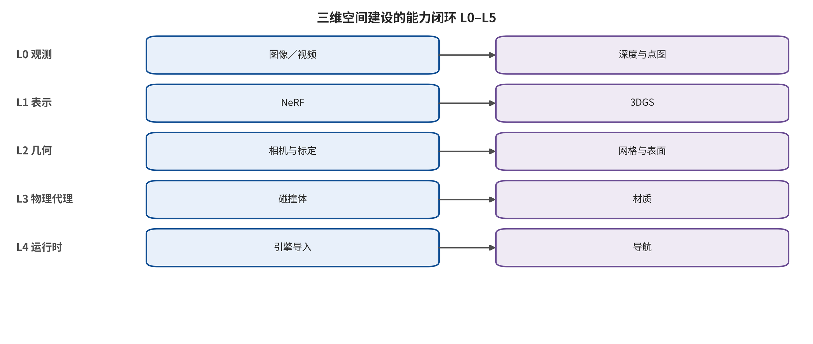

## 分类设计与覆盖审计

本文只采用一条一级分类轴：方法原生闭合了哪一种可验证空间能力。L0 是像素与帧序列，交付图像、视频或动作条件观察；L1 是可查询外观，要求给定新相机后仍能渲染同一场景；L2 是可测空间样本，交付相机、深度、点图、点云或 surfel；L3 是显式可编辑表面与生产资产，交付网格、SDF/TSDF 等值面或版本化视觉资产；L4 是可碰撞和可导航代理；L5 是具有对象身份、状态、脚本、物理、流送、保存与回滚的持久交互世界。

判定时先看输出能否被独立查询和验证。能生成相机运动一致的视频并不自动达到 L1；能渲染新视角的辐射表示也不自动达到 L2 或 L3；携带显式三维中心的 3DGS 不等于显式表面；带三角形的视觉网格不自动达到 L4；能在动作条件下预测下一帧的世界模型也不自动达到 L5。每次晋升都必须增加新的制品合同或状态合同。

多标签只用于记录次级机制，例如显式或隐式表示、逐场景优化或前馈推理、观测驱动或生成驱动、静态或动态、闭源产品或开放实现。一个混合系统可以跨越多层，但正文把它放在首次闭合的关键接口处，并在后续层写清仍需的转换。

覆盖审计的边界案例包括 Marble、Video2Game、前馈几何基础模型和程序化 DCC/CAD。Marble 依据公开导出物可覆盖视觉表示、网格和碰撞代理，但内部生成算法未知；Video2Game 的价值在资产转换链，而非仅生成更多帧；程序化建模从设计意图直接进入 L3 或 L4，不应被迫归入像素重建路线。

该主轴不承诺类别互斥，而承诺判定规则稳定：类别由可验证输出定义，方法名称只是例子。未公开导出、查询或状态接口的系统停留在已证实的最低层，不能依据演示画面向上推断。

### 分类与验证图件

下列图件由旧项目的结构化数据或生成脚本派生，图注同时给出可读范围；正文不使用比较表格替代论证。

*3D 空间建设能力阶梯与方法族分类。图中类别按可验证输出和查询能力编码，而不是按模型名称编码；它是本文主分类轴的图形化表达。*

---

[← 返回目录](index.md)
