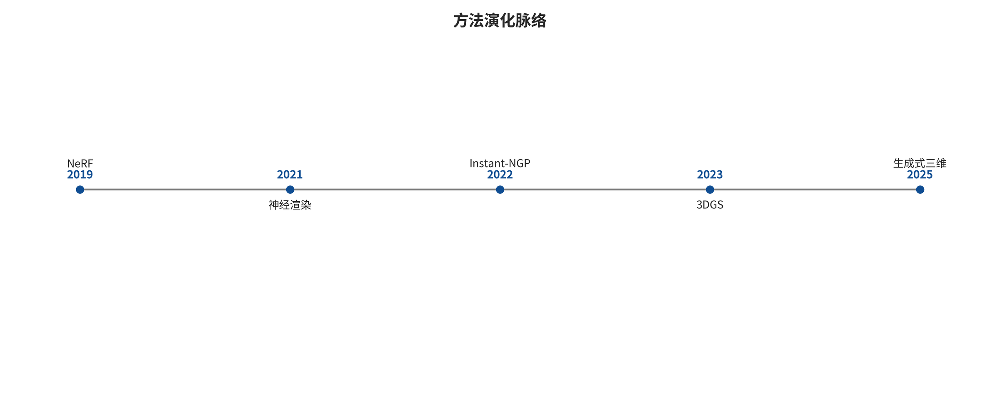

## 跨家族综合与选择指南

前述方法只有放入同一能力闭环后才可比较。这里比较的不是异源最高分，而是观测约束、生成先验、规则约束、逐场景优化、摊销推理和持久状态分别承担了什么。

把论文按年份罗列，会看到 SfM、NeRF、3DGS、视频扩散、世界模型等名词不断更换，却看不出它们为何出现。更准确的脉络是：每一代方法都重新选择了什么作为未知量、用什么观测约束它、结果要回答哪一种查询。

传统重建把相机和三维点作为未知量，通过跨图像对应关系求解；NeRF 把连续密度与颜色函数作为未知量，通过渲染后的像素误差求解；3DGS 把可投影高斯作为未知量，换取更快优化和渲染；DUSt3R、VGGT 等把过去逐场景求解的几何压进前馈网络；视频和世界模型则进一步把“下一时刻会看见什么”作为预测对象。它们不是沿同一标尺越来越高，而是在速度、可观测性、外观、表面、状态和交互之间重新分工。

因此本章不用逐篇字段卡组织论述。逐篇数字和来源定位已经迁移到证据卡附录（开放材料：附录_逐篇证据卡.md）；这里解释方法的思想归类、演进动力和可组合关系。

### 分类与验证图件

下列图件由旧项目的结构化数据或生成脚本派生，图注同时给出可读范围；正文不使用比较表格替代论证。



*从测量几何到持久世界的方法演进。新表示改变了未知量和优化位置，但没有自动消除资产化、物理查询与运行状态的缺口。*

### 第一条矛盾：观测约束与生成先验

真实照片只能约束被看见的表面。相机背面、遮挡区、透明物体内部和绝对尺度通常不可从单图唯一确定。不同方法的根本差异，是如何处理这些不可辨识量。

观测约束型方法只承认能由多视图、深度、IMU 或尺度锚支持的几何。SfM、MVS、SLAM 和 TSDF 属于这一类。优点是误差有物理含义；代价是未覆盖区域保持未知，输入退化时会失败；学习先验型估计用训练分布补足局部歧义，但仍输出深度、点图或相机等几何量。MVSNet、NeuralRecon、DUSt3R、VGGT 属于这一类。它们降低了匹配、标定或逐场景优化门槛，同时把训练域偏差带入几何；生成型方法直接从条件分布采样一个合理世界。视频扩散、文本到 3D 和 Marble 类世界生成属于这一类。它们能填补不可见区域，却不能把“合理”改写为“观测真值”。

这三类不是互斥路线。一个可用系统常用观测约束固定已见区域，用生成先验提出未见区域候选，再用闭环、多视图或人工语义验证决定哪些内容可以固化为资产。若生成视图由同一个模型产生，多视图一致也可能只是模型在多个角度重复同一幻觉，因此必须保留真实观测锚点。

### 第二条矛盾：画面损失与表面查询

NeRF 的关键转变不是“用了神经网络”，而是把监督终点从特征对应/深度改成了渲染像素。只要沿每条射线积分得到的颜色接近照片，密度可以是厚层、半透明层或若干互相补偿的结构。这个目标特别适合新视图，却不要求唯一薄表面。

3DGS 保留同一类像素目标，但把隐式 MLP 换成可以直接投影的各向异性高斯。训练和渲染显著加快，代价是高斯之间没有共享边和封闭内外。随后 SuGaR、2DGS、Gaussian Opacity Fields、3DGSR 等重新引入表面对齐、局部盘元、水平集或 SDF 约束，说明演进不是“高斯淘汰网格”，而是：

用可微外观表示获得高质量和快速渲染；发现像素目标不足以确定表面；再把法向、深度、SDF、盘面或 Poisson 等几何约束接回系统；将视觉表示和提取网格作为两个有版本关系、但不能互相替代的制品。

这种往返揭示了一个通用规律：优化目标决定结果愿意牺牲什么。像素损失愿意牺牲拓扑；Chamfer 距离可能牺牲薄壁和连通；水密化愿意封闭未知区域；碰撞代理愿意牺牲视觉细节以换取保守、稳定和快速查询。没有跨任务的“最好表示”，只有与查询合同匹配的表示。

### 第三条矛盾：逐场景优化与摊销推理

经典 SfM/MVS 和早期 NeRF 都需要为一个新场景执行显式求解或优化。优点是观测残差可以针对当前场景下降；缺点是初始化、时间、局部极值和长序列扩展成本高。

学习式几何把大量过去场景的求解经验摊销进网络参数。DUSt3R 直接预测两个视图中的点图与置信度，再做全局对齐；VGGT 用共享 Transformer 同时预测相机、深度、点图和点轨迹。它们把“先匹配、再估相机、再估深度”的模块化流程压成联合前馈推理，但没有让几何约束失效：跨长序列仍需全局对齐、闭环、尺度锚和异常观测处理。

因此更可能稳定下来的工程形态不是“网络完全取代优化”，而是：

**原稿中的 text 流程或伪代码**
```
前馈模型给相机/深度/点图/置信度初值
→ 几何验证删除不一致观测
→ BA、位姿图或全局对齐修正跨视图约束
→ 深度/点云融合与表面化
→ 对失败区域重新采集或保留未知
```

这里的演进动力是把昂贵搜索变成强初始化，再让显式优化承担可审计的最后约束。前馈速度和优化可解释性并非二选一。

### 第四条矛盾：逐帧生成与持久空间状态

普通视频生成器学习的是条件像素序列。它可以生成相机运动和视差，但没有义务保存“门的对象 ID”“玩家刚移动的箱子”或“同一房间在另一条路径下的状态”。动作条件世界模型进一步学习

$$
p(o_{t+1}\mid o_{\le t},a_{\le t}),
$$

使下一帧响应动作；然而，把全部状态压进有限历史帧仍会造成回访遗忘、对象漂移和分支不一致。

GEN3C 一类方法通过深度反投影维护可回渲 3D cache，说明像素生成需要空间记忆；PERSIST 类研究把相机、环境和渲染器放进潜三维状态；游戏引擎则早已使用对象表、场景图、组件和事件日志维护确定性状态。世界模型的演进由此出现两条可能汇合的路线：

神经模型负责外观、未观测内容、动态先验和反事实候选；显式状态负责对象身份、几何、碰撞、任务逻辑、权限和可回滚事件。

真正的“持久世界”不只是视频更长，而是同一状态在回访、遮挡、编辑和动作分支下仍能被查询与复现。Marble 的公开产品接口已经把 splat、视觉网格和粗 collider 分层导出，但其内部世界模型架构未公开，因此只能把它放在“产品化分层资产输出”位置，不能据此补写潜状态或物理求解算法。

### 第五条矛盾：从观测未知量到显式设计意图

上述四条矛盾都从“不知道场景是什么”出发：算法要从观测或训练分布恢复相机、表面、外观或状态。程序化 DCC/CAD 改变了起点。它把墙宽、门高、草图约束、布尔关系、实例规则、对象 ID 和随机种子视为已知设计意图，未知量变成“规则怎样求值为合法几何和场景”。这条路线不与 SfM、NeRF 或世界模型竞争同一个问题；它在结构已知、需要批量变体或可编辑性的区域，避免先生成像素再反推本来已经知道的尺寸。

程序化路线的核心约束也因此不同。OpenSCAD 的 CSG 树受集合运算、容差和最小特征约束；CadQuery/FreeCAD 的 B-rep 与特征历史受草图、工作平面、拓扑引用和内核有效性约束；Blender `bpy`/BMesh 和 Geometry Nodes 受场景数据块、依赖图、属性域与宿主上下文约束；Houdini 受 SOP/VEX/PDG 的数据流、属性和 cook 依赖约束；引擎编辑器脚本再受资产数据库、场景事务与运行时构建规则约束。它们的主要误差不是像素损失，而是尺寸偏差、布尔失败、拓扑命名漂移、上下文依赖、非确定随机、导出差异和批量错误放大。

最有解释力的演进不是“代码建模替代 AI”，而是可执行设计规范开始连接学习模型。语言/世界模型可以把意图解析成受限参数或候选程序，程序执行器在固定版本和沙箱中构造资产，几何验证器用尺寸、拓扑、碰撞和导航查询给出反例，模型再修改参数或程序。闭环中的模型负责搜索和语义，CAD/DCC 内核负责确定求值，独立验证器决定是否发布。只有把生成代码当作不可信输入，并保存参数、种子、版本、输出哈希和失败轨迹，这种 agentic modeling 才比一次性“文本转 Blender 脚本”更接近可维护工程。

### 按核心未知量归类，比按论文名称归类更稳定

从核心未知量看，SfM/BA 求解相机内外参与稀疏三维点，约束来自极几何、重投影误差和鲁棒核，因此擅长回答“相机在哪里、观测点在哪里”；MVS 和学习式深度方法进一步求每个视图的深度与置信度，通过光度或特征一致性、平面扫描代价体和空间正则恢复可见表面距离。TSDF/SLAM 把未知量换成位姿轨迹、体素距离与融合权重，通过视觉/ICP 残差、加权融合和闭环来查询自由空间、占据和等值面。DUSt3R、VGGT 类模型则把点图、深度、相机和点轨迹的估计摊销进大规模网络，但尺度、长序列闭环和表面资产并不会随一次前向推理自动完成。

NeRF 求解连续密度与视角相关颜色，直接用可微体渲染的像素误差约束，因此原生擅长辐射和新视图查询；神经 SDF 把几何未知量改成到表面的有符号距离，并用 Eikonal 或几何正则约束零水平集；3DGS 求解高斯中心、协方差、不透明度和外观，通过投影合成后的图像损失以及增密、裁剪获得快速渲染。Poisson、BPA 和 alpha shape 则不再学习外观，而是根据法向场、邻域半径或采样几何估计三角表面。它们分别解决辐射、隐式表面、显式基元和点到面的不同查询，不能用一个 PSNR 或一个“是否输出 3D”标签混为一类。

视频生成把潜视频或逐帧像素作为未知量，优化去噪、序列预测和条件遵循；世界模型增加动作条件潜状态、观察分布、奖励或价值预测；程序化 DCC/CAD 则固定或枚举设计参数，通过 CSG、约束、节点图和场景 API 求值可编辑几何；碰撞与 NavMesh 最终求解的是保守接触代理和带代理尺寸约束的可达空间。图的重点正是定位这些未知量及其遗留缺口：两个系统即使都叫 world model，如果一个只预测像素、另一个维护可查询 3D 状态，它们在建设管线中的位置仍不同；两个系统即使都输出 GLB，如果一个是视觉网格、另一个是粗 collider，也不是相同交付；一个 Blender 脚本即使确定地产生 mesh，也不能据此证明现场测量、物理代理和宿主信任同时成立。

### 七个关键转换定义了完整空间建设

### 设计意图到参数化几何与场景图

使用 CSG、sketch/feature B-rep、BMesh/修改器、节点数据流或引擎编辑器 API，把单位、尺寸、约束、语义 ID 和种子求值为可编辑资产。核心风险是布尔/特征内核、上下文、属性域和导出器使规则在不同版本下得到不同拓扑。输出必须带工具链锁、参数清单、求值几何与回读查询。

### 像素到相机与空间样本

使用特征/学习对应、极几何、三角化、深度回归或点图预测。核心风险是把物体运动、重复纹理或生成不一致解释成相机/几何。输出必须带置信度、坐标系和尺度来源。

### 空间样本到可查询外观

用 NeRF、3DGS 或神经纹理拟合多视图外观。核心风险是外观优化吸收几何错误，使训练视角附近很好看、离轨迹视角出现漂浮或拉伸。

### 空间样本或辐射表示到表面

使用 TSDF 等值面、Poisson、BPA、神经 SDF、Gaussian surface regularization 等。这里必须明确阈值、法向、分辨率和未观测区策略，因为“提面”是一次新的估计，而非格式转换。

### 表面到生产网格

修复非流形、自交、退化面和翻转法向；做 QEM/重拓扑、LOD、UV 和材质烘焙。核心风险是修洞和简化改变门洞、薄壁、关节间隙或语义边界。

### 视觉网格到碰撞与导航

为动态对象构造基本体、凸包/凸分解或 SDF，为静态环境构造简化三角碰撞；再按代理半径、身高、坡度和台阶烘焙 NavMesh。核心风险是视觉精度与求解稳定目标相反，不能共用一个“越密越好”的指标。

### 资产到持久运行世界

引擎把网格、高斯、材质、碰撞、导航、对象状态和脚本组织成场景图，并承担流送、版本、网络同步和回滚。只有到这一步，“可以看”才可能成为“可以维护和交互”。

### 方法选择的正确顺序

选型不应先问“用 NeRF 还是 3DGS”，而应按下列顺序倒推：

最终查询是视频观看、新视图、测量、编辑、碰撞、导航还是动作分支？；哪些区域有真实观测，哪些区域允许先验生成？；是否需要绝对尺度、对象身份、动态状态或确定性重放？；允许离线优化多久，运行时的 GPU/CPU/内存预算是多少？；哪些错误必须保守失败，哪些错误可以交给人工修复？；每一次表示转换如何记录坐标、置信度、版本和误差？。

例如，虚拟参观可以选择 SfM 位姿加 3DGS 外观，再为地面和墙体制作简化碰撞；机器人数字孪生可让扫描提供现场偏差、参数 CAD 提供可编辑结构、TSDF/SDF/网格承担带尺度几何与接触验证，并把 3DGS 作为外观层；文本生成游戏原型可以让世界生成器提出布局，让 Blender/Houdini 或引擎脚本把受约束模块批量实例化，但关键门洞、台阶、动态物体和玩法区域仍需碰撞与 NavMesh 回归。

这一归类也解释了研究的总体方向：不是某个新模型吞并全部旧模块，而是生成、几何、外观、表面、物理和运行时逐渐形成带显式接口的混合系统。真正的进步应表现为某个转换更少人工、更可验证或误差更可控，而不只是演示画面更逼真。

---

---

[← 返回目录](index.md)
