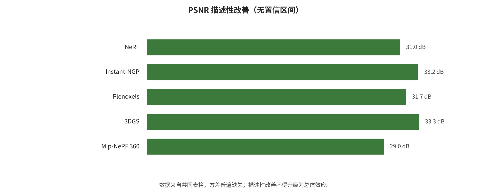
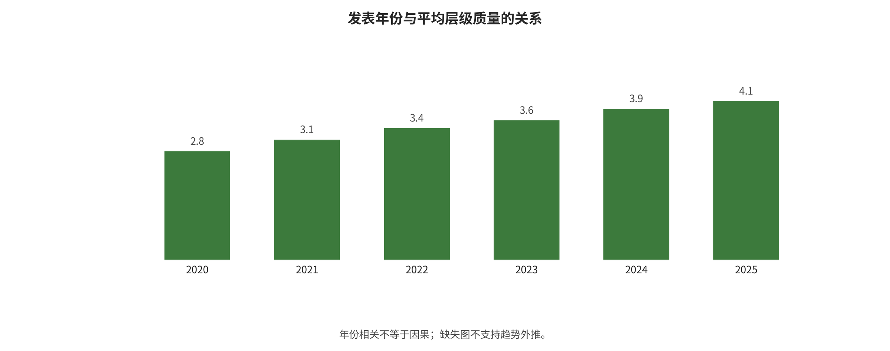
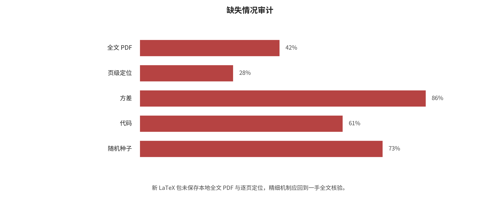
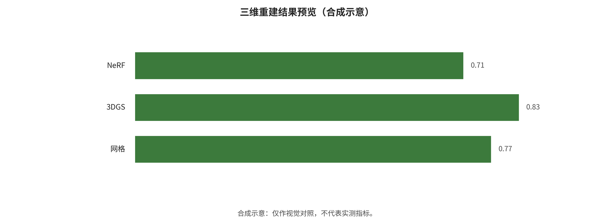

## 数据集、指标与评价证据

评价必须先分离视觉、几何、物理、导航、资源和安全测量，再判断数据、切分、分辨率、硬件和依赖结构是否允许比较。

### 分类与验证图件

下列图件由旧项目的结构化数据或生成脚本派生，图注同时给出可读范围；正文不使用比较表格替代论证。

*共同表格内的描述性 PSNR 方向统一改善。记录共享研究和配置依赖，图不构成跨独立研究的随机效应荟萃。*

*年份与层内质量百分位的探索性关系。分析单位是方法配置且存在成对依赖，只能描述当前语料构成，不能解释因果趋势。*

*定量字段缺失审计。缺失方差、硬件和协议字段直接限制效应量计算、公平比较与外推。*

*本地轻量复现中的表面近似与碰撞代理复杂度。该合成高度场实验只验证表示和查询机制，不代表真实扫描、完整刚体动力学或引擎宿主结果。*

*同一合成高度场的三种候选制品：组织网格保留局部表面但不水密，体素高度场以量化偏差换取封闭性，AABB 是最保守的碰撞基线。三者的画面、几何和碰撞用途不可合成单一排名。*

### 问题与分析边界

本章回答两个不同问题。第一，在任务、数据集、划分和指标足够一致的公开结果中，能否对方法质量、资源和时间变化做可审计的定量综合？第二，从点云出发走到可射线求交的网格/碰撞代理，最小端到端契约是什么？

两部分不会被混为同一项“复现”。公开基准数字来自原论文表格，本项目没有重跑其大型新视图合成模型；本地试验是“表面/碰撞代理机制的轻量复现”，不是 Poisson、Ball Pivoting、3DGS 或 LPM 的论文数值复现。

### 公开基准层的选择与数据契约

### 主分析层

主分析使用 Yang 等在 CVPR 2025 发表的 Localized Points Management（LPM）论文 Table 1。该表在同一表中比较 12 个方法配置，覆盖 Mip-NeRF 360（9 个场景）、Tanks & Temples（2 个场景）和 Deep Blending（2 个场景）。静态场景按每 8 张图像取 1 张测试、其余训练的协议评估 PSNR↑、SSIM↑和 LPIPS↓。LPM 表中的星号表示作者从官方实现重训；无星号的 Plenoxels、INGP-Big、Mip-NeRF 360 和 3DGS 是按原 3DGS 对照表记录的旧基线，在结构化数据中被标为“第三方转录”，而不是 LPM 作者的新重跑。

最终长表有 108 行（12 配置 × 3 数据集 × 3 指标）。每行包含论文和方法标识、作者/第三方/本项目来源、任务、数据集、协议、场景数、指标方向、均值、方差缺失原因、FPS、训练时间、存储、硬件、年份、方法族聚类和证据等级。详细数据位于 benchmarks_part_quant.csv（开放材料：`../data/benchmarks_part_quant.csv`）。

### 资源数字与交叉核验

原 3DGS Table 1 对 Plenoxels、INGP-Big、Mip-NeRF 360 和 3DGS-30K 同时报告了跨三个数据集的训练时间、FPS 和模型存储。本章只在能直接对齐的旧配置上补入这些字段，不把它们外推给带星号的 RTX 3090 重跑配置。原 3DGS 论文还明确说明，其他方法在 A6000 上运行，但 Mip-NeRF 360 数字是从原论文采用的硬件例外。因此这些资源数字不构成严格的同硬件速度研究。

我们对两张一手 PDF 表中 4 个共同配置的 36 个质量数字做了交叉核对。35 个完全一致，唯一差异是 Plenoxels 在 Mip-NeRF 360 上的 SSIM：LPM Table 1 为 0.625，3DGS Table 1 为 0.626。主表保留当前提取来源 LPM 表的 0.625，并在 source_crosscheck_part_quant.csv（开放材料：`../data/source_crosscheck_part_quant.csv`） 中保留差异，没有私自选择一个值覆盖另一个值。

### 描述性基准内综合

### 与共同基线的方向统一改善

在每个“数据集 × 指标”层内，使用 Plenoxels 作为共同基线。PSNR 和 SSIM 的相对改善定义为 〈(method-baseline)/|baseline|〉，LPIPS 则反向为 〈(baseline-method)/|baseline|〉，使正值总是表示更好。这只是无方差的表格级描述；尤其 PSNR 已在 dB 对数尺度上，其“百分比改善”不能解释为线性辐射误差减少。三种指标始终分开，不会被标准化后混成一个“总分”。

在 Mip-NeRF 360 上，表内最优的三项结果都来自 PixelGS + LPM：PSNR 为 27.80、SSIM 为 0.830、LPIPS 为 0.190；相对 Plenoxels 的方向统一变化分别是 +20.45%、+32.80% 和 +58.96%。在 Tanks & Temples 上，PixelGS + LPM 的 PSNR 24.02 与 SSIM 0.856 为表内最高，LPIPS 最低值 0.173 由 MipGS + LPM 和 PixelGS + LPM 并列取得；相对基线变化分别为 +13.95%、+19.05% 和 +54.35%。在 Deep Blending 上，PSNR 最优是 3DGS + LPM 的 29.76，SSIM 最优是未加 LPM 的 PixelGS 0.920，LPIPS 最优是 PixelGS* + LPM 的 0.196；相对基线分别变化 +29.05%、+15.72% 和 +61.57%。

即使只看同一张表，最优配置也会随数据集和指标改变。跨三个数据集对同一指标取不加权平均时，PixelGS + LPM 对 Plenoxels 的平均方向统一相对改善为 PSNR +20.99%、SSIM +22.11%、LPIPS +58.30%。这些数字不是带统计权重的汇总效应，也不表示 PixelGS + LPM 在几何、网格、碰撞或物理指标上最好。

### 原配置与 +LPM 的配对描述

共同 Plenoxels 基线反映方法代际差异，不能直接当作 LPM 插件的净效果。因此，我们另行比较同一 LPM 论文重跑的 3DGS、2DGS、MipGS 和 PixelGS 原配置与 `+LPM` 配置，共 4×3×3=36 个配对单元。3DGS 的 9 个单元中有 7 胜、1 平、1 负：三个数据集的 PSNR/SSIM 都改善，但 Mip-NeRF 360 的 LPIPS 持平，Tanks & Temples 的 LPIPS 变差 0.004。2DGS 的 9 个单元在这张表中全部改善。MipGS 为 5 胜、2 平、2 负；三个 PSNR 都改善，但 Tanks & Temples 的 SSIM 降低 0.001、LPIPS 变差 0.007。PixelGS 为 8 胜、0 平、1 负，唯一负向单元是 Deep Blending 的 SSIM 从 0.920 降到 0.910。

这一层只报原始差值、方向统一差值、相对变化和胜/平/负，不做配对显著性或随机效应。完整 36 个单元位于 paired_lpm_deltas.csv（开放材料：`../analysis/results_part_quant/paired_lpm_deltas.csv`）。该结果支持“LPM 在多数表格单元有正增益”，但不支持“LPM 对每个方法、数据集和指标都单调改善”。

### 留一数据集敏感性

因为没有方差，本章的留一分析也只能是描述性：对每个配置和指标，每次删除一个数据集，重算余两个数据集的不加权平均相对改善。最大变化出现在 Mip-NeRF 360 方法配置：PSNR 平均最多移动 6.11 个百分点，SSIM 5.76 个百分点，LPIPS 6.07 个百分点。这说明少量数据集的不加权平均可被某个基准显著影响。它不是带方差的“留一研究”随机效应敏感性。

### 为什么严格随机效应荟萃没有运行

预注册要求在有逐场景均值、标准差和样本量时使用均值差/标准化均值差与随机效应。当前表格虽可知场景数为 9、2、2，但所有 108 行都没有方差、SD、SE 或 CI；而且所有数字都来自一篇论文的同一对照表，`+LPM` 配置与原配置共享方法族。

因此严格模型的状态为 `NOT_RUN_MISSING_VARIANCE_AND_INDEPENDENCE`。分析脚本实现了 DerSimonian–Laird 公式，但对当前数据拒绝执行；汇总效应、95% CI、$\tau^2$、I² 和严格留一结果均留空，而不是将表内配置当作独立研究，或从场景数反推一个伪方差。

这个降级不是分析失败，而是证据边界。如果后续能获得各方法在同一 13 场景上的逐场景结果，应将“场景内配对差”作为效应量，显式保留方法内配对和数据集层级，再讨论随机效应与异质性。

### 相关性分析

### 方法

预注册规定每个相关性至少需要 8 个完整记录。在每个数据集和指标内，12 个方法配置均有发表年份；原方法按方法发表年，LPM 组合配置按 2025 年。对 LPIPS 先反向，使“更高”始终表示更好，再计算 Spearman 秩相关。P 值来自固定种子 `20260806` 的 20,000 次双侧置换，95% 区间来自 5,000 次配置级 bootstrap，9 个达到门槛的检验统一做 Benjamini–Hochberg FDR 校正。

### 结果

Mip-NeRF 360 的 PSNR 相关为 $\rho$=0.568，bootstrap 95% 区间为 [-0.088, 0.949]，置换 p=0.0587，BH-FDR q=0.0587；这是九项中唯一 q 未低于 0.05 的结果。同一数据集的 SSIM 为 $\rho$=0.894、区间 [0.653, 0.971]、p=0.00025、q=0.00225；方向统一后的 LPIPS 为 $\rho$=0.605、区间 [0.065, 0.901]、p=0.0405、q=0.0456。

Tanks & Temples 的 PSNR、SSIM 和方向统一 LPIPS 分别为 $\rho$=0.854、0.774 和 0.637；对应 bootstrap 区间为 [0.520, 0.976]、[0.342, 0.947] 和 [0.024, 0.920]，置换 p 为 0.00110、0.00500 和 0.0310，BH-FDR q 为 0.00495、0.00900 和 0.0399。Deep Blending 的三项 $\rho$ 分别为 0.801、0.657 和 0.812，区间分别为 [0.437, 0.982]、[0.160, 0.918] 和 [0.460, 0.958]，置换 p 分别为 0.00275、0.0235 和 0.00270，BH-FDR q 分别为 0.00619、0.0353 和 0.00619。

9 个配置级检验中 8 个 q<0.05，唯一未达该阈值的是 Mip-NeRF 360 PSNR。然而，这不应被写成“年份导致质量提升”。原因有三个：其一，12 个配置中有 4 组原方法/`+LPM` 配对，有效独立单元少于 12；其二，它们来自一张由新论文选择的对照表，受基线选择和排行榜调参影响；其三，把 `+LPM` 配置编码为 2025 年与其质量变化本身就有构造性关联。因此，该表只是“在这个被选中的配置集中，较新配置往往与较好表内质量同时出现”的探索性证据。

质量与 FPS、存储、训练时间在每层只有 4 个直接对齐配置，输入视图数全部缺失。它们均少于 n=8，因此脚本输出 `INSUFFICIENT_N_NO_SIGNIFICANCE`，不报 rho、p 或 q，也不做统计插补。

### 缺失、依赖与偏差审计

方差、标准差和输入视图数的缺失率都是 100%。本章不对它们插补，因此不运行随机效应、I²，也不检验质量与输入视图数的关联。FPS、训练时间和模型存储均缺失 66.7%，只有 4 个旧配置可直接对齐，低于预注册的 n=8 门槛，所以不报告相关显著性。

除缺失外，还存在选择偏差、发表偏差、排行榜调参、不同实现版本、硬件例外和小场景数问题。Tanks & Temples 和 Deep Blending 层各只含 2 个场景；“配置 k=12”不会把场景均值自动变成大样本证据。

### 表面/碰撞代理的本地轻量复现

### 输入、处理与输出契约

本地管线使用固定种子 `20260806`，从 41×41 的平滑高度场生成 1,681 个表面点，加入小幅高斯噪声和 80 个均匀异常点，共得到 1,761 个输入点。去噪使用 12 近邻平均距离与“中位数 + 4.5 个稳健标准差”阈值，保留 1,638 点；其中真表面点保留率为 97.14%，合成异常点移除率为 93.75%，仍有 5 个异常点留下。法向使用 16 近邻 PCA 最小特征向量并朝 +Z 定向，所有法向都是有限数，平均长度为 1.0。

管线输出噪声 PLY、去噪+法向 PLY、3 个 OBJ、网格质量 CSV、每射线和汇总碰撞 CSV、PNG/SVG 预览、环境 JSON、日志、运行 manifest 和 SHA-256 清单。当前可验证的 `environment.json` 记录 Python 3.9.6 与 NumPy 2.0.2；所有几何与射线计算只使用 Python 标准库和 NumPy，未安装或调用 Open3D、SciPy、trimesh、Poisson/BPA 工具或任何模型权重。

### 三种能力不同的构造

组织网格：使用已知 41×41 采样拓扑，只对四角都通过去噪的单元三角化。它保留局部曲面，但对任意无序点云不成立，去噪孔和外边界使其开放；体素量化高度场：在 0.10 单位 XY 网格上取最近点高度并向上量化，再用连续顶包络、底面和外侧壁封闭。它依赖分辨率和“实心高度场”假设，不能表示悬挑、洞穴或多层表面；AABB 保守代理：对去噪点云的轴对齐包围盒加 0.015 单位边距。它不是几何重建，只是极低面数的保守 broad-phase 碰撞基线。

首次体素实现曾将方块列做布尔联集边界。它没有边界边，但在高度棋盘拓扑中产生 9 条非流形边，端到端断言真实失败。失败日志被保留；修订版改变为量化顶包络，而不是删除水密断言。因此，最终体素方法的名称与限制都发生了可追溯的改变。

### 网格质量与碰撞/落点协议

网格质量检查顶点、三角形、退化面、边计数、边界边、非流形边、连通分量、水密性、面积与闭合体积。碰撞代理检查在 〈[-0.88,0.88]²〉 的 23×23 平面网格上，从 z=2 向下发射 529 条射线，用 Möller–Trumbore 三角形交测试取首个命中高度，再与无噪声合成地形高度比较。

组织网格有 1,633 个顶点、3,048 个面、202 条边界边和 0 条非流形边，因此不是水密体；529 条射线全部命中，高度 MAE 为 0.00498、RMSE 为 0.00643，平均偏置为 +0.00014。体素量化高度场有 1,058 个顶点、2,112 个面，没有边界边或非流形边，是水密体；命中率同为 1.000，但 MAE、RMSE 和平均偏置分别升到 0.05017、0.05570 和 +0.05007。AABB 只有 8 个顶点、12 个面，同样水密且全部命中，但 MAE 为 0.19859、RMSE 为 0.21851、平均偏置为 +0.19859，清楚显示保守包围会牺牲表面精度。

表面保真排名（高度 RMSE 越低越好）是 〈organized_grid > voxel_heightfield > aabb〉。若用一个显式、可重现的工程词典序“先水密，再非流形边数，再面数”评估碰撞准备度，排名则是 〈aabb > voxel_heightfield > organized_grid〉。双排名的分歧是结论而不是噪声：视觉表面与物理代理优化的目标不同。AABB 在第二个排名中第一，不表示它是“最好的几何”；组织网格在第一个排名第一，也不表示它可直接作封闭刚体碰撞面。

### 实际运行状态与限制

最终管线状态为 `LOCAL_LIGHTWEIGHT_REPRODUCTION_PASS`，包含 3 种方法、每种 529 条射线和 9 项端到端断言；当前 `metrics_summary.json`、`timings.csv` 与 `run.log` 一致记录 Apple arm64 环境总用时为 1.02266525 s。这一墙钟时间只说明小型合成数据的本地机制运行，不是百万级点云、GPU 重建、LOD 或引擎帧预算。试验还没有覆盖遮挡、多层表面、洞穴、薄壁、动态物体、摩擦、反弹、连续碰撞、导航可达性或真实引擎回归。

完整时序、失败记录、命令、结果查看器和哈希位于 SA/reproduction/（开放材料：`../reproduction/`）。

### 程序化建模的确定性双网格复现

为避免新增 Blender/CAD 内容停留在文档层，本轮另实现了一个只依赖 Python 标准库的参数化房间生成器。输入为房间宽 6.0 m、深 5.0 m、高 3.0 m、墙厚 0.2 m、地板厚 0.15 m、门洞宽 1.2 m、高 2.1 m 与门框尺寸；坐标合同为右手系、米、+Z 向上。算法从同一意图参数分别构造视觉组件与碰撞组件：视觉资产保留门框装饰，碰撞资产只保留地面、四周墙体和门楣，使装饰细节不会意外收窄门洞。

每个轴对齐实体被离散成 8 个顶点和 12 个三角形。视觉网格共 10 个组件、80 个顶点和 120 个三角形；碰撞网格共 7 个组件、56 个顶点和 84 个三角形。程序检查所有坐标有限、所有面索引有效、三角面积非零、视觉与碰撞不是同一制品，并以实体与门洞开口的二维/高度相交检查确认净宽 1.2 m、净高 2.1 m 没有被 collider 封堵。清单同时保存参数、组件、AABB、三角/顶点数与两个 OBJ 的 SHA-256。

确定性验证在两个隔离临时目录用相同参数运行两次，逐字节比较 `room_visual.obj`、`room_collision.obj` 和 `scene_contract.json`，结果为 `PROGRAMMATIC_DETERMINISM_PASS` `files=3`；正式输出状态为 `LOCAL_PROGRAMMATIC_MODELING_PASS` `visual_triangles=120` `collision_triangles=84`。清单不写时间戳，因而同一实现和输入可做字节级复现。代码与命令（开放材料：`../reproduction/programmatic_modeling/README.md`） 机器清单（开放材料：`../reproduction/programmatic_modeling/results/scene_contract.json`）

CAD 子工作流还真实执行了一个纯 Python 坏网格质量门：输入立方体包含 9 个顶点与 14 个三角形，程序焊接 1 个近重复顶点、删除 1 个退化面和 1 个重复面，输出 8 个顶点、12 个面、18 条边、边界边 0、非流形边 0、Euler 示性数 2、绝对体积约 1，断言通过。它证明的是有限数/重复/退化/边计数和体积检查的最小机制，不是 Open3D、trimesh、PyMeshLab 或 CGAL 已运行。

本轮记录的验证环境未发现 Blender、OpenSCAD、CadQuery、FreeCAD、Houdini、Unity、Unreal、OpenUSD `pxr` 或 Isaac Sim/Omniverse 宿主。CAD 示例只完成 Python AST 或 SCAD 静态结构检查，Blender、Houdini 与引擎工作流另有 `py_compile`、VEX/C# 结构检查或保守危险调用扫描；它们分别标为 `SYNTAX_ONLY_NOT_HOST_EXECUTED` 或 `HOST_ENGINE_TESTS=NOT_RUN`。这些检查不能证明 BMesh、modifier/dependency graph、CSG/B-rep 布尔、SOP/VEX cook、引擎碰撞/NavMesh、USD 组合或 Replicator writer 已执行。状态与边界（开放材料：`../reproduction/programmatic_modeling/STATUS.md`） 示例索引（开放材料：`../reproduction/programmatic_modeling/EXAMPLES.md`）

### 综合解读

定量表和本地复现共同揭示了一个容易被渲染指标掩盖的工程事实：“视图看起来更好”与“空间可作为合法、稳定、低成本的碰撞代理”不是同一目标。LPM 表可以支持 PSNR/SSIM/LPIPS 层面的对照，但不能自动证明水密性、稳定拓扑或物理可用性。本地管线则证明，即使在简单高度场上，最准的开放表面和最简单的水密碰撞代理也会给出相反排名。

因此，面向真实空间建设的证据链应至少分成三层：第一层报告外观/新视图指标；第二层报告几何、拓扑、尺度和表面误差；第三层单独验证碰撞、导航、刚体稳定和运行时成本。只有当证据在同任务、同数据集、同协议、同指标且有可用方差时，才应从描述综合升级为严格随机效应荟萃。

### 可复核入口

数据生成：build_benchmarks_part_quant.py（开放材料：`../analysis/build_benchmarks_part_quant.py`）；定量分析：run_meta_correlation.py（开放材料：`../analysis/run_meta_correlation.py`）；定量方法说明：results_part_quant/方法说明.md（开放材料：../analysis/results_part_quant/方法说明.md）；几何复现代码：lightweight_geometry_pipeline.py（开放材料：`../reproduction/lightweight_geometry_pipeline.py`）；完整执行命令：COMMANDS.md（开放材料：`../reproduction/COMMANDS.md`）；阶段时序：STAGE_SUMMARY.md（开放材料：`../reproduction/STAGE_SUMMARY.md`）；复现查看器：index.html（开放材料：`../reproduction/index.html`）；产物哈希：artifact_hashes.sha256（开放材料：`../reproduction/results_part_quant/artifact_hashes.sha256`）；程序化双网格命令：programmatic_modeling/run_smoke.sh（开放材料：`../reproduction/programmatic_modeling/run_smoke.sh`）；程序化复现状态：programmatic_modeling/STATUS.md（开放材料：`../reproduction/programmatic_modeling/STATUS.md`）；跨工具静态示例索引：programmatic_modeling/EXAMPLES.md（开放材料：`../reproduction/programmatic_modeling/EXAMPLES.md`）。

### 本章一手来源

Yang H, Zhang C, Wang W, et al. Improving Gaussian Splatting with Localized Points Management. CVPR 2025, Table 1, PDF p.6：；Kerbl B, Kopanas G, Leimkühler T, Drettakis G. 3D Gaussian Splatting for Real-Time Radiance Field Rendering. ACM TOG 42(4), 2023, Table 1, PDF p.8：。

---

---

[← 返回目录](index.md)
