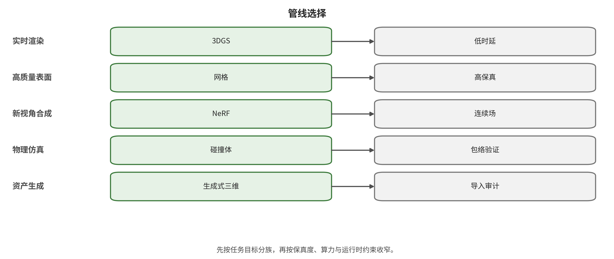

## 应用与部署映射

应用映射从最终查询倒推建设管线：需要观看、测量、编辑、碰撞、导航、规划或回滚，会选择不同的主表示和验证门。

不存在一条适用于所有输入和应用的最优管线。选型应从最终需要回答的查询倒推：只看画面、自由查看、精确测量、编辑表面、实时碰撞、代理导航，还是长时动作响应。下面给出六类常见建设任务。

### 分类与验证图件

下列图件由旧项目的结构化数据或生成脚本派生，图注同时给出可读范围；正文不使用比较表格替代论证。

*从最终查询合同反推建设管线的分类图。选择顺序先固定需要回答的查询，再选择表示、资产化、碰撞导航和引擎运行层。*

### 真实场景高保真数字化

建议管线：规划采集 → 相机/颜色预处理 → SfM/SLAM 位姿 → MVS 或前馈点图/深度 → 3DGS/NeRF 外观层 + TSDF/神经 SDF/网格几何层 → 网格修复与材质 → 独立碰撞和 navmesh → 引擎验证。

为什么采用双表示：3DGS/NeRF 通常更擅长拟合训练视角附近的复杂外观和视角相关效果，但几何层更适合尺度、测量、编辑与碰撞。若项目只是虚拟参观，可把更多预算放在外观层；若用于机器人或数字孪生，几何和尺度验证优先于 PSNR。

关键验证：回访闭环、重投影、深度/点云误差、未覆盖区、薄/透明物体、坐标与尺度、网格自交/孔洞、碰撞穿透、导航连通和引擎峰值资源。

### 单图或文本快速生成世界

建议管线：文本/图像 → 布局或粗 3D 条件 → 多视图/全景/3D 世界生成 → 前馈几何或场景表示 → 对象分解 → 视觉网格/高斯与碰撞代理分离 → 人工语义校正 → 引擎烘焙。

必须接受的事实：不可见内容没有唯一真值。生成系统应输出不确定性、版本和来源，而不是把先验补全描述为重建。对于玩法和美术原型，合理性比观测真实性重要；对于真实地点复刻，必须把生成区和观测区分层标记。

Marble 类服务的正确使用方式：可以把其 splat 作为高保真视觉层，把导出的粗 collider 作为原型物理层，再对关键玩法区域重建或手工修正碰撞。官方文档已经说明高质量视觉网格也可能在未覆盖、反射和薄结构处出错，因此不能跳过资产检查和游戏测试。Marble 网格导出 [@srcWL-MARBLE-MESH]

### 交互视频世界和代理训练

建议管线：动作条件世界模型 → 明确状态/记忆接口 → 像素或 3D 状态滚动 → 安全壳/动作门控 → 关键状态的显式地图或对象表 → 与传统物理/任务逻辑对照 → 代理评测。

应用边界：像素世界模型适合生成多样、连续的视觉经验和反事实场景，但若任务依赖精确距离、接触或奖励，必须有可验证的状态通道。可行的混合方案是让生成模型负责外观和未见内容，让显式模拟器负责碰撞、动力学、任务终止和安全约束。

关键验证：相同动作重放、分支一致性、回访记忆、物体永久性、状态泄漏、长时漂移、动作延迟、闭环任务成功率和安全约束违反。不能用短视频偏好分数代替这些指标。

### 游戏、XR 与内容生产

建议管线：生成/扫描资产 → 分对象与语义 → 网格修复/重拓扑 → UV/PBR 材质/烘焙 → 多级 LOD/流送 → 简单/复杂碰撞 → navmesh 和交互标记 → 平台构建与帧预算测试。

表示组合：静态背景可使用高斯/神经渲染插件，近距离交互物体用传统网格、骨骼和材质；视觉与碰撞分离；远景、天空和不可交互区域不要支付高精度碰撞成本。

关键验证：桌面、移动、XR 各自的 GPU/CPU/内存预算；透明/反射材质；光照和阴影；LOD 跳变；碰撞层与触发器；连续碰撞和高速物体；导航代理尺寸；资源加载、卸载和失败回退。

### 机器人仿真与数字孪生

建议管线：标定传感采集 → 具有尺度的重建 → 语义/对象与可供性 → 可接触表面和物理参数 → 机器人碰撞模型 → 传感器仿真 → 任务/安全约束 → 真实数据回标。

优先级：几何、尺度、可达性和传感器误差高于照片级外观。生成内容可以用于域随机化和长尾场景，但必须明确哪些变量是合成的、分布如何采样、是否改变任务难度。

关键验证：真实/仿真对应坐标、关节和接触参数、遮挡与传感器噪声、轨迹可执行性、碰撞余量、重置可重复性、模拟器确定性和 sim-to-real 偏差。

### 规则空间、模块关卡与批量合成数据

建议管线：冻结单位/坐标/参数 schema → OpenSCAD、CadQuery、FreeCAD 或 Blender/Houdini 节点/脚本构造几何 → 语义 ID 与材质/实例规则 → 从意图分别生成视觉、LOD 和碰撞代理 → Unity/Unreal/Godot 编辑器脚本幂等导入和布局 → NavMesh/传感器/标注生成 → 导出回读、查询回归与原子发布。

何时优先选择程序化路线：目标具有重复模块、明确尺寸、装配关系、可制造约束或需要大规模受控变化时，不应先生成图片再重建已知结构。建筑房间、道路、管网、工业零件、仓库货架、迷宫、训练障碍场和参数化城市都可以把设计意图直接编码为规则。真实数字孪生可用扫描估计现场偏差，再用参数 CAD 固化墙、门、设备和可编辑结构；生成模型负责材质、陈设或未观测候选，但不能覆盖测量残差。

关键验证：参数范围和约束可满足；固定 seed/toolchain 后输出确定；布尔/B-rep 有效且最小特征未被容差吞并；对象 ID 在插入或删减后稳定；视觉、碰撞和导航派生物共享坐标却独立验收；导出器与目标引擎回读的层级、单位、变换和材质一致；未受信脚本、插件和源文件在禁网、无凭据、资源受限的 worker 中执行。只有 Python AST 或文本括号检查时，状态必须写成“语法/静态检查”，不能声称已在 Blender、CAD 或引擎宿主运行。

### 按最终查询选择主表示

若任务只是影视或镜头预演，主表示可以停留在视频或动作条件像素世界，入口是文本、图像和镜头条件，物理代理可以省略或极简；验收重点是条件遵循、跨帧连续和同一镜头可重放，主要风险是长时漂移与相机轨迹不可复现。若任务是虚拟参观，应采用 3DGS/NeRF 外观加简化几何的双表示，从多图、视频或全景进入，并为地面和障碍制作粗碰撞；新视图、回访、浮游物、坐标和未覆盖区是最低门槛。

若结果要承担真实测量或数字孪生，主表示必须转向带尺度的点云、TSDF、SDF 或网格；参数 CAD 可以作为设计意图和可编辑结构，但要用标定 RGB-D、LiDAR 或有充分覆盖的多视图验证现场偏差。碰撞代理可以分层精化，但尺度、配准、薄面、反射面、拓扑和版本必须逐项验证。游戏原型和 XR 更适合程序化网格与高斯/神经外观的混合：生成或扫描负责内容入口，Blender/Houdini/引擎脚本负责受约束资产与布局，基本体、凸分解和 NavMesh 负责交互，验收要同时覆盖幂等导入、LOD、碰撞、导航、设备帧预算、窄通道和遮挡，而不能只看编辑器截图。

机器人训练需要具有真实尺度、语义和可供性的网格/SDF，并显式维护机器人与环境碰撞、接触和传感器模型；受控生成可以扩展长尾场景，但不能替代接触、可达、重置确定性和 sim-to-real 检验。大世界在线流送则把问题转成空间分块：分块网格、层次高斯或体素负责视觉与几何，分区碰撞和 tiled NavMesh 负责局部查询，必须测试内存峰值、坐标精度、世界原点、LOD、动态重烘焙和加载失败回退。

### 决策规则

若输出必须碰撞，先要求表面/距离查询合同。 仅有视频、新视图或无拓扑高斯时，计划中必须出现网格/SDF/代理构建步骤；若输出必须编辑，先要求对象、语义、拓扑和材质分层。 把整场景烘成单个不可分的大网格，会把后续编辑成本前移为技术债；若输出必须测量，先要求尺度、坐标和不确定性。 单图生成和纯外观优化不能单独承担这一职责；若输出必须实时，分别预算渲染、物理、导航和流送。 渲染达到 60 fps 不代表碰撞或重规划也在预算内；若输出用于安全相关决策，拒绝只凭演示。 需要明确数据、协议、失败样本、方差、自适应攻击和独立复现；若结构已知且需要批量变体，优先把设计意图写成参数和约束。 同时锁定宿主/内核/插件版本、随机种子和导出合同，并将生成代码作为不可信供应链输入验证。

---

[← 返回目录](index.md)
