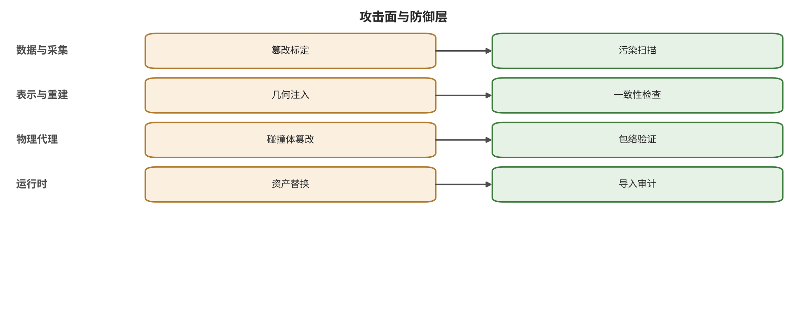

## 攻击、防御、未来趋势与局限

安全问题不是孤立的模型鲁棒性，而是错误能否穿过接口并固化为资产、物理代理或运行状态。本节把攻击、纵深防御、未来议程和证据局限放在同一传播链中。

### 分类与验证图件

下列图件由旧项目的结构化数据或生成脚本派生，图注同时给出可读范围；正文不使用比较表格替代论证。

*三维空间资产的攻击传播与纵深防御门。箭头表示错误可从观测和坐标层传到表示、几何资产、碰撞导航和运行时；防御必须在接口处分别验收。*

### 攻击方式：从观测投毒到几何资产、碰撞导航与引擎宿主

三维空间建设的安全问题不能写成一列攻击名称。攻击者可能只在现实场景贴一块纹理，也可能上传源图或模型，可能控制转换参数，或者已经进入构建供应链；这些能力对应完全不同的结论。有效分析必须同时说明：攻击者控制什么、知道什么、优化什么、受什么预算约束、错误在哪一层首次出现、怎样传播、哪一道门有独立观测，以及攻击者知道这道门后是否仍能成功。

#### 统一威胁模型与跨层攻击目标

把整条建设流水线写为

$$
z_0\xrightarrow{f_1}z_1\xrightarrow{f_2}\cdots \xrightarrow{f_K}z_K,
$$

其中 $z_0$ 是图像/视频/深度/点云和标定，后续状态依次可包含位姿、深度、NeRF/3DGS、参考 mesh、碰撞代理、NavMesh 和引擎包。攻击者在允许集合 $\Delta$ 内选择扰动 $\delta$，使最终任务损失最大：

$$
\max_{\delta\in\Delta} L_{\mathrm{task}}(f_K\circ\cdots\circ f_1(z_0+\delta)) -\lambda L_{\mathrm{visible}}(z_0,z_0+\delta) -\rho L_{\mathrm{cost}}(\delta).
$$

只优化第一层分类错误是局部攻击；优化最终可达差异、漏碰距离或资源峰值才是端到端空间攻击。攻击者知识可分黑盒查询、掌握同族代理、知道权重/梯度、知道验证器与阈值、控制构建节点五级。最后一级已经不是对抗样本，而是供应链对手。安全声称必须绑定到其中一级，不能把“对非自适应白盒样本有效”缩写成“安全”。

跨层传播应记录 Jacobian 或离散敏感性：某些扰动在下一步被平均掉，某些则经累积放大。例如一帧小深度误差可能被多视图融合抑制；持续同向位姿偏差会把 TSDF 墙融合成双层壳；一个小门洞在凸分解后可能完全消失；一个 NavMesh link 只改几个字节，却可跨越整堵墙。攻击预算不能只用输入 $L_p$ 范数，还要报告语义改动、物理可实现性和下游影响。

#### 输入、相机与位姿攻击：先破坏坐标，再让所有表面继承

图像与深度扰动。 对单目深度或通用 NeRF，若采用 $L_\infty$ 像素预算，常见的符号梯度投影更新为：

$$
x^{t+1}=\Pi_{\|x-x_0\|_\infty\le\epsilon} \left(x^t+\alpha \mathrm{sign}(\nabla_x L)\right).
$$

若目标是某个空间位置的错误表面，$L$ 不应只取图像分类损失，而应经过深度回投影、融合和提面，对目标区域的深度、占据或碰撞差异求梯度。打印 patch 则用 expectation over transformation 对距离、姿态、曝光、模糊和打印色域采样，使扰动在物理视角下仍有效。单目深度数字攻击、打印 patch 与三维对象纹理攻击的现有证据分别见 [S011—S013]；它们证明深度链可被操纵，但没有直接证明任意 SfM/MVS 或碰撞系统在相同预算下失守。

防御门不能只看像素频谱。应同时比较双目/主动深度、跨帧光流重投影、轮廓与深度法向、静态表面的多视图一致性，并保留原始传感器帧和标定哈希。攻击者知道这些门后，应把检测损失一起加入目标：

$$
L_{\mathrm{adaptive}}=L_{\mathrm{task}}-\beta D_{\mathrm{detector}}-\gamma D_{\mathrm{crossmodal}}.
$$

这里 $D_{\mathrm{detector}}$ 是异常分数，$D_{\mathrm{crossmodal}}$ 是跨模态不一致分数；攻击者在放大任务错误的同时压低两种可观测信号。若防御只在攻击者不知道阈值时有效，应明确标为非自适应结果。

特征、对应与位姿。 SfM/SLAM 的攻击不必让像素显著变化，只需制造稳定的错误对应、控制相机元数据、利用重复纹理形成多数派假模型，或让物理 patch 吸引特征。RANSAC 只在真实内点比例和采样假设满足时鲁棒；若攻击者构造一组几何上自洽但语义错误的对应，错误模型可能拥有更多“内点”。AoR 已在视觉 SLAM 场景用低可见道路 patch 放大轨迹误差，[@srcS014] SLAMSpoof 则选择扫描匹配脆弱位置注入 LiDAR 点。[@srcS016]

位姿攻击的传播链是：错误匹配 $\rightarrow$ 相机 $R,t$ 偏差 $\rightarrow$ MVS 单应性和深度代价体错位 $\rightarrow$ TSDF 多层壳/薄墙消失 $\rightarrow$ mesh 与 collider 偏移 $\rightarrow$ NavMesh 连通变化。防御应在融合前检查匹配图循环一致性、视图图割边、重投影残差空间分布、IMU/GNSS/轮速残差、尺度锚与回环后的重积分稳定性；在融合后仍要用独立测距验证关键墙面。COLMAP/MVSNet 的一手流程和 RANSAC/TEASER++ 的鲁棒估计边界说明了这些检查成立所需的对应与噪声假设，[@srcG003][@srcG004][@srcG012][@srcG013] 自适应评测必须进一步使用结构化、多数派、阈值内的错误对应，而不只是随机离群点。

物理点移除。 PRA 利用 LiDAR 信号和框架过滤流程使真实障碍点被删除，[@srcS015] 其危险不只在检测器漏检：若地图系统把“没有回波”当自由空间，攻击会把瞬时缺失累积成持久孔洞。防线要保留过滤前回波，区分未知与自由，要求跨帧、多模态证据才能清空占据；安全机器人在冲突时应减速或停车，而不是让生成先验自动补成“看起来合理”的道路。

#### 点云、NeRF 与 3DGS：几何目标和资源目标是两条攻击线

点云操作与训练后门。 白盒点云分类攻击可以移动原点、加入散点或少量结构簇，通过 $\nabla_{p_i}L$ 迭代改变标签；现有 PointNet/ModelNet 证据显示这种数字输入很脆弱。〔来源标识 S002〕 训练集后门进一步在少量样本加入触发点簇，使干净样本正常、触发样本定向分类。[@srcS003] 如果语义标签直接决定“可走/不可走”或碰撞 layer，分类错误会传播到物理层；但这是一条系统设计导致的条件路径，不等于原论文已攻击 NavMesh。正确防线是让语义只作为候选，物理占据仍由可信几何决定。

SOR、半径过滤和 DUP-Net 假设恶意点比真实表面离群，[@srcS004] IF-Defense 用隐式形状先验恢复点集。[@srcS005] 两者都可能删除电线、叶片、杆件等真实稀有薄结构。自适应攻击应通过可微近似或 BPDA 穿过过滤器，并同时约束恢复后的表面；防御评测除分类准确率外，还要报告双向 Chamfer/Hausdorff、法向、观测覆盖、薄结构召回和碰撞漏面。PointGuard 的证书只在规定点操作预算下保护分类标签，〔来源标识 S006〕 不能改写为位姿、表面距离或可达性证书。

NeRF 源视图攻击。 NeRFool 针对 generalizable NeRF 修改一个或多个源视图，使多个未提供目标视角的颜色/结构退化。[@srcS007] 目标化工作还研究低强度扰动和可打印 patch。[@srcS008] 若后续从密度或 SDF 提面，跨视图错误可能变成伪面，但传播程度取决于具体表示、阈值和额外深度约束。防御应随机选择源视图子集、比较不同子集重建、用真实深度/轮廓做交叉验证，并在攻击者知道子集策略和净化器时重新优化；仅对同族攻击做对抗训练不能覆盖逐场景 NeRF 或其他表面化管线。

3DGS 资源投毒。 Poison-splat 的目标不是悄悄移动一堵墙，而是利用 3DGS densification 机制放大高斯数量、显存、训练时间与渲染延迟。[@srcS009] 可抽象成双层问题：外层选择受约束输入扰动，内层执行正常训练 $\theta^*(x+\delta)$，外层最大化资源函数

$$
\max_{\|\delta\|\le\epsilon} R(\theta^*)=\alpha N_{\mathrm{gauss}}+ \beta M_{\mathrm{peak}}+ \gamma T_{\mathrm{train}}, \quad \theta^*=\arg\min_\theta L_{\mathrm{render}}(\theta;x+\delta).
$$

攻击利用梯度/误差触发分裂和克隆，使训练仍在优化渲染却不断扩张表示。检测信号不是最终 PSNR，而是每迭代高斯数、densification 次数、显存与墙钟斜率，以及质量改善与资源增长的失配。RemedyGS 用检测与净化并报告白盒、黑盒和 defense-aware adaptive attack，[@srcS010] 是较完整的防御证据；然而净化器仍不能代替在 OOM 前执行的硬高斯数、显存、迭代和墙钟配额。租户隔离与原子失败属于系统保证，不依赖攻击分布。

几何定向投毒与资源 DoS 必须分开。一个样本可能让高斯数增加却不改变碰撞，一个样本也可能在资源正常时移动特定表面。未来评测应采用双目标：在视觉指标变化低于阈值且资源未触发断路器的条件下，最大化目标区域表面或碰撞差异；否则“防住资源攻击”不能推出“几何安全”。

#### 恶意网格与资产解析器：几何文件同时是复杂数据和可执行信任边界

恶意网格有两类。第一类内容在格式上合法，却利用几何语义：轻微移动顶点让可微渲染后的识别器误判，MeshAdv 证明了这种跨视角持久载体。[@srcS001] 进一步的工程攻击可加入极薄长三角、重复重叠壳、反向法向、NaN/Inf、极端坐标、海量连通分量或隐藏内部几何，在视觉上几乎不变，却让 BVH、凸分解、SDF cooking 和 NavMesh 烘焙超时或产生错误内外。攻击目标可写为

$$
\max_{M'}D_{\mathrm{physics}}(B(M'),B(M)) \quad\text{s.t.}\quad D_{\mathrm{render}}(M',M)\le\epsilon,
$$

其中 $B$ 是资产构建器。真正的自适应样本要知道修复、简化和阈值，并在它们之后仍保留攻击效果。

第二类直接攻击解析器或宿主。glTF 的 buffer/accessor/extension/URI、USD 的 resolver/plugin、FBX/SketchUp/MDL 与 DCC 源文件都扩大了攻击面。Unity 2023 安全公告确认受影响编辑器导入 FBX/SketchUp 的内存破坏/RCE 风险，〔来源标识 S017〕 Assimp 的特定 HL1 MDL loader 堆溢出说明统一格式库也可能在长度/索引解析处失败，[@srcS019] Blender 官方则明确 `.blend` 可含 Python、driver 等脚本能力，自动执行必须视为信任决策。[@srcS020] Unity 2025 宿主加载漏洞进一步说明，几何 schema 验证通过也不能替代引擎补丁和应用重建。[@srcS018]

解析防线应在分配大缓冲之前执行流式计数与整数溢出检查，限制文件字节、解压比、节点、顶点、索引、纹理像素、骨骼、动画、扩展、递归深度和外部 URI；解析进程使用低权限、只读输入、临时输出、禁网、无凭据、CPU/内存/墙钟限制，并禁用不需要的格式、resolver、插件和脚本。glTF Validator 能检查规范一致性，[@srcE002] 但不能替代资源配额、图像解码安全和沙箱。安全测试需要格式感知 fuzz、复杂度 fuzz、ASan/UBSan corpus 回归以及修复版本清单，而不是只上传几个损坏文件看会不会崩溃。

#### 碰撞面与 NavMesh 操纵：最小几何改动可以造成最大可达差异

攻击者一旦能改 collider、collision mask、agent profile、area cost、off-mesh link 或 tile 数据，就不必攻破重建模型。删除一块不可见 collider 可让角色越界，增加薄盒可形成隐形墙，把某 layer 从 block 改为 ignore 可让射线和刚体看到不同世界；把 agent radius 调小一格可打开本来封闭的通道，增加超低 cost link 可让路径穿墙，删除 tile border link 可把大区割裂。此类主动攻击的成熟同行评审基准仍少，因此当前证据应标为工程威胁模型，而不是引用一个未经验证的“成功率”。[C004—C007][@srcV005]

可以把导航攻击形式化为

$$
\max_{\delta\in\Delta} D_R\big(R(N),R(N\oplus\delta)\big) -\lambda\|\delta\|_0,
$$

其中 $N$ 是构建输入和参数，$R(N)$ 是选定起终点集合的可达矩阵或最短路分布，$\delta$ 可为少量三角、link、area 或参数修改。攻击者追求最少修改却最大化连通差异，并约束视觉 mesh 不变。对碰撞则可最大化一组 sweep 的漏命中或假命中，保持渲染距离低于阈值。

防御门必须从可信参考几何确定性重建代理，锁定构建参数策略和 collision matrix，并由第二实现建立自由空间参考。测试集应包含正查询与负查询：必须阻挡的墙、必须通过的门、上下楼层不可误连、关键平台不能丢失；还要包含高速 sweep、不同 agent 净空、tile seam、动态门开闭和资源上限。自适应红队拿到所有阈值后重新求解上述目标；若验证器只抽样固定路径，攻击会避开样本，因此需要随机种子轮换、覆盖驱动探索和关键任务的穷举小区域。

#### 引擎运行时与供应链：签名保证“谁构建”，不保证“构建得对”

构建节点、插件、模型权重、导入器或发布镜像被替换后，攻击者能生成格式正确、测试选择性通过的恶意世界。C2PA 可把媒体断言、签名与哈希绑定，适合追踪输入图像编辑链，[@srcS021] SLSA provenance 描述源、构建者和制品生成关系，[@srcS022] NIST SSDF 提供组织级安全开发实践。〔来源标识 S023〕 它们解决出处与构建链完整性，却不证明内容真实、许可证有效、几何正确、碰撞合理或签名者可信。拿到合法签名密钥的攻击者仍可签署恶意 collider。

供应链门应同时要求固定依赖哈希和 SBOM、隔离可复现构建、双人审批关键参数、制品签名、部署端强制验证，以及内容层的独立几何/物理/导航测试。运行时还需最小权限、网络与文件访问控制、崩溃隔离和安全回退。超配额或状态 generation 不一致时，应保留上一份已验证 cell 或禁用问题区域；绝不能把解析一半的资源注册到全局场景后继续运行。

#### 程序化建模攻击：代码正确执行也可能批量构造错误世界

代码驱动 Blender、CAD、节点图和引擎编辑器后，攻击面从“恶意 mesh”前移到可执行构建规范。第一类是宿主代码执行：Blender 注册文本块/driver、插件 Python，Unity 导入回调和 C#，Unreal `init_unreal.py`/Editor Utility，Godot `@tool` 与 Omniverse extension 都可能在编辑器账户权限下访问文件、网络和项目。Blender 官方安全文档直接说明 Python 不限制脚本能力且自动执行是信任决定；Unity 2023 官方公告曾确认特制 FBX/SketchUp 在受影响编辑器版本中造成内存破坏并可能执行代码。Blender 脚本安全 [@srcS020] Unity 2023 安全公告 [@srcS017-EA-S001] 后一证据只覆盖公告列出的历史版本/格式，不能写成 Unity 6 当前仍有同一漏洞；其他宿主链在缺少特定利用论文时应标为工程威胁模型，不给出虚构发生率。

第二类是依赖、启动上下文和缓存污染。宽松插件版本、用户级 Python 路径、可写包缓存、未知启动文件、当前编辑器选择和活动场景会使相同脚本加载不同模块或作用于错误对象。攻击者不一定需要执行明显恶意语句：把同名插件放到优先搜索路径、改变 Geometry Nodes/HDA 引用、修改 Unity 导入器版本或 Unreal 启动对象，便可能使构建输出稳定漂移。其信号包括依赖闭包变化、未声明脚本执行、项目大面积 dirty、对象数突然增加和同一 BuildSpec 的规范化几何签名改变。

第三类是路径与引用逃逸。脚本输出 `../`、绝对路径或符号链接，USD `resolver/reference/payload`、纹理 URI、压缩包嵌套和 Replicator writer 文件名都可在字符串前缀检查后解析到批准根之外。攻击目标可以是读取凭据、覆盖项目、把训练标签写到别的 generation 或把网络资源混入离线包。验证必须对实际解析后的 canonical path、symlink 和挂载边界判断，而不是只拒绝文本中的 `..`。

第四类是几何与组合复杂度炸弹。单项数量看似合规，阵列 × subdivision × boolean × instance × USD reference × 帧数的乘积却可让 dependency graph、B-rep 内核、凸分解、NavMesh、渲染或 writer 耗尽 CPU/GPU/内存/磁盘。更隐蔽的样本使用近共面布尔、极小薄片、深节点图、循环依赖、海量组件或高纹理解压比，使“生成几十个对象”的参数在求值后变成亿级三角。防御必须在高成本求值前估计联合预算，并在运行中设置增长率和硬中止；只检查最终文件字节已经太晚。

第五类是确定性与语义攻击。删除一个上游实例使全局随机序列后移，便能改变所有对象；修改单位或 up axis 会同时破坏碰撞、NavMesh、相机和深度；重排对象导致基于数组索引的 instance ID 与标签漂移；Replicator 异步 step 还能让 RGB 与上一帧标注错配。它们未必让构建失败，反而可能产生格式有效、画面合理且稳定通过错误测试的资产。攻击目标应直接写成尺寸、占据、可达矩阵、标签投影或跨 generation 对象身份的差异，而不是仅看脚本退出码。

程序化攻击的自适应评测应把公开 schema、白名单 API、路径根、预算、种子和几何门全部交给攻击者，然后寻找满足语法与视觉约束、未触发门却最大化物理/导航/资源/标签差异的最小程序或参数补丁。成功后用 delta debugging 缩到最少节点、实例、路径或参数，固定为回归语料。这样才能检验防线是否真正限制能力，而不是只拦截明显的 `os.system` 字符串。

#### 攻击的真正主线是失败传播，而不是论文名称

所有攻击可归入六种传播机制：一是坐标污染，从标定/位姿把所有后续表面一起移错；二是观测污染，让深度、点或辐射场在局部制造伪几何；三是表示膨胀，利用 densification、三角、实例、引用或纹理数量耗尽资源；四是合同替换，在 mesh→collider→NavMesh 的转换处改变内外、净空或连通；五是执行边界突破，利用解析器、建模脚本、节点图、插件或供应链取得宿主权限；六是复现身份污染，通过版本、依赖、种子、上下文和异步帧改变同一规格的求值结果。防御也必须放在相应传播边之前：位姿错在融合前拦，恶意组合在高成本求值前拦，碰撞差异在发布前拦，脚本能力在宿主启动前限制，供应链替换在部署验签时拦。下一章不再罗列论文，而是沿这些机制解释方法为何从单点鲁棒性走向多合同、独立验证和自适应闭环。

### 防御方式与方法演进：从“清理输入”走向“可认证的世界合同”

三维建设技术的演进并不是渲染指标单调上升。每一代方法都增加一种查询能力，也引入一种新的不可验证状态：图像生成增加视角外观却缺少持久几何；重建增加相机和表面却缺少物理内外；3DGS 增加显式可微基元和实时渲染却缺少唯一拓扑；网格增加编辑与交换却缺少碰撞语义；凸件/SDF 增加接触查询却仍不能决定某种 agent 是否可达；NavMesh 增加任务可行域，却依赖引擎状态、动态更新和供应链。防御方法因而从输入净化，逐步演进为跨层输出合同与独立验证。

#### 三条方法演进逻辑：查询能力、确定性边界与状态持久性

第一条是从外观相似到可回答空间查询。 像素视频只能回答“这一视角看见什么”；NeRF/3DGS 能回答“给定相机如何合成颜色”，但密度、高斯和表面之间仍需额外解释；点云/TSDF/神经 SDF 增加深度、占据或零水平集；有向网格增加局部表面与拓扑；凸件、三角 BVH、SDF 增加 overlap/sweep/contact；NavMesh 增加特定 agent 的连通与成本；引擎场景图再增加对象身份、动态状态和流送生命周期。每次升级都要声明新查询与误差单位，不能把上一层指标冒充下一层保证。

第二条是从共享表示走向职责分离。 早期原型常把同一 mesh 同时渲染、碰撞和导航，优点是简单，缺点是每一次简化或修洞都会改变三个系统。生产路线逐渐分为参考几何、视觉资产、物理代理和 agent-specific NavMesh，并由哈希与 generation 连接。职责分离不是重复存储，而是让目标函数可解释：视觉面允许材质近似，参考面保留观测证据，碰撞面控制假/漏占据，NavMesh 控制净空和连通。攻击者也更难通过一个低权限视觉文件直接改变物理世界。

第三条是从一次性构建走向持久、事务化状态。 离线场景只需加载一次，动态世界却要处理门、破坏、流送、重定位与多人同步。简单的“重烘焙后替换文件”会产生新旧 collider/NavMesh 混合快照。演进方向是稳定对象 ID、分块 generation、增量 BVH/refit、tile cache、两阶段提交和可回滚制品。世界模型若要进入游戏或机器人，不仅要生成下一帧，还要输出可分支、可回访、可查询且能原子更新的对象与几何状态。

这三条逻辑共同解释了为什么未来不会由单一表示吞并所有层。高斯适合外观，网格适合编辑，SDF适合距离，凸件适合动态求解，NavMesh适合路径，场景图适合身份与状态；更可行的是混合表示共享坐标、来源和不确定性，由清晰转换边界组成系统。

#### 六道防御门：每道门拦截一种传播，而不是重复跑同一检测器

门一：采集与标定。 原始帧、深度、IMU/LiDAR、时间戳和标定文件进入只增不改的采集包，逐项哈希；检查帧率、曝光、时间同步、相机内参漂移和多模态残差。纹理 patch 或激光攻击导致模态冲突时，把区域标为 unknown，不把缺测直接写成 free。门的输出是“带来源和不确定性的观测”，不是清洗后假装干净的数据。

门二：估计与融合。 SfM/MVS/SLAM 检查匹配循环、重投影、视图图连通、尺度锚和闭环；TSDF/神经状态保存每体素观测次数、权重和 observed/inferred 标签；3DGS 监控每轮高斯数、增密、显存、时间和质量增益。超出资源斜率立即在安全边界中止，不等 OOM。对可疑视图分别重建，比较子集间几何而非仅最终渲染。

门三：参考几何与网格。 验证有限数、AABB、索引、重复/退化面、边界、非流形、自交、法向、连通分量、体积和最小厚度；对提面阈值、体素分辨率和 Poisson/修洞设置做敏感性扫描。只有不同设置下稳定且有观测支持的区域才能自动进入碰撞；补全和封口面必须带标签并允许回滚。网格修复输出差异报告，不能静默覆盖输入。

门四：物理代理。 对 primitive、凸分解、静态三角和 SDF 分别验收。比较代理与参考面的有符号距离，测关键孔洞/槽的净空；跑 ray/overlap/sweep、初始重叠、边角、薄壁、高速 CCD、堆叠和不同时间步；记录凸件、BVH 节点、SDF voxel、候选对和窄相位耗时。所有 collision layer/mask、query/simulation/trigger 标志进入策略锁，配置差异和几何差异同等审查。

门五：导航与任务。 每种 agent profile 独立构建与版本化；以第二实现的自由空间或高分辨率局部参考检查组件、净空、上下层、最短路和 tile seam；动态门、电梯、link、area cost 和障碍撤销都跑状态序列。发布门不仅问“有路径吗”，还问“不该有的路径是否出现、路径是否穿越参考障碍、最窄处是否满足身体和误差余量”。

门六：运行与供应链。 所有不可信格式在沙箱 worker 解析，固定版本/哈希/SBOM，禁网和脚本，限制资源；构建结果带 provenance 和签名。运行时按 generation 原子加载 render/collider/nav，查询日志能追到 shape/tile/source；验证失败则保留上一份可信世界或进入减速、停车、封区等安全状态。签名验证与内容验证并行，任何一个通过都不能替代另一个。

六道门的关键是输入相互独立。用同一份被攻击 mesh 同时生成 collider、NavMesh 和“参考答案”，三者完全一致也可能一起错误。参考可以来自原始深度、第二重建器、测量锚、不同体素分辨率或人工标注关键区域；独立性必须写入评测协议。

#### 自适应评测：让攻击者看到全部防线，再寻找最小改动

许多防御在固定攻击样本上有效，是因为攻击没有针对净化、阈值或随机化重新优化。可部署评测应采用“构建—验证—攻击—再构建”的闭环：

**原稿中的 text 流程或伪代码**
\begin{verbatim}
adaptive_red_team(clean_case, pipeline, gates, budgets):
baseline = pipeline.build(clean_case)
assert gates.accept(baseline)
attacker.learn(pipeline.public_config, gates.thresholds)
population = initialize_allowed_edits(clean_case, budgets)
repeat until wallclock_budget:
candidate = attacker.optimize(
maximize = task_difference(candidate, baseline)
+ resource_cost(candidate),
subject_to = input_budget
+ visual_similarity
+ gates.accept(candidate)
)
result = pipeline.build_in_isolation(candidate)
record(all_intermediate_states, result, gate_signals)
attacker.update(result)
minimize_successful_edit()
replay_on_other_engines_seeds_and_resolutions()
\end{verbatim}

攻击目标应与层对应：输入层测位姿/深度/表面偏差，资源层测峰值显存和墙钟，碰撞层测假命中/漏命中和 time of impact，导航层测可达矩阵/最短路/净空，解析层测崩溃/RCE/资源分配，供应链测未授权制品是否被部署。成功样本还要做 delta debugging，找出最小顶点、参数、link 或文件字段改动；最小反例更容易修复和回归。

随机化防御要公开种子策略并报告置信区间，不能只选一次随机子视图；不可微过滤要用 BPDA、EOT 或无梯度搜索测试，避免梯度遮蔽；阈值门要测试阈值附近的慢速攻击，避免只看明显异常；多模态防御要让攻击者同时优化可控制模态，并明确仍可信的模态。RemedyGS 明确包含 defense-aware adaptive attack，[@srcS010] 提供了本领域较好的范式；点云净化、SLAM patch 与导航验证仍普遍缺少同强度闭环。

#### 评价不能再压成“一个三维总分”

演进后的系统至少有六本账：视觉账用 PSNR/SSIM/LPIPS、时序与新视角；几何账用深度、Chamfer/Hausdorff、法向、完整度、拓扑和尺度；物理账用假/漏碰、穿透深度、CCD 漏检、接触稳定与查询延迟；导航账用组件、可达、路径长度、净空和动态更新；资源账用高斯/三角/凸件/tile 数、峰值内存和墙钟；安全账用攻击预算、成功终点、检测/拒绝、自适应状态和最坏损失。不同单位不能相加成一个“总体建设能力”。

比较两个方案时，可先定义必须通过的硬合同，再在合同内优化成本。例如：关键墙面漏碰为零、门净空误差小于 2 cm、所有任务起终点可达、峰值物理步低于预算；满足后再比较视觉质量或三角数。这样，快速但穿墙的代理不会靠 FPS 赢得总分，华丽但不可达的世界也不会靠 PSNR 掩盖失败。

防御也应报告代价。SOR/隐式恢复可能损失薄结构，[@srcS004][@srcS005] 更细 SDF 增加内存，[@srcC004] 更小 Recast cell 增加构建成本并可能造成资源风险，[@srcV004] 更多凸件提高精度但增加接触对。每一道门都应给出拒绝率、误删真实几何、延迟、内存和人工复核量，防止“全部拒绝”被当作安全成功。

#### 下一阶段的方法方向：混合世界、可认证误差与跨引擎差分

混合世界表示。 最有前景的生产结构不是把高斯强制变成唯一 mesh，而是把外观高斯/辐射场、带观测证据的占据或 SDF、可编辑网格、碰撞代理和对象场景图并存。共享层提供 〈entity_id + world_transform + time + provenance + uncertainty〉；各查询层保留自己的误差界。视觉补全可以即时出现，但进入碰撞前必须有几何证据或保守策略。

面向合同的学习。 当前训练损失偏向像素、深度或 Chamfer。下一步应直接加入薄壁召回、门洞净空、自由空间一致、SDF 符号、接触距离和可达性，同时避免把引擎 builder 当作不可审计黑盒。可微近似可用于提出候选，最终仍由独立离散几何与运行查询验收。学习器输出置信度不能自证，应在跨传感器、跨阈值和跨实现中校准。

从标签证书走向空间证书。 PointGuard 类结果保护给定点预算下的分类标签，〔来源标识 S006〕 而空间系统需要的新证书是：位姿误差在界内、关键区域表面 Hausdorff 不超过 $\epsilon$、占据不会漏掉大于某尺度的障碍、给定 agent 的路径不会穿过可信障碍。完全证明整个开放世界很难，但可以先对局部安全走廊、机器人刹停区和任务关键门洞给区间或保守占据保证。

事务化持久世界。 世界模型与在线重建应把新观测写入候选 generation，先完成几何、碰撞和导航增量验证，再提交到运行世界。对象状态、tile link 和物理 actor 采用稳定 ID 与事件日志，可回放某次更新为何改变路径。这样“持续生成”不等于“持续把未经验证内容放进物理世界”。

跨引擎差分基准。 同一组规范化 glTF/USD/mesh 及恶意变体，应在 Unity、Unreal、Godot 和直接 PhysX 集成中比较坐标、三角绕序、凸化、SDF、collision mask、NavMesh 和资源行为。差分不是要求输出字节一致，而是要求一组世界查询在允许误差内一致。解析崩溃、过度内存、隐形墙和跨层捷径都应成为 corpus，并在引擎升级后自动回归。

端到端自适应红队。 未来攻击不会停在分类 ASR。更有意义的目标是：在源图几乎不变、渲染质量通过、资源配额未超、几何门未报警的条件下，让一个任务路径穿墙或让高速 sweep 漏检。防御研究则必须说明哪一个独立证据阻断了这条传播，并公开失败样本。直接操纵 collider/NavMesh 的标准数据仍是明显空白；[@srcV005] 所代表的独立几何验证可以成为起点，但需要跨引擎、第三方复现和知道验证器的攻击者。

#### 程序化构建专项防御：能力限制、确定性和差分查询

程序化建模的首选安全界面是声明式、能力受限的规格，而不是把任意 Python/C# 直接交给高权限编辑器。参数 schema 或小型 DSL 只允许基本体、受控布尔、实例、材质引用和有限场景操作；验证器先检查单位、数值范围、引用根和联合预算，再由受信适配器翻译成 `bpy`、CAD、Unity 或 Unreal API。若任务确实需要通用代码，执行环境必须每任务新建、禁网、无用户凭据和签名密钥、输入只读、输出只能写暂存根，并由操作系统施加 CPU、内存、GPU、文件数、字节和墙钟限制。依赖、插件、启动脚本和宿主版本逐项允许列表，Blender 默认禁自动执行，Unity/Unreal/Godot 使用干净项目和显式入口。

路径门在实际打开前解析 canonical path 与 symlink，确认位于允许挂载；USD 的 reference/payload/sublayer、纹理 URI、压缩包与 writer 输出都按递归深度、展开字节和目标协议限制。资源门不能只限制 `N_faces`，而要对阵列、实例、细分、布尔、节点迭代、引用和帧数的乘积估计上界，求值时持续监控对象/三角/prim、内存和输出增长率。达到任何硬界即终止整个 generation，不把已导入一半的对象留在主项目。

确定性门固定 schema、工具链、内核、插件、依赖闭包、随机算法和种子派生规则。随机种子应从 〈global_seed + stable_entity_id + cell_id + operation_id〉 派生，而不是消费一个会因插入对象而整体后移的全局序列。脚本不得依赖当前选择、活动对象、打开场景、用户偏好或未声明环境变量；宿主求值后记录基础 mesh 与 evaluated mesh 的数量和哈希。完全字节一致不现实的 GPU/物理输出应预先定义字段容差，但对象身份、标签、单位、碰撞策略和清单不能使用模糊容差掩盖漂移。

差分门以查询而不是文件格式为准。视觉资产比较包围盒、双向表面距离、法向、UV/材质和语义 ID；碰撞资产比较预注册 ray/overlap/sweep、门洞净空和保守占据；NavMesh 比较各 agent 的连通、路径矩阵和最短路；合成数据比较每帧相机投影、mask/box/depth 与同一场景状态。导出后必须由第二解析器或目标引擎从空进程回读，避免生成器与验证器共享同一错误。验证、签名和发布控制面与用户脚本分离，全部通过才原子提升，失败保留上一 generation。

最终红队应知道上述全部策略，尝试在白名单 API、路径根、预算和几何阈值内制造最小反例。防御报告同时列出干净构建通过率、误拒、资源开销、输出差异、最坏查询损失和自适应状态；“未运行宿主，只通过 AST/括号检查”必须留在结果中，不能被包装成端到端防御成功。

#### 演进结论：真正的三维建设方法是一组可追溯转换

从第10章到本章，方法演进可以压缩为一条因果链：视觉表面无法稳定回答接触，于是产生 primitive、凸体、三角 BVH 与 SDF；单凸包破坏凹槽，于是从 V-HACD 的体素近似演进到 CoACD 的碰撞感知凹度与多步切割；离散接触会隧穿，于是加入连续 time-of-impact；碰撞空间不能直接回答 agent 可达，于是 Recast 将它体素化、过滤、侵蚀、分区并多边形化；静态资产无法维持动态世界，于是引擎引入场景图、流送 cell、generation 和事务提交；每个转换又成为攻击面，于是防御从输入净化演进为六道独立合同门和自适应闭环。

因此，一套合格方法的最小交付不是漫游视频或单个 mesh，而是：带来源的观测或可执行设计规范、可复核参考几何、用途明确的视觉/碰撞/导航制品、锁定的坐标与 agent 合同、参数/种子/工具链/依赖清单、可回滚引擎包、逐层误差与资源报告、以及攻击者知道验证器后的失败记录。只有这些接口连续成立，前端的视频模型、世界模型、重建、3DGS、程序化 DCC/CAD、点云与网格方法才真正完成了从“生成三维内容”到“建设可交互空间”的跨越。

---

### 未来趋势：从“会生成”走向“可维护、可验证、可分支”

#### 世界模型正在探索把持久 3D 状态变成显式接口

短上下文像素历史会在回访、遮挡和长时交互中遗忘空间。PERSIST 一类方法把环境、相机和渲染器放进潜 3D 状态，说明未来世界模型可能由三个部分组成：生成外观的神经模型、维护对象/几何的持久状态，以及负责动作和约束的模拟层。PERSIST [@srcPERSIST-2026] 真正需要验证的不是模型是否偶尔记住一分钟前的画面，而是同一对象在不同路径、不同时间和不同动作分支下是否保持身份、几何和因果关系。

#### 生成与重建可能形成闭环，而不是单向流水线

当前常见做法是先生成视频，再从视频重建 3D；未来更有效的系统会在生成时读取几何不确定性，主动选择下一视角或生成补充视图，再把重建残差反馈给生成模型。需要警惕的是，自生成视图并不是独立证据：如果同一模型在多个视角重复同一幻觉，多视图一致并不等于真实。可靠闭环必须保留真实观测锚点和不确定性传播。

#### 混合表示更可能成为常见生产方案

网格、SDF、3DGS、神经材质和潜状态各自擅长不同查询。未来系统更可能让：

网格承担拓扑、骨骼、碰撞和编辑；高斯/神经纹理承担复杂外观、反射和细节；SDF/体素承担距离、接触和空间占据；对象/场景图承担语义、权限和持久状态；世界模型承担未观测内容、动态与反事实生成。

研究问题会从“哪个表示取代所有表示”转向“如何在共享坐标、LOD 和误差预算下同步多种表示”。

#### 前馈几何基础模型正在推动快速采集，但优化不会完全消失

VGGT 类模型把相机、深度、点图和轨迹放进一次前向推理。VGGT [@srcVGGT-2025] 未来更现实的形态可能是“前馈给出强初始化与置信度，轻量几何优化负责闭环和精修”，而不是完全取消束调整或显式约束。

#### “资产化”正在成为独立研究目标

评价将从单纯的 Chamfer/PSNR 扩展到：拓扑可用率、UV/材质完整度、骨骼/关节合理性、LOD 保真、碰撞代理误差、导航可达、导入成功率、运行时预算和人工修复时间。WorldGen 把“可遍历和可交互”作为目标，Marble 直接提供 splat、视觉网格和碰撞网格的不同导出层，说明研究和产品正在把最后一公里显式化。WorldGen [@srcWORLDGEN-2026] Marble 导出规格 [@srcWL-MARBLE-EXPORT-M04]

#### 物理一致性必须从“像物理”升级为可复核状态

视频模型可以学到重力、流体和碰撞的视觉模式，但闭环代理训练需要可读取的状态、动作后果和失败条件。下一代基准应同时公布视频、几何、接触/约束状态和任务事件，让研究者区分“看起来像发生了碰撞”与“求解器真的满足接触和能量约束”。

#### 安全范围正从模型鲁棒性扩展到三维资产供应链

3DGS 已出现计算成本投毒的同行评审证据 Poison-splat [@srcS009]，以及目标视角定向投毒的 2025 年预印本 GaussTrap [@srcGAUSSTRAP-2025]；点云与网格也有对抗扰动。另一方面，生产系统还要处理超大顶点/高斯数量、NaN/Inf、退化面、自交、恶意纹理/着色器、脚本、路径引用和解压炸弹。未来需要像软件供应链一样为三维资产建立来源、哈希、签名、格式沙箱、资源配额和逐层验证门。

#### 开放格式与跨引擎验证将影响生态可用性

glTF/GLB、OpenUSD、PLY/SPZ 等格式需要携带坐标、单位、材质、LOD、语义和可能的物理扩展。导出“能打开”只是最低标准；还应自动验证 Unity、Unreal、Godot/WebGPU 等目标中的坐标、透明度、碰撞、导航和性能。Marble 的规格页保留了 OpenCV 到 OpenGL 需翻转 Y/Z 的说明，但更新日志显示世界生成从 2025-12-11 起默认导出 OpenGL，2026-01-01 起又可选择 OpenGL 或 OpenCV；因此不能假定固定默认值，必须读取实际导出版本和选项。Marble 导出规格 [@srcWL-MARBLE-EXPORT-M04] Marble 更新日志 [@webd179b99c4e6c]

#### 可执行资产规范与建模代理将形成闭环

未来的文本到 3D 不一定直接预测最终顶点，而可能生成受限的 Blender Python、Geometry Nodes/Houdini 图、OpenSCAD/CadQuery 程序、USD 场景操作或引擎编辑器事务。这样中间结果可编辑、可参数化，也能由几何内核给出明确失败。然而代码生成同时扩大执行权限和几何攻击面：一个语法正确的脚本可以读取凭据、联网、覆盖路径、实例化十亿对象或用布尔/细分耗尽资源。安全架构应把模型输出限制在声明式 schema、白名单 API 或能力受限 DSL；若必须执行通用 Python/C#，则在一次性 worker 中禁网、无凭据、只读输入、限定输出根、CPU/内存/墙钟配额并禁宿主自动脚本。

闭环质量不应只由同一个模型“看图自评”。构建器输出规范化 mesh/scene 与清单，独立验证器检查尺寸、流形、自交、对象 ID、碰撞净空、NavMesh 可达、引擎回读和资源预算，再把最小反例返回给代理。每次迭代保存原程序、补丁、参数、种子、工具链、stdout/stderr 和资产哈希；只有验证全部通过的 generation 才原子发布。研究评价可报告首次通过率、修复轮数、最终查询通过率、资源最坏值和未解决失败类型，而不是只展示最漂亮的成功样本。

#### 可检验的研究议程

构建同时包含观测图像、真实尺度几何、拓扑、材质、碰撞/接触和导航任务的端到端 benchmark；设计“回访、分支、遮挡、修改持久性”测试，专门评估世界模型的长期 3D 状态；为生成区与观测区建立校准的不确定性图，并验证它能否预测网格/碰撞失败；研究高斯—网格—SDF—场景图之间可逆或受控有损转换，报告每次转换的误差传播；把人工资产修复时间、导入失败率和运行时预算纳入生成 3D 评价；建立对数据投毒、视角后门、资源耗尽、恶意资产和导航/碰撞操纵的组合红队基准；让防御同时报告干净质量、几何代价、时延、内存、适应性攻击和恢复能力；用真实交互任务验证“视觉物理”是否转化为可复核、可控和可安全停止的动力学；建立“意图或文本—建模程序—视觉/碰撞资产—引擎查询”的 agentic modeling 基准，公开宿主版本、沙箱、失败程序和修复轨迹。

### 证据与复现局限

本文的第一项限制是检索虽有查询和筛选日志，但不是数据库可复算的双人系统筛选；这使覆盖性结论只能解释为已记录语料中的分布。第二项限制是大量方法证据来自正式网页、项目页、结构化抽取和作者报告，而新 LaTeX 包未保存本地全文 PDF 与逐页定位，精细机制仍应回到一手全文核验。

第三项限制是量化记录依赖同一研究和共同表格，且方差普遍缺失。描述性改善、年份相关和缺失图不能升级为总体效应、显著优越或技术进步的因果证据。第四项限制是本地复现只覆盖合成高度场、三种表面或碰撞代理以及确定性双网格；真实扫描、动态场景、刚体接触、导航和跨引擎一致性没有被实验验证。

第五项限制是 Marble 内部算法、收费服务行为和训练数据不可见；正文只评公开输入、输出、样例文件与失败说明。第六项限制是 Blender、Houdini、OpenSCAD、CadQuery、FreeCAD、Unity、Unreal、USD 与 Omniverse 等宿主在记录环境中未执行，语法检查和静态扫描只能证明示例可解析，不能证明宿主 API、布尔内核、依赖图、碰撞烹饪或导航烘焙成功。

最后，本稿使用出版方中立的中文 generic 模板，尚未选择具体期刊或会议，也未核验页数、匿名政策、引用样式和官方类文件。因此，即使 PDF 编译通过，状态仍只能是 compiled-draft。

---

[← 返回目录](index.md)
