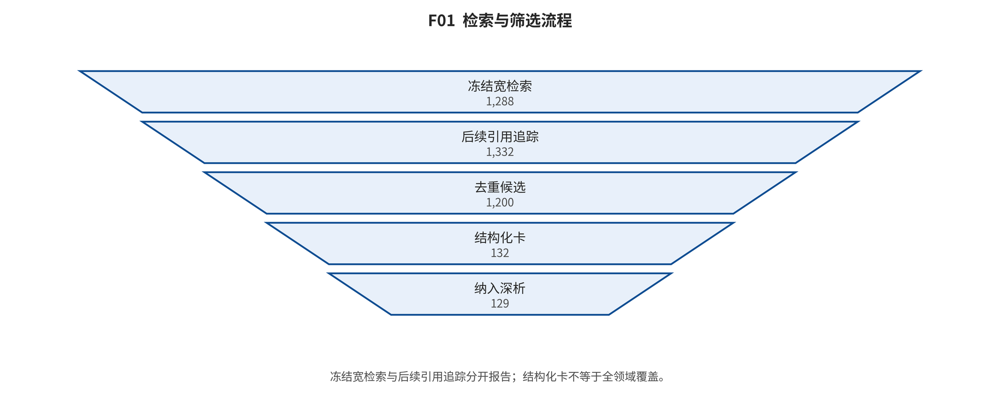

## 第 2 章 证据方法：检索、筛选、版本、编码与新闻核验

输入与问题：冻结的 Q0—Q11 检索式、纳排规则、核心/旁枝标准、来源注册表、结构化卡和新闻核验合同。

论证动作：分开宽检索与后续引用追踪，合并版本但保留身份漂移，并对高信息量卡片和谱系边做第二编码抽查。

冻结宽检索为 1288 条，后续引用追踪为 44 条，合计 1332 条。当前有 132 张结构化卡，其中全文纳入 129 张、候选 3 张。两个检索流分开保留，后验追踪不冒充冻结查询召回。

去重顺序为 DOI、arXiv ID、规范题名＋首作者＋年份；正式版优先，预印本只在保留独有附录时作为同一 work_id 的版本证据。论文、权重、产品和网页各自保留版本与访问日期。摘要只用于发现候选，不支持算法细节；官方发布只支持官方宣布的事实，独立报道缺失时不写外部效果已验证。

第二编码者对 132 卡中的 24 卡和 32 条高信息量边做分层目的抽查。卡片字段严格一致率为 61.6%，边严格一致率为 71.9%；这些比率只描述目的样本，不能外推总体。中央修订覆盖 23 张卡和 9 条边；正文只读取 corrected 规范层，当前规范边数为 231。

后生成一致性审计另对 132/132 张结构化卡执行了“基座—最终状态更新—训练/推理合同”结构扫描；其中 124 张有本地全文，8 张不可在本地全文核验。审计记录 1 项 critical、19 项 high 与 4 项 medium。critical/high 由中央 overlay 原子修订：落地前不允许向主稿和图传播，落地后只读 corrected 层重建。这一全卡结构扫描和定向全文复核仍不是第二位编码者对 132 卡的全量独立双编码。 [@src_s_audit_post_generation_20260809]

关键纠错包括：CogVideoX 依全文为 v-prediction 随机扩散 DiT；ControlNet 与 DreamBooth 依冻结角色规则改为核心；Latte→CogVideoX 的无直接证据边被移除。后生成审计进一步指出：ConsisID 继承 CogVideoX-5B 的条件 epsilon 去噪与 DPM 反向扩散，身份分频不是 flow 更新；DDIM 与 DDPM 共用训练目标，eta=0 只使采样确定化；Janus-Pro 的理解编码器不参与最终视觉状态更新，因而主轴是 AR visual-token；VACE 的 VCU/Context Adapter 是条件模块，公开基座的主更新是 velocity/flow；The Matrix 的实时路径由四步 SCM student 独立推理，Swin-DPM 教师是训练或替代路径，不应因教师与学生并存而自动编为 hybrid。 [@src_s_audit_post_generation_20260809; @video_2408_06072; @controlnet; @dreambooth; @video_2411_17440; @ddim; @januspro; @video_2503_07598; @video_2412_03568]

*F01。检索与筛选分母。冻结宽检索1,288条，后续引用追踪44条，合并1,332条；形成132张结构化卡，其中129张已纳入全文证据流、3张仍为候选。 证据边界：排除码尚未编码，1,200条仍为pending；第二编码者仅在抽样阶段。*

以下审计索引逐项引用 132 张结构化卡的规范 source_id 与 BibTeX key；详细动机、机制、贡献、失败和证据见独立论文卡目录。

- WIMG0001｜Auto-Encoding Variational Bayes｜2013｜角色 core｜家族 explicit-latent-flow｜证据 B｜定位 central-sample-audited; see cross_coder_audit｜规范来源 S_ARXIV_1312_6114 [@vae]
- WIMG0002｜Generative Adversarial Networks｜2014｜角色 core｜家族 adversarial｜证据 A｜定位 central-sample-audited; see cross_coder_audit｜规范来源 S_ARXIV_1406_2661 [@gan]
- WIMG0003｜Unsupervised Representation Learning with Deep Convolutional Generative Adversarial Networks｜2015｜角色 bridge｜家族 adversarial｜证据 B｜定位 claim-level-partial｜规范来源 S_ARXIV_1511_06434 [@dcgan]
- WIMG0006｜Density Estimation using Real NVP｜2016｜角色 core｜家族 explicit-latent-flow｜证据 B｜定位 central-targeted-fulltext-audited; exact locators in post_generation_audit｜规范来源 S_ARXIV_1605_08803 [@realnvp]
- WIMG0014｜Pixel Recurrent Neural Networks｜2016｜角色 core｜家族 autoregressive-mask｜证据 A｜定位 claim-level-partial｜规范来源 S_ARXIV_1601_06759 [@pixelrnn]
- WIMG0004｜Wasserstein GAN｜2017｜角色 core｜家族 adversarial｜证据 A｜定位 claim-level-partial｜规范来源 S_ARXIV_1701_07875 [@wgan]
- WIMG0005｜Improved Training of Wasserstein GANs｜2017｜角色 bridge｜家族 adversarial｜证据 B｜定位 claim-level-partial｜规范来源 S_ARXIV_1704_00028 [@wgangp]
- WIMG0008｜Progressive Growing of GANs for Improved Quality, Stability, and Variation｜2017｜角色 core｜家族 adversarial｜证据 B｜定位 claim-level-partial｜规范来源 S_ARXIV_1710_10196 [@pggan]
- WIMG0015｜Neural Discrete Representation Learning｜2017｜角色 core｜家族 explicit-latent-flow｜证据 B｜定位 claim-level-partial｜规范来源 S_ARXIV_1711_00937 [@vqvae]
- WIMG0007｜Glow: Generative Flow with Invertible 1x1 Convolutions｜2018｜角色 bridge｜家族 explicit-latent-flow｜证据 B｜定位 central-targeted-fulltext-audited; exact locators in post_generation_audit｜规范来源 S_ARXIV_1807_03039 [@glow]
- WIMG0009｜Large Scale GAN Training for High Fidelity Natural Image Synthesis｜2018｜角色 core｜家族 adversarial｜证据 B｜定位 claim-level-partial｜规范来源 S_ARXIV_1809_11096 [@biggan]
- WIMG0010｜A Style-Based Generator Architecture for Generative Adversarial Networks｜2018｜角色 core｜家族 adversarial｜证据 A｜定位 central-targeted-fulltext-audited; exact locators in post_generation_audit｜规范来源 S_ARXIV_1812_04948 [@stylegan]
- WIMG0013｜Do Deep Generative Models Know What They Don't Know?｜2018｜角色 counterexample｜家族 explicit-latent-flow｜证据 B｜定位 claim-level-partial｜规范来源 S_ARXIV_1810_09136 [@oodlikelihood]
- WIMG0011｜Analyzing and Improving the Image Quality of StyleGAN｜2019｜角色 branch｜家族 adversarial｜证据 A｜定位 central-targeted-fulltext-audited; exact locators in post_generation_audit｜规范来源 S_ARXIV_1912_04958 [@stylegan2]
- WIMG0016｜Generating Diverse High-Fidelity Images with VQ-VAE-2｜2019｜角色 bridge｜家族 autoregressive-mask｜证据 A｜定位 claim-level-partial｜规范来源 S_ARXIV_1906_00446 [@vqvae2]
- WIMG0026｜Generative Modeling by Estimating Gradients of the Data Distribution｜2019｜角色 core｜家族 stochastic-score-diffusion｜证据 B｜定位 claim-level-partial｜规范来源 S_ARXIV_1907_05600 [@ncsn]
- WIMG0017｜Taming Transformers for High-Resolution Image Synthesis｜2020｜角色 core｜家族 autoregressive-mask｜证据 B｜定位 central-sample-audited; see cross_coder_audit｜规范来源 S_ARXIV_2012_09841 [@vqgan]
- WIMG0027｜Score-Based Generative Modeling through Stochastic Differential Equations｜2020｜角色 core｜家族 stochastic-score-diffusion｜证据 A｜定位 claim-level-partial｜规范来源 S_ARXIV_2011_13456 [@scoresde]
- WIMG0028｜Denoising Diffusion Probabilistic Models｜2020｜角色 core｜家族 stochastic-score-diffusion｜证据 A｜定位 central-sample-audited; see cross_coder_audit｜规范来源 S_ARXIV_2006_11239 [@ddpm]
- WIMG0029｜Denoising Diffusion Implicit Models｜2020｜角色 core｜家族 stochastic-score-diffusion｜证据 A｜定位 central-targeted-fulltext-audited; exact locators in post_generation_audit｜规范来源 S_ARXIV_2010_02502 [@ddim]
- WIMG0012｜Alias-Free Generative Adversarial Networks｜2021｜角色 branch｜家族 adversarial｜证据 B｜定位 central-targeted-fulltext-audited; exact locators in post_generation_audit｜规范来源 S_ARXIV_2106_12423 [@stylegan3]
- WIMG0018｜Zero-Shot Text-to-Image Generation｜2021｜角色 core｜家族 autoregressive-mask｜证据 A｜定位 claim-level-partial｜规范来源 S_ARXIV_2102_12092 [@dalle]
- WIMG0030｜Diffusion Models Beat GANs on Image Synthesis｜2021｜角色 core｜家族 stochastic-score-diffusion｜证据 A｜定位 claim-level-partial｜规范来源 S_ARXIV_2105_05233 [@adm]
- WIMG0031｜High-Resolution Image Synthesis with Latent Diffusion Models｜2021｜角色 core｜家族 stochastic-score-diffusion｜证据 A｜定位 central-sample-audited; see cross_coder_audit｜规范来源 S_ARXIV_2112_10752 [@ldm]
- WIMG0055｜SDEdit: Guided Image Synthesis and Editing with Stochastic Differential Equations｜2021｜角色 branch｜家族 stochastic-score-diffusion｜证据 B｜定位 claim-level-partial｜规范来源 S_ARXIV_2108_01073 [@sdedit]
- WIMG0019｜Hierarchical Text-Conditional Image Generation with CLIP Latents｜2022｜角色 bridge｜家族 stochastic-score-diffusion｜证据 B｜定位 central-targeted-fulltext-audited; exact locators in post_generation_audit｜规范来源 S_ARXIV_2204_06125 [@dalle2]
- WIMG0020｜MaskGIT: Masked Generative Image Transformer｜2022｜角色 core｜家族 autoregressive-mask｜证据 B｜定位 central-sample-audited; see cross_coder_audit｜规范来源 S_ARXIV_2202_04200 [@maskgit]
- WIMG0032｜Classifier-Free Diffusion Guidance｜2022｜角色 core｜家族 stochastic-score-diffusion｜证据 B｜定位 central-targeted-fulltext-audited; exact locators in post_generation_audit｜规范来源 S_ARXIV_2207_12598 [@cfg]
- WIMG0033｜Photorealistic Text-to-Image Diffusion Models with Deep Language Understanding｜2022｜角色 core｜家族 stochastic-score-diffusion｜证据 B｜定位 claim-level-partial｜规范来源 S_ARXIV_2205_11487 [@imagen]
- WIMG0034｜Scalable Diffusion Models with Transformers｜2022｜角色 core｜家族 stochastic-score-diffusion｜证据 A｜定位 central-targeted-fulltext-audited; exact locators in post_generation_audit｜规范来源 S_ARXIV_2212_09748 [@dit]
- WIMG0038｜Elucidating the Design Space of Diffusion-Based Generative Models｜2022｜角色 core｜家族 stochastic-score-diffusion｜证据 B｜定位 claim-level-partial｜规范来源 S_ARXIV_2206_00364 [@edm]
- WIMG0039｜Flow Matching for Generative Modeling｜2022｜角色 core｜家族 deterministic-transport｜证据 B｜定位 central-sample-audited; see cross_coder_audit｜规范来源 S_ARXIV_2210_02747 [@flowmatching]
- WIMG0040｜Flow Straight and Fast: Learning to Generate and Transfer Data with Rectified Flow｜2022｜角色 core｜家族 deterministic-transport｜证据 B｜定位 claim-level-partial｜规范来源 S_ARXIV_2209_03003 [@rectifiedflow]
- WIMG0056｜Prompt-to-Prompt Image Editing with Cross Attention Control｜2022｜角色 branch｜家族 stochastic-score-diffusion｜证据 B｜定位 claim-level-partial｜规范来源 S_ARXIV_2208_01626 [@prompt2prompt]
- WIMG0057｜Null-text Inversion for Editing Real Images using Guided Diffusion Models｜2022｜角色 branch｜家族 stochastic-score-diffusion｜证据 B｜定位 claim-level-partial｜规范来源 S_ARXIV_2211_09794 [@nulltext]
- WIMG0058｜InstructPix2Pix: Learning to Follow Image Editing Instructions｜2022｜角色 branch｜家族 stochastic-score-diffusion｜证据 A｜定位 claim-level-partial｜规范来源 S_ARXIV_2211_09800 [@instructpix2pix]
- WIMG0059｜DiffEdit: Diffusion-based Semantic Image Editing with Mask Guidance｜2022｜角色 branch｜家族 stochastic-score-diffusion｜证据 B｜定位 claim-level-partial｜规范来源 S_ARXIV_2210_11427 [@diffedit]
- WIMG0060｜An Image is Worth One Word: Personalizing Text-to-Image Generation using Textual Inversion｜2022｜角色 branch｜家族 stochastic-score-diffusion｜证据 B｜定位 claim-level-partial｜规范来源 S_ARXIV_2208_01618 [@textualinversion]
- WIMG0061｜DreamBooth: Fine Tuning Text-to-Image Diffusion Models for Subject-Driven Generation｜2022｜角色 core｜家族 stochastic-score-diffusion｜证据 A｜定位 central-sample-audited; see cross_coder_audit｜规范来源 S_ARXIV_2208_12242 [@dreambooth]
- WIMG0062｜Multi-Concept Customization of Text-to-Image Diffusion｜2022｜角色 branch｜家族 stochastic-score-diffusion｜证据 B｜定位 claim-level-partial｜规范来源 S_ARXIV_2212_04488 [@customdiffusion]
- WIMG0021｜Muse: Text-To-Image Generation via Masked Generative Transformers｜2023｜角色 bridge｜家族 autoregressive-mask｜证据 B｜定位 claim-level-partial｜规范来源 S_ARXIV_2301_00704 [@muse]
- WIMG0035｜SDXL: Improving Latent Diffusion Models for High-Resolution Image Synthesis｜2023｜角色 bridge｜家族 stochastic-score-diffusion｜证据 B｜定位 claim-level-partial｜规范来源 S_ARXIV_2307_01952 [@sdxl]
- WIMG0036｜PixArt-α: Fast Training of Diffusion Transformer for Photorealistic Text-to-Image Synthesis｜2023｜角色 bridge｜家族 stochastic-score-diffusion｜证据 B｜定位 claim-level-partial｜规范来源 S_ARXIV_2310_00426 [@pixart]
- WIMG0041｜Consistency Models｜2023｜角色 core｜家族 deterministic-transport｜证据 A｜定位 central-targeted-fulltext-audited; exact locators in post_generation_audit｜规范来源 S_ARXIV_2303_01469 [@consistency]
- WIMG0042｜Latent Consistency Models: Synthesizing High-Resolution Images with Few-Step Inference｜2023｜角色 bridge｜家族 deterministic-transport｜证据 B｜定位 central-targeted-fulltext-audited; exact locators in post_generation_audit｜规范来源 S_ARXIV_2310_04378 [@lcm]
- WIMG0043｜InstaFlow: One Step is Enough for High-Quality Diffusion-Based Text-to-Image Generation｜2023｜角色 bridge｜家族 deterministic-transport｜证据 B｜定位 claim-level-partial｜规范来源 S_ARXIV_2309_06380 [@instaflow]
- WIMG0044｜Adversarial Diffusion Distillation｜2023｜角色 bridge｜家族 hybrid｜证据 B｜定位 claim-level-partial｜规范来源 S_ARXIV_2311_17042 [@add]
- WIMG0051｜Adding Conditional Control to Text-to-Image Diffusion Models｜2023｜角色 core｜家族 stochastic-score-diffusion｜证据 A｜定位 central-sample-audited; see cross_coder_audit｜规范来源 S_ARXIV_2302_05543 [@controlnet]
- WIMG0052｜T2I-Adapter: Learning Adapters to Dig out More Controllable Ability for Text-to-Image Diffusion Models｜2023｜角色 branch｜家族 stochastic-score-diffusion｜证据 B｜定位 claim-level-partial｜规范来源 S_ARXIV_2302_08453 [@t2iadapter]
- WIMG0053｜GLIGEN: Open-Set Grounded Text-to-Image Generation｜2023｜角色 branch｜家族 stochastic-score-diffusion｜证据 B｜定位 claim-level-partial｜规范来源 S_ARXIV_2301_07093 [@gligen]
- WIMG0054｜IP-Adapter: Text Compatible Image Prompt Adapter for Text-to-Image Diffusion Models｜2023｜角色 branch｜家族 stochastic-score-diffusion｜证据 B｜定位 claim-level-partial｜规范来源 S_ARXIV_2308_06721 [@ipadapter]
- WIMG0064｜PhotoMaker: Customizing Realistic Human Photos via Stacked ID Embedding｜2023｜角色 branch｜家族 stochastic-score-diffusion｜证据 B｜定位 claim-level-partial｜规范来源 S_ARXIV_2312_04461 [@photomaker]
- WIMG0065｜TextDiffuser: Diffusion Models as Text Painters｜2023｜角色 branch｜家族 stochastic-score-diffusion｜证据 B｜定位 claim-level-partial｜规范来源 S_ARXIV_2305_10855 [@textdiffuser]
- WIMG0066｜GlyphDraw: Seamlessly Rendering Text with Intricate Spatial Structures in Text-to-Image Generation｜2023｜角色 branch｜家族 stochastic-score-diffusion｜证据 B｜定位 claim-level-partial｜规范来源 S_ARXIV_2303_17870 [@glyphdraw]
- WIMG0067｜GlyphControl: Glyph Conditional Control for Visual Text Generation｜2023｜角色 branch｜家族 stochastic-score-diffusion｜证据 B｜定位 claim-level-partial｜规范来源 S_ARXIV_2305_18259 [@glyphcontrol]
- WIMG0068｜AnyText: Multilingual Visual Text Generation And Editing｜2023｜角色 branch｜家族 stochastic-score-diffusion｜证据 B｜定位 claim-level-partial｜规范来源 S_ARXIV_2311_03054 [@anytext]
- WIMG0069｜Improving Image Generation with Better Captions｜2023｜角色 bridge｜家族 stochastic-score-diffusion｜证据 B｜定位 claim-level-partial｜规范来源 S_EXT_59F33A7592EA074B [@dalle3]
- WIMG0022｜Visual Autoregressive Modeling: Scalable Image Generation via Next-Scale Prediction｜2024｜角色 core｜家族 autoregressive-mask｜证据 A｜定位 claim-level-partial｜规范来源 S_ARXIV_2404_02905 [@var]
- WIMG0023｜Autoregressive Model Beats Diffusion: Llama for Scalable Image Generation｜2024｜角色 bridge｜家族 autoregressive-mask｜证据 B｜定位 claim-level-partial｜规范来源 S_ARXIV_2406_06525 [@llamagen]
- WIMG0024｜Autoregressive Image Generation without Vector Quantization｜2024｜角色 core｜家族 hybrid｜证据 B｜定位 central-targeted-fulltext-audited; exact locators in post_generation_audit｜规范来源 S_ARXIV_2406_11838 [@mar]
- WIMG0037｜Scaling Rectified Flow Transformers for High-Resolution Image Synthesis｜2024｜角色 core｜家族 deterministic-transport｜证据 B｜定位 central-sample-audited; see cross_coder_audit｜规范来源 S_ARXIV_2403_03206 [@sd3]
- WIMG0045｜SiT: Exploring Flow and Diffusion-based Generative Models with Scalable Interpolant Transformers｜2024｜角色 bridge｜家族 deterministic-transport｜证据 B｜定位 claim-level-partial｜规范来源 S_ARXIV_2401_08740 [@sit]
- WIMG0046｜SANA: Efficient High-Resolution Image Synthesis with Linear Diffusion Transformers｜2024｜角色 core｜家族 deterministic-transport｜证据 A｜定位 claim-level-partial｜规范来源 S_ARXIV_2410_10629 [@sana]
- WIMG0063｜InstantID: Zero-shot Identity-Preserving Generation in Seconds｜2024｜角色 branch｜家族 stochastic-score-diffusion｜证据 B｜定位 claim-level-partial｜规范来源 S_ARXIV_2401_07519 [@instantid]
- WIMG0025｜FlexVAR: Flexible Visual Autoregressive Modeling without Residual Prediction｜2025｜角色 branch｜家族 autoregressive-mask｜证据 A｜定位 claim-level-partial｜规范来源 S_EXT_525865E4AC1310C7 [@flexvar]
- WIMG0047｜Mean Flows for One-step Generative Modeling｜2025｜角色 core｜家族 deterministic-transport｜证据 B｜定位 central-targeted-fulltext-audited; exact locators in post_generation_audit｜规范来源 S_ARXIV_2505_13447 [@meanflow]
- WIMG0048｜Align Your Flow: Scaling Continuous-Time Flow Map Distillation｜2025｜角色 bridge｜家族 deterministic-transport｜证据 A｜定位 claim-level-partial｜规范来源 S_EXT_940E9BE95BC34920 [@alignflow]
- WIMG0049｜Transition Matching: Scalable and Flexible Generative Modeling｜2025｜角色 bridge｜家族 hybrid｜证据 B｜定位 claim-level-partial｜规范来源 S_ARXIV_2506_23589 [@transitionmatching]
- WIMG0050｜Unified Continuous Generative Models for Denoising-based Diffusion｜2025｜角色 bridge｜家族 deterministic-transport｜证据 B｜定位 claim-level-partial｜规范来源 S_EXT_17EB3BFB20AB68C8 [@ucgm]
- WIMG0070｜TextInVision: Text and Prompt Complexity Driven Visual Text Generation Benchmark｜2025｜角色 counterexample｜家族 hybrid｜证据 A｜定位 claim-level-partial｜规范来源 S_EXT_71B5C2CC3E1B0BC5 [@textinvision]
- WIMG0071｜Janus-Pro: Unified Multimodal Understanding and Generation with Data and Model Scaling｜2025｜角色 bridge｜家族 autoregressive-mask｜证据 B｜定位 central-targeted-fulltext-audited; exact locators in post_generation_audit｜规范来源 S_ARXIV_2501_17811 [@januspro]
- WIMG0072｜FlowInOne: Unifying Multimodal Generation as Image-in, Image-out Flow Matching｜2026｜角色 bridge｜家族 deterministic-transport｜证据 B｜定位 claim-level-partial｜规范来源 S_ARXIV_2604_06757 [@flowinone]
- VID-W001｜Generating Videos with Scene Dynamics｜2016｜角色 core｜家族 adversarial｜证据 B｜定位 central-sample-audited; see cross_coder_audit｜规范来源 S_ARXIV_1609_02612 [@video_1609_02612]
- VID-W002｜Temporal Generative Adversarial Nets with Singular Value Clipping｜2016｜角色 core｜家族 adversarial｜证据 B｜定位 section-category-generic-needs-precise-patch｜规范来源 S_ARXIV_1611_06624 [@video_1611_06624]
- VID-W003｜MoCoGAN: Decomposing Motion and Content for Video Generation｜2017｜角色 core｜家族 adversarial｜证据 B｜定位 central-sample-audited; see cross_coder_audit｜规范来源 S_ARXIV_1707_04993 [@video_1707_04993]
- VID-W004｜Adversarial Video Generation on Complex Datasets｜2019｜角色 core｜家族 adversarial｜证据 B｜定位 section-category-generic-needs-precise-patch｜规范来源 S_ARXIV_1907_06571 [@video_1907_06571]
- VID-W005｜VideoGPT: Video Generation using VQ-VAE and Transformers｜2021｜角色 core｜家族 autoregressive-mask｜证据 B｜定位 central-sample-audited; see cross_coder_audit｜规范来源 S_ARXIV_2104_10157 [@video_2104_10157]
- VID-W006｜Long Video Generation with Time-Agnostic VQGAN and Time-Sensitive Transformer｜2022｜角色 core｜家族 autoregressive-mask｜证据 B｜定位 section-category-generic-needs-precise-patch｜规范来源 S_ARXIV_2204_03638 [@video_2204_03638]
- VID-W007｜CogVideo: Large-scale Pretraining for Text-to-Video Generation via Transformers｜2022｜角色 core｜家族 autoregressive-mask｜证据 B｜定位 section-category-generic-needs-precise-patch｜规范来源 S_ARXIV_2205_15868 [@video_2205_15868]
- VID-W008｜Phenaki: Variable Length Video Generation From Open Domain Textual Description｜2022｜角色 core｜家族 autoregressive-mask｜证据 B｜定位 central-sample-audited; see cross_coder_audit｜规范来源 S_ARXIV_2210_02399 [@video_2210_02399]
- VID-W010｜Video Diffusion Models｜2022｜角色 core｜家族 stochastic-score-diffusion｜证据 B｜定位 central-sample-audited; see cross_coder_audit｜规范来源 S_ARXIV_2204_03458 [@video_2204_03458]
- VID-W011｜Flexible Diffusion Modeling of Long Videos｜2022｜角色 core｜家族 stochastic-score-diffusion｜证据 B｜定位 section-category-generic-needs-precise-patch｜规范来源 S_ARXIV_2205_11495 [@video_2205_11495]
- VID-W012｜Make-A-Video: Text-to-Video Generation without Text-Video Data｜2022｜角色 core｜家族 stochastic-score-diffusion｜证据 B｜定位 section-category-generic-needs-precise-patch｜规范来源 S_ARXIV_2209_14792 [@video_2209_14792]
- VID-W013｜Imagen Video: High Definition Video Generation with Diffusion Models｜2022｜角色 core｜家族 stochastic-score-diffusion｜证据 B｜定位 section-category-generic-needs-precise-patch｜规范来源 S_ARXIV_2210_02303 [@video_2210_02303]
- VID-W039｜Tune-A-Video: One-Shot Tuning of Image Diffusion Models for Text-to-Video Generation｜2022｜角色 branch｜家族 stochastic-score-diffusion｜证据 B｜定位 section-category-generic-needs-precise-patch｜规范来源 S_ARXIV_2212_11565 [@video_2212_11565]
- VID-W049｜MM-Diffusion: Learning Multi-Modal Diffusion Models for Joint Audio and Video Generation｜2022｜角色 branch｜家族 stochastic-score-diffusion｜证据 B｜定位 section-category-generic-needs-precise-patch｜规范来源 S_ARXIV_2212_09478 [@video_2212_09478]
- VID-W009｜VideoPoet: A Large Language Model for Zero-Shot Video Generation｜2023｜角色 core｜家族 autoregressive-mask｜证据 B｜定位 section-category-generic-needs-precise-patch｜规范来源 S_ARXIV_2312_14125 [@video_2312_14125]
- VID-W014｜Align your Latents: High-Resolution Video Synthesis with Latent Diffusion Models｜2023｜角色 core｜家族 stochastic-score-diffusion｜证据 B｜定位 central-sample-audited; see cross_coder_audit｜规范来源 S_ARXIV_2304_08818 [@video_2304_08818]
- VID-W015｜ModelScope Text-to-Video Technical Report｜2023｜角色 bridge｜家族 stochastic-score-diffusion｜证据 B｜定位 section-category-generic-needs-precise-patch｜规范来源 S_ARXIV_2308_06571 [@video_2308_06571]
- VID-W016｜Stable Video Diffusion: Scaling Latent Video Diffusion Models to Large Datasets｜2023｜角色 core｜家族 stochastic-score-diffusion｜证据 B｜定位 central-targeted-fulltext-audited; exact locators in post_generation_audit｜规范来源 S_ARXIV_2311_15127 [@video_2311_15127]
- VID-W032｜NUWA-XL: Diffusion over Diffusion for eXtremely Long Video Generation｜2023｜角色 branch｜家族 stochastic-score-diffusion｜证据 B｜定位 section-category-generic-needs-precise-patch｜规范来源 S_ARXIV_2303_12346 [@video_2303_12346]
- VID-W033｜FreeNoise: Tuning-Free Longer Video Diffusion via Noise Rescheduling｜2023｜角色 branch｜家族 stochastic-score-diffusion｜证据 B｜定位 section-category-generic-needs-precise-patch｜规范来源 S_ARXIV_2310_15169 [@video_2310_15169]
- VID-W040｜Dreamix: Video Diffusion Models are General Video Editors｜2023｜角色 branch｜家族 stochastic-score-diffusion｜证据 B｜定位 section-category-generic-needs-precise-patch｜规范来源 S_ARXIV_2302_01329 [@video_2302_01329]
- VID-W041｜TokenFlow: Consistent Diffusion Features for Consistent Video Editing｜2023｜角色 branch｜家族 stochastic-score-diffusion｜证据 B｜定位 section-category-generic-needs-precise-patch｜规范来源 S_ARXIV_2307_10373 [@video_2307_10373]
- VID-W042｜AnimateDiff: Animate Your Personalized Text-to-Image Diffusion Models without Specific Tuning｜2023｜角色 branch｜家族 stochastic-score-diffusion｜证据 B｜定位 central-targeted-fulltext-audited; exact locators in post_generation_audit｜规范来源 S_ARXIV_2307_04725 [@video_2307_04725]
- VID-W043｜VideoComposer: Compositional Video Synthesis with Motion Controllability｜2023｜角色 branch｜家族 stochastic-score-diffusion｜证据 B｜定位 section-category-generic-needs-precise-patch｜规范来源 S_ARXIV_2306_02018 [@video_2306_02018]
- VID-W044｜MotionCtrl: A Unified and Flexible Motion Controller for Video Generation｜2023｜角色 branch｜家族 stochastic-score-diffusion｜证据 B｜定位 section-category-generic-needs-precise-patch｜规范来源 S_ARXIV_2312_03641 [@video_2312_03641]
- VID-W050｜GAIA-1: A Generative World Model for Autonomous Driving｜2023｜角色 core｜家族 hybrid｜证据 B｜定位 central-sample-audited; see cross_coder_audit｜规范来源 S_ARXIV_2309_17080 [@video_2309_17080]
- VID-W051｜Learning Interactive Real-World Simulators｜2023｜角色 core｜家族 stochastic-score-diffusion｜证据 B｜定位 section-category-generic-needs-precise-patch｜规范来源 S_ARXIV_2310_06114 [@video_2310_06114]
- VID-W017｜Lumiere: A Space-Time Diffusion Model for Video Generation｜2024｜角色 core｜家族 stochastic-score-diffusion｜证据 B｜定位 section-category-generic-needs-precise-patch｜规范来源 S_ARXIV_2401_12945 [@video_2401_12945]
- VID-W018｜Latte: Latent Diffusion Transformer for Video Generation｜2024｜角色 core｜家族 stochastic-score-diffusion｜证据 B｜定位 central-sample-audited; see cross_coder_audit｜规范来源 S_ARXIV_2401_03048 [@video_2401_03048]
- VID-W019｜CogVideoX: Text-to-Video Diffusion Models with An Expert Transformer｜2024｜角色 core｜家族 stochastic-score-diffusion｜证据 B｜定位 central-sample-audited; see cross_coder_audit｜规范来源 S_ARXIV_2408_06072 [@video_2408_06072]
- VID-W020｜Movie Gen: A Cast of Media Foundation Models｜2024｜角色 core｜家族 deterministic-transport｜证据 B｜定位 section-category-generic-needs-precise-patch｜规范来源 S_ARXIV_2410_13720 [@video_2410_13720]
- VID-W021｜HunyuanVideo: A Systematic Framework For Large Video Generative Models｜2024｜角色 core｜家族 deterministic-transport｜证据 B｜定位 section-category-generic-needs-precise-patch｜规范来源 S_ARXIV_2412_03603 [@video_2412_03603]
- VID-W024｜Pyramidal Flow Matching for Efficient Video Generative Modeling｜2024｜角色 core｜家族 deterministic-transport｜证据 B｜定位 section-category-generic-needs-precise-patch｜规范来源 S_ARXIV_2410_05954 [@video_2410_05954]
- VID-W027｜STIV: Scalable Text and Image Conditioned Video Generation｜2024｜角色 core｜家族 deterministic-transport｜证据 B｜定位 section-category-generic-needs-precise-patch｜规范来源 S_ARXIV_2412_07730 [@video_2412_07730]
- VID-W030｜From Slow Bidirectional to Fast Autoregressive Video Diffusion Models｜2024｜角色 core｜家族 hybrid｜证据 B｜定位 section-category-generic-needs-precise-patch｜规范来源 S_ARXIV_2412_07772 [@video_2412_07772]
- VID-W034｜FIFO-Diffusion: Generating Infinite Videos from Text without Training｜2024｜角色 core｜家族 stochastic-score-diffusion｜证据 B｜定位 central-sample-audited; see cross_coder_audit｜规范来源 S_ARXIV_2405_11473 [@video_2405_11473]
- VID-W035｜StreamingT2V: Consistent, Dynamic, and Extendable Long Video Generation from Text｜2024｜角色 branch｜家族 stochastic-score-diffusion｜证据 B｜定位 section-category-generic-needs-precise-patch｜规范来源 S_ARXIV_2403_14773 [@video_2403_14773]
- VID-W036｜LinGen: Towards High-Resolution Minute-Length Text-to-Video Generation with Linear Computational Complexity｜2024｜角色 core｜家族 deterministic-transport｜证据 B｜定位 central-targeted-fulltext-audited; exact locators in post_generation_audit｜规范来源 S_ARXIV_2412_09856 [@video_2412_09856]
- VID-W045｜CameraCtrl: Enabling Camera Control for Text-to-Video Generation｜2024｜角色 branch｜家族 stochastic-score-diffusion｜证据 B｜定位 central-sample-audited; see cross_coder_audit｜规范来源 S_ARXIV_2404_02101 [@video_2404_02101]
- VID-W046｜ConsisID: Identity-Preserving Text-to-Video Generation by Frequency Decomposition｜2024｜角色 branch｜家族 stochastic-score-diffusion｜证据 B｜定位 central-targeted-fulltext-audited; exact sections/equations recorded｜规范来源 S_ARXIV_2411_17440 [@video_2411_17440]
- VID-W052｜Genie: Generative Interactive Environments｜2024｜角色 core｜家族 autoregressive-mask｜证据 B｜定位 central-sample-audited; see cross_coder_audit｜规范来源 S_ARXIV_2402_15391 [@video_2402_15391]
- VID-W053｜Diffusion Models Are Real-Time Game Engines｜2024｜角色 core｜家族 stochastic-score-diffusion｜证据 B｜定位 section-category-generic-needs-precise-patch｜规范来源 S_ARXIV_2408_14837 [@video_2408_14837]
- VID-W054｜iVideoGPT: Interactive VideoGPTs are Scalable World Models｜2024｜角色 core｜家族 autoregressive-mask｜证据 B｜定位 section-category-generic-needs-precise-patch｜规范来源 S_ARXIV_2405_15223 [@video_2405_15223]
- VID-W055｜The Matrix: Infinite-Horizon World Generation with Real-Time Moving Control｜2024｜角色 core｜家族 deterministic-transport｜证据 B｜定位 central-targeted-fulltext-audited; exact locators in post_generation_audit｜规范来源 S_ARXIV_2412_03568 [@video_2412_03568]
- VID-W058｜Video generation models as world simulators｜2024｜角色 system｜家族 stochastic-score-diffusion｜证据 B｜定位 section-category-generic-needs-precise-patch｜规范来源 S_EXT_0FE3432110402A0F [@video_system_58]
- VID-W059｜Genie 2: A large-scale foundation world model｜2024｜角色 system｜家族 stochastic-score-diffusion｜证据 B｜定位 section-category-generic-needs-precise-patch｜规范来源 S_EXT_9E0C24009D08375C [@video_system_59]
- VID-W022｜Wan: Open and Advanced Large-Scale Video Generative Models｜2025｜角色 core｜家族 deterministic-transport｜证据 B｜定位 section-category-generic-needs-precise-patch｜规范来源 S_ARXIV_2503_20314 [@video_2503_20314]
- VID-W023｜Goku: Flow Based Video Generative Foundation Models｜2025｜角色 core｜家族 deterministic-transport｜证据 B｜定位 section-category-generic-needs-precise-patch｜规范来源 S_ARXIV_2502_04896 [@video_2502_04896]
- VID-W025｜LTX-Video: Realtime Video Latent Diffusion｜2025｜角色 core｜家族 deterministic-transport｜证据 B｜定位 section-category-generic-needs-precise-patch｜规范来源 S_ARXIV_2501_00103 [@video_2501_00103]
- VID-W026｜Step-Video-T2V Technical Report: The Practice, Challenges, and Future of Video Foundation Model｜2025｜角色 core｜家族 deterministic-transport｜证据 B｜定位 section-category-generic-needs-precise-patch｜规范来源 S_ARXIV_2502_10248 [@video_2502_10248]
- VID-W028｜Generative Pre-trained Autoregressive Diffusion Transformer｜2025｜角色 bridge｜家族 hybrid｜证据 B｜定位 section-category-generic-needs-precise-patch｜规范来源 S_ARXIV_2505_07344 [@video_2505_07344]
- VID-W029｜InfinityStar: Unified Spacetime AutoRegressive Modeling for Visual Generation｜2025｜角色 core｜家族 autoregressive-mask｜证据 B｜定位 section-category-generic-needs-precise-patch｜规范来源 S_ARXIV_2511_04675 [@video_2511_04675]
- VID-W031｜Autoregressive Adversarial Post-Training for Real-Time Interactive Video Generation｜2025｜角色 core｜家族 hybrid｜证据 B｜定位 section-category-generic-needs-precise-patch｜规范来源 S_ARXIV_2506_09350 [@video_2506_09350]
- VID-W037｜SkyReels-V2: Infinite-length Film Generative Model｜2025｜角色 core｜家族 hybrid｜证据 B｜定位 section-category-generic-needs-precise-patch｜规范来源 S_ARXIV_2504_13074 [@video_2504_13074]
- VID-W038｜Captain Cinema: Towards Short Movie Generation｜2025｜角色 core｜家族 hybrid｜证据 B｜定位 section-category-generic-needs-precise-patch｜规范来源 S_ARXIV_2507_18634 [@video_2507_18634]
- VID-W047｜VACE: All-in-One Video Creation and Editing｜2025｜角色 core｜家族 deterministic-transport｜证据 B｜定位 central-targeted-fulltext-audited; exact locators in post_generation_audit｜规范来源 S_ARXIV_2503_07598 [@video_2503_07598]
- VID-W056｜VRAG: Learning World Models for Interactive Video Generation｜2025｜角色 core｜家族 stochastic-score-diffusion｜证据 B｜定位 section-category-generic-needs-precise-patch｜规范来源 S_ARXIV_2505_21996 [@video_2505_21996]
- VID-W057｜PhysCtrl: Generative Physics for Controllable and Physics-Grounded Video Generation｜2025｜角色 core｜家族 hybrid｜证据 B｜定位 section-category-generic-needs-precise-patch｜规范来源 S_ARXIV_2509_20358 [@video_2509_20358]
- VID-W060｜Genie 3: A new frontier for world models｜2025｜角色 system｜家族 hybrid｜证据 B｜定位 section-category-generic-needs-precise-patch｜规范来源 S_EXT_01794224D4B71F7C [@video_system_60]
- VID-W048｜Learning to Generate Highly Dynamic Videos using Synthetic Motion Data｜2026｜角色 branch｜家族 hybrid｜证据 B｜定位 section-category-generic-needs-precise-patch｜规范来源 S_ARXIV_2604_01666 [@video_2604_01666]

综合判断：当前语料足以支持检索增强的分类综合与抽样纠错后的规范编码，但不足以声称系统综述筛选闭合。

证据边界：尚有待筛候选、非概率第二编码样本、视频定位粒度不足和快速版本漂移；不报告 kappa 或总体置信区间。

转场：第 3 章把纳入工作转换为共同数学与输入输出接口。

---

[← 返回目录](index.md)
