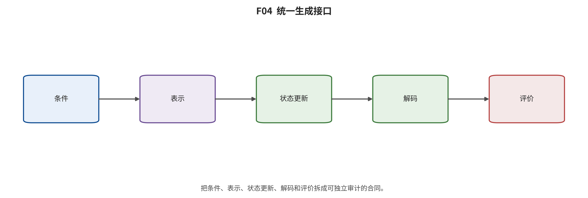

## 第 3 章 形式化与共同接口

输入与问题：规范论文卡中的任务、输入、表示、状态更新、目标、推理、条件、预算、输出和失败字段。

论证动作：用统一符号表达图像与视频生成，并把似然、感知、语义、时间、物理、交互和系统指标拆成不同测量对象。

令观测视觉对象为 x，条件为 c，表示器为 E，解码器为 D，生成状态为 s，状态更新为 U。一般系统先把像素、帧或多模态上下文映射到连续潜变量、离散 token 或时空状态，再按训练目标学习从先验、噪声或历史到目标状态的转换，最后直接输出或经解码器得到 x_hat。 [@vae; @vqvae; @ldm; @video_2304_08818]

$$
s_{t+1}=U_\theta(s_t,c,t), \hat{x}=D(s_T)

$$
[@ddpm; @flowmatching; @vae]

图像输出通常是 H×W×C 的单帧；视频输出 x_{1:T} 还可能依赖历史 h_t、动作 a_t、相机 k_t、音频 y_t 或记忆 m_t。只有当动作、状态转移和下游控制被独立验证时，视觉预测才可升级为交互或规划证据。 [@video_2204_03458; @video_2309_17080; @video_2402_15391]

六类主更新是：潜样本/可逆密度、对抗隐式映射、token/像素/尺度条件更新、随机得分去噪、确定性速度输运，以及依赖两个以上不可删算子的混合。像素或 latent 是表示，U-Net/DiT 是骨干，cross-attention/adapter 是条件接口，DDIM/solver/缓存是采样或系统字段，均不单独成为一级家族。

$$
\mathcal{L}_{VAE}=\mathbb{E}_{q_\phi(z|x)}[\log p_\theta(x|z)]-\mathrm{KL}(q_\phi(z|x),p(z))

$$
[@vae]

$$
\min_G\max_D\ \mathbb{E}_{x}[\log D(x)]+\mathbb{E}_{z}[\log(1-D(G(z)))]

$$
[@gan]

$$
p_\theta(x|c)=\prod_{i=1}^{N}p_\theta(x_i|x_{1:i-1},c)

$$
[@pixelrnn]

R001 的三项独立小实现均通过预设合同：VAE 路径导数残差 2.405e-11，DDPM 最大代数残差 1.110e-16，线性 Flow/RF 最大数值残差 6.589e-11。三者量纲与随机性不同，只能各自对阈值判断，不能按残差大小排名。 [@src_s_exp_r001_formula_metrics]

*F04。统一生成接口。不同家族可以共享 codec、Transformer 骨干或条件模块，但最终生成更新、成功判据、预算和失败必须分开报告。 证据边界：本图是字段级统一接口，不表示所有系统都公开了每个字段，缺报项应编码为 NR/UV。*

综合判断：真正可比较的是统一接口及其失败传播，而不是架构标签；表示、更新、条件、解码和评价必须分开归因。

证据边界：公式合同通过只证明所测代数或数值实现，不证明网络训练、生成质量、效率或论文指标复现。

转场：第 4 章沿时间查看这些接口怎样被建立、迁移和重组。

---

[← 返回目录](index.md)
