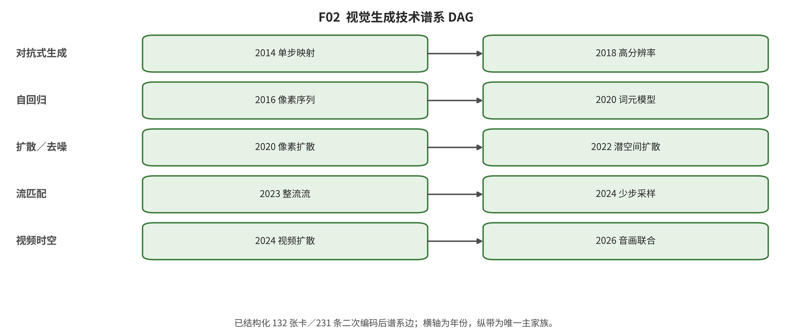

## 第 4 章 技术发展脉络：从单帧分布到时空世界

输入与问题：纠错后的 132 张卡、231 条规范谱系边以及图像和视频支线的全文定位。

论证动作：按技术接口而非年份榜单分期，区分直接继承、并行发展、组合与替代。

2014 年前与 2014—2017：生成合同并立。VAE 把不可解后验转成 ELBO 与重参数化；GAN 以判别博弈学习隐式映射；PixelRNN/PixelCNN 保留归一化像素似然；RealNVP/Glow 发展可逆密度；VQ-VAE 把视觉变成离散码。视频 GAN 则开始拆分静态外观与运动。阶段产物不是单一赢家，而是 latent-sample、adversarial-map、next-token 与 invertible-map 四种可复用合同。 [@vae; @gan; @pixelrnn; @realnvp; @vqvae; @video_1609_02612; @video_1707_04993]

2018—2020：表示、规模与得分去噪。Progressive GAN、BigGAN 和 StyleGAN 分别把分辨率课程、规模条件训练和可编辑潜空间变成组件；VQ 分层与感知 tokenizer 缩短生成序列；NCSN 与 DDPM 把多噪声级得分/去噪回归重建为随机生成主干。视频侧的空间/时间双判别继续区分帧质量与动态。 [@pggan; @biggan; @stylegan; @vqgan; @scoresde; @ddpm; @video_1907_06571]

2021—2022：文本—视觉、潜空间与视频扩散。DALL·E 将文本与图像 token 联合建模，Imagen 强化文本编码与级联，LDM 把去噪迁入感知 latent 并以交叉注意接入条件。DDIM、Score-SDE、EDM 和 CFG 拆开训练参数化、采样路径与条件强度。VideoGPT、Phenaki、Video Diffusion 与 Video LDM 则把离散序列、时间层和时空 codec 引入视频。 [@dalle; @ldm; @ddim; @cfg; @video_2104_10157; @video_2210_02399; @video_2204_03458; @video_2304_08818]

2023—2024：DiT、流、少步与控制生态。DiT 把 latent patch 交给 Transformer；Flow Matching 与 Rectified Flow 回归向量场或路径；Consistency、LCM 和对抗蒸馏压缩采样。ControlNet、IP-Adapter、DreamBooth 等共享控制接口扩展。视频侧 DiT、3D 因果 VAE、长窗口和动作条件快速分化。CogVideoX 经第二编码确认属于 v-pred 扩散 DiT，不能因为使用 ODE 相关术语或 DiT 骨干而改为 flow。 [@dit; @flowmatching; @rectifiedflow; @consistency; @controlnet; @dreambooth; @video_2401_03048; @video_2408_06072]

2025—2026：少步、长程、原生多模态与开放—封闭分化。新工作尝试一步平均速度、任意区间 flow map、连续与离散转移统一、因果少步视频、检索记忆、交互世界和音视频联合。它们仍受版本漂移、独立后继不足和闭源证据限制，因此只记录可核机制与否证条件，不宣布路线已经统一或达到通用世界模型。 [@meanflow; @alignflow; @transitionmatching; @januspro; @video_2505_07344; @video_2412_03568; @video_system_60]

*F02。视觉生成技术谱系。图中完整纳入132个工作节点和231条经二次编码保留的边；颜色表示生成更新家族，圆形/菱形分别表示图像/视频。 证据边界：边表示可核验的机制关系，不是引用数、影响力或性能排名；中低信心边仍需精确引文复核。*

综合判断：规范谱系含 231 条边；转折来自表示、状态更新、条件与时间接口重组，不是模型名线性替代。

证据边界：谱系边是当前编码中的技术关系，不是因果归因网络；抽样纠错只覆盖 32 条边，未抽样关系仍需定位复核。

转场：第 5 章说明怎样把历史材料稳定编码为六家族并处理边界案例。

---

[← 返回目录](index.md)
