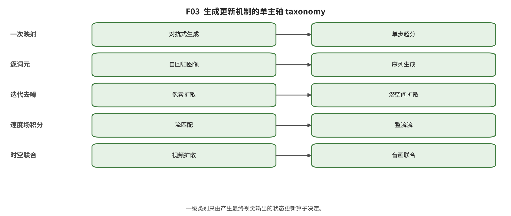

## 第 5 章 分类设计与覆盖审计

输入与问题：统一接口、纠错后的角色编码、决策规则和边界案例。

论证动作：先判混合，再按最终更新算子判六家族；表示、骨干、条件、模态和产品均保留为二级标签。

判定顺序是：若两个以上不可删生成算子共同产生最终输出，编码为混合并记录组件；否则依次检查潜样本/可逆密度、对抗博弈、序列/掩码更新、得分去噪、速度/flow map。无法由全文定位支持时标 UV，不得按模型名猜测。

纠错后的 132 卡家族分布为：显式概率与潜变量/可逆流 5 张；对抗式隐式生成 13 张；自回归与掩码生成 18 张；得分与随机去噪 60 张；确定性输运 23 张；混合与统一生成机制 13 张。 [@video_2408_06072]

计数还接受后生成审计的约束：132/132 张卡已完成结构扫描，124 张有本地全文，8 张不可本地核验；发现为 critical 1、high 19、medium 4。critical/high 由中央 overlay 原子修订并在 corrected 与 figures 同步后才传播；因此表中数量是当前纠错层的动态计数，而不是冻结的旧快照。该审计仍不是全量独立双编码。 [@src_s_audit_post_generation_20260809]

角色与家族正交；纠错后角色分布为：branch 32 张；bridge 21 张；core 74 张；counterexample 2 张；system 3 张。ControlNet 与 DreamBooth 按 B/D 共享接口规则升级为核心。 [@controlnet; @dreambooth]

**纠错后单主轴家族编码与代表工作；计数只描述 132 张结构化卡。**

机制家族 | 卡数 | 代表 work_id |
|---|---|---|
显式概率与潜变量/可逆流 [@vae; @glow] | 5 | WIMG0001、WIMG0007 |
| 对抗式隐式生成 [@gan; @stylegan] | 13 | WIMG0002、WIMG0010 |
| 自回归与掩码生成 [@pixelrnn; @maskgit; @video_2104_10157] | 18 | WIMG0014、WIMG0020、VID-W005 |
| 得分与随机去噪 [@ddpm; @ldm; @video_2204_03458] | 60 | WIMG0028、WIMG0031、VID-W010 |
| 确定性输运 [@flowmatching; @rectifiedflow] | 23 | WIMG0039、WIMG0040 |
| 混合与统一生成机制 [@sana; @video_2309_17080] | 13 | WIMG0046、VID-W050 |
| | | |

**纠错后论文角色分布；角色与主家族正交。**

角色 | 卡数 |
|---|---|
branch | 32 |
| bridge | 21 |
| core | 74 |
| counterexample | 2 |
| system | 3 |
| | |

边界案例按组件职责处理：VQ/VAE codec＋AR prior 由 next-token 决定主类；latent codec＋DiT＋rectified flow 由 velocity-flow 决定；扩散教师＋对抗学生若都不可删则为混合；图像预训练＋时间层只是跨模态标签；闭源品牌若未披露算子只能记 system/UV。 [@vqgan; @sd3; @instaflow; @video_2304_08818]

后生成复核使这一边界规则变得可操作：DDIM 的确定性采样不改变扩散训练家族；ConsisID 的身份条件不取代 CogVideoX 反向扩散；Janus-Pro 按最终 AR visual-token 更新编码；VACE 的条件适配器不另立生成算子；The Matrix 按实时 SCM student 路径与非实时教师路径区分。 [@src_s_audit_post_generation_20260809; @ddim; @video_2411_17440; @januspro; @video_2503_07598; @video_2412_03568]

*F03。六家族单主轴分类。分类依据是生成分布的构造与最终视觉状态更新机制，而不是 Transformer、VAE codec、条件控制或产品名。 证据边界：家族数量只描述132张结构化卡；分层抽样二次编码尚未完成，不作领域发生率。*

综合判断：单主轴能够编码全部 132 张结构化卡，并把混合机制作为有组件合同的类别而非杂项桶。

证据边界：132/132 结构扫描不等于全量独立双编码；24 卡目的抽样的一致率不能证明全体分类稳定，8 张无本地全文卡仍保持核验上限。

转场：第 6—12 章依同一字段展开六家族及其桥接机制。

---

[← 返回目录](index.md)
