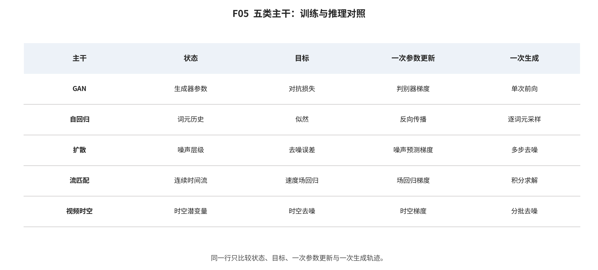

## 第 6 章 显式概率与潜变量家族

输入与问题：显式潜变量与可逆流卡片、ALG01—ALG02 以及后续 AR、扩散和视频 codec 的继承关系。

论证动作：比较 ELBO、离散码本和可逆 Jacobian 三种显式接口，追踪压缩收益如何转化为下游信息瓶颈。

VAE 的持久贡献是摊销推断与可微随机潜变量，而不是感知质量总胜负。ELBO 同时约束重构与先验，使编码、生成和条件化共享 latent；后验族、似然选择和 KL 权重也会造成后验坍塌或视觉模糊。 [@vae]

> **ALG01 VAE 与可微潜变量采样 [@vae**]
> 1. >
1. 训练输入：样本 x、标准高斯噪声 ε
>
1. 状态与目标：状态为 连续潜变量 z；目标为 ELBO = E_q[log pθ(x|z)] - KL(qφ(z|x)||p(z))
>
1. 一次参数更新：由 z=μ+σ⊙ε 的重参数化路径联合更新编码器 φ 与解码器 θ
>
1. 推理初始化：z p(z)
>
1. 单步状态更新：x_hat=Dθ(z)
>
1. 终止与复杂度：输出一次解码后的样本；单次编码/解码；训练含重构与 KL
>
1. 典型失败与结论上限：近似后验受限、后验坍塌、像素似然导致感知模糊；证明可微随机潜变量接口；不证明感知质量优于其他家族；公式/机制来自一手全文卡；复杂度与失败仅作定性合同，不构成性能排名。
>

VQ-VAE 把连续状态离散化，使强 prior 不必直接处理像素；分层 VQ 和 VQGAN 用层级码、感知与对抗目标提高压缩重建。代价是 tokenizer 先决定可达图像集合，文字、小物体、快速运动和几何可能在 prior 之前已经丢失。 [@vqvae; @vqvae2; @vqgan]

> **ALG02 VQ-VAE/VQGAN 离散视觉 tokenizer [@vqvae; @vqgan**]
> 1. >
1. 训练输入：图像 x 与码本 e_1...e_K
>
1. 状态与目标：状态为 码本索引 k 与量化 latent z_q；目标为 重构 + 码本 + commitment；VQGAN 另含感知与 patch 对抗项
>
1. 一次参数更新：最近邻量化，straight-through 传递解码梯度
>
1. 推理初始化：由先验产生离散 token 或编码给定图像
>
1. 单步状态更新：k*=argmin_j ||z_e-e_j||²，随后由 decoder 解码
>
1. 终止与复杂度：离散序列完备后输出图像/视频；编码一次；后续 token 模型成本取决于序列长度
>
1. 典型失败与结论上限：码本坍塌、重建上限、文字/小物体/快速运动丢失；说明表示压缩成为 AR、掩码与潜生成共享接口；公式/机制来自一手全文卡；复杂度与失败仅作定性合同，不构成性能排名。
>

RealNVP/Glow 通过可逆耦合与变量替换计算精确似然和反演，但高维视觉要求受限结构和较大显存。似然反例又表明密度可能奖励背景或局部统计，因此精确 likelihood 不自动等于语义真实。 [@realnvp; @glow]

*F05。VAE/可逆流、GAN/WGAN、像素或离散 token 自回归、DDPM/score-SDE 与 Flow Matching/Rectified Flow/Consistency 的训练—推理合同对照。 证据边界：公式和机制来自一手全文卡；复杂度与失败仅作定性合同，不支持质量、速度或资源全局排名。*

综合判断：显式潜变量路线最终成为 AR、扩散与视频系统共享的表示基础设施；选择它要同时验证推断需求、重建上限和结构成本。

证据边界：本章没有跨协议比较重建分数或似然，也不从公式性质推断感知或语义质量。

转场：第 7 章考察放弃显式密度、以判别博弈学习单步映射的路线。

---

[← 返回目录](index.md)
