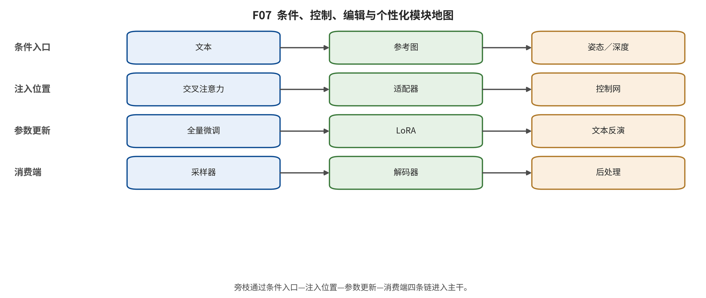

## 第 13 章 条件、控制、编辑与个性化旁枝

输入与问题：控制旁枝表中的结构条件、编辑、个性化、参考图、视觉文字及视频动作条件。

论证动作：按条件来源、注入点、参数更新、推理依赖和失败模式比较，而不把每个 adapter 升格为生成家族。

结构控制围绕“不破坏基础生成器”展开：ControlNet 复制可训练支路并以零卷积注入，T2I-Adapter 使用更小条件编码器，GLIGEN 引入 grounding token，IP-Adapter 增加解耦图像 cross-attention。它们在容量、参数、模态竞争和多条件冲突上形成不同失败。 [@controlnet; @t2iadapter; @gligen; @ipadapter]

编辑方法分别操作起点、轨迹、注意和监督：SDEdit 选择噪声起点，Prompt-to-Prompt 控制注意图，Null-text inversion 优化无条件 embedding，DiffEdit 估计 mask，InstructPix2Pix 学习指令三元组。对象交换、计数、空间关系、非编辑区漂移和多轮伪影要求局部与全局指标分开。 [@sdedit; @prompt2prompt; @nulltext; @instructpix2pix; @diffedit]

个性化从 Textual Inversion 的输入 embedding，发展到 DreamBooth 全模型微调、Custom Diffusion 局部权重以及 InstantID/PhotoMaker 的 encoder 路线。主体保真、文本遵循和多样性构成三角；单一身份相似度不能覆盖背景泄漏、多主体属性混淆和群体偏差。 [@textualinversion; @dreambooth; @customdiffusion; @instantid; @photomaker]

视觉文字方法显式加入布局、glyph、OCR 表征或更详细 caption，说明数据与 codec 同样是算法变量。可靠文字需要字符级数据、空间约束、VAE 重建、OCR 与人评联合合同；错拼、缺词和重叠不能由整体 CLIP 相似掩盖。 [@textdiffuser; @glyphdraw; @glyphcontrol; @anytext; @dalle3]

**控制、编辑、个性化等旁枝簇的结构化分布。}

\begin{tabular}{lcl}

旁枝簇 & 记录数 & 示例 \\

temporal & 19 & Generating Videos with Scene Dynamics、Temporal Generative Adversarial Nets with Singular Value Clipping、MoCoGAN: Decomposing Motion and Content for Video Generation \\
control & 11 & Adding Conditional Control to Text-to-Image Diffusion Models、T2I-Adapter: Learning Adapters to Dig out More Controllable Ability for Text-to-Image Diffusion Models、GLIGEN: Open-Set Grounded Text-to-Image Generation \\
editing & 11 & A Style-Based Generator Architecture for Generative Adversarial Networks、Analyzing and Improving the Image Quality of StyleGAN、Alias-Free Generative Adversarial Networks \\
personalization & 7 & An Image is Worth One Word: Personalizing Text-to-Image Generation using Textual Inversion、DreamBooth: Fine Tuning Text-to-Image Diffusion Models for Subject-Driven Generation、Multi-Concept Customization of Text-to-Image Diffusion \\
audio-video & 3 & MM-Diffusion: Learning Multi-Modal Diffusion Models for Joint Audio and Video Generation、VideoPoet: A Large Language Model for Zero-Shot Video Generation、Movie Gen: A Cast of Media Foundation Models \\
text-rendering & 1 & AnyText: Multilingual Visual Text Generation And Editing \\

\end{tabular}

\end{table**

|
旁枝簇 | 记录数 | 示例 |
|---|---|---|
|
temporal | 19 | Generating Videos with Scene Dynamics、Temporal Generative Adversarial Nets with Singular Value Clipping、MoCoGAN: Decomposing Motion and Content for Video Generation |
| control | 11 | Adding Conditional Control to Text-to-Image Diffusion Models、T2I-Adapter: Learning Adapters to Dig out More Controllable Ability for Text-to-Image Diffusion Models、GLIGEN: Open-Set Grounded Text-to-Image Generation |
| editing | 11 | A Style-Based Generator Architecture for Generative Adversarial Networks、Analyzing and Improving the Image Quality of StyleGAN、Alias-Free Generative Adversarial Networks |
| personalization | 7 | An Image is Worth One Word: Personalizing Text-to-Image Generation using Textual Inversion、DreamBooth: Fine Tuning Text-to-Image Diffusion Models for Subject-Driven Generation、Multi-Concept Customization of Text-to-Image Diffusion |
| audio-video | 3 | MM-Diffusion: Learning Multi-Modal Diffusion Models for Joint Audio and Video Generation、VideoPoet: A Large Language Model for Zero-Shot Video Generation、Movie Gen: A Cast of Media Foundation Models |
| text-rendering | 1 | AnyText: Multilingual Visual Text Generation And Editing |
| | | |

*F07。控制旁枝不是新生成家族；应按条件载体、注入位置、参数更新范围与失败模式对比。 证据边界：注入路径是用于导航全文的归纳标签，不替代每篇论文的精确层级、权重或代码审计。*

综合判断：旁枝的价值在于修复共享瓶颈；是否升级为核心取决于接口复用和独立后继，而非模块大小或发布热度。

证据边界：当前控制表汇总异源作者证据，未在同一基础模型上做多条件、编辑和个性化统一运行。

转场：第 14 章把同一条件问题扩展到时间、运动、长程状态、音频和动作。

---

[← 返回目录](index.md)
