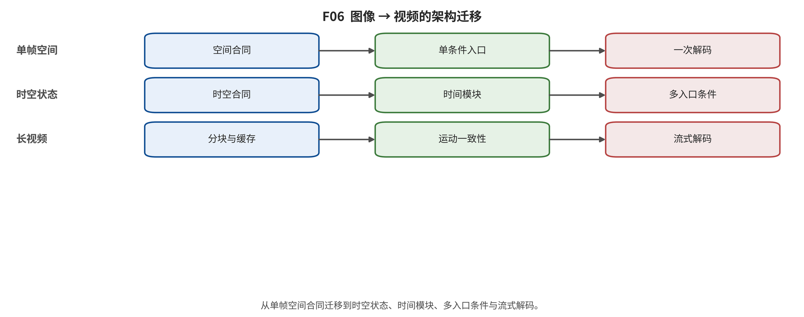

## 第 14 章 视频专属问题：时间、运动、长程状态与交互

输入与问题：60 张视频卡、视频时间矩阵和 ALG14。

论证动作：把时间一致、运动、长程状态、交互和世界能力拆成表示容量、更新粒度、历史机制与监督四个问题。

时间一致不是逐帧画质。身份、对象永久性、遮挡、相机、事件顺序和动作因果要求跨帧状态；单帧 FID/美学分数可能与闪烁、运动错误或回访不一致并存。 [@video_1609_02612; @video_2204_03458; @video_2304_08818]

架构从空间/时间因子化、3D 卷积、时空 DiT 到因果块和分层生成。图像预训练可以提供外观与文本语义，无标注视频提供运动，时空 codec 决定快速运动和小对象是否可见；这些因素必须分别归因。 [@video_2204_03458; @video_2209_14792; @video_2304_08818; @video_2401_03048; @video_2408_06072]

> **ALG14 时空视频扩散、DiT 与 Flow [@video_2204_03458; @video_2401_03048; @video_2408_06072; @video_2412_03603; @video_2503_20314**]
> 1. >
1. 训练输入：视频/图像混合数据、条件 c、时间 t 与噪声/路径端点
>
1. 状态与目标：状态为 像素或 3D 因果 VAE latent 的时空噪声状态；目标为 视频去噪 ε/v 目标或 flow/rectified-flow 速度目标
>
1. 一次参数更新：2D+时间层、3D U-Net 或时空 DiT 回归状态更新量
>
1. 推理初始化：整段或滑窗时空噪声
>
1. 单步状态更新：逆扩散更新或 ODE 速度积分；可带首帧/轨迹/动作条件
>
1. 终止与复杂度：固定窗口完成或分块循环终止；随时空 token 体积、注意力方案、步数和 codec 压缩变化
>
1. 典型失败与结论上限：身份/场景漂移、闪烁、长时记忆缺失、物理与动作因果未证；视频生成必须分开视觉预测、物理一致、在线交互和规划四级证据；公式/机制来自一手全文卡；复杂度与失败仅作定性合同，不构成性能排名。
>

长视频方法使用分段、滑窗、固定队列、首帧锚、KV cache、关键帧/故事板或检索记忆。可生成时长只是运行属性；应报告首次失败时间、回访一致、事件顺序、身份和状态查询，以及内存与延迟随时长的曲线。 [@video_2405_11473; @video_2403_14773; @video_2412_09856; @video_2412_03568; @video_2505_21996]

动作条件和交互系统还需区分视觉预测、物理守恒、反事实因果与下游规划。GAIA-1、Genie 和 Genie 3 展示不同状态/动作接口，但只有任务成功、回环、对象永久性和分布外动作证据才能支持可行动世界主张。 [@video_2309_17080; @video_2402_15391; @video_system_60]

**视频结构化卡按主家族的分布与示例；视频能力仍需时间和动作字段。}

|
主家族 | 卡数 | 示例 |
|---|---|---|
|
得分与随机去噪 | 28 | Video Diffusion Models、Flexible Diffusion Modeling of Long Videos、Make-A-Video: Text-to-Video Generation without Text-Video Data |
| 确定性输运 | 11 | Movie Gen: A Cast of Media Foundation Models、HunyuanVideo: A Systematic Framework For Large Video Generative Models、Pyramidal Flow Matching for Efficient Video Generative Modeling |
| 混合与统一生成机制 | 9 | GAIA-1: A Generative World Model for Autonomous Driving、From Slow Bidirectional to Fast Autoregressive Video Diffusion Models、Generative Pre-trained Autoregressive Diffusion Transformer |
| 自回归与掩码生成 | 8 | VideoGPT: Video Generation using VQ-VAE and Transformers、Long Video Generation with Time-Agnostic VQGAN and Time-Sensitive Transformer、CogVideo: Large-scale Pretraining for Text-to-Video Generation via Transformers |
| 对抗式隐式生成 | 4 | Generating Videos with Scene Dynamics、Temporal Generative Adversarial Nets with Singular Value Clipping、MoCoGAN: Decomposing Motion and Content for Video Generation |
| | | |

*F06。图像架构迁移到视频时需新增时空表示、时间交互、帧/相机/动作条件以及窗口外状态维持；一级家族仍由最终更新算子决定。 证据边界：聚合计数是非互斥标签；本图描述架构变化，不声称图像模型一定是每个视频模型的直接祖先。*

综合判断：视频的四个先验问题是 codec 是否保留运动、每次更新什么、怎样维护历史、条件是否含动作/相机/音频。

证据边界：视频卡仍以章节级定位为主，纠错只抽样 12 张；公开演示不能证明长程、物理或规划能力。

转场：第 15 章审计图像和视频数据、指标与协议可比性。

---

[← 返回目录](index.md)
