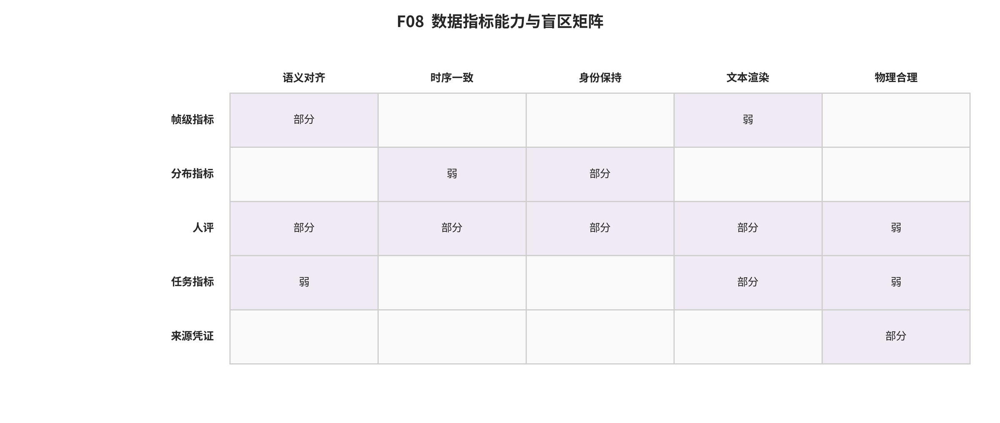

## 第 15 章 数据、评测与证据可比性

输入与问题：数据集、指标、评测实现、人评、竞技场和 R002 合成特征协议夹具。

论证动作：为每个测量对象建立最小协议，区分作者结果、合成夹具和真实生成模型评测。

训练与评测数据必须记录独立媒体分母、派生 clip、caption 来源、过滤、许可、URL 漂移、重复/近复制和污染。图像对数、视频 clip 数与总时长不可互换；数据卡许可也不自动转移底层媒体权利。

**数据记录按模态汇总；规模、许可和派生关系须逐行回到数据表。**

模态 | 记录数 | 示例 |
|---|---|---|
video | 12 | WebVid-10M、HD-VILA-100M、InternVid-10M-FLT |
| image | 11 | MS COCO、Conceptual Captions、FFHQ |
| | | |

FID/KID 测量特征分布，CLIP 类分数测文本—图像表征相似，FVD 扩展到视频特征，人评和偏好模型测特定问题下的判断。它们分别遗漏组合、文字、时序、物理、身份、尾部失败或评审偏差，不能由一个分数替代。

**指标按测量目标汇总；同名指标只有在实现和协议一致时可比较。**

测量目标 | 记录数 | 示例 |
|---|---|---|
MMD between generated and reference Inception features | 1 | KID |
| attribute binding; object interaction; motion binding; spatial and temporal composition | 1 | T2V-CompBench vector |
| completed outputs per time | 1 | throughput |
| compliance with named physical laws | 1 | PhyGenBench physical score |
| criterion-specific perceived quality | 1 | absolute human rating |
| energy cost after quality and success gating | 1 | energy_per_accepted_output |
| fine-grained human-like quality dimensions | 1 | VideoScore |
| generated/reference feature-distribution distance | 1 | FID |
| generated/reference spatiotemporal feature-distribution distance | 1 | FVD |
| image-text semantic compatibility | 1 | CLIPScore |
| learned expert preference for a prompt-image pair | 1 | ImageReward |
| learned human preference prediction and four-style benchmark performance | 1 | HPS_v2 |
| learned prediction of real-user preference conditional on a prompt | 1 | PickScore |
| maximum accelerator memory used | 1 | peak_memory |
| object presence; co-occurrence; count; color; position; color attribution | 1 | GenEval score |
| open-world compositional prompt adherence | 1 | T2I-CompBench vector |
| physical commonsense and plausibility | 1 | VideoPhy score |
| question-answer faithfulness to prompt facts | 1 | TIFA score |
| relative preference under a named criterion | 1 | pairwise human preference |
| scientific relevance; factual accuracy; explainability | 1 | SCIEval vector |
| video quality and semantic dimensions | 1 | VBench dimension vector |
| visual quality; motion; temporal coherence; text-video alignment | 1 | EvalCrafter metric vector |
| wall-clock request completion | 1 | end_to_end_latency |
| | | |

**跨研究可比性的最小合同；任一关键字段漂移都应分组或拒绝比较。**

合同层 | 必须固定 | 不满足时 |
|---|---|---|
任务与输入 | 任务、条件、提示集、源媒体 | 只作异源描述 |
| 输出 | 分辨率、帧数、帧率、时长、格式 | 不比较质量或效率 |
| 采样 | 步数、solver、guidance、随机种子 | 不归因于模型本体 |
| 评测 | 实现、特征器、参考集、样本数、人评题目 | 不合并分数 |
| 系统 | 硬件、精度、batch、编译、冷启动、负载 | 不比较延迟与吞吐 |
| 统计 | 独立单位、重复、方差、缺失与失败 | 拒绝元分析或显著性 |
| | | |

R002 的合成特征夹具中，FID、KID 和协议指纹三项合同均为 pass：FID 同集值 0.0，KID 交换绝对差 0.0，预处理指纹不一致会在指标计算前阻断。输入只是固定合成特征，没有图像解码、Inception 权重、生成器或人评，因此不支持视觉质量与模型排名。 [@src_s_exp_r002_metric_fixture]

*F08。数据、指标与能力的对应。每个指标依其主要测量对象归入一个能力列，同时显示参考集依赖与已知盲区；归类不把一个指标扩张成通用效度。 证据边界：能力归组只用于导航；同名指标在提取器、预处理、样本数、prompt、聚合和种子不同时不可直接比较。*

综合判断：只有任务、数据、输出、采样、评测器、硬件和统计单位同时对齐的子集才可定量比较。

证据边界：当前没有统一生成模型运行、独立重复或跨研究方差；元分析和跨协议总榜均被拒绝。

转场：第 16 章把采样、codec、缓存、量化与服务成本放入端到端复现阶梯。

### 数据记录审计索引

- ECO-D001｜MS COCO｜模态 image｜规模 328000 images｜用途 text-image training; COCO-FID; caption alignment｜许可/条款 dataset terms plus underlying Flickr image licenses｜风险 object-centric domain; caption style; duplicate and preprocessing sensitivity｜可比性 COCO-30K and COCO-2014/2017 subsets are not interchangeable [@src_s_ext_a2e1a9cc9bd2ee15; @src_s_ext_b8fde4a88fe06f4f]
- ECO-D002｜Conceptual Captions｜模态 image｜规模 3300000 image_text_pairs｜用途 large-scale image-text pretraining｜许可/条款 dataset page terms; underlying web media rights not transferred｜风险 weak captions; URL decay; web bias; rights ambiguity｜可比性 record retrieval date and successful-download denominator [@src_s_ext_883b91a248a8f70d]
- ECO-D003｜FFHQ｜模态 image｜规模 70000 images｜用途 face generation and inversion｜许可/条款 CC BY-NC-SA 4.0 dataset; individual images retain original licenses; face-recognition restriction｜风险 demographic imbalance; biometric/privacy risk; inherited licenses｜可比性 not comparable to general-scene datasets [@src_s_ext_2e0206c9bfbf134e]
- ECO-D004｜LAION-5B｜模态 image｜规模 5850000000 image_text_pairs｜用途 foundation-model pretraining and data research｜许可/条款 metadata CC BY 4.0; underlying media rights remain with owners｜风险 weak text; duplicates; bias; URL decay; unsafe and unlawful-content risk｜可比性 metadata scale is not equal to currently retrievable valid samples [@src_s_ext_e21d4fdc23640b7f; @src_s_ext_c32738ba82a67d01; @src_s_ext_a71e52f7d74db2c8; @src_s_ext_813aaade7ed9b752; @src_s_ext_a322cc3b396554b6]
- ECO-D005｜Re-LAION-5B｜模态 image｜规模 5850000000 image_text_pairs｜用途 safer large-scale pretraining index｜许可/条款 metadata terms per release; underlying media rights not transferred｜风险 known-hash filtering cannot prove absence of all harmful content; source drift｜可比性 report exact variant and snapshot [@src_s_ext_a71e52f7d74db2c8]
- ECO-D006｜DataComp-1B candidate pool｜模态 image｜规模 12800000000 image_text_pairs｜用途 data curation benchmark for CLIP-like training｜许可/条款 benchmark/data terms; underlying media rights require separate review｜风险 web bias; URL decay; optimization to fixed downstream suite｜可比性 compare only within the same DataComp scale and training budget [@src_s_ext_8931ca2bc2a2df46]
- ECO-D007｜WebVid-10M｜模态 video｜规模 10000000 video_text_pairs｜用途 video-language pretraining and text-to-video training｜许可/条款 repository/data terms; source-video rights and availability remain external｜风险 watermarks; weak captions; duplicates; URL decay; stock-video bias｜可比性 successful retrieval count and dedup policy are mandatory [@src_s_ext_9c5cfc1e3ee09475]
- ECO-D008｜HD-VILA-100M｜模态 video｜规模 100000000 video_clip_text_pairs｜用途 high-resolution video-language pretraining｜许可/条款 URLs/metadata release; source media rights remain external｜风险 ASR errors; spoken-content bias; source drift; long-video correlation｜可比性 do not treat 100M clips as 100M independent source videos [@src_s_ext_27fd08d04b6030b2; @src_s_ext_be5c2e02470ae804]
- ECO-D009｜InternVid-10M-FLT｜模态 video｜规模 10000000 video_text_pairs｜用途 video-text representation and generation｜许可/条款 dataset-card terms; underlying media rights require review｜风险 machine-caption bias; filter-model bias; availability drift｜可比性 lock subset version and HF commit [@src_s_ext_3baa8d3a6825c19d; @src_s_ext_f3e09865590969f9]
- ECO-D010｜Panda-70M｜模态 video｜规模 70000000 video_text_pairs｜用途 text-to-video training and caption research｜许可/条款 project terms plus inherited source-video conditions｜风险 dependent samples; teacher hallucination; inherited ASR/source bias｜可比性 70M pairs are derived segments rather than independent videos [@src_s_ext_aad92459dff9dad3]
- ECO-D011｜OpenVid-1M｜模态 video｜规模 1000000 video_text_pairs｜用途 high-quality text-to-video training｜许可/条款 repository and dataset terms; underlying source rights require review｜风险 filter-model bias; duplicate segments; source drift｜可比性 433K 1080p subset must be named separately from full set [@src_s_arxiv_2407_02371; @src_s_ext_1f5cad9fbb4d7ee1]
- ECO-D012｜OpenVidHD-0.4M｜模态 video｜规模 433000 video_text_pairs｜用途 high-resolution video generation｜许可/条款 same as OpenVid-1M release｜风险 resolution does not guarantee content or caption quality｜可比性 compare only after matching duration/fps/resolution filters [@src_s_arxiv_2407_02371; @src_s_ext_1f5cad9fbb4d7ee1]
- ECO-D013｜MiraData｜模态 video｜规模 NA long_videos｜用途 long-video generation and structured evaluation｜许可/条款 project terms; underlying content rights require review｜风险 long-range caption hallucination; generator-version dependence; source drift｜可比性 scale and release composition require version-specific audit [@src_s_ext_9eae22c439bbcff9]
- ECO-D014｜MiraBench｜模态 video｜规模 150 prompts｜用途 long-video evaluation｜许可/条款 benchmark terms｜风险 small prompt set; metric aggregation can hide dimension failures｜可比性 not a substitute for VBench or human preference [@src_s_ext_9eae22c439bbcff9]
- ECO-D015｜FineVideo｜模态 video｜规模 43000 videos｜用途 >3,400-hour long-form video generation and understanding｜许可/条款 CC-BY source selection with attribution obligations; card-specific terms｜风险 only CC-BY filtering accuracy is auditable by snapshot; machine-label bias; deletions｜可比性 retain video-level attribution and model-generated metadata provenance [@src_s_ext_d8a85afa9f84a924; @src_s_ext_734a4df434589b7b]
- ECO-D016｜TIFA v1｜模态 image｜规模 4000 prompts｜用途 faithfulness diagnostics｜许可/条款 paper/repository terms｜风险 LLM question generation and VQA answer bias｜可比性 report question generator and VQA evaluator version [@src_s_ext_1610191ec47a137a]
- ECO-D017｜T2V-CompBench｜模态 video｜规模 1400 prompts｜用途 compositional text-to-video evaluation｜许可/条款 paper/repository terms｜风险 detector/tracker/MLLM failure can be scored as generator failure｜可比性 use category vector; avoid single-score cross-paper ranking [@src_s_ext_886b46db89300b7c]
- ECO-D018｜PhyGenBench｜模态 video｜规模 160 prompts｜用途 physical commonsense evaluation｜许可/条款 paper/repository terms｜风险 coverage is sparse; VLM/LLM judge bias; prompt leakage｜可比性 not directly comparable to VideoPhy without shared prompts and judges [@src_s_ext_ca220ee450d111b2; @src_s_ext_28660977e9853176]
- ECO-D019｜VideoFeedback｜模态 video｜规模 37600 videos｜用途 training and evaluating learned video reward models｜许可/条款 repository/data terms｜风险 rater population and model-era bias; distribution shift｜可比性 learned scores require out-of-distribution validation [@src_s_ext_0ced8660dbcb0990; @src_s_ext_e279a4f042679383]
- ECO-D020｜SCIEval｜模态 image｜规模 NA scientific_prompts_and_images｜用途 scientific image generation evaluation｜许可/条款 paper/repository terms｜风险 domain-expert dependence; scientific subdomain coverage｜可比性 do not compare with general-aesthetic benchmarks as a single quality axis [@src_s_ext_500194e9b9e5c4e6]
- ECO-D021｜Pick-a-Pic｜模态 image｜规模 >500000 preference_examples｜用途 training and testing PickScore; preference research｜许可/条款 paper/dataset terms; user consent described by authors; repository MIT applies to code only｜风险 self-selected users; interface effects; generator-era coverage; repeated-user dependence｜可比性 version and user split must be fixed; examples are not independent when users or prompts repeat [@src_s_ext_463d2c341c7ad7d0; @src_s_ext_33d29297a792c446]
- ECO-D022｜ImageRewardDB｜模态 image｜规模 137000 expert_pairwise_comparisons｜用途 training and testing ImageReward; reward feedback learning｜许可/条款 paper/dataset terms; repository Apache-2.0 applies to code only｜风险 expert recruitment and rubric dependence; source-model coverage; annotator clustering｜可比性 do not merge its comparison count with crowdsourced or real-user datasets without cluster metadata [@src_s_ext_96452f21157f1b23; @src_s_ext_0341223e1150a5f6]
- ECO-D023｜HPD_v2｜模态 image｜规模 798090 preference_choices｜用途 training HPS v2 and four-style text-to-image evaluation｜许可/条款 paper/dataset terms; repository Apache-2.0 applies to code only｜风险 model-era and style coverage; annotator dependence; train/test release changed over time｜可比性 lock HPD and HPS checkpoint versions; choice count and unique image-pair denominator are distinct [@src_s_arxiv_2306_09341; @src_s_ext_b9537ace6ebc0114]

### 指标记录审计索引

- ECO-M001｜FID｜目标 generated/reference feature-distribution distance｜方向 lower｜最小协议 same extractor implementation; same resize/preprocess; named real split; equal and disclosed sample counts; confidence interval or repeated seeds｜盲区 Gaussian approximation; sample bias; extractor/domain mismatch; insensitive to prompt-level correctness｜可比性 only within identical implementation and sampling protocol [@src_s_ext_f13a72e436c93975]
- ECO-M002｜KID｜目标 MMD between generated and reference Inception features｜方向 lower｜最小协议 same features; kernel; subset size; number of subsets; sample counts; uncertainty｜盲区 extractor/domain mismatch; subset estimator settings; no prompt-level semantics｜可比性 unbiased estimator does not remove protocol dependence [@src_s_ext_55391d95358da2e0]
- ECO-M003｜CLIPScore｜目标 image-text semantic compatibility｜方向 higher｜最小协议 same CLIP model/tokenization; same prompt set; crop/resize; aggregation and seed policy｜盲区 weak on counting; negation; spatial relations; text rendering; physical correctness; aesthetics｜可比性 not interchangeable across CLIP checkpoints or prompt distributions [@src_s_ext_d47e49b272b9817e]
- ECO-M004｜FVD｜目标 generated/reference spatiotemporal feature-distribution distance｜方向 lower｜最小协议 same I3D weights; frame count/fps/resolution; clip sampling; reference split; sample count｜盲区 I3D action-domain bias; sample inefficiency; temporal preprocessing; no prompt-specific diagnosis｜可比性 never compare values with different frame/fps/I3D/data protocols [@src_s_ext_cdc5919a22f406ea]
- ECO-M005｜TIFA score｜目标 question-answer faithfulness to prompt facts｜方向 higher｜最小协议 same TIFA question set/generator; VQA checkpoint; answer normalization; prompt categories｜盲区 question omissions/hallucinations; VQA failure; weak aesthetics and global coherence｜可比性 report per-category scores and judge version [@src_s_ext_1610191ec47a137a]
- ECO-M006｜GenEval score｜目标 object presence; co-occurrence; count; color; position; color attribution｜方向 higher｜最小协议 official prompts; detector checkpoint/threshold; parsing; seed count｜盲区 detector bottleneck; limited attributes and relations; style/domain sensitivity｜可比性 only same detector and benchmark release [@src_s_ext_2da47e6f77711c51]
- ECO-M007｜T2I-CompBench vector｜目标 open-world compositional prompt adherence｜方向 higher｜最小协议 same prompt split; evaluator versions; aggregation; seeds｜盲区 evaluator entanglement; open-world long-tail; aggregate masks failure modes｜可比性 do not collapse across releases without preserving dimensions [@src_s_arxiv_2307_06350]
- ECO-M008｜VBench dimension vector｜目标 video quality and semantic dimensions｜方向 higher｜最小协议 VBench version; prompt suite; duration/fps/resolution; evaluator checkpoints; seeds｜盲区 judge-model bias; overlapping dimensions; sensitivity to video preprocessing｜可比性 use within one VBench protocol; no cross-paper leaderboard synthesis [@src_s_ext_41ef49de30ab0c93]
- ECO-M009｜EvalCrafter metric vector｜目标 visual quality; motion; temporal coherence; text-video alignment｜方向 mostly higher｜最小协议 same 700 prompts; evaluator checkpoints; video preprocessing; raw metrics and coefficients｜盲区 learned aggregate may overfit raters/models; coefficients obscure tradeoffs｜可比性 preserve raw vector; learned aggregate not universal utility [@src_s_ext_ada443910805e939]
- ECO-M010｜VideoScore｜目标 fine-grained human-like quality dimensions｜方向 higher｜最小协议 checkpoint; input sampling; resolution/fps; prompt set; domain-shift audit｜盲区 inherits annotator and training-model bias; vulnerable to reward hacking｜可比性 not valid as sole judge for post-training models without held-out human audit [@src_s_ext_0ced8660dbcb0990; @src_s_ext_e279a4f042679383]
- ECO-M011｜T2V-CompBench vector｜目标 attribute binding; object interaction; motion binding; spatial and temporal composition｜方向 higher｜最小协议 same 1,400 prompts; evaluator versions; frame sampling; seed count｜盲区 composed evaluator failure; limited prompts; long-tail relation ambiguity｜可比性 same benchmark release only; no aggregation with VBench [@src_s_ext_886b46db89300b7c]
- ECO-M012｜PhyGenBench physical score｜目标 compliance with named physical laws｜方向 higher｜最小协议 same 160 prompts; 27 laws; four domains; judge prompt/checkpoint; human audit｜盲区 judge may hallucinate physical violations; small coverage; ambiguity in stochastic phenomena｜可比性 do not rank against VideoPhy without common clips and raters [@src_s_ext_ca220ee450d111b2; @src_s_ext_28660977e9853176]
- ECO-M013｜VideoPhy score｜目标 physical commonsense and plausibility｜方向 higher｜最小协议 official split; prompt and judge version; video preprocessing; seeds｜盲区 benchmark taxonomy/domain limits; evaluator error｜可比性 not directly comparable to PhyGenBench scores [@src_s_ext_1bdc47e96f4aa885]
- ECO-M014｜SCIEval vector｜目标 scientific relevance; factual accuracy; explainability｜方向 higher｜最小协议 same scientific domains; prompts; reference material; judge version; expert audit｜盲区 domain coverage; judge factuality; scientific ambiguity｜可比性 never substitute with FID or aesthetic preference [@src_s_ext_500194e9b9e5c4e6]
- ECO-M015｜pairwise human preference｜目标 relative preference under a named criterion｜方向 higher｜最小协议 randomized side; exact prompt/output sampling; ties; rater count/demographics; repeated items; quality checks; CI; multiple-comparison plan｜盲区 position bias; rater culture; criterion leakage; non-transitivity; version drift｜可比性 win rates are only transitive under an explicit fitted model and adequate overlap [@src_s_ext_d92935b612a4c23a]
- ECO-M016｜absolute human rating｜目标 criterion-specific perceived quality｜方向 higher｜最小协议 anchored rubric; calibration examples; randomization; repeated items; inter-rater reliability; CI｜盲区 scale-use bias; central tendency; ceiling effects; rater fatigue｜可比性 means of ordinal scales require justification; prefer distributions or ordinal models [@src_s_ext_d92935b612a4c23a]
- ECO-M017｜end_to_end_latency｜目标 wall-clock request completion｜方向 lower｜最小协议 model/version; prompt; frames; resolution; steps; batch/concurrency; warmup; device; dtype; compiler; cache; p50/p95; failed requests｜盲区 excludes quality unless paired; service queues and cold starts; network overhead｜可比性 only compare identical workload and service boundaries [@src_s_ext_13736dc1c9b1994c; @src_s_ext_82285d355bc15510; @src_s_ext_98ddce99618b4027]
- ECO-M018｜throughput｜目标 completed outputs per time｜方向 higher｜最小协议 same output definition; quality gate; batch/concurrency; device count; duration/fps/resolution; failure handling｜盲区 can improve by batching while latency worsens; frame/s hides video duration and quality｜可比性 state numerator, denominator and quality acceptance explicitly [@src_s_ext_4f224d03e281827c; @src_s_ext_57f457395c501e8a; @src_s_ext_caf93eb5901acc77]
- ECO-M019｜peak_memory｜目标 maximum accelerator memory used｜方向 lower｜最小协议 same model; dtype; batch; frames; resolution; offload; allocator; peak reset; device count｜盲区 host memory and transfer cost can be hidden; reserved versus allocated ambiguity｜可比性 report per-device accelerator plus host memory and offload [@src_s_ext_fe29d7e2334824e7; @src_s_ext_a04fcd8503ac7c51; @src_s_ext_8bdfea4a272027d7; @src_s_ext_27e55f929824efd0; @src_s_ext_aa8861f307dc3370]
- ECO-M020｜energy_per_accepted_output｜目标 energy cost after quality and success gating｜方向 lower｜最小协议 same hardware; sampling interval; idle baseline; workload; success/quality gate; retries｜盲区 sensor precision; embodied energy excluded; quality gate subjective｜可比性 not available in most papers; mark NR rather than infer from latency [@src_s_ext_13736dc1c9b1994c; @src_s_ext_4f224d03e281827c]
- ECO-M021｜PickScore｜目标 learned prediction of real-user preference conditional on a prompt｜方向 higher｜最小协议 exact PickScore checkpoint; Pick-a-Pic split/version; prompt and image preprocessing; paired outputs; ties; confidence interval; held-out blind human audit｜盲区 self-selected-user bias; source-generator era; cultural and interface bias; reward hacking when optimized directly｜可比性 only compare with the same checkpoint and evaluation prompts; not a universal human utility [@src_s_ext_463d2c341c7ad7d0; @src_s_ext_33d29297a792c446]
- ECO-M022｜ImageReward｜目标 learned expert preference for a prompt-image pair｜方向 higher｜最小协议 exact checkpoint and code commit; prompt/image preprocessing; held-out split; source-model strata; uncertainty; blind human audit｜盲区 expert-rubric dependence; model/domain drift; scalar collapses dimensions; reward hacking and overoptimization｜可比性 do not combine raw values across checkpoint versions or treat reward-maximized outputs as unbiased evaluation [@src_s_ext_96452f21157f1b23; @src_s_ext_0341223e1150a5f6]
- ECO-M023｜HPS_v2｜目标 learned human preference prediction and four-style benchmark performance｜方向 higher｜最小协议 exact HPS v2 checkpoint; HPD/test-prompt release; four style labels; identical generation budget; seeds; paired blind human audit｜盲区 HPD/model-era bias; style taxonomy limits; annotator/cultural shift; optimization gaming｜可比性 HPS, HPS v2 and later checkpoints are different metrics; never mix leaderboard values across releases [@src_s_ext_74fbe248ebdc6108; @src_s_arxiv_2306_09341; @src_s_ext_b9537ace6ebc0114]

---

[← 返回目录](index.md)
