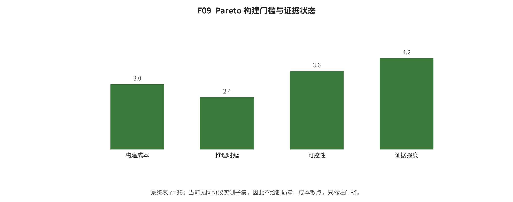
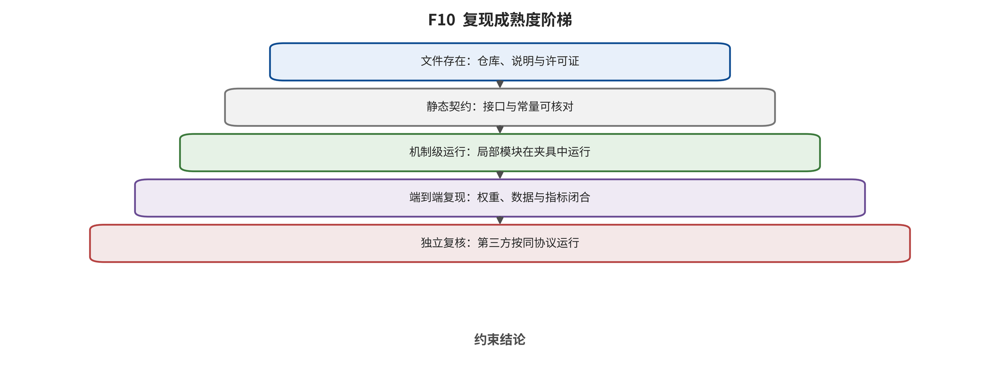

## 第 16 章 工程系统、效率与复现审计

输入与问题：系统组件表、R001/R002 运行产物、代码/权重可用性和复现层级。

论证动作：区分局部算法成本与端到端系统 KPI，并按 R1—R5 报告真实执行而非文件存在。

训练系统需固定数据版本、分布式拓扑、混合精度、检查点和配置身份；推理需记录文本编码、sampler、去噪器、codec、缓存、量化、编译、传输、冷启动、队列和失败重试。NFE、FLOPs、参数量与单内核倍数都不是端到端 p50/p95、吞吐、能耗或成本。

**系统组件按类型汇总；作者报告效率没有被改写成同硬件实测。**

组件类型 | 记录数 | 示例 |
|---|---|---|
open_weight_model | 10 | Stable Diffusion XL Base 1.0、FLUX.1-schnell、Stable Diffusion 3.5 Large Turbo |
| cache | 5 | DeepCache、FasterCache、TeaCache |
| closed_service | 5 | Sora Turbo、Sora 2、Veo 3.1 |
| quantization | 5 | Q-Diffusion、Q-DiT、QVD |
| distillation | 2 | Progressive Distillation、Latent Consistency Models |
| open_weight_world_model | 2 | Cosmos Predict2、Cosmos 3 |
| attention_kernel | 1 | SageAttention |
| inference_engine | 1 | xDiT |
| model_family | 1 | Consistency Models |
| open_research_stack | 1 | Open-Sora 2.0 |
| parallel_inference | 1 | PipeFusion |
| research_only_closed_model | 1 | Movie Gen |
| sampler | 1 | DPM-Solver |
| | | |

R001 为 R1 formula-checked：3/3 合同通过，排名状态固定为 REFUSED_NONCOMPARABLE_CONTRACTS。它没有作者代码、神经模块、权重、生成输出或论文指标。 [@src_s_exp_r001_formula_metrics]

R002 为指标实现和协议防护冒烟：合成特征上的 FID/KID 不变量及预处理指纹通过；它没有使用真实图片、生成模型或视觉特征器。C2PA 工具门状态为 blocked_tool_unavailable，未安装工具、未下载样例、未执行往返，因而不能声称 valid、invalid 或 absent 的实测转换。 [@src_s_exp_r002_metric_fixture; @src_s_exp_r002_c2pa_availability]

*F09。Pareto 构建门槛与拒绝状态。36个系统条目的数据、硬件、质量门、资源及开放性协议不一致；本文未统一执行任何模型推理，故 Pareto 前沿被显式拒绝，而非伪造或拼接异源点。 证据边界：本图评估的是证据可比性，不是系统性能；作者报告的NFE、FID或加速倍数未被改写成本文实测。*

*F10。复现成熟度。本项目完成了静态审计、3项公式合同和3项合成特征指标合同；权重推理和端到端训练/评价均为0。C2PA往返因工具不可用而阻塞，不得写成验证通过。 证据边界：R001/R002的“通过”只指冻结不变量；无图像特征有效性、无任何生成模型样本、无速度显存或论文性能复现。*

综合判断：效率结论必须沿完整服务路径建立质量—时延—显存—吞吐—能耗—许可向量，不能从局部加速外推。

证据边界：当前最高执行层级是公式合同与合成特征指标夹具；没有公开权重推理、训练或论文级端到端复现。

转场：第 17 章把训练数据、输出、平台与用户风险映射到控制和责任层。

### 系统组件审计索引

- ECO-Y001｜DPM-Solver｜类型 sampler｜机制 high-order ODE solver with dedicated diffusion formulation｜代码 official code public｜权重 uses base-model weights｜硬件 paper-specific GPUs; not normalized｜作者报告效率 10-20 NFE; paper reports 4-16x against selected training-free samplers｜证据状态 paper_plus_code_not_executed｜可比性 same base model/noise schedule/NFE/hardware only｜边界 NFE reduction may not equal wall-clock ratio [@src_s_ext_13736dc1c9b1994c; @src_s_ext_205c5653b363344f]
- ECO-Y002｜Progressive Distillation｜类型 distillation｜机制 iteratively distills two sampling steps into one｜代码 research implementations exist｜权重 distilled weights task-specific｜硬件 paper-specific｜作者报告效率 paper demonstrates reduction from many steps to 4｜证据状态 peer_reviewed_not_executed｜可比性 same teacher/student/data/training budget only｜边界 training cost and possible diversity loss must be included [@src_s_ext_bab5c1176c129773]
- ECO-Y003｜Consistency Models｜类型 model_family｜机制 directly maps noise to data with consistency property｜代码 official research code linked by paper｜权重 model-specific｜硬件 paper-specific｜作者报告效率 one-step or few-step generation｜证据状态 peer_reviewed_not_executed｜可比性 same model size/data/training budget only｜边界 not a drop-in speedup for arbitrary diffusion checkpoints [@src_s_ext_041a050598868907]
- ECO-Y004｜Latent Consistency Models｜类型 distillation｜机制 latent consistency distillation for few-step sampling｜代码 official code public｜权重 public checkpoints｜硬件 paper and model-card hardware｜作者报告效率 2-4 steps in reported setups｜证据状态 paper_plus_code_weights_not_executed｜可比性 lock base model/checkpoint/guidance/scheduler｜边界 license and quality differ by checkpoint [@lcm; @src_s_ext_fe6673cb211972b8]
- ECO-Y005｜DeepCache｜类型 cache｜机制 reuses high-level U-Net features at selected steps｜代码 official code public｜权重 uses base-model weights｜硬件 paper-specific GPU｜作者报告效率 2.3x on SD1.5 with reported 0.05 CLIP decline; 4.1x on LDM-4-G with reported +0.22 FID｜证据状态 peer_reviewed_author_report｜可比性 values stay attached to named workload｜边界 cache interval can cause content/detail drift [@src_s_ext_82285d355bc15510; @src_s_ext_80c1a7d017512c6a]
- ECO-Y006｜FasterCache｜类型 cache｜机制 conditional-unconditional and temporal feature reuse｜代码 paper/repository availability varies by release｜权重 uses base-model weights｜硬件 paper-specific GPU｜作者报告效率 1.67x on Vchitect-2.0 in author report｜证据状态 peer_reviewed_author_report｜可比性 same model/frames/resolution/steps/GPU only｜边界 longer clips and different CFG schedules may change gains [@src_s_ext_98ddce99618b4027]
- ECO-Y007｜TeaCache｜类型 cache｜机制 uses timestep-embedding changes to estimate output changes and trigger cache｜代码 official code public｜权重 uses base-model weights｜硬件 per-repository benchmark hardware｜作者报告效率 repository and paper report model-dependent speedups｜证据状态 paper_plus_code_not_executed｜可比性 compare only fixed threshold and model｜边界 supported-model matrix and default thresholds drift [@src_s_ext_9034ed5341b82826; @src_s_ext_6276152978fb722c]
- ECO-Y008｜Pyramid Attention Broadcast｜类型 cache｜机制 broadcasts attention outputs across timestep ranges at pyramid levels｜代码 research code status version-dependent｜权重 uses base-model weights｜硬件 paper-specific｜作者报告效率 up to 10.5x in selected author-reported setting｜证据状态 preprint_author_report｜可比性 maximum speedup cannot be pooled across models｜边界 attention reuse may impair motion/detail [@src_s_ext_8b66a4dc7b04db0d]
- ECO-Y009｜PipeFusion｜类型 parallel_inference｜机制 displaced patch pipeline parallelism with stale-feature reuse｜代码 implemented in xDiT｜权重 uses base-model weights｜硬件 paper includes 8x L40 setting｜作者报告效率 paper reports multi-GPU scaling under named setup｜证据状态 preprint_plus_engine_not_executed｜可比性 same GPU count/interconnect/resolution/batch｜边界 communication and stale patches can dominate or affect quality [@src_s_ext_4f224d03e281827c; @src_s_ext_57f457395c501e8a]
- ECO-Y010｜xDiT｜类型 inference_engine｜机制 unified sequence/tensor/pipe/CFG parallel methods｜代码 public repository｜权重 external model weights｜硬件 GPU clusters listed by repository｜作者报告效率 repository-specific scaling claims｜证据状态 official_repo_static_audit｜可比性 requires identical engine commit and topology｜边界 code presence does not prove every advertised path runs [@src_s_ext_57f457395c501e8a]
- ECO-Y011｜Q-Diffusion｜类型 quantization｜机制 timestep-aware calibration and shortcut splitting PTQ｜代码 research code linked by project｜权重 quantized artifacts model-specific｜硬件 paper-specific｜作者报告效率 low-bit model quality reported; E2E speed hardware-dependent｜证据状态 peer_reviewed_not_executed｜可比性 same bit-width/calibration/kernel/base checkpoint｜边界 low bit-width without optimized kernels may not reduce latency [@src_s_ext_fe29d7e2334824e7]
- ECO-Y012｜Q-DiT｜类型 quantization｜机制 post-training quantization tailored to diffusion transformers｜代码 research implementation status version-dependent｜权重 quantized artifacts task-specific｜硬件 paper-specific｜作者报告效率 paper reports compression/acceleration under selected hardware｜证据状态 peer_reviewed_not_executed｜可比性 match W/A bits and calibration data｜边界 accuracy and runtime are separate claims [@src_s_ext_a04fcd8503ac7c51]
- ECO-Y013｜QVD｜类型 quantization｜机制 video diffusion PTQ with temporal/timestep calibration｜代码 research code status version-dependent｜权重 quantized artifacts task-specific｜硬件 paper-specific｜作者报告效率 W8A8 author results｜证据状态 preprint_not_executed｜可比性 same frames/resolution/base model/kernel｜边界 W8A8 label alone is not a service-speed guarantee [@src_s_ext_8bdfea4a272027d7]
- ECO-Y014｜Q-VDiT｜类型 quantization｜机制 post-training quantization for video diffusion transformers｜代码 research code status version-dependent｜权重 quantized artifacts task-specific｜硬件 paper-specific｜作者报告效率 author-reported memory/runtime benefits｜证据状态 peer_reviewed_not_executed｜可比性 same hardware/runtime/bit configuration｜边界 host offload and decoder costs may hide gains [@src_s_ext_27e55f929824efd0]
- ECO-Y015｜SVDQuant｜类型 quantization｜机制 moves activation outliers into low-rank branch and quantizes main branch W4A4｜代码 project code/Nunchaku engine public｜权重 public quantized models for selected bases｜硬件 supported NVIDIA GPUs｜作者报告效率 author reports acceleration with Nunchaku on supported GPUs｜证据状态 peer_reviewed_project_not_executed｜可比性 must match GPU/runtime/base model and low-rank rank｜边界 engine support is a prerequisite [@src_s_ext_aa8861f307dc3370]
- ECO-Y016｜SageAttention｜类型 attention_kernel｜机制 quantized attention kernels｜代码 public repository｜权重 uses external weights｜硬件 supported NVIDIA GPU list｜作者报告效率 repository reports roughly 2-5x attention-kernel speedup｜证据状态 official_repo_author_benchmark｜可比性 kernel benchmark separate from model E2E｜边界 unsupported shapes or non-attention bottlenecks reduce benefit [@src_s_ext_caf93eb5901acc77]
- ECO-Y017｜EasyCache｜类型 cache｜机制 architecture-agnostic training-free cache policy｜代码 preprint implementation status｜权重 uses base-model weights｜硬件 paper-specific｜作者报告效率 2.1-3.3x author report｜证据状态 preprint_not_executed｜可比性 same model/threshold/hardware/workload｜边界 new preprint; independent replication absent [@src_s_ext_3d04b2a0a9b9c1fb]
- ECO-Y018｜Stable Diffusion XL Base 1.0｜类型 open_weight_model｜机制 latent diffusion XL base plus optional refiner｜代码 official inference code public｜权重 public｜硬件 self-hosted GPU; configuration-dependent｜作者报告效率 NR｜证据状态 official_model_card_static_audit｜可比性 benchmark only exact checkpoint and refiner path｜边界 restricted-use license is not OSI open source [@src_s_ext_3c44be280a6c9e15]
- ECO-Y019｜FLUX.1-schnell｜类型 open_weight_model｜机制 distilled rectified-flow transformer for few-step generation｜代码 public inference ecosystem｜权重 public｜硬件 self-hosted GPU; dtype/offload dependent｜作者报告效率 few-step generation; no universal latency supplied here｜证据状态 official_model_card_static_audit｜可比性 do not transfer license/performance from dev/pro variants｜边界 checkpoint-specific architecture and terms [@src_s_ext_4143cf1471f6ab87]
- ECO-Y020｜Stable Diffusion 3.5 Large Turbo｜类型 open_weight_model｜机制 distilled MMDiT image generator｜代码 official inference code public｜权重 public｜硬件 vendor reports consumer/data-center compatibility by variant｜作者报告效率 4-step generation; 9.9 GiB claim applies to Medium excluding text encoders｜证据状态 official_release_author_report｜可比性 variant-specific; no cross-vendor ranking｜边界 custom revenue-threshold license; vendor comparative claims [@src_s_ext_06d2114e2823654c]
- ECO-Y021｜Wan2.1 T2V-1.3B｜类型 open_weight_model｜机制 diffusion transformer with Wan-VAE｜代码 official code public｜权重 public｜硬件 RTX 4090 example with offload options｜作者报告效率 about 4 minutes per 5-second 480p video on RTX 4090 without quantization per README｜证据状态 official_repo_author_report｜可比性 exact command/checkpoint/prompt-extension setting required｜边界 720p is supported but author recommends 480p stability [@src_s_ext_839f5acdc65fd3f7]
- ECO-Y022｜Wan2.1 T2V-14B｜类型 open_weight_model｜机制 large diffusion transformer with Wan-VAE｜代码 official code public｜权重 public｜硬件 single or multi-GPU; FSDP+xDiT supported｜作者报告效率 NR｜证据状态 official_repo_static_audit｜可比性 prompt extension and distributed path must be declared｜边界 large memory requirement and external prompt model can alter quality/cost [@src_s_ext_839f5acdc65fd3f7]
- ECO-Y023｜Wan2.2 T2V-A14B｜类型 open_weight_model｜机制 timestep-specialized mixture-of-experts diffusion model｜代码 official code public｜权重 public｜硬件 README single-GPU command requires at least 80 GiB VRAM｜作者报告效率 NR｜证据状态 official_repo_static_audit｜可比性 same checkpoint and prompt-extension setting only｜边界 vendor says broader data; no public sample-level training-data ledger [@src_s_ext_4460f5dc2a2e30b2]
- ECO-Y024｜Wan2.2 TI2V-5B｜类型 open_weight_model｜机制 5B joint text/image-to-video model with 16x16x4 VAE compression｜代码 official code public｜权重 public｜硬件 vendor states consumer GPU such as RTX 4090｜作者报告效率 no normalized latency in retained evidence｜证据状态 official_repo_static_audit｜可比性 must distinguish TI2V-5B from T2V-A14B｜边界 consumer-GPU availability does not imply real-time [@src_s_ext_4460f5dc2a2e30b2]
- ECO-Y025｜HunyuanVideo｜类型 open_weight_model｜机制 large video diffusion transformer｜代码 official code public｜权重 public｜硬件 multi-GPU/quantization options vary｜作者报告效率 NR｜证据状态 official_model_card_static_audit｜可比性 exact checkpoint/runtime/license version required｜边界 custom license includes geographic and acceptable-use conditions [@src_s_ext_49fc67fa3d5b229b]
- ECO-Y026｜LTX-Video｜类型 open_weight_model｜机制 video latent diffusion transformer optimized for long spatial-temporal compression｜代码 official code public｜权重 public｜硬件 vendor-listed hardware and optimized paths｜作者报告效率 vendor uses real-time language for selected configurations｜证据状态 official_model_card_author_report｜可比性 latency requires version/hardware/frame/fps/resolution｜边界 open weights is not the same as OSI open source [@src_s_ext_3377b81d395d3de7]
- ECO-Y027｜Mochi 1 preview｜类型 open_weight_model｜机制 asymmetric video diffusion transformer｜代码 official code public｜权重 public｜硬件 large GPU requirements; runtime dependent｜作者报告效率 NR｜证据状态 official_model_card_static_audit｜可比性 preview-version comparisons expire with updates｜边界 training-data disclosure and safety coverage remain limited [@src_s_ext_1de1cfdb739dc858]
- ECO-Y028｜Open-Sora 2.0｜类型 open_research_stack｜机制 open training/inference stack for video generation｜代码 public｜权重 selected checkpoints public｜硬件 multi-GPU training/inference｜作者报告效率 NR｜证据状态 official_repo_static_audit｜可比性 code/checkpoint/data openness are three separate axes｜边界 main branch is mutable; commit pin required [@src_s_ext_bde1adbe087b0baa]
- ECO-Y029｜Cosmos Predict2｜类型 open_weight_world_model｜机制 conditional world-generation models for physical AI｜代码 public under Apache-2.0｜权重 public under NVIDIA Open Model License｜硬件 NVIDIA GPU stacks｜作者报告效率 NR｜证据状态 official_repo_static_audit｜可比性 not directly comparable to entertainment text-to-video｜边界 policy, simulator and generator roles must be separated [@src_s_ext_3c4d37cf1a6a49cd]
- ECO-Y030｜Movie Gen｜类型 research_only_closed_model｜机制 30B transformer media foundation model with personalized/editing/audio components｜代码 not publicly released as complete system｜权重 not public｜硬件 undisclosed serving hardware｜作者报告效率 NR｜证据状态 official_technical_report_only｜可比性 closed technical report; no independent runtime｜边界 do not infer production availability or hidden architecture beyond report [@src_s_ext_629f563e4913e713]
- ECO-Y031｜Sora Turbo｜类型 closed_service｜机制 closed video generation service｜代码 closed｜权重 closed｜硬件 provider service｜作者报告效率 faster than February preview by provider statement; no normalized value｜证据状态 official_product_evidence｜可比性 no cross-service ranking｜边界 web/app discontinued 2026-04-26; page current status supersedes launch availability [@src_s_ext_2d134659d4de90af]
- ECO-Y032｜Sora 2｜类型 closed_service｜机制 closed synchronized video-audio generation with likeness feature｜代码 closed｜权重 closed｜硬件 provider service｜作者报告效率 NR｜证据状态 official_product_evidence｜可比性 no independent architecture or runtime inference｜边界 web/app discontinued; API sunset was still future as of cutoff [@src_s_ext_661a3476d3d51bb4; @src_s_ext_4d8dc7c1bcf322d1]
- ECO-Y033｜Veo 3.1｜类型 closed_service｜机制 closed video generation with native audio and editing inputs｜代码 closed｜权重 closed｜硬件 provider service｜作者报告效率 NR｜证据状态 official_product_evidence｜可比性 entry/version/region and upscaling must be declared｜边界 closed demos do not reveal model architecture [@src_s_ext_4914c72c16a5ed4b; @src_s_ext_c59cbd3dcf25d3c8; @src_s_ext_8dc07480ab081fa9]
- ECO-Y034｜Seedance 2.0｜类型 closed_service｜机制 unified multimodal reference/edit/continuation and stereo audio generation｜代码 closed｜权重 closed｜硬件 provider service｜作者报告效率 NR｜证据状态 official_product_evidence｜可比性 vendor comparison not merged with independent benchmarks｜边界 official page reports remaining detail stability and audio distortion issues [@src_s_ext_724cb3e9025c287d]
- ECO-Y035｜Kling AI 3.0｜类型 closed_service｜机制 product family with Video 3.0/Omni/Image 3.0/Omni｜代码 closed｜权重 closed｜硬件 provider service｜作者报告效率 NR｜证据状态 official_product_evidence｜可比性 availability and quotas require live product check｜边界 corporate announcement is not independent benchmark evidence [@src_s_ext_effdb7b60b6799e6]
- ECO-Y036｜Cosmos 3｜类型 open_weight_world_model｜机制 omnimodal backbone spanning reasoning/generation/policy/dynamics｜代码 public code link｜权重 public model-card links｜硬件 NVIDIA hardware ecosystem｜作者报告效率 NR｜证据状态 official_research_release｜可比性 task-specific evaluation only｜边界 rank-1 claims are provider summaries and must not be pooled with other protocols [@src_s_ext_0aa0fa2de9f38b24; @src_s_ext_129b2c193f5b258e]

---

[← 返回目录](index.md)
