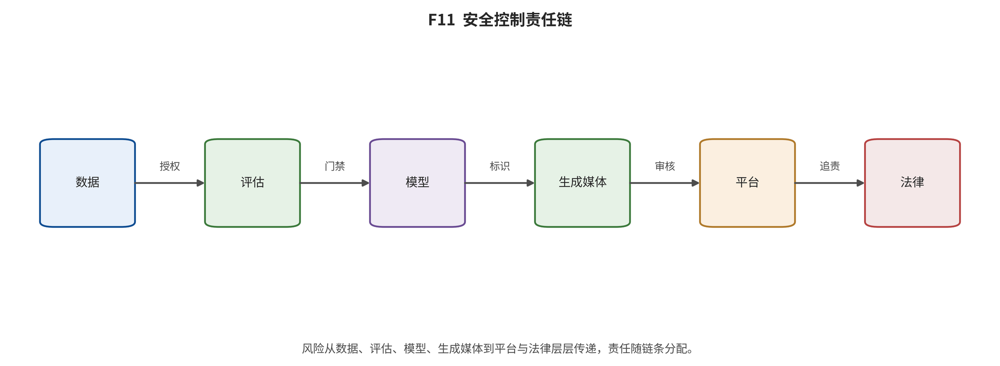

## 第 17 章 安全、版权、来源证明与社会影响

输入与问题：风险—控制矩阵中的训练语料、记忆、偏见、深度伪造、水印、来源凭据、平台与法律责任。

论证动作：沿数据、模型、生成服务、内容传播和申诉纠错链分配控制与验证，不把规范存在写成执行有效。

训练数据治理需要逐样本来源、权利基础、时间戳、删除传播和检查点谱系。数据集只分发 URL 或元数据时，其许可证不自动转移底层媒体权利；法律状态还受法域和案件事实限制，本综述不提供法律意见。

模型层风险包括记忆与近复制、隐私泄漏、代表性与偏见，以及绕过安全策略的生成。评估应区分攻击入口、受影响群体、基率、误报/漏报、人工复核和恢复，而不能用单一拒答率或演示样例估计社会危害发生率。

来源证明需要区分签名内容凭据、鲁棒水印、检测器、服务日志和平台标签。凭据缺失不等于人类创作，水印命中不证明训练合法，标准发布也不证明跨编辑器、转码和平台传递中的保留率。

**风险控制按控制层汇总；控制存在不等于执行有效。}

\begin{tabular}{lcl}

控制层 & 记录数 & 风险示例 \\

evaluation_governance & 3 & metric drift or invalid cross-paper ranking、judge bias or capability bottleneck misattributed to generator、distribution shift, population bias and reward hacking produce inflated apparent quality \\
data_governance & 2 & copyrighted material included without adequate provenance or licensing basis、privacy and biometric misuse \\
provenance & 2 & C2PA manifest stripped so provenance becomes unavailable、contradictory authenticated signals or metadata washing \\
compliance & 1 & noncompliance or misleading disclosure across generation and distribution chain \\
content_safety & 1 & non-consensual sexual imagery, impersonation, harassment \\
data_quality & 1 & hallucinated captions, demographic bias, unsafe omissions and teacher-model imprint \\
data_safety & 1 & CSAM/CSEM or other illegal harmful content enters index and training \\
human_study & 1 & position bias, rater fatigue, cultural bias, non-transitive preferences \\
legal_governance & 1 & lawsuit allegations or judgment over training, output similarity, trademark and territorial acts \\
organizational_security & 1 & deepfake identity used to authorize high-value transfer \\
platform_governance & 1 & upstream markers missing, stripped or misread; user does not disclose \\
release_governance & 1 & license misunderstood as unrestricted open source or commercial permission \\
reporting & 1 & quality dimensions and minority failure modes are hidden \\
reproducibility & 1 & current files differ from cited or tested version \\
runtime_control & 1 & motion, identity, text or detail drift from stale features \\
systems_evaluation & 1 & headline speedup fails under real workload or loses quality \\
watermark & 1 & false negative after transformation or unsupported generator; false positive near threshold \\

\end{tabular}

\end{table**

|
控制层 | 记录数 | 风险示例 |
|---|---|---|
|
evaluation_governance | 3 | metric drift or invalid cross-paper ranking、judge bias or capability bottleneck misattributed to generator、distribution shift, population bias and reward hacking produce inflated apparent quality |
| data_governance | 2 | copyrighted material included without adequate provenance or licensing basis、privacy and biometric misuse |
| provenance | 2 | C2PA manifest stripped so provenance becomes unavailable、contradictory authenticated signals or metadata washing |
| compliance | 1 | noncompliance or misleading disclosure across generation and distribution chain |
| content_safety | 1 | non-consensual sexual imagery, impersonation, harassment |
| data_quality | 1 | hallucinated captions, demographic bias, unsafe omissions and teacher-model imprint |
| data_safety | 1 | CSAM/CSEM or other illegal harmful content enters index and training |
| human_study | 1 | position bias, rater fatigue, cultural bias, non-transitive preferences |
| legal_governance | 1 | lawsuit allegations or judgment over training, output similarity, trademark and territorial acts |
| organizational_security | 1 | deepfake identity used to authorize high-value transfer |
| platform_governance | 1 | upstream markers missing, stripped or misread; user does not disclose |
| release_governance | 1 | license misunderstood as unrestricted open source or commercial permission |
| reporting | 1 | quality dimensions and minority failure modes are hidden |
| reproducibility | 1 | current files differ from cited or tested version |
| runtime_control | 1 | motion, identity, text or detail drift from stale features |
| systems_evaluation | 1 | headline speedup fails under real workload or loses quality |
| watermark | 1 | false negative after transformation or unsupported generator; false positive near threshold |
| | | |

*F11。安全—控制—责任链。每个风险必须同时记录入口、受影响方、控制层、责任方、验证方式和已知失败，不用单一水印或过滤器概括整条链。 证据边界：风险与控制条目是证据导航和验证清单，不是法律意见；“控制存在”不证明执行有效或风险已消除。*

综合判断：有效治理依赖数据、模型、凭据、平台和组织纠错的组合控制；任何单层都不能同时证明真实性、合法性和安全。

证据边界：矩阵记录控制设计与已知失败，不测发生率或执行效果；政策和诉讼条目具有时间与法域边界。

转场：第 18 章以发生日、公告日、报道日和证据类型组织产业与新闻快照。

### 风险—控制—责任审计索引

- ECO-R001｜资产 training_corpus｜入口 web crawl and URL index｜风险 copyrighted material included without adequate provenance or licensing basis｜受影响方 rights holders; model developers; downstream deployers｜控制 retain source URL/license/timestamp; rights-basis field; takedown channel; deletion propagation; jurisdiction review｜责任 dataset curator and model developer｜验证 sample-level provenance audit; removal SLA; checkpoint lineage｜已知失败 metadata license does not transfer underlying-media rights｜状态 open_control_gap [@src_s_ext_e21d4fdc23640b7f; @src_s_ext_c32738ba82a67d01; @src_s_ext_8931ca2bc2a2df46; @src_s_ext_5d3ee9b7c90010d4; @src_s_ext_6584f6bb78a0e4bc]
- ECO-R002｜资产 training_corpus｜入口 large-scale web ingestion｜风险 CSAM/CSEM or other illegal harmful content enters index and training｜受影响方 children; victims; curators; developers｜控制 trusted hash lists; perceptual matching; human escalation; quarantine; periodic rescans; model/version deletion ledger｜责任 curator; developer; specialist safety organizations｜验证 independent red-team sampling; known-hash coverage; false-negative audit; documented re-release diff｜已知失败 known hashes cannot prove absence of unseen or transformed content｜状态 partially_mitigated [@src_s_ext_a71e52f7d74db2c8; @src_s_ext_813aaade7ed9b752; @src_s_ext_a322cc3b396554b6]
- ECO-R003｜资产 training_corpus｜入口 face and person image collection｜风险 privacy and biometric misuse｜受影响方 data subjects｜控制 purpose limitation; consent/rights assessment; biometric prohibition; access controls; deletion request｜责任 curator and deployer｜验证 dataset-card compliance audit; downstream-use review｜已知失败 open download can enable uses outside intended purpose｜状态 control_present_with_enforcement_gap [@src_s_ext_2e0206c9bfbf134e]
- ECO-R004｜资产 training_corpus｜入口 machine captioning and filtering｜风险 hallucinated captions, demographic bias, unsafe omissions and teacher-model imprint｜受影响方 model users; represented groups｜控制 store raw and generated fields separately; caption-model/version; confidence; human stratified audit; error tags｜责任 dataset curator｜验证 audited sample by language/domain/demographic; inter-annotator agreement｜已知失败 teacher errors can be amplified at scale and are correlated｜状态 open_control_gap [@src_s_ext_3baa8d3a6825c19d; @src_s_ext_aad92459dff9dad3; @src_s_arxiv_2407_02371; @src_s_ext_d8a85afa9f84a924]
- ECO-R005｜资产 evaluation｜入口 FID/KID/FVD computation｜风险 metric drift or invalid cross-paper ranking｜受影响方 research readers and developers｜控制 executable metric manifest; hashes for extractor/data split; fixed sample counts; uncertainty; no cross-protocol ranking｜责任 benchmark maintainer and paper author｜验证 recompute fixture; schema check; known-reference regression｜已知失败 same metric name can hide incompatible implementations｜状态 required [@src_s_ext_f13a72e436c93975; @src_s_ext_55391d95358da2e0; @src_s_ext_cdc5919a22f406ea]
- ECO-R006｜资产 evaluation｜入口 CLIP/VQA/MLLM automated judge｜风险 judge bias or capability bottleneck misattributed to generator｜受影响方 model developers and users｜控制 judge ensemble only if predeclared; fixed versions; adversarial judge audit; human spot-check; disagreement report｜责任 benchmark maintainer｜验证 held-out human correlation by category; judge failure taxonomy｜已知失败 new generators may exploit or fall outside judge distribution｜状态 partially_mitigated [@src_s_ext_1610191ec47a137a; @src_s_ext_2da47e6f77711c51; @src_s_ext_886b46db89300b7c; @src_s_ext_ca220ee450d111b2; @src_s_ext_1bdc47e96f4aa885]
- ECO-R007｜资产 evaluation｜入口 single aggregate score｜风险 quality dimensions and minority failure modes are hidden｜受影响方 users and affected groups｜控制 publish raw dimension vector; prompt strata; worst-group results; Pareto view; preregister aggregation｜责任 paper author and reviewer｜验证 table/figure contract validation; aggregation sensitivity analysis｜已知失败 weights encode value judgments and can reverse ordering｜状态 required [@src_s_ext_41ef49de30ab0c93; @src_s_ext_ada443910805e939; @src_s_ext_0ced8660dbcb0990; @src_s_ext_886b46db89300b7c]
- ECO-R008｜资产 human_evaluation｜入口 pairwise or Likert study｜风险 position bias, rater fatigue, cultural bias, non-transitive preferences｜受影响方 participants and research readers｜控制 blind/randomize; allow ties; repeat anchors; report rater population; reliability; CI; compensation and consent｜责任 study owner and ethics reviewer｜验证 attention checks; repeated-item agreement; Bradley-Terry diagnostics; subgroup analysis｜已知失败 large sample does not fix ambiguous rubric or sampling bias｜状态 required [@src_s_ext_d92935b612a4c23a]
- ECO-R009｜资产 inference_service｜入口 few-step, cache, parallel, quantized acceleration｜风险 headline speedup fails under real workload or loses quality｜受影响方 operators and users｜控制 end-to-end benchmark contract; p50/p95; failures; warm/cold; concurrency; power; paired quality acceptance｜责任 system developer and operator｜验证 replay fixed prompts/seeds; trace stages; compare accepted-output cost｜已知失败 kernel/NFE gains can be dominated by decoder, transfer, queue or retries｜状态 required [@src_s_ext_13736dc1c9b1994c; @src_s_ext_82285d355bc15510; @src_s_ext_98ddce99618b4027; @src_s_ext_4f224d03e281827c; @src_s_ext_fe29d7e2334824e7; @src_s_ext_caf93eb5901acc77]
- ECO-R010｜资产 inference_service｜入口 cache reuse｜风险 motion, identity, text or detail drift from stale features｜受影响方 content creators and downstream users｜控制 adaptive thresholds; scene-change detection; periodic refresh; task-specific quality gates; fallback path｜责任 method author and operator｜验证 per-frame/per-object drift metrics plus blind human review｜已知失败 aggregate FVD/CLIP may miss localized temporal errors｜状态 partially_mitigated [@src_s_ext_82285d355bc15510; @src_s_ext_98ddce99618b4027; @src_s_ext_9034ed5341b82826; @src_s_ext_8b66a4dc7b04db0d]
- ECO-R011｜资产 open_model_release｜入口 weights and code publication｜风险 license misunderstood as unrestricted open source or commercial permission｜受影响方 developers and organizations｜控制 artifact-level license inventory; SPDX when valid; revenue/region/use restrictions; dependency and derivative-work review｜责任 model publisher and adopter｜验证 license hash; model-card snapshot; legal review for deployment｜已知失败 code license and checkpoint license may differ｜状态 required [@src_s_ext_3c44be280a6c9e15; @src_s_ext_06d2114e2823654c; @src_s_ext_49fc67fa3d5b229b; @src_s_ext_3377b81d395d3de7; @src_s_ext_3c4d37cf1a6a49cd]
- ECO-R012｜资产 open_model_release｜入口 mutable Git/HF repositories｜风险 current files differ from cited or tested version｜受影响方 researchers and operators｜控制 pin commit/revision; hash weights/config/license; archive README and environment lock｜责任 researcher and maintainer｜验证 fresh clone/checksum test; provenance manifest｜已知失败 main-branch presence is not proof that old checkpoint still works｜状态 required [@src_s_ext_839f5acdc65fd3f7; @src_s_ext_4460f5dc2a2e30b2; @src_s_ext_bde1adbe087b0baa]
- ECO-R013｜资产 generated_media｜入口 file export and platform re-encoding｜风险 C2PA manifest stripped so provenance becomes unavailable｜受影响方 viewers; publishers; investigators｜控制 preserve embedded manifest; external manifest repository; soft binding; platform pass-through tests; show unknown state｜责任 generator; editor; platform; verifier｜验证 round-trip test across each platform; validator logs; trust-list version｜已知失败 absence of credential cannot prove content is human-made｜状态 partially_mitigated [@src_s_ext_e0ffa9f133ce7fc3; @src_s_ext_52d0dd2ef128f371; @src_s_ext_615ff3cb7e5bf360]
- ECO-R014｜资产 generated_media｜入口 watermark and provenance checked independently｜风险 contradictory authenticated signals or metadata washing｜受影响方 viewers and investigators｜控制 joint policy engine; bind watermark assertion in signed provenance; preserve raw detector scores; escalate conflicts｜责任 generator and verifier vendors｜验证 red-team edit pipelines; conflict matrix; human forensic review｜已知失败 two valid-looking layers can still describe incompatible histories｜状态 open_research_gap [@src_s_ext_9f2a5c76c58bb158]
- ECO-R015｜资产 generated_media｜入口 invisible watermark detection｜风险 false negative after transformation or unsupported generator; false positive near threshold｜受影响方 creators; platforms; viewers｜控制 combine visible label, signed provenance, watermark, account/service logs; calibrate thresholds; publish scope｜责任 model provider and platform｜验证 transform suite; ROC by media type; unsupported-source state｜已知失败 watermark is not universal detector and can be damaged or absent｜状态 partially_mitigated [@src_s_ext_03a8a1262c665625]
- ECO-R016｜资产 generated_media｜入口 real-person reference or likeness upload｜风险 non-consensual sexual imagery, impersonation, harassment｜受影响方 depicted persons｜控制 consent verification; adult/age safeguards; public-figure and sexual-content blocks; rapid hash matching; victim notice/takedown｜责任 generator provider and platform｜验证 red-team policy bypass; response-time audit; victim-centered appeal metrics｜已知失败 generator attribution may remain unknown; open pipelines can omit provider controls｜状态 open_control_gap [@src_s_ext_661a3476d3d51bb4; @src_s_ext_724cb3e9025c287d; @src_s_ext_e10e575afc4c5f3c]
- ECO-R017｜资产 communications_and_payments｜入口 video meeting approval｜风险 deepfake identity used to authorize high-value transfer｜受影响方 employees; organizations; customers｜控制 out-of-band callback; hardware-backed identity; transaction thresholds; two-person approval; delay and anomaly detection｜责任 employer; bank; communications platform｜验证 tabletop exercise; simulated deepfake call; approval-log audit｜已知失败 visual familiarity and voice alone are weak authentication｜状态 actionable [@src_s_ext_49a83cb0a82fcf79; @src_s_ext_632bd1bb7c1c71d1]
- ECO-R018｜资产 distribution_platform｜入口 AI label ingestion and display｜风险 upstream markers missing, stripped or misread; user does not disclose｜受影响方 viewers and affected persons｜控制 multi-signal ingest; user disclosure; policy enforcement; fact-check escalation; preserve labels across transforms｜责任 platform｜验证 known-positive/negative fixture; cross-upload round trip; appeal/error statistics｜已知失败 platform labels can over- or under-apply and may not survive reposting｜状态 partially_mitigated [@src_s_ext_e57798b9027c40ed; @src_s_ext_52d0dd2ef128f371]
- ECO-R019｜资产 regulatory_compliance｜入口 China/EU machine-readable and visible labeling｜风险 noncompliance or misleading disclosure across generation and distribution chain｜受影响方 users; providers; deployers; platforms｜控制 jurisdiction matrix; dual-layer labels; metadata preservation; deployer notices; audit log; change management｜责任 provider; deployer; platform｜验证 pre-release legal mapping; automated file/UI test; platform round trip; retained evidence｜已知失败 one technical standard may not satisfy every legal requirement or exception｜状态 required [@src_s_ext_c03f6cc2696d90aa; @src_s_ext_43dbe36dfbe6e288; @src_s_ext_402803ae8da90ab8]
- ECO-R020｜资产 copyright_and_training｜入口 model release and output service｜风险 lawsuit allegations or judgment over training, output similarity, trademark and territorial acts｜受影响方 rights holders; developers; users｜控制 licensed datasets; opt-out/takedown; memorization tests; output similarity guardrails; litigation hold; legal review｜责任 developer and deployer｜验证 dataset ledger; canary/memorization audit; complaint tracking; jurisdiction-specific counsel｜已知失败 no single case resolves all training and output questions｜状态 open_legal_uncertainty [@src_s_ext_6584f6bb78a0e4bc; @src_s_ext_d69aa51c5b39e5ea; @src_s_ext_1bf67a1ae824bb99; @src_s_ext_365ab6d86ca889fb; @src_s_ext_48da7c84540ba04d]
- ECO-R021｜资产 evaluation｜入口 learned preference scorer used for evaluation or optimization｜风险 distribution shift, population bias and reward hacking produce inflated apparent quality｜受影响方 users; benchmark readers; model developers｜控制 freeze scorer/data versions; stratify by model and prompt domain; reserve secret human-evaluated holdout; monitor disagreement; prohibit scorer-only release gates｜责任 benchmark maintainer and model developer｜验证 pre-registered blind pairwise study; subgroup calibration; adversarial optimization test; score-human disagreement report｜已知失败 high scorer value can reflect exploitation of the learned judge rather than broader human preference｜状态 required [@src_s_ext_463d2c341c7ad7d0; @src_s_ext_96452f21157f1b23; @src_s_ext_74fbe248ebdc6108; @src_s_arxiv_2306_09341]

---

[← 返回目录](index.md)
