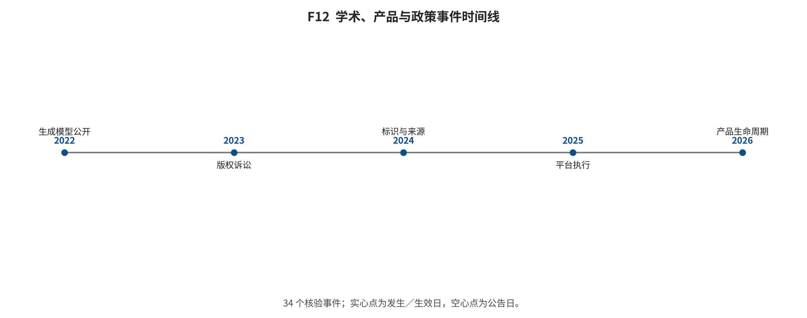

## 第 18 章 产业、开源生态与新闻时间线

输入与问题：34 条模型、产品、开源、可用性、政策与事故事件卡及其官方/独立来源。

论证动作：分别记录发生、公告和报道日期，限制闭源结论，并把新闻用于生态解释而非算法排名。

事件单位是“事件—官方版本—发生日—证据类型”。发布日期可能晚于实际发生，独立报道也可能只确认外部影响；三者不能互相填补。官方页面可核规格和条款，但不能独立证明市场效果、训练架构或比较性能。

**事件按类型汇总；发生数量不是采用率、影响率或因果证据。}

|
事件类型 | 记录数 | 示例 |
|---|---|---|
|
product_release | 9 | Sora Turbo 面向订阅用户发布、Sora 2 发布并上线社交应用、GPT-4o 原生图像生成上线 |
| open_release | 4 | Wan2.1 代码与权重发布、Wan2.2 代码与权重发布、Stable Diffusion 3.5 系列开放发布 |
| policy_effective | 3 | 中国生成合成内容标识办法施行、AB 2013 训练数据披露期限到达、欧盟 AI Act Article 50 透明度义务开始适用 |
| policy_guidance | 2 | 欧盟发布 AI 生成内容标记与标签行为准则、欧盟发布 Article 50 透明度指南 |
| policy_report | 2 | 美国版权局发布 AI 输出可版权性报告 Part 2、美国版权局发布生成式 AI 训练报告 Part 3 预发布版 |
| technical_release | 2 | Movie Gen 技术报告公开、Seedance 1.0 技术报告公开 |
| abuse_incident | 1 | 非自愿合成私密图像在 X 大规模传播 |
| availability_change | 1 | Sora 网页与 App 停止服务 |
| copyright_dispute | 1 | Seedance 2.0 引发好莱坞版权争议 |
| copyright_judgment | 1 | 英国高等法院 Getty v Stability AI 判决发布 |
| copyright_litigation | 1 | Disney 与 Universal 起诉 Midjourney |
| fraud_incident | 1 | 香港深伪视频会议转账诈骗曝光 |
| incident_and_availability | 1 | LAION-5B 因安全审查暂时下线 |
| policy_enactment | 1 | 加州 AB 2013 获州长批准 |
| policy_publication | 1 | 中国生成合成内容标识办法发布 |
| product_update | 1 | Veo 3.1 增加竖屏与高清输出路径 |
| remediation_release | 1 | Re-LAION-5B 发布并移除已知问题哈希 |
| standard_release | 1 | C2PA 2.4 规范发布 |
| | | |

*F12。学术、产品、政策、法律与事件时间线。34个事件按发生/生效日定位；若公告日不同，以空心点和虚线显示。事件样本不是全量新闻流，不可从点的密度推断发生率或因果。 证据边界：事件清单为主题相关、来源核验的目的抽样，不是系统全量新闻数据；不报发生率、风险率或因果效应。*

综合判断：事件表显示开放权重、闭源产品、可用性变化和治理基础设施并行演进，但只形成截止日快照。

证据边界：事件数量不是采用率、事故率或因果证据；没有独立来源的条目只支持官方自述层结论。

转场：第 19 章把机制、时间、系统、开放性和风险转换为条件化选型。

### 34 条事件的日期与来源审计索引

- ECO-E029｜LAION-5B 因安全审查暂时下线｜发生 2023-12-19｜公告 2023-12-19｜报道 2023-12-20｜机构 LAION｜版本 LAION-5B｜类型 incident_and_availability｜公开技术 收到疑似 CSAM 链接研究报告后暂时移除数据集并启动安全审查｜披露层级 official_response_without_full_independent_forensics｜可用性 temporarily unavailable at event time｜官方来源 S_EXT_813AAADE7ED9B752｜独立来源 S_EXT_A322CC3B396554B6｜影响结论上限 暴露超大规模网页索引的内容治理、删除和审计能力缺口｜置信 high [@src_s_ext_813aaade7ed9b752; @src_s_ext_a322cc3b396554b6]
- ECO-E031｜非自愿合成私密图像在 X 大规模传播｜发生 2024-01-25｜公告 2024-01-25｜报道 2024-01-29｜机构 unknown creators and X｜版本 NA｜类型 abuse_incident｜公开技术 涉及 Taylor Swift 的合成露骨图像传播；X 临时限制相关搜索｜披露层级 harm_event_and_platform_response_without_generator_attribution｜可用性 harmful content removed/limited after spread｜官方来源 无｜独立来源 S_EXT_E10E575AFC4C5F3C｜影响结论上限 显示生成防护、平台检测、快速下架和受害者救济需共同作用；无法可靠归因到单一模型｜置信 high [@src_s_ext_e10e575afc4c5f3c]
- ECO-E032｜香港深伪视频会议转账诈骗曝光｜发生 2024-02-02｜公告 2024-02-04｜报道 2024-02-05｜机构 fraud actors; Hong Kong Police investigation｜版本 NA｜类型 fraud_incident｜公开技术 员工被预录深伪视频会议欺骗，个案报道损失 HKD 200 million｜披露层级 incident_summary_without_tool_attribution｜可用性 criminal investigation and prevention guidance｜官方来源 S_EXT_49A83CB0A82FCF79｜独立来源 S_EXT_632BD1BB7C1C71D1｜影响结论上限 证明活体视频外观不足以完成高额付款授权；应采用带外复核和多人审批｜置信 medium_high [@src_s_ext_49a83cb0a82fcf79; @src_s_ext_632bd1bb7c1c71d1]
- ECO-E030｜Re-LAION-5B 发布并移除已知问题哈希｜发生 2024-08-30｜公告 2024-08-30｜报道 2024-08-30｜机构 LAION｜版本 Re-LAION-5B｜类型 remediation_release｜公开技术 与 IWF/C3P 合作并覆盖 Stanford 报告的 1,008 条疑似链接｜披露层级 official_filtering_process｜可用性 available variants｜官方来源 S_EXT_A71E52F7D74DB2C8｜独立来源 S_EXT_A322CC3B396554B6｜影响结论上限 是可审计迭代而非零风险证明；后续仍需持续删除与重扫｜置信 medium_high [@src_s_ext_a71e52f7d74db2c8; @src_s_ext_a322cc3b396554b6]
- ECO-E021｜加州 AB 2013 获州长批准｜发生 2024-09-28｜公告 2024-09-28｜报道 2024-09-30｜机构 State of California｜版本 AB 2013｜类型 policy_enactment｜公开技术 要求面向加州公众的生成式 AI 开发者披露训练数据高层摘要｜披露层级 full_bill_text｜可用性 enacted; disclosure deadline 2026-01-01｜官方来源 S_EXT_5D3EE9B7C90010D4｜独立来源 无｜影响结论上限 提高数据来源、权利类型、清洗与合成数据使用的文档责任；不是逐样本披露｜置信 high [@src_s_ext_5d3ee9b7c90010d4]
- ECO-E010｜Movie Gen 技术报告公开｜发生 2024-10-16｜公告 2024-10-16｜报道 2024-10-16｜机构 Meta｜版本 Movie Gen｜类型 technical_release｜公开技术 30B 视频模型、最长 16 秒、16 fps、1080p，同步音频、个性化和编辑｜披露层级 technical_report_without_code_or_weights｜可用性 research demos; no public complete model｜官方来源 S_EXT_629F563E4913E713｜独立来源 无｜影响结论上限 提供较多技术披露但不可独立运行；不能将人评主张与异协议系统排名｜置信 high [@src_s_ext_629f563e4913e713]
- ECO-E013｜Stable Diffusion 3.5 系列开放发布｜发生 2024-10-22｜公告 2024-10-22｜报道 2024-10-22｜机构 Stability AI｜版本 SD3.5 Large/Large Turbo｜类型 open_release｜公开技术 公开权重和推理代码；Turbo 为 4 步；Medium 于 10 月 29 日补发｜披露层级 weights_code_license_and_selected_hardware｜可用性 downloadable weights and hosted APIs｜官方来源 S_EXT_06D2114E2823654C｜独立来源 无｜影响结论上限 开放权重但非无条件开源；厂商跨模型比较不进入本综述排名｜置信 high [@src_s_ext_06d2114e2823654c]
- ECO-E001｜Sora Turbo 面向订阅用户发布｜发生 2024-12-09｜公告 2024-12-09｜报道 2024-12-09｜机构 OpenAI｜版本 Sora Turbo｜类型 product_release｜公开技术 最高 1080p、最长 20 秒、支持文本/图像/视频入口；所有生成视频含 C2PA，默认可见水印｜披露层级 product_features_and_limits_only｜可用性 2026-04-26 起网页和 App 已停止；发布时为 Plus/Pro 服务｜官方来源 S_EXT_2D134659D4DE90AF｜独立来源 无｜影响结论上限 把研究预览转为消费服务；不证明世界模型或物理理解达到通用水平｜置信 high [@src_s_ext_2d134659d4de90af]
- ECO-E023｜美国版权局发布 AI 输出可版权性报告 Part 2｜发生 2025-01-29｜公告 2025-01-29｜报道 2025-01-29｜机构 U.S. Copyright Office｜版本 Copyright and AI Part 2｜类型 policy_report｜公开技术 分析生成式 AI 输出可版权性和人类作者贡献｜披露层级 official_report｜可用性 public report｜官方来源 S_EXT_6584F6BB78A0E4BC｜独立来源 无｜影响结论上限 支持按人类创作贡献而非工具标签判断；不替代个案法院判决｜置信 high [@src_s_ext_6584f6bb78a0e4bc]
- ECO-E009｜Adobe Firefly Video Model 公测发布｜发生 2025-02-12｜公告 2025-02-12｜报道 2025-02-12｜机构 Adobe｜版本 Firefly Video Model｜类型 product_release｜公开技术 视频生成与 Creative Cloud 工作流；Adobe 称 commercially safe｜披露层级 product_and_data_positioning｜可用性 closed service｜官方来源 S_EXT_F1084EA3E8588058｜独立来源 无｜影响结论上限 权利来源成为差异化产品主张；commercially safe 不等于法律保证｜置信 medium_high [@src_s_ext_f1084ea3e8588058]
- ECO-E011｜Wan2.1 代码与权重发布｜发生 2025-02-25｜公告 2025-02-25｜报道 2025-02-25｜机构 Wan Team｜版本 Wan2.1｜类型 open_release｜公开技术 T2V/I2V 多规格；1.3B README 报告 RTX 4090 生成 5 秒 480p 约 4 分钟｜披露层级 code_weights_commands_and_hardware_example｜可用性 public repository and checkpoints｜官方来源 S_EXT_839F5ACDC65FD3F7｜独立来源 无｜影响结论上限 提供可执行开放基线；厂商 benchmark 和硬件例子仍需独立复测｜置信 high [@src_s_ext_839f5acdc65fd3f7]
- ECO-E019｜中国生成合成内容标识办法发布｜发生 2025-03-14｜公告 2025-03-14｜报道 2025-03-14｜机构 国家网信办等四部门｜版本 NA｜类型 policy_publication｜公开技术 规定显式与隐式标识、传播平台责任和禁止恶意删除篡改｜披露层级 full_official_notice_and_linked_rule｜可用性 published; not yet effective on publication date｜官方来源 S_EXT_C03F6CC2696D90AA｜独立来源 无｜影响结论上限 治理对象从生成端延伸到传播端和用户篡改行为｜置信 high [@src_s_ext_c03f6cc2696d90aa]
- ECO-E004｜GPT-4o 原生图像生成上线｜发生 2025-03-25｜公告 2025-03-25｜报道 2025-03-25｜机构 OpenAI｜版本 GPT-4o image generation｜类型 product_release｜公开技术 在 ChatGPT 原生生成/编辑图像并加入 C2PA 元数据｜披露层级 product_release_plus_system_card｜可用性 closed service｜官方来源 S_EXT_389AB448B1904BC0；S_EXT_5223FE491EE43B1C｜独立来源 无｜影响结论上限 把文本渲染、对话式编辑与来源标记纳入统一产品；质量主张仍为官方评测｜置信 medium_high [@src_s_ext_389ab448b1904bc0; @src_s_ext_5223fe491ee43b1c]
- ECO-E024｜美国版权局发布生成式 AI 训练报告 Part 3 预发布版｜发生 2025-05-09｜公告 2025-05-09｜报道 2025-05-09｜机构 U.S. Copyright Office｜版本 Copyright and AI Part 3 pre-publication｜类型 policy_report｜公开技术 分析训练使用版权材料的法律与政策问题｜披露层级 official_prepublication_report｜可用性 public pre-publication report｜官方来源 S_EXT_6584F6BB78A0E4BC｜独立来源 无｜影响结论上限 为许可、例外和市场影响提供政策背景；不能简化为训练一概合法或违法｜置信 high [@src_s_ext_6584f6bb78a0e4bc]
- ECO-E005｜Veo 3 与 Flow 发布｜发生 2025-05-20｜公告 2025-05-20｜报道 2025-05-20｜机构 Google｜版本 Veo 3｜类型 product_release｜公开技术 视频生成带原生音频；Flow 提供电影制作工作流｜披露层级 product_features_only｜可用性 closed service via named Google products｜官方来源 S_EXT_4914C72C16A5ED4B｜独立来源 无｜影响结论上限 音视频一体化进入主流闭源视频产品；不公开权重或训练数据｜置信 medium_high [@src_s_ext_4914c72c16a5ed4b]
- ECO-E014｜Seedance 1.0 技术报告公开｜发生 2025-06-11｜公告 2025-06-11｜报道 2025-06-11｜机构 ByteDance Seed｜版本 Seedance 1.0｜类型 technical_release｜公开技术 公开文本到视频系统技术报告｜披露层级 technical_report_without_weights｜可用性 paper/report public; service availability separate｜官方来源 S_EXT_4BD7BA572ABD70D0｜独立来源 无｜影响结论上限 技术披露增加但仍不能复现完整闭源训练/推理栈｜置信 high [@src_s_ext_4bd7ba572abd70d0]
- ECO-E033｜Disney 与 Universal 起诉 Midjourney｜发生 2025-06-11｜公告 2025-06-11｜报道 2025-06-11｜机构 Disney; Universal; Midjourney｜版本 Midjourney｜类型 copyright_litigation｜公开技术 原告指控训练和输出侵犯受保护角色版权并请求救济｜披露层级 complaint_and_docket_not_final_judgment｜可用性 case pending in retained evidence｜官方来源 S_EXT_D69AA51C5B39E5EA｜独立来源 S_EXT_1BF67A1AE824BB99｜影响结论上限 事件证明版权方执法压力；不能写成法院已认定 Midjourney 侵权｜置信 high [@src_s_ext_d69aa51c5b39e5ea; @src_s_ext_1bf67a1ae824bb99]
- ECO-E012｜Wan2.2 代码与权重发布｜发生 2025-07-28｜公告 2025-07-28｜报道 2025-07-28｜机构 Wan Team｜版本 Wan2.2｜类型 open_release｜公开技术 MoE T2V-A14B 与高压缩 TI2V-5B；480p/720p；24 fps 输出选项｜披露层级 code_weights_commands_hardware_requirements｜可用性 public repository and checkpoints｜官方来源 S_EXT_4460F5DC2A2E30B2｜独立来源 无｜影响结论上限 扩展开放视频生态；T2V-A14B 单卡示例至少 80 GiB，不能笼统称消费级｜置信 high [@src_s_ext_4460f5dc2a2e30b2]
- ECO-E020｜中国生成合成内容标识办法施行｜发生 2025-09-01｜公告 2025-03-14｜报道 2025-09-01｜机构 国家网信办等四部门｜版本 NA｜类型 policy_effective｜公开技术 办法与强制性国家标准同步施行｜披露层级 full_official_notice_and_linked_standard｜可用性 effective｜官方来源 S_EXT_C03F6CC2696D90AA｜独立来源 无｜影响结论上限 部署需同时实现界面显式标识和文件元数据隐式标识，并记录平台编码｜置信 high [@src_s_ext_c03f6cc2696d90aa]
- ECO-E002｜Sora 2 发布并上线社交应用｜发生 2025-09-30｜公告 2025-09-30｜报道 2025-09-30｜机构 OpenAI｜版本 Sora 2｜类型 product_release｜公开技术 同步对话/音效、角色肖像录入、多镜头可控性；厂商称物理性提升｜披露层级 product_and_safety_disclosure_without_weights｜可用性 发布时邀请制；截至 2026-04-26 网页/App 已停止｜官方来源 S_EXT_661A3476D3D51BB4｜独立来源 无｜影响结论上限 推动音视频一体化和肖像许可成为产品功能；影响判断限于官方发布｜置信 medium_high [@src_s_ext_661a3476d3d51bb4]
- ECO-E006｜Veo 3.1 发布｜发生 2025-10-15｜公告 2025-10-15｜报道 2025-10-15｜机构 Google｜版本 Veo 3.1｜类型 product_release｜公开技术 更新参考输入、编辑和音视频生成能力｜披露层级 product_features_only｜可用性 closed service; endpoint-specific｜官方来源 S_EXT_C59CBD3DCF25D3C8｜独立来源 无｜影响结论上限 版本快速迭代使静态排行榜过期风险增加｜置信 medium [@src_s_ext_c59cbd3dcf25d3c8]
- ECO-E034｜英国高等法院 Getty v Stability AI 判决发布｜发生 2025-11-04｜公告 2025-11-04｜报道 2025-11-04｜机构 Getty Images; Stability AI｜版本 Stable Diffusion｜类型 copyright_judgment｜公开技术 判决处理英国商标与部分版权请求；结论受具体诉讼请求、证据和地域限制｜披露层级 full_judgment｜可用性 judgment public｜官方来源 S_EXT_365AB6D86CA889FB｜独立来源 S_EXT_48DA7C84540BA04D｜影响结论上限 不应概括为生成模型训练在英国全面合法；影响是暴露现行法与训练地点证据的复杂性｜置信 high [@src_s_ext_365ab6d86ca889fb; @src_s_ext_48da7c84540ba04d]
- ECO-E008｜Runway Gen-4.5 发布｜发生 2025-12-01｜公告 2025-12-01｜报道 2025-12-01｜机构 Runway｜版本 Gen-4.5｜类型 product_release｜公开技术 闭源视频模型能力演示和研究页披露｜披露层级 demo_and_high_level_release｜可用性 closed service｜官方来源 S_EXT_F9A73D8D68254059｜独立来源 无｜影响结论上限 作为产品版本事件纳入；没有权重和端到端可复现证据｜置信 medium [@src_s_ext_f9a73d8d68254059]
- ECO-E022｜AB 2013 训练数据披露期限到达｜发生 2026-01-01｜公告 2024-09-28｜报道 2026-01-01｜机构 State of California｜版本 AB 2013｜类型 policy_effective｜公开技术 针对 2022-01-01 以来公开系统，在上线或重大更新前发布法定高层数据文档｜披露层级 full_bill_text｜可用性 effective for covered systems｜官方来源 S_EXT_5D3EE9B7C90010D4｜独立来源 无｜影响结论上限 为开放和闭源系统建立最低披露清单；具体合规需法律审查｜置信 high [@src_s_ext_5d3ee9b7c90010d4]
- ECO-E007｜Veo 3.1 增加竖屏与高清输出路径｜发生 2026-01-13｜公告 2026-01-13｜报道 2026-01-13｜机构 Google｜版本 Veo 3.1｜类型 product_update｜公开技术 竖屏、1080p 以及 4K 升级路径；继续使用 SynthID｜披露层级 product_features_and_provenance｜可用性 closed service; availability varies by product｜官方来源 S_EXT_8DC07480AB081FA9｜独立来源 无｜影响结论上限 输出规格必须区分原生生成与升级；SynthID 仅覆盖支持的 Google 输出｜置信 high [@src_s_ext_8dc07480ab081fa9]
- ECO-E017｜Kling AI 3.0 发布｜发生 2026-02-05｜公告 2026-02-05｜报道 2026-02-05｜机构 Kuaishou｜版本 Kling AI 3.0｜类型 product_release｜公开技术 Video 3.0/Omni/Image 3.0/Omni；最长 15 秒和原生多语音频为公告主张｜披露层级 corporate_product_announcement｜可用性 closed service; quotas and regions require live check｜官方来源 S_EXT_EFFDB7B60B6799E6｜独立来源 无｜影响结论上限 产品进入多模态统一创作阶段；未开放权重和训练数据｜置信 medium_high [@src_s_ext_effdb7b60b6799e6]
- ECO-E015｜Seedance 2.0 发布｜发生 2026-02-12｜公告 2026-02-12｜报道 2026-02-12｜机构 ByteDance Seed｜版本 Seedance 2.0｜类型 product_release｜公开技术 多模态参考、编辑、续写、双声道音频；页面披露细节稳定性和偶发音频失真仍需改进｜披露层级 product_features_limitations_and_demo_evaluation｜可用性 closed service｜官方来源 S_EXT_724CB3E9025C287D｜独立来源 无｜影响结论上限 音视频和编辑统一；性能对比只能标为厂商自述｜置信 high [@src_s_ext_724cb3e9025c287d]
- ECO-E016｜Seedance 2.0 引发好莱坞版权争议｜发生 2026-02-15｜公告 2026-02-15｜报道 2026-02-15｜机构 MPA members and ByteDance｜版本 Seedance 2.0｜类型 copyright_dispute｜公开技术 权利方批评演示涉及受保护角色；属于争议和主张｜披露层级 no_architecture_disclosure｜可用性 service remained subject to provider controls at report time｜官方来源 无｜独立来源 S_EXT_41DCE625EBEC1211｜影响结论上限 证明外部版权压力而非已裁判侵权；需跟踪后续程序和产品控制｜置信 medium [@src_s_ext_41dce625ebec1211]
- ECO-E028｜C2PA 2.4 规范发布｜发生 2026-04-01｜公告 2026-04-01｜报道 2026-04-01｜机构 C2PA｜版本 C2PA 2.4｜类型 standard_release｜公开技术 提供 Content Credentials、crJSON、attestations、soft binding 与安全考虑文档；官方仅披露 2026 年 4 月，日期按当月首日编码｜披露层级 full_public_specification_month_precision｜可用性 public specification and validators ecosystem｜官方来源 S_EXT_E0FFA9F133CE7FC3；S_EXT_52D0DD2EF128F371｜独立来源 S_EXT_615FF3CB7E5BF360；S_EXT_9F2A5C76C58BB158｜影响结论上限 增强媒体来源链的可验证性，但标准明确存在剥离/可用性威胁，独立研究还指出跨层矛盾｜置信 high [@src_s_ext_e0ffa9f133ce7fc3; @src_s_ext_52d0dd2ef128f371; @src_s_ext_615ff3cb7e5bf360; @src_s_ext_9f2a5c76c58bb158]
- ECO-E003｜Sora 网页与 App 停止服务｜发生 2026-04-26｜公告 2026-04-26｜报道 2026-07-30｜机构 OpenAI｜版本 Sora/Sora 2｜类型 availability_change｜公开技术 停止网页和 App；帮助页称 API 计划于 2026-09-24 停止｜披露层级 availability_and_data_export_notice｜可用性 web/app unavailable; API scheduled for future sunset as of cutoff｜官方来源 S_EXT_4D8DC7C1BCF322D1｜独立来源 无｜影响结论上限 说明产品可用性与论文/模型能力是独立维度；未来 API 日期不记为已完成｜置信 high [@src_s_ext_4d8dc7c1bcf322d1]
- ECO-E018｜Cosmos 3 开放研究发布｜发生 2026-06-01｜公告 2026-06-01｜报道 2026-06-01｜机构 NVIDIA｜版本 Cosmos 3｜类型 open_release｜公开技术 统一覆盖图像、音视频、推理、机器人策略与动力学；提供技术报告、模型卡和代码链接｜披露层级 technical_report_code_and_model_cards｜可用性 open model artifacts through official links｜官方来源 S_EXT_0AA0FA2DE9F38B24｜独立来源 S_EXT_129B2C193F5B258E｜影响结论上限 显示生成模型与 Physical AI 接轨；厂商 rank-1 摘要不作跨协议结论｜置信 high [@src_s_ext_0aa0fa2de9f38b24; @src_s_ext_129b2c193f5b258e]
- ECO-E025｜欧盟发布 AI 生成内容标记与标签行为准则｜发生 2026-06-10｜公告 2026-06-10｜报道 2026-06-10｜机构 European Commission｜版本 Article 50 Code of Practice｜类型 policy_guidance｜公开技术 发布帮助提供者和部署者履行 Article 50 的最终自愿准则｜披露层级 official_voluntary_code｜可用性 published; voluntary｜官方来源 S_EXT_402803AE8DA90AB8｜独立来源 无｜影响结论上限 提供实施路径但不替代法定义务｜置信 high [@src_s_ext_402803ae8da90ab8]
- ECO-E026｜欧盟发布 Article 50 透明度指南｜发生 2026-07-20｜公告 2026-07-20｜报道 2026-07-20｜机构 European Commission｜版本 Article 50 Guidelines｜类型 policy_guidance｜公开技术 解释交互提示、机器可读标记、深伪和公共利益文本披露义务｜披露层级 official_guidelines｜可用性 published｜官方来源 S_EXT_43DBE36DFBE6E288｜独立来源 无｜影响结论上限 降低实施歧义；具体范围和例外仍需按指南及法条核对｜置信 high [@src_s_ext_43dbe36dfbe6e288]
- ECO-E027｜欧盟 AI Act Article 50 透明度义务开始适用｜发生 2026-08-02｜公告 2026-07-20｜报道 2026-08-02｜机构 European Union｜版本 AI Act Article 50｜类型 policy_effective｜公开技术 提供者需使 AI 生成/操纵内容可机器检测；部署者在关键场景披露深伪等内容｜披露层级 official_guidance_summary｜可用性 effective｜官方来源 S_EXT_43DBE36DFBE6E288；S_EXT_402803AE8DA90AB8｜独立来源 无｜影响结论上限 生成端标记、部署端披露与平台展示需要端到端协同；不等同强制采用单一技术标准｜置信 high [@src_s_ext_43dbe36dfbe6e288; @src_s_ext_402803ae8da90ab8]

---

[← 返回目录](index.md)
