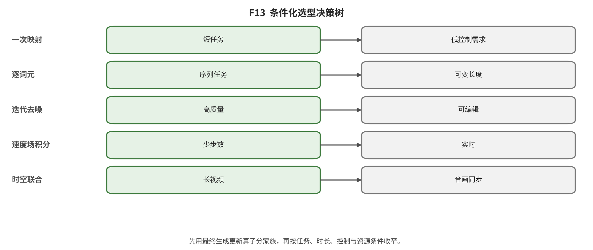

## 第 19 章 跨家族综合与条件化选择指南

输入与问题：六家族统一字段、条件规则、系统与风险边界。

论证动作：按任务和硬约束先选需要审计的机制组合，再列必须测量字段与会使建议翻转的条件。

**方法统一比较合同；表中没有跨协议数值或总排名。}

\begin{tabular}{lllll}

家族 & 状态更新 & 训练目标 & 推理 & 关键失败 \\

显式概率与潜变量/可逆流 & 潜样本或可逆映射 & ELBO 或精确似然 & 一次解码或逆变换 & 后验/可逆结构与感知失配 \\
对抗式隐式生成 & 判别博弈约束的隐式映射 & 最小最大或 IPM 目标 & 生成器一次前向 & 覆盖、训练稳定与条件扩展 \\
自回归与掩码生成 & token/像素/帧/尺度条件更新 & 条件似然或掩码恢复 & 串行或并行迭代 & codec 上限、串行深度与累积误差 \\
得分与随机去噪 & 噪声或得分状态 & 去噪、得分或等价参数化 & 反向链、SDE 或概率流 ODE & 采样成本、引导权衡与 codec 失真 \\
确定性输运 & 速度场、flow map 或一致映射 & 条件流、整流路径或端点一致 & ODE 积分或少步映射 & 路径、solver 与端到端收益不确定 \\
混合与统一生成机制 & 两个以上不可删更新算子 & 组件目标与接口联合 & 多阶段或组合更新 & 误差传播、复杂度与归因困难 \\

\end{tabular}

\end{table**

|
家族 | 状态更新 | 训练目标 | 推理 | 关键失败 |
|---|---|---|---|---|
|
显式概率与潜变量/可逆流 | 潜样本或可逆映射 | ELBO 或精确似然 | 一次解码或逆变换 | 后验/可逆结构与感知失配 |
| 对抗式隐式生成 | 判别博弈约束的隐式映射 | 最小最大或 IPM 目标 | 生成器一次前向 | 覆盖、训练稳定与条件扩展 |
| 自回归与掩码生成 | token/像素/帧/尺度条件更新 | 条件似然或掩码恢复 | 串行或并行迭代 | codec 上限、串行深度与累积误差 |
| 得分与随机去噪 | 噪声或得分状态 | 去噪、得分或等价参数化 | 反向链、SDE 或概率流 ODE | 采样成本、引导权衡与 codec 失真 |
| 确定性输运 | 速度场、flow map 或一致映射 | 条件流、整流路径或端点一致 | ODE 积分或少步映射 | 路径、solver 与端到端收益不确定 |
| 混合与统一生成机制 | 两个以上不可删更新算子 | 组件目标与接口联合 | 多阶段或组合更新 | 误差传播、复杂度与归因困难 |
| | | | | |

需要显式密度或反演时先审计潜变量/可逆流的语义外部效度；固定域单步延迟优先时审计 GAN 或对抗蒸馏的覆盖；语言统一与在线因果状态优先时审计 AR/token 的 codec、串行和缓存；开放文本与成熟控制优先时审计潜扩散的引导、codec 与采样；少步优先时审计 flow/consistency 的真实系统前沿。

视频选择前先固定输出时长与帧率、codec、更新粒度、历史维护和动作/相机/音频条件。短窗双向一致、因果在线更新、长叙事规划和动作闭环是不同任务；可生成更长不能替代状态查询和闭环成功。

- SEL01｜若 需要显式密度、潜变量推断或可逆反演，先审计 explicit-latent-flow；必须测量 semantic_external_validity_of_likelihood、invertibility_cost、decoder_reconstruction
- SEL02｜若 固定域且一次前向延迟是硬约束，先审计 adversarial、hybrid；必须测量 coverage、training_stability、tail_failures、end_to_end_latency
- SEL03｜若 需要语言统一序列、离散状态或在线因果更新，先审计 autoregressive-mask、hybrid；必须测量 codec_reconstruction、serial_depth、kv_cache、error_accumulation
- SEL04｜若 开放文本、多峰未来和成熟条件控制优先，先审计 stochastic-score-diffusion；必须测量 guidance_tradeoff、sampling_cost、condition_conflict、codec_loss
- SEL05｜若 少步 ODE/flow map 是主要约束，先审计 deterministic-transport、hybrid；必须测量 wall_clock、throughput、memory、energy、coverage、editability
- SEL06｜若 视频需要低延迟动作输入，先审计 autoregressive-mask、deterministic-transport、hybrid；必须测量 causal_latency、state_drift、first_failure_time、closed_loop_success
- SEL07｜若 需要长时叙事或世界状态，先审计 hybrid、autoregressive-mask、stochastic-score-diffusion；必须测量 revisit_consistency、object_permanence、event_order、memory_cost、planning_success
- SEL08｜若 只能访问闭源 API，先审计 system-interface-only；必须测量 documented_input_output、availability、terms、observed_failures；结论上限 不得反推训练数据、架构、服务器效率或与论文机制排名。

五类变化最易翻转选择：更换 tokenizer/codec；更换文本编码器或 caption；更换 sampler、guidance 或更新粒度；把单图/短片换成长程、多主体或动作闭环；把 NFE/FLOPs 换成端到端 p50/p95、吞吐、显存、能耗、许可和失败率。当前没有统一运行产生经验权重或全局 Pareto。

*F13。条件化选型。左侧用六个定义性问题确定一级生成家族；右侧把具体任务条件映射到应优先检查的家族和必测向量。更换 codec、数据、sampler、硬件或风险约束均可翻转结论。 证据边界：决策树给出候选与必测字段，不给出模型质量保证；第二编码者敏感性分析和同协议 Pareto 均未完成。*

综合判断：条件化选择的输出是“先审计什么、必须测什么、何时翻转”，不是总分、排行榜或无条件赢家。

证据边界：R001/R002 只验证局部公式和合成特征协议，不能为任何家族或产品背书。

转场：第 20 章把尚未解决的翻转条件改写为可证伪研究议程。

---

[← 返回目录](index.md)
