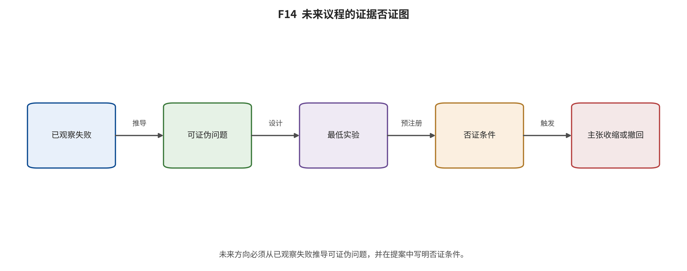

## 第 20 章 未来趋势与可证伪研究议程

输入与问题：前文失败、表格空白、系统边界、风险控制缺口和六条冻结未来议程。

论证动作：对每项趋势执行“观察—缺口—可证伪问题—最低验证—否证条件”，拒绝愿望清单。

**未来趋势的可证伪问题与否证条件。}

|
节 | 主题 | 可证伪问题 | 否证条件 |
|---|---|---|---|
|
20.1 | 原生多模态理解—生成统一 | 在同数据、同参数、同tokenizer和同训练预算下，共享模型能否在理解、图像生成、视频生成与编辑上达到专用模… | 优势只来自更大预算，或共享模型在任一核心任务稳定退化。 |
| 20.2 | 长时状态、可编辑记忆与身份/场景持久性 | 在相同生成器、数据、token与计算预算下，显式对象/场景记忆是否比等长像素上下文持续降低回访错误，并允许局部… | 显式记忆不优于等预算像素上下文，或编辑传播系统性破坏未编辑状态。 |
| 20.3 | 物理、因果、3D/4D与交互闭环 | 显式3D/物理状态是否在分布外动作和长程闭环中，比像素历史显著提高可预测性与任务成功，同时不过度牺牲渲染质量和… | 改进只出现在训练内视觉指标，物理残差或闭环规划不改善。 |
| 20.4 | 数据瓶颈、合成反馈与授权数据经济 | 在固定独立源与算力下，授权人工描述、机器再描述和多轮合成混合分别怎样改变语义、尾部覆盖、记忆、偏差与权利可审计… | 收益只对生成教师同源评审器成立，或合成代数增加时尾部覆盖持续收缩。 |
| 20.5 | 实时端侧/边缘生成、稀疏专家与编解码协同 | 稀疏/专家路由、少步与codec协同能否在固定质量下改善端到端Pareto，而不是把瓶颈或失真转移到其他组件？ | NFE或FLOPs降低但端到端前沿不移动，或尾部失败率显著增加。 |
| 20.6 | 可验证来源、行为审计与治理基础设施 | 签名凭据、鲁棒水印、服务日志和平台政策组合能否在已知/未知变换、恶意剥离及多平台转发中提高来源可验证率，同时控… | 组合控制不优于最强单层，或缺失仍被系统性误判为非AI。 |
| | | | |

- 20.1 原生多模态理解—生成统一。观察：当前工作分别共享Transformer主干、视觉token或条件表示，并尝试连接连续与离散更新；图像与视频越来越多地共用codec、DiT和条件模块。 缺口：公开结果通常同时改变数据、参数、tokenizer与预算，不能把收益单独归因于统一；负迁移缺少同合同报告。 可证伪问题：在同数据、同参数、同tokenizer和同训练预算下，共享模型能否在理解、图像生成、视频生成与编辑上达到专用模型的条件化Pareto，且不放大任何核心任务尾部失败？ 最低验证：建立共享与模块化两组等预算模型；固定去重数据和提示集；至少三随机种子；逐任务及语言/群体分层；记录跨任务梯度冲突与失败样本。 指标：逐任务质量向量;尾部失败率;梯度冲突;参数与训练成本;p50/p95推理成本 否证条件：优势只来自更大预算，或共享模型在任一核心任务稳定退化。 [@transitionmatching; @januspro; @flowinone; @video_2312_14125]
- 20.2 长时状态、可编辑记忆与身份/场景持久性。观察：滑窗、固定队列、首帧锚、KV缓存、故事板和检索记忆均可延长生成流程，但仍出现窗口外遗忘、累计漂移与回访不一致。 缺口：多数长或无限视频只报告可运行时长或选例，缺少对象永久性、事件顺序、身份状态查询和首次失败时间。 可证伪问题：在相同生成器、数据、token与计算预算下，显式对象/场景记忆是否比等长像素上下文持续降低回访错误，并允许局部编辑后正确传播状态？ 最低验证：构造1、5、15、30分钟脚本，包含离场回访、遮挡、属性修改、跨镜头身份与反事实编辑；比较滑窗、关键帧、检索、显式状态；重复种子并报告生存曲线。 指标：事件级准确率;对象永久性;身份一致;首次失败时间;内存;延迟;编辑传播误差 否证条件：显式记忆不优于等预算像素上下文，或编辑传播系统性破坏未编辑状态。 [@video_2310_15169; @video_2405_11473; @video_2403_14773; @video_2504_13074; @video_2507_18634; @video_2412_03568; @video_2505_21996]
- 20.3 物理、因果、3D/4D与交互闭环。观察：动作条件视频、模拟器轨迹、物理约束与交互系统增加，但证据从视觉预测到闭环规划跨度很大，且多限于特定机器人、游戏或材料合同。 缺口：视觉逼真、物理守恒、反事实因果、3D/4D状态一致和策略成功常被混称世界理解。 可证伪问题：显式3D/物理状态是否在分布外动作和长程闭环中，比像素历史显著提高可预测性与任务成功，同时不过度牺牲渲染质量和实时性？ 最低验证：同场景训练像素、几何/物理状态和混合三组；测试碰撞、遮挡、对象永久性、相机回环、反事实动作与下游规划；使用新的分布外场景和独立策略。 指标：视觉质量;物理守恒残差;状态查询准确率;校准;闭环任务成功;延迟 否证条件：改进只出现在训练内视觉指标，物理残差或闭环规划不改善。 [@video_2309_17080; @video_2310_06114; @video_2402_15391; @video_2408_14837; @video_2405_15223; @video_2509_20358; @video_system_58; @video_system_59; @video_system_60]
- 20.4 数据瓶颈、合成反馈与授权数据经济。观察：网页图文/视频索引、自动字幕、再描述、过滤与合成中间状态成为关键变量；同时存在URL漂移、派生clip依赖、教师错误、权利不转移与删除传播问题。 缺口：规模常以对或片段数报告，缺少独立源分母、权利状态、教师版本及多轮合成反馈的误差和多样性轨迹。 可证伪问题：在固定独立源与算力下，授权人工描述、机器再描述和多轮合成混合分别怎样改变语义、尾部覆盖、记忆、偏差与权利可审计性？ 最低验证：冻结同一原始媒体集，分层改变caption来源与合成代数；在AR、扩散、flow至少三类模型等预算训练；保留逐样本权利、教师版本、删除传播和近复制账本。 指标：独立源数;近复制率;分层语义/组合指标;尾部覆盖;教师错误传递;删除传播成功率 否证条件：收益只对生成教师同源评审器成立，或合成代数增加时尾部覆盖持续收缩。
- 20.5 实时端侧/边缘生成、稀疏专家与编解码协同。观察：少步、缓存、量化、注意力内核、多GPU并行与高压缩codec降低不同局部成本；开放权重使实测成为可能，但NFE、内核倍数和README时间并非同一端到端指标。 缺口：缺少同checkpoint、硬件、编译和服务负载下覆盖文本编码、生成器、codec、传输、冷启动、队列与重试的质量—时延—内存—能耗证据。 可证伪问题：稀疏/专家路由、少步与codec协同能否在固定质量下改善端到端Pareto，而不是把瓶颈或失真转移到其他组件？ 最低验证：冻结开放checkpoint、许可可用版本、输入集和硬件；做单因素再组合消融；记录warmup、冷启动、并发、失败重试与完整trace；至少三次重复。 指标：p50/p95延迟;吞吐;峰值GPU/主存;能耗;失败率;codec重建;运动/文字/身份分层质量 否证条件：NFE或FLOPs降低但端到端前沿不移动，或尾部失败率显著增加。
- 20.6 可验证来源、行为审计与治理基础设施。观察：数据文档、输出标签、C2PA凭据、不可见水印、平台识别、删除与纠错形成多层责任链；34条事件和21条风险控制记录显示每一层均有剥离、误判或执行缺口。 缺口：规范存在、厂商启用或单次鲁棒性演示不等于跨编辑器、平台和再编码链的真实保留率，也不能判定内容真伪或训练合法性。 可证伪问题：签名凭据、鲁棒水印、服务日志和平台政策组合能否在已知/未知变换、恶意剥离及多平台转发中提高来源可验证率，同时控制误报和隐私成本？ 最低验证：冻结生成器版本和原始manifest；执行裁剪、缩放、转码、帧率改变、拼接、截图、再生成与对抗剥离；跨至少两个编辑器和平台验证有效/无效/缺失三态；加入申诉恢复测试。 指标：凭据保留率;水印检测率;误报;链条完整率;验证延迟;隐私泄漏;申诉恢复率 否证条件：组合控制不优于最强单层，或缺失仍被系统性误判为非AI。

*F14。六项未来议程的证据链。每一行从已观察现象和开放缺口出发，转化为可证伪问题、最低验证设计和明确否证标准；这些是研究建议，不是已证实趋势。 证据边界：全部条目的 claim_*

综合判断：优先议程集中在多模态负迁移、长时记忆、物理/闭环、数据反馈、端到端实时性和跨平台来源证明。

证据边界：这些是由当前证据空白推导的测试方案，不是对 2026 年后模型、市场或政策结果的预测。

转场：第 21 章用方法、证据、统计、工程和时效性局限收紧 RQ1—RQ12 的回答。

---

[← 返回目录](index.md)
